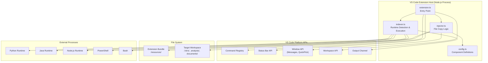
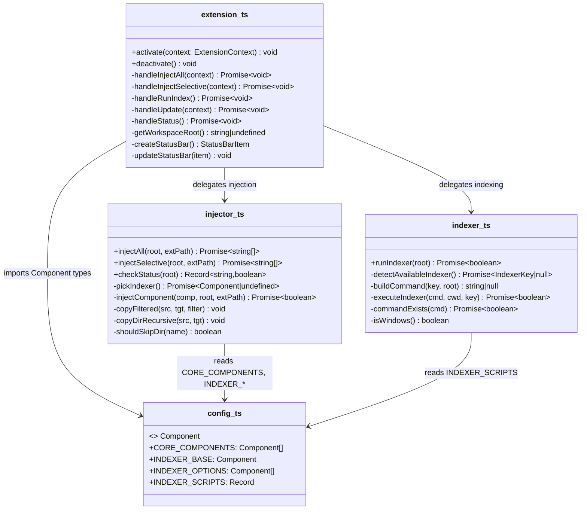
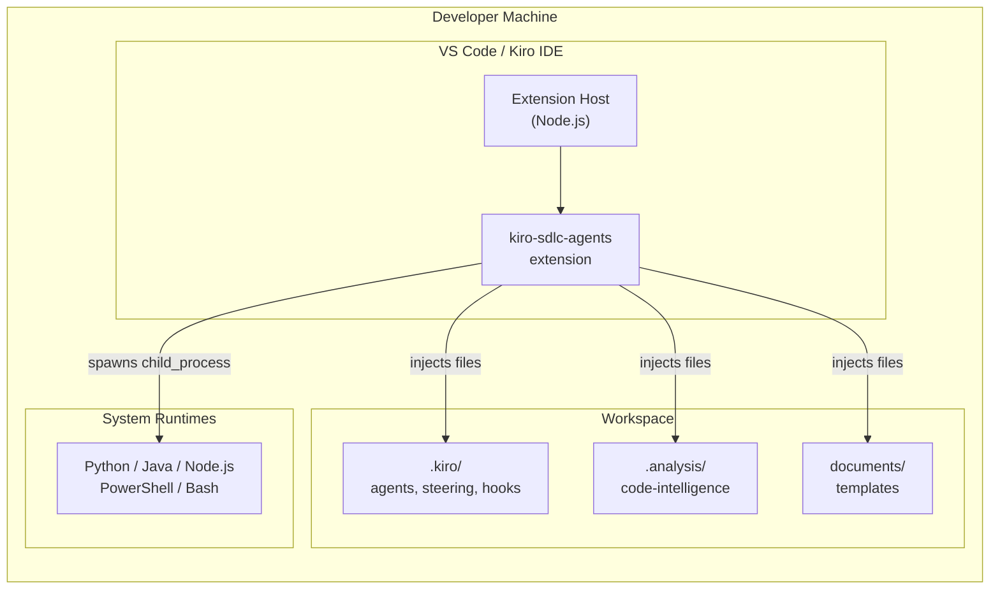
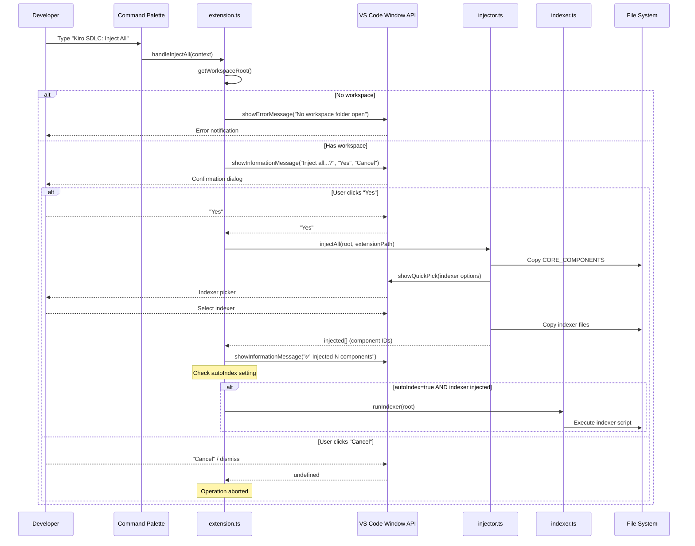
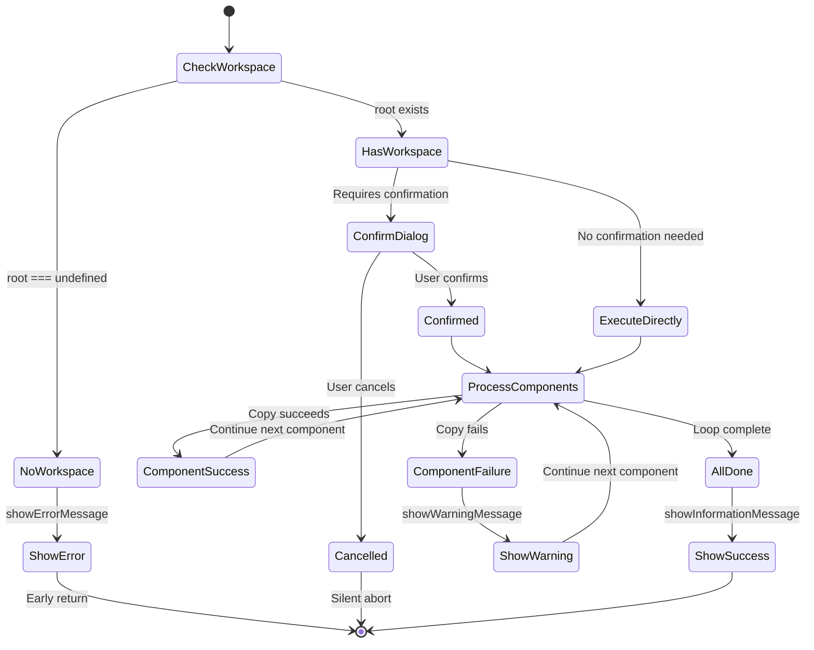
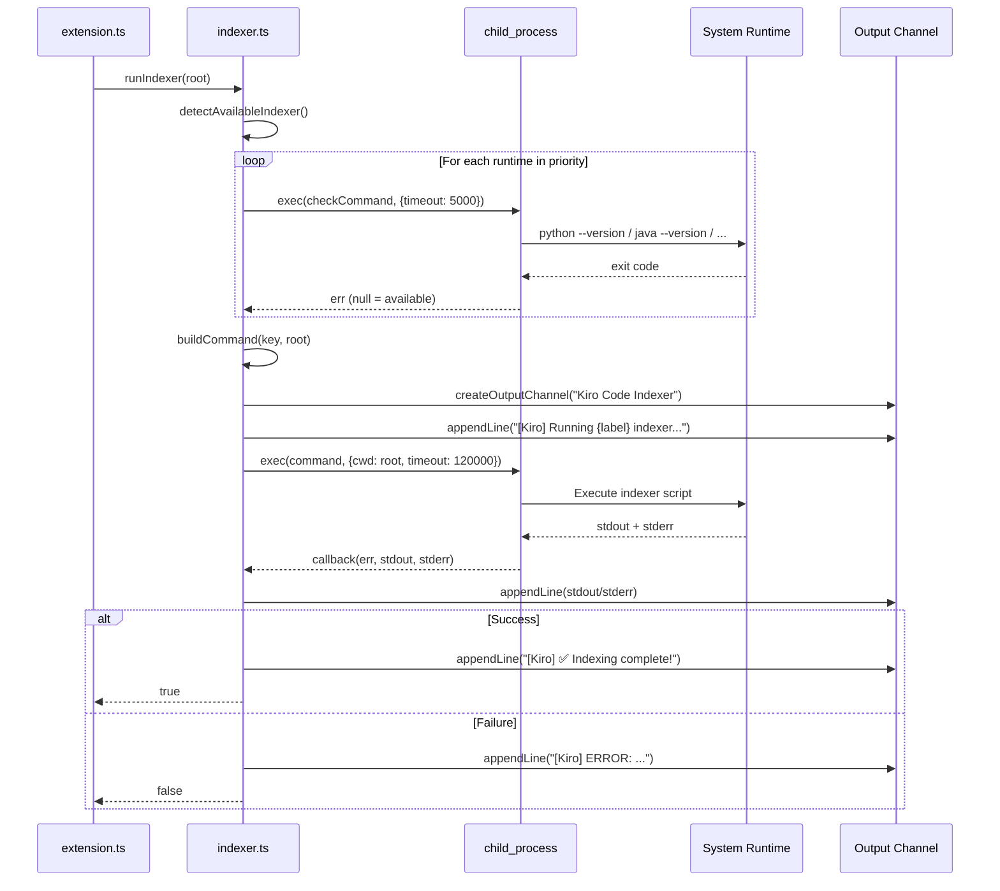

# Technical Design Document (TDD)

## Kiro SDLC Agents Extension — KSA-2: Extension Core — Commands & Activation

---

## Document Information

| Field | Value |
|-------|-------|
| Jira Ticket | KSA-2 |
| Title | Extension Core — Commands & Activation |
| Author | SA Agent |
| Version | 1.0 |
| Date | 2025-01-20 |
| Status | Draft |
| Related BRD | documents/KSA-2/BRD.md |
| Related FSD | documents/KSA-2/FSD.md |

---

## Author Tracking

| Role | Name - Position | Responsibility |
|------|-----------------|----------------|
| Author | SA Agent – Solution Architect | Create document |
| Peer Reviewer | DEV Agent – Developer | Review document |

---

## Revision History

| Version | Date | Author | Changes |
|---------|------|--------|---------|
| 1.0 | 2025-01-20 | SA Agent | Initiate document — retroactive TDD from implemented code |

---

## 1. Introduction

### 1.1 Purpose

This TDD documents the technical design of the **Extension Core — Commands & Activation** component of the Kiro SDLC Agents VS Code extension. Since the code is already implemented, this document serves as retroactive architecture documentation — capturing design decisions, patterns, and module structure for maintainability and onboarding.

### 1.2 Scope

This document covers the technical implementation of:
- Extension activation lifecycle (`activate()` / `deactivate()`)
- Five VS Code Command Palette commands and their handler functions
- Status bar indicator with three visual states
- Confirmation dialog patterns for destructive operations
- Module decomposition across 4 source files

**Out of scope:** Bundled resource content (KSA-6), individual indexer script implementations (KSA-7–10), marketplace publishing (KSA-11).

### 1.3 Technology Stack

| Layer | Technology | Version |
|-------|-----------|---------|
| Language | TypeScript | ^5.4.0 |
| Runtime | Node.js (VS Code Extension Host) | 20.x LTS |
| Platform API | VS Code Extension API | ^1.85.0 |
| Module System | CommonJS | ES2022 target |
| Build Tool | tsc (TypeScript Compiler) | ^5.4.0 |
| Packaging | @vscode/vsce | ^2.24.0 |
| File System | Node.js `fs` (synchronous + async) | Built-in |
| Child Process | Node.js `child_process` | Built-in |

### 1.4 Design Principles

- **Zero external runtime dependencies** — Extension uses only VS Code API and Node.js built-ins
- **Single Responsibility** — Each source file owns one concern (entry, config, injection, indexing)
- **Graceful Degradation** — Extension never throws when workspace is absent
- **Fail-Safe Defaults** — Confirmation dialogs before destructive operations
- **Convention over Configuration** — Sensible defaults with opt-in settings

### 1.5 Constraints

- Must activate in < 100ms (no heavy I/O in `activate()`)
- Must work in both VS Code and Kiro IDE (compatible Extension Host)
- Must not introduce external npm dependencies (devDependencies only)
- File operations use synchronous `fs` for status checks (non-blocking for small checks)
- Indexer execution timeout: 120 seconds maximum

### 1.6 References

| Document | Location |
|----------|----------|
| BRD — KSA-2 | documents/KSA-2/BRD.md |
| FSD — KSA-2 | documents/KSA-2/FSD.md |
| VS Code Extension API | https://code.visualstudio.com/api |
| Source Code | kiro-sdlc-agents/src/ |

---

## 2. System Architecture

### 2.1 Architecture Overview

The extension operates as a single-process module within the VS Code Extension Host. It follows a **layered architecture** with clear separation between the entry point (command registration + UI), configuration (static data), business logic (injection), and infrastructure (indexer execution).




### 2.2 Component Diagram

| Component | File | Responsibility | Dependencies |
|-----------|------|---------------|--------------|
| Entry Point | `extension.ts` | Activation, command registration, status bar, handler orchestration | config, injector, indexer |
| Configuration | `config.ts` | Static component definitions, indexer options, script metadata | None |
| Injector | `injector.ts` | File copy operations, selective injection, status checking | config |
| Indexer | `indexer.ts` | Runtime detection, command building, process execution | config |



### 2.3 Deployment Architecture

The extension is packaged as a `.vsix` file and installed into VS Code/Kiro IDE. There is no server-side deployment — it runs entirely within the user's local Extension Host process.



### 2.4 Communication Patterns

| From | To | Protocol | Pattern | Description |
|------|----|----------|---------|-------------|
| Extension Host | extension.ts | Function call | Sync | `activate(context)` lifecycle |
| extension.ts | injector.ts | Function call | Async | `injectAll()`, `injectSelective()` |
| extension.ts | indexer.ts | Function call | Async | `runIndexer()` |
| indexer.ts | System Runtime | child_process.exec | Async (callback) | Spawns indexer script |
| extension.ts | VS Code APIs | Function call | Sync/Async | UI interactions |
| injector.ts | File System | fs (sync) | Sync | `copyFileSync`, `mkdirSync`, `existsSync` |

---

## 3. API Design (VS Code Commands)

> **Note:** This extension exposes no HTTP APIs. The "API" is the set of VS Code commands registered in the Command Palette. Each command is documented as an interface contract.

### 3.1 Command Overview

| # | Command ID | Display Title | Handler | Implements |
|---|-----------|---------------|---------|------------|
| 1 | `kiroSdlc.injectAll` | Kiro SDLC: Inject All Agents | `handleInjectAll()` | UC-2a, BR-8 |
| 2 | `kiroSdlc.injectSelective` | Kiro SDLC: Inject (Select Components) | `handleInjectSelective()` | UC-2b, BR-10 |
| 3 | `kiroSdlc.runIndex` | Kiro SDLC: Run Code Indexer | `handleRunIndex()` | UC-2c, BR-11 |
| 4 | `kiroSdlc.update` | Kiro SDLC: Update Agents (Keep Customizations) | `handleUpdate()` | UC-2d, BR-9 |
| 5 | `kiroSdlc.status` | Kiro SDLC: Show Status | `handleStatus()` | UC-2e, UC-3 |


### 3.2 Command: kiroSdlc.injectAll

**Implements:** UC-2a, BR-5, BR-8, BR-12



**Preconditions:**
- Workspace folder must be open
- Extension bundle must contain `/resources/` directory with SDLC components

**Postconditions (success):**
- All CORE_COMPONENTS copied to workspace
- Selected indexer scripts copied to `.analysis/code-intelligence/scripts/`
- Success notification shown with list of injected component IDs
- If `autoIndex=true`: indexer executed automatically

**Error Handling:**
| Condition | Behavior |
|-----------|----------|
| No workspace open | `showErrorMessage` → early return |
| User cancels dialog | Silent abort (no error) |
| Source resource missing | `showWarningMessage` per component, skip |
| File copy permission error | `showErrorMessage` per component, continue others |

---

### 3.3 Command: kiroSdlc.injectSelective

**Implements:** UC-2b, BR-5, BR-10

**Flow:**
1. Check workspace root (abort if none)
2. Show QuickPick with `canPickMany: true` — all CORE_COMPONENTS + "Indexer" option
3. For each selected core component: call `injectComponent()`
4. If "Indexer" selected: show secondary QuickPick for language choice
5. Show success message with injected IDs

**QuickPick Items:**

| Label | Description | ID |
|-------|-------------|-----|
| Agents (BA, SA, QA, DEV, DevOps, UI, Security, SM, TA) | Multi-agent SDLC pipeline with prompts | agents |
| Steering Rules | Code standards, self-learning, file-writing, drawio, jira-workflow | steering |
| Hooks (Code Index + Drawio Validation) | Auto-trigger hooks for file events | hooks |
| Document Templates (BRD, FSD, TDD, STP, STC, DPG, RLN, UG) | Templates for all SDLC documents | templates |
| Code Intelligence Indexer (choose language next) | Source code indexer — will ask which language | indexer |

---

### 3.4 Command: kiroSdlc.runIndex

**Implements:** UC-2c, BR-5, BR-11

**Flow:**
1. Check workspace root (abort if none)
2. Read `kiroSdlc.preferredIndexer` setting
3. If "auto": detect available runtime (priority: Python → Java → Node.js → PowerShell → Bash)
4. Build command string for detected runtime
5. Create Output Channel "Kiro Code Indexer"
6. Execute via `child_process.exec` with 120s timeout
7. Stream stdout/stderr to Output Channel
8. Show success/failure notification

**Runtime Detection Priority:**

| Priority | Runtime | Check Command | Fallback |
|----------|---------|---------------|----------|
| 1 | Python | `python --version` | — |
| 2 | Java | `java --version` | — |
| 3 | Node.js | `node --version` | — |
| 4 | PowerShell | (Windows default) | Windows only |
| 5 | Bash | (Unix default) | Unix only |

---

### 3.5 Command: kiroSdlc.update

**Implements:** UC-2d, BR-5, BR-9

**Flow:**
1. Check workspace root (abort if none)
2. Show `showWarningMessage` with destructive warning text
3. If confirmed ("Update"): call `injectAll()` — overwrites all components
4. Show success message

**Warning Message:** "Update will overwrite agents/steering/templates. Custom modifications in these folders will be lost. Continue?"

---

### 3.6 Command: kiroSdlc.status

**Implements:** UC-2e, UC-3, BR-5

**Flow:**
1. Check workspace root (abort if none)
2. Call `checkStatus(root)` — returns `Record<string, boolean>`
3. Format status lines: `✅ {id}` or `❌ {id}`
4. Show information message with status + "Inject Missing" action button
5. If user clicks "Inject Missing": execute `kiroSdlc.injectSelective`

**Status Check Logic:**
```typescript
// For each CORE_COMPONENT: fs.existsSync(path.join(root, component.targetPath))
// For indexer: fs.existsSync(path.join(root, ".analysis/code-intelligence/index-config.json"))
```

---

## 4. Data Model

> This extension has no database. The data model describes TypeScript interfaces, configuration structures, and VS Code settings.

### 4.1 Core Interface: Component

```typescript
export interface Component {
    id: string;          // Unique identifier (e.g., "agents", "steering")
    label: string;       // Display name for QuickPick UI
    description: string; // Short description for QuickPick detail
    sourcePath: string;  // Relative path within extension bundle (/resources/)
    targetPath: string;  // Relative path in target workspace
    filter?: string[];   // Optional whitelist — only copy these items from source
}
```

### 4.2 Static Data: CORE_COMPONENTS

| ID | Source Path | Target Path | Filter |
|----|-------------|-------------|--------|
| agents | `.kiro/agents` | `.kiro/agents` | — |
| steering | `.kiro/steering` | `.kiro/steering` | — |
| hooks | `.kiro/hooks` | `.kiro/hooks` | — |
| templates | `documents/templates` | `documents/templates` | — |

### 4.3 Static Data: INDEXER_BASE

| ID | Source Path | Target Path | Filter |
|----|-------------|-------------|--------|
| indexer-config | `.analysis/code-intelligence` | `.analysis/code-intelligence` | `["index-config.json", "modules", "scripts/README.md"]` |

### 4.4 Static Data: INDEXER_OPTIONS

| ID | Source Path | Target Path | Runtime |
|----|-------------|-------------|---------|
| indexer-python | `.analysis/code-intelligence/scripts/python` | `.analysis/code-intelligence/scripts/python` | Python 3.7+ |
| indexer-java | `.analysis/code-intelligence/scripts/java` | `.analysis/code-intelligence/scripts/java` | Java 17+ |
| indexer-powershell | `.analysis/code-intelligence/scripts/powershell` | `.analysis/code-intelligence/scripts/powershell` | PowerShell 5.1+ |
| indexer-bash | `.analysis/code-intelligence/scripts/bash` | `.analysis/code-intelligence/scripts/bash` | Bash 4+ |
| indexer-nodejs | `.analysis/code-intelligence/scripts/nodejs` | `.analysis/code-intelligence/scripts/nodejs` | Node.js 18+ |

### 4.5 Static Data: INDEXER_SCRIPTS

```typescript
export const INDEXER_SCRIPTS = {
    python:     { check: "python --version",                                    label: "Python" },
    java:       { check: "java --version",                                      label: "Java" },
    nodejs:     { check: "node --version",                                      label: "Node.js" },
    powershell: { check: "powershell -Command \"$PSVersionTable.PSVersion\"",   label: "PowerShell" },
    bash:       { check: "bash --version",                                      label: "Bash" }
};
```

### 4.6 VS Code Extension Settings

| Setting | Type | Default | Description |
|---------|------|---------|-------------|
| `kiroSdlc.autoIndex` | boolean | `true` | Auto-run indexer after injection |
| `kiroSdlc.preferredIndexer` | enum | `"auto"` | Preferred indexer runtime |

**preferredIndexer enum values:** `"auto"`, `"python"`, `"java"`, `"nodejs"`, `"powershell"`, `"bash"`

---

## 5. Class / Module Design

### 5.1 Package Structure

```
kiro-sdlc-agents/
├── src/
│   ├── extension.ts      # Entry point — activate/deactivate, command handlers, status bar
│   ├── config.ts         # Static configuration — Component interface, registries
│   ├── injector.ts       # Business logic — file copy, selective injection, status check
│   └── indexer.ts        # Infrastructure — runtime detection, child process execution
├── resources/            # Bundled SDLC resources (copied to target workspace)
│   ├── .kiro/
│   │   ├── agents/
│   │   ├── steering/
│   │   └── hooks/
│   ├── .analysis/code-intelligence/
│   │   └── scripts/{python,java,nodejs,powershell,bash}/
│   └── documents/templates/
├── out/                  # Compiled JavaScript output
├── package.json          # Extension manifest
├── tsconfig.json         # TypeScript configuration
└── .vscodeignore         # Files excluded from .vsix package
```

### 5.2 Module Responsibilities

| Module | Lines | Exports | Private Functions | Responsibility |
|--------|-------|---------|-------------------|---------------|
| extension.ts | ~100 | `activate()`, `deactivate()` | 7 handler/helper functions | Orchestration layer |
| config.ts | ~95 | `Component`, `CORE_COMPONENTS`, `INDEXER_BASE`, `INDEXER_OPTIONS`, `INDEXER_SCRIPTS` | None | Data definitions |
| injector.ts | ~110 | `injectAll()`, `injectSelective()`, `checkStatus()` | 4 private functions | File operations |
| indexer.ts | ~85 | `runIndexer()` | 4 private functions | Process management |

### 5.3 Design Patterns

| Pattern | Where Used | Rationale |
|---------|-----------|-----------|
| **Module Pattern** | All files | Each file is a self-contained module with explicit exports |
| **Command Pattern** | extension.ts | Each command handler encapsulates a complete operation |
| **Strategy Pattern** | indexer.ts | Runtime detection selects the appropriate indexer strategy |
| **Registry Pattern** | config.ts | `CORE_COMPONENTS` and `INDEXER_OPTIONS` act as component registries |
| **Guard Clause** | All handlers | `getWorkspaceRoot()` check at top of every handler |
| **Delegation** | extension.ts → injector/indexer | Entry point delegates to specialized modules |
| **Recursive Visitor** | injector.ts `copyDirRecursive()` | Traverses directory tree with skip rules |

### 5.4 Error Handling Strategy

The extension uses a **fail-soft** approach — individual component failures do not block the overall operation.

| Layer | Strategy | Implementation |
|-------|----------|----------------|
| Command handlers | Guard clause + early return | `if (!root) { return; }` |
| Confirmation dialogs | Null-check on response | `if (confirm !== "Yes") { return; }` |
| File operations | try/catch per component | `showWarningMessage` on failure, continue loop |
| Indexer execution | Callback error handling | `showErrorMessage` + Output Channel logging |
| Runtime detection | Graceful fallback | Falls back to platform default (PowerShell/Bash) |

**Error Flow:**



---

## 6. Integration Design

### 6.1 VS Code Extension API Integration

| API | Module | Usage |
|-----|--------|-------|
| `vscode.commands.registerCommand()` | extension.ts | Register 5 command handlers |
| `vscode.window.createStatusBarItem()` | extension.ts | Create status bar indicator |
| `vscode.window.showInformationMessage()` | extension.ts, injector.ts | Success notifications, confirmations |
| `vscode.window.showWarningMessage()` | extension.ts, injector.ts | Destructive confirmations, missing resources |
| `vscode.window.showErrorMessage()` | extension.ts, injector.ts | Fatal errors |
| `vscode.window.showQuickPick()` | injector.ts | Component selection, indexer language picker |
| `vscode.window.createOutputChannel()` | indexer.ts | Indexer execution log |
| `vscode.workspace.workspaceFolders` | extension.ts | Get workspace root path |
| `vscode.workspace.getConfiguration()` | extension.ts, indexer.ts | Read extension settings |
| `context.subscriptions.push()` | extension.ts | Register disposables for cleanup |

### 6.2 Node.js File System Integration

| Operation | API | Sync/Async | Module |
|-----------|-----|-----------|--------|
| Check file exists | `fs.existsSync()` | Sync | injector.ts |
| Create directory | `fs.mkdirSync({ recursive: true })` | Sync | injector.ts |
| Copy file | `fs.copyFileSync()` | Sync | injector.ts |
| Read directory | `fs.readdirSync({ withFileTypes: true })` | Sync | injector.ts |
| Check if directory | `fs.statSync().isDirectory()` | Sync | injector.ts |

**Rationale for synchronous fs:** File operations during injection are sequential and must complete before reporting results. The number of files is bounded (< 100 per component), so blocking is acceptable.

### 6.3 Child Process Integration (Indexer)

| Attribute | Value |
|-----------|-------|
| API | `child_process.exec()` |
| Timeout | 120,000 ms |
| Working Directory | Workspace root |
| Output | Streamed to VS Code Output Channel |
| Error Handling | Callback-based (err, stdout, stderr) |



---

## 7. Security Design

### 7.1 Threat Model

This is a **local-only extension** with no network communication, no authentication, and no data transmission. Security concerns are limited to file system safety.

| Threat | Mitigation |
|--------|-----------|
| Accidental file overwrite | Confirmation dialogs (BR-8, BR-9) |
| Directory traversal in copy | All paths resolved relative to workspace root via `path.join()` |
| Malicious indexer script | Scripts are bundled with extension (trusted source) |
| Command injection in indexer | Commands built from static templates + workspace root path |
| Excessive file system access | `shouldSkipDir()` excludes `node_modules`, `.git`, etc. |

### 7.2 File System Safety

| Control | Implementation |
|---------|---------------|
| Path resolution | `path.join(workspaceRoot, component.targetPath)` — no user-supplied path segments |
| Directory skip list | `["node_modules", "__pycache__", "out", "dist", ".git"]` |
| Overwrite protection | `injectAll` requires explicit "Yes" confirmation |
| Update warning | `update` uses `showWarningMessage` (elevated severity) |

### 7.3 Extension Permissions

The extension requires no special VS Code permissions beyond the default:
- File system access (same as user)
- Child process execution (same as user)
- No network access required
- No secrets/credentials stored

---

## 8. Performance & Scalability

### 8.1 Activation Performance

| Metric | Target | Implementation |
|--------|--------|----------------|
| Activation time | < 100ms | No async I/O in `activate()` |
| Memory footprint | < 5MB | Static config only, no caches |
| Status bar update | < 10ms | Synchronous `fs.existsSync()` (5 checks) |

**Activation sequence (all synchronous, no I/O):**
1. Create StatusBarItem object
2. Push to subscriptions
3. Register 5 commands (function references only)
4. Push to subscriptions
5. Call `updateStatusBar()` — 5× `fs.existsSync()`

### 8.2 Injection Performance

| Operation | Expected Duration | Bottleneck |
|-----------|------------------|-----------|
| Copy single component | < 500ms | Disk I/O (recursive copy) |
| Copy all 4 core components | < 2s | Sequential disk I/O |
| Copy indexer scripts | < 1s | Disk I/O |
| Full inject (all + indexer) | < 3s | Disk I/O + user interaction |

### 8.3 Indexer Performance

| Metric | Value | Configuration |
|--------|-------|---------------|
| Detection timeout | 5,000ms per runtime | `commandExists()` timeout |
| Execution timeout | 120,000ms | `child_process.exec` timeout |
| Output buffering | Unbounded | Streamed to Output Channel |

### 8.4 Scalability Considerations

- **Large workspaces:** Status check is O(n) where n = number of CORE_COMPONENTS (fixed at 4+1). Does not scale with workspace size.
- **Large resource bundles:** Copy is O(files) — bounded by extension bundle size. No recursive workspace scanning.
- **Multiple workspaces:** Only first workspace folder is used (`workspaceFolders[0]`).

---

## 9. Monitoring & Observability

### 9.1 Logging

| Event | Channel | Format | Level |
|-------|---------|--------|-------|
| Indexer start | Output Channel "Kiro Code Indexer" | `[Kiro] Running {label} indexer...` | INFO |
| Indexer command | Output Channel | `[Kiro] Command: {command}` | DEBUG |
| Indexer stdout | Output Channel | Raw output | INFO |
| Indexer stderr | Output Channel | Raw output | WARN |
| Indexer success | Output Channel | `[Kiro] ✅ Indexing complete!` | INFO |
| Indexer error | Output Channel | `[Kiro] ERROR: {message}` | ERROR |

### 9.2 User Notifications

| Event | API | Severity |
|-------|-----|----------|
| Injection success | `showInformationMessage` | Info |
| Update success | `showInformationMessage` | Info |
| Indexer success | `showInformationMessage` | Info |
| No workspace | `showErrorMessage` | Error |
| Source not found | `showWarningMessage` | Warning |
| Injection failure | `showErrorMessage` | Error |
| Indexer failure | `showErrorMessage` | Error |
| No runtime found | `showWarningMessage` | Warning |

### 9.3 Status Bar as Health Indicator

The status bar serves as a persistent health monitor:
- **$(check) SDLC Agents** — All components present (green state)
- **$(warning) SDLC Agents** — Some components missing (yellow state)
- **$(circle-slash) SDLC** — No workspace open (grey state)

---

## 10. Deployment Considerations

### 10.1 Build & Package

```bash
# Compile TypeScript
npm run compile    # tsc -p ./

# Package as .vsix
npm run package    # vsce package
```

**Output:** `kiro-sdlc-agents-1.0.0.vsix`

### 10.2 Installation Methods

| Method | Command |
|--------|---------|
| VS Code CLI | `code --install-extension kiro-sdlc-agents-1.0.0.vsix` |
| VS Code UI | Extensions → "..." → Install from VSIX |
| Marketplace | `ext install your-publisher-id.kiro-sdlc-agents` |

### 10.3 Extension Manifest (package.json)

Key configuration:
- `activationEvents: []` — Startup activation (always active)
- `main: "./out/extension.js"` — Compiled entry point
- `engines.vscode: "^1.85.0"` — Minimum VS Code version
- `categories: ["Other", "Snippets"]`

### 10.4 TypeScript Compilation

| Option | Value | Rationale |
|--------|-------|-----------|
| `module` | `commonjs` | Required by VS Code Extension Host |
| `target` | `ES2022` | Modern JS features (top-level await, etc.) |
| `strict` | `true` | Full type safety |
| `sourceMap` | `true` | Debugging support |
| `rootDir` | `src` | Source root |
| `outDir` | `out` | Compiled output |
| `esModuleInterop` | `true` | CommonJS/ESM interop |

### 10.5 Rollback Strategy

Since this is a local extension:
1. **Uninstall:** `code --uninstall-extension your-publisher-id.kiro-sdlc-agents`
2. **Downgrade:** Install previous `.vsix` version
3. **Workspace cleanup:** Manually delete injected folders (`.kiro/`, `.analysis/`, `documents/templates/`)

---

## 11. Appendix

### 11.1 Glossary

| Term | Definition |
|------|------------|
| Extension Host | Node.js process that runs VS Code extensions in isolation |
| Disposable | VS Code pattern for resource cleanup on deactivation |
| Codicon | VS Code's built-in icon font (`$(icon-name)` syntax) |
| QuickPick | VS Code's dropdown selection UI component |
| Output Channel | VS Code's panel for extension log output |
| VSIX | VS Code extension package format (ZIP-based) |
| SDLC | Software Development Life Cycle |

### 11.2 File Size Compliance

Per code-standards.md (max 200 lines per file, max 20 lines per function):

| File | Lines | Status | Largest Function |
|------|-------|--------|-----------------|
| extension.ts | ~100 | ✅ Compliant | `handleInjectAll` (~15 lines) |
| config.ts | ~95 | ✅ Compliant | N/A (data only) |
| injector.ts | ~110 | ✅ Compliant | `injectSelective` (~20 lines) |
| indexer.ts | ~85 | ✅ Compliant | `executeIndexer` (~18 lines) |

### 11.3 Traceability Matrix

| BRD Story | FSD Use Case | FSD Business Rule | TDD Section | Implementation |
|-----------|-------------|-------------------|-------------|----------------|
| Story 1 | UC-1 | BR-1, BR-2, BR-3, BR-4 | §2.1, §8.1 | `activate()` in extension.ts |
| Story 2 | UC-2a–2e | BR-5, BR-6, BR-7, BR-8, BR-9, BR-10, BR-11, BR-12 | §3.1–3.6 | Command handlers in extension.ts |
| Story 3 | UC-3 | BR-13, BR-14, BR-15, BR-16, BR-17 | §9.3 | `createStatusBar()`, `updateStatusBar()` |
| Story 4 | UC-4 | BR-18, BR-19, BR-20, BR-21, BR-22, BR-23 | §3.2, §3.5 | Confirmation dialogs in handlers |

### 11.4 Open Questions

| # | Question | Status | Answer |
|---|----------|--------|--------|
| 1 | Should status bar auto-refresh on file changes? | Resolved | No — only updates on activation. Future enhancement. |
| 2 | Multi-root workspace support? | Resolved | Only first folder used (`workspaceFolders[0]`) |
| 3 | Should update preserve user customizations? | Resolved | No — full overwrite with warning. Title is aspirational. |

