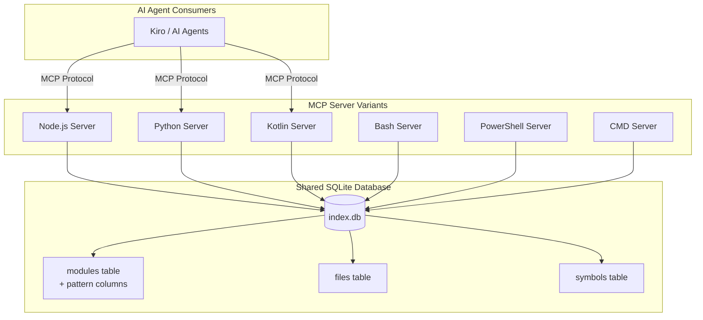
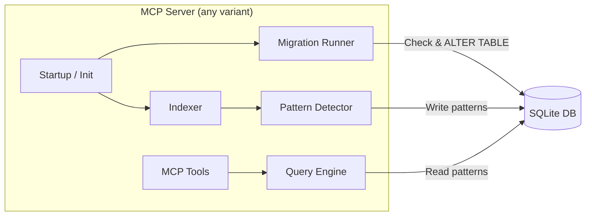
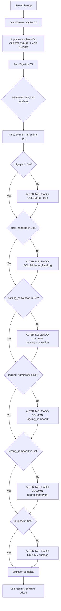
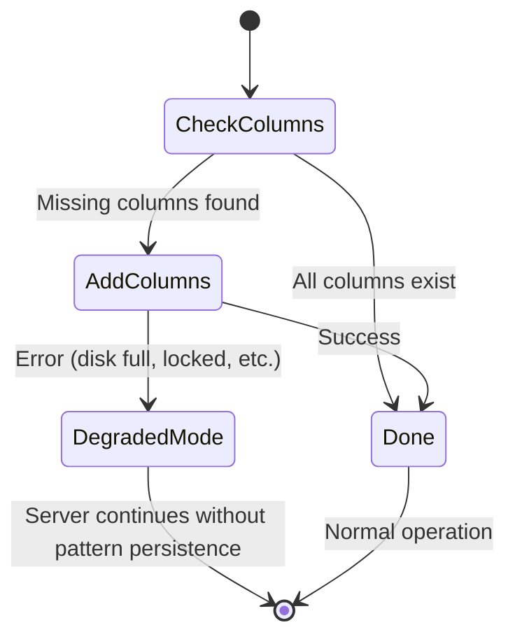
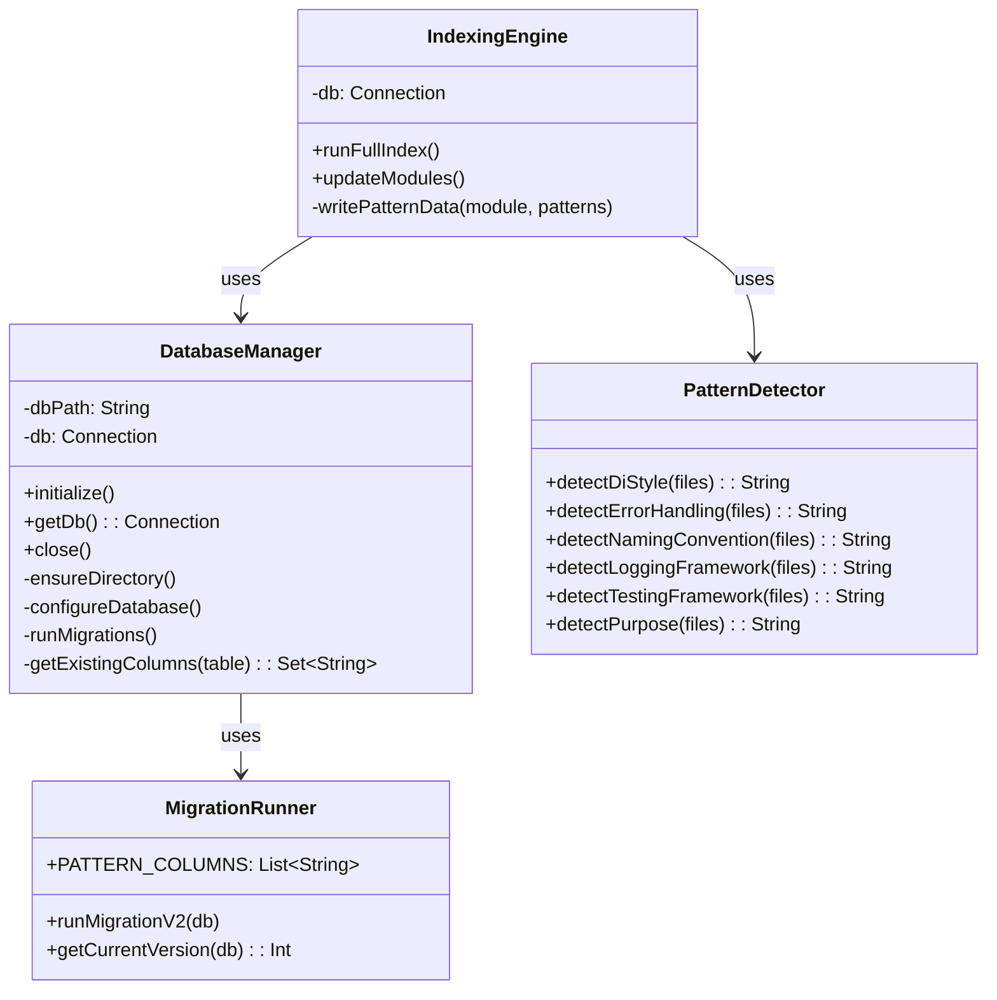
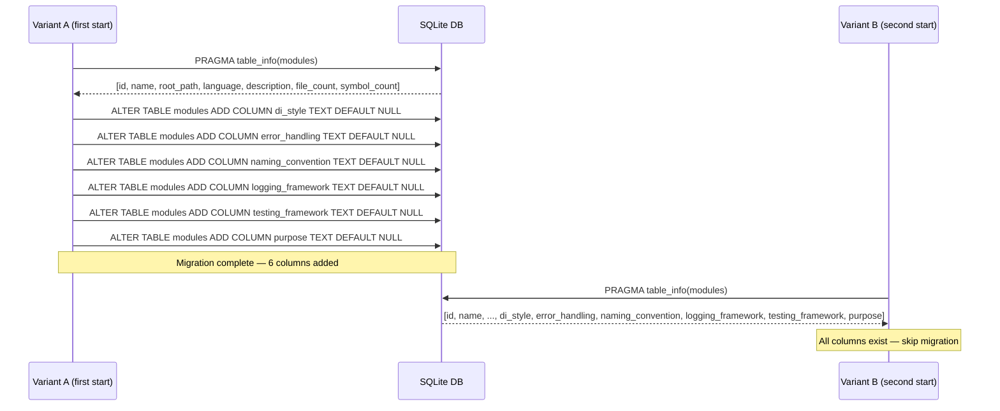

# Technical Design Document (TDD)

## Code Intelligence System — KSA-25: [DB] Extend modules table schema for pattern metadata

---

## Document Information

| Field | Value |
|-------|-------|
| Jira Ticket | KSA-25 |
| Title | [DB] Extend modules table schema for pattern metadata |
| Author | SA Agent |
| Version | 1.0 |
| Date | 2026-05-16 |
| Status | Draft |
| Related BRD | BRD-v1.0-KSA-25.docx |
| Related FSD | N/A (BRD-only ticket — DB schema change) |

---

## Author Tracking

| Role | Name - Position | Responsibility |
|------|-----------------|----------------|
| Author | SA Agent – Solution Architect | Create document |
| Peer Reviewer | DEV Agent – Developer | Review implementation feasibility |

---

## Revision History

| Version | Date | Author | Changes |
|---------|------|--------|---------|
| 1.0 | 2026-05-16 | SA Agent | Initiate document — designed from BRD + source code analysis |

---

## Sign-Off

| Name | Signature and date |
|------|--------------------|
| DEV Agent | ☐ I agree and confirm the technical design in this TDD |
| QA Agent | ☐ I agree and confirm the technical design in this TDD |

---

## 1. Introduction

### 1.1 Purpose

This TDD specifies the technical implementation for extending the `modules` table in the Code Intelligence SQLite database to persist pattern metadata (DI style, error handling, naming conventions, logging framework, testing framework, and module purpose). The design covers all 6 MCP server variants that share a common schema.

### 1.2 Scope

- Schema migration logic for 6 language variants (Node.js, Python, Kotlin, Bash, PowerShell, CMD)
- DDL for new columns added to the `modules` table
- Migration algorithm (idempotent, backward-compatible, auto-run on startup)
- Error handling and graceful degradation strategy
- Test strategy for cross-variant consistency

### 1.3 Technology Stack

| Layer | Technology | Version |
|-------|-----------|---------|
| Database | SQLite | 3.x (all variants) |
| Node.js | TypeScript + better-sqlite3 | Node 18+ |
| Python | sqlite3 (stdlib) | Python 3.11+ |
| Kotlin | JDBC sqlite-jdbc | JDK 17+ |
| Bash | sqlite3 CLI | Any |
| PowerShell | sqlite3 CLI | PS 5.1+ / PS 7+ |
| CMD | sqlite3 CLI | Windows 10+ |

### 1.4 Design Principles

- **Idempotent migrations** — Running migration N times produces same result as running once
- **Backward compatibility** — Older server versions can still read the database
- **Graceful degradation** — Migration failure does not prevent server startup
- **Cross-variant consistency** — All 6 variants produce identical schema
- **Zero downtime** — ALTER TABLE ADD COLUMN in SQLite is O(1), no table rewrite

### 1.5 Constraints

- SQLite does not support `ALTER TABLE DROP COLUMN` (pre-3.35.0) — columns once added cannot be removed
- SQLite does not support `ALTER TABLE ADD COLUMN` with `NOT NULL` unless a default is provided
- All variants must use sqlite3 CLI or native SQLite bindings (no ORM abstraction)
- Migration must complete in < 100ms for databases with < 1000 modules

### 1.6 References

| Document | Location |
|----------|----------|
| BRD | documents/KSA-25/BRD.md |
| Node.js Schema | mcp-code-intelligence-nodejs/src/db/schema.ts |
| Python DB | mcp-code-intelligence-python/src/mcp_code_intel/db.py |
| Kotlin Schema | mcp-code-intelligence-kotlin/src/main/kotlin/com/codeintel/db/Schema.kt |
| Bash DB | mcp-code-intelligence-bash/lib/db.sh |
| PowerShell DB | mcp-code-intelligence-powershell/code-intel-db.ps1 |
| CMD Scanner | mcp-code-intelligence-cmd/code-intel-scan.cmd |

---

## 2. System Architecture

### 2.1 Architecture Overview

The Code Intelligence system consists of 6 independent MCP server implementations that all operate on the same SQLite database schema. Each variant is a standalone process that:
1. Opens/creates the SQLite database at `{workspace}/.code-intel/index.db`
2. Applies schema migrations on startup
3. Indexes workspace files and extracts symbols
4. Serves MCP tool requests (queries against the indexed data)



### 2.2 Component Diagram

Each MCP server variant follows the same internal architecture:



| Component | Responsibility | Affected by KSA-25 |
|-----------|---------------|-------------------|
| Startup/Init | Open DB, run migrations | ✅ Triggers migration |
| Migration Runner | Check schema, add missing columns | ✅ NEW — core of this change |
| Indexer | Scan files, extract symbols | ✅ Must write pattern data |
| Pattern Detector | Detect DI, error handling, etc. | ❌ Unchanged (already exists) |
| Query Engine | Execute SQL queries | ✅ Must read new columns |
| MCP Tools | Serve tool requests | ✅ Must include patterns in response |

### 2.3 Deployment Architecture

No deployment changes. Each variant runs as a local process on the developer's machine. The SQLite database is a local file — no network, no containers, no shared infrastructure.

### 2.4 Communication Patterns

| From | To | Protocol | Pattern | Description |
|------|----|----------|---------|-------------|
| AI Agent | MCP Server | JSON-RPC over stdio/SSE | Sync | Tool invocations |
| MCP Server | SQLite DB | File I/O | Sync | Direct file access |

---

## 3. API Design

> This change does NOT add new MCP tools or endpoints. It enriches the response of existing tools by including pattern metadata fields.

### 3.1 Affected MCP Tool: `get_module_info`

**Change type:** Response schema extension (additive, non-breaking)

**Current response:**
```json
{
  "name": "core",
  "root_path": "src/core",
  "language": "kotlin",
  "description": "Core business logic",
  "file_count": 42,
  "symbol_count": 156
}
```

**New response (after KSA-25):**
```json
{
  "name": "core",
  "root_path": "src/core",
  "language": "kotlin",
  "description": "Core business logic",
  "file_count": 42,
  "symbol_count": 156,
  "di_style": "constructor injection",
  "error_handling": "try-catch",
  "naming_convention": "*Controller, *Service, *Repository",
  "logging_framework": "SLF4J",
  "testing_framework": "JUnit",
  "purpose": "Business logic"
}
```

**Backward compatibility:** New fields are additive. Consumers that don't expect them will ignore them. Fields may be `null` for modules where patterns haven't been detected yet.

### 3.2 Affected MCP Tool: `list_modules`

Same additive change — each module in the list includes the 6 new pattern fields.

---

## 4. Database Design

### 4.1 Schema Overview — Current State (Verified from Source Code)

The **actual** `modules` table schema across all 6 variants is:

```sql
CREATE TABLE IF NOT EXISTS modules (
  id INTEGER PRIMARY KEY AUTOINCREMENT,
  name TEXT NOT NULL UNIQUE,
  root_path TEXT NOT NULL,
  language TEXT,
  description TEXT,
  file_count INTEGER NOT NULL DEFAULT 0,
  symbol_count INTEGER NOT NULL DEFAULT 0
);
```

> ⚠️ **DISCREPANCY vs BRD:** The BRD states the current schema has a `last_indexed` column and no `description` column. The actual codebase has `description TEXT` and does NOT have `last_indexed`. This TDD uses the **actual schema** as ground truth.

### 4.2 Target Schema (After Migration)

```sql
CREATE TABLE IF NOT EXISTS modules (
  id INTEGER PRIMARY KEY AUTOINCREMENT,
  name TEXT NOT NULL UNIQUE,
  root_path TEXT NOT NULL,
  language TEXT,
  description TEXT,
  file_count INTEGER NOT NULL DEFAULT 0,
  symbol_count INTEGER NOT NULL DEFAULT 0,
  di_style TEXT DEFAULT NULL,
  error_handling TEXT DEFAULT NULL,
  naming_convention TEXT DEFAULT NULL,
  logging_framework TEXT DEFAULT NULL,
  testing_framework TEXT DEFAULT NULL,
  purpose TEXT DEFAULT NULL
);
```

### 4.3 DDL — Migration Statements

```sql
-- Migration V2: Add pattern metadata columns to modules table
-- Each statement is idempotent when wrapped in try/catch for "duplicate column" error

ALTER TABLE modules ADD COLUMN di_style TEXT DEFAULT NULL;
ALTER TABLE modules ADD COLUMN error_handling TEXT DEFAULT NULL;
ALTER TABLE modules ADD COLUMN naming_convention TEXT DEFAULT NULL;
ALTER TABLE modules ADD COLUMN logging_framework TEXT DEFAULT NULL;
ALTER TABLE modules ADD COLUMN testing_framework TEXT DEFAULT NULL;
ALTER TABLE modules ADD COLUMN purpose TEXT DEFAULT NULL;
```

### 4.4 Column Specifications

| Column | Type | Nullable | Default | Max Length (App) | Example Values |
|--------|------|----------|---------|-----------------|----------------|
| di_style | TEXT | Yes | NULL | 255 | "constructor injection", "field injection", "none" |
| error_handling | TEXT | Yes | NULL | 255 | "try-catch", "Result type", "exception handler" |
| naming_convention | TEXT | Yes | NULL | 255 | "*Controller, *Service, *Repository" |
| logging_framework | TEXT | Yes | NULL | 255 | "SLF4J", "Log4j", "console.log", "logging (stdlib)" |
| testing_framework | TEXT | Yes | NULL | 255 | "JUnit", "Jest", "pytest", "vitest" |
| purpose | TEXT | Yes | NULL | 255 | "API layer", "Business logic", "Data access" |

### 4.5 Design Decision: DEFAULT NULL vs DEFAULT 'unknown'

| Option | Pros | Cons | Decision |
|--------|------|------|----------|
| `DEFAULT NULL` | Distinguishes "not yet detected" from "detected as unknown"; cleaner semantics | Consumers must handle NULL | ✅ **CHOSEN** |
| `DEFAULT 'unknown'` | No NULL handling needed | Cannot distinguish "never scanned" from "scanned but undetectable" | ❌ Rejected |

**Rationale:** Using `DEFAULT NULL` allows the system to distinguish between:
- `NULL` = module has not been analyzed for patterns yet
- `'unknown'` = module was analyzed but pattern could not be determined
- `'constructor injection'` = pattern successfully detected

This is consistent with the BRD acceptance criteria: "GIVEN a module where a pattern cannot be detected WHEN the record is written THEN the corresponding column contains NULL or 'unknown'" — the application writes `'unknown'` explicitly when detection fails, while `NULL` means detection hasn't run.

> ⚠️ **Note:** The Jira ticket description uses `DEFAULT 'unknown'` but the BRD specifies `DEFAULT NULL`. This TDD follows the BRD as the authoritative requirements document.

### 4.6 Migration Plan

| Order | Action | Description | Estimated Time | Rollback |
|-------|--------|-------------|----------------|----------|
| 1 | Check columns exist | `PRAGMA table_info(modules)` | < 1ms | N/A |
| 2 | Add missing columns | Up to 6x `ALTER TABLE ADD COLUMN` | < 10ms | Not needed (additive) |
| 3 | Record version | `INSERT INTO schema_version` | < 1ms | DELETE version record |

**Rollback strategy:** Since `ALTER TABLE ADD COLUMN` is non-destructive and SQLite < 3.35 cannot drop columns, rollback is not applicable. Older server versions simply ignore the new columns.

### 4.7 Query Patterns

| Operation | SQL | Expected Performance |
|-----------|-----|---------------------|
| Read module with patterns | `SELECT * FROM modules WHERE name = ?` | < 1ms (indexed on name UNIQUE) |
| Update patterns after detection | `UPDATE modules SET di_style=?, error_handling=?, naming_convention=?, logging_framework=?, testing_framework=?, purpose=? WHERE name=?` | < 1ms |
| List all modules with patterns | `SELECT * FROM modules ORDER BY name` | < 5ms (< 100 modules typical) |
| Check if migration needed | `PRAGMA table_info(modules)` | < 1ms |

### 4.8 Data Volume Estimates

- Typical workspace: 5-20 modules
- Maximum expected: ~100 modules (monorepo)
- New columns add ~6 * 50 bytes average = ~300 bytes per row
- Total additional storage: < 30KB even for large workspaces
- No performance impact on existing queries (columns are read alongside existing data)

---

## 5. Class / Module Design

### 5.1 Migration Algorithm (Shared Across All Variants)

All 6 variants MUST implement the same algorithm:



### 5.2 Implementation Design Per Variant

#### 5.2.1 Node.js (TypeScript + better-sqlite3)

**File:** `mcp-code-intelligence-nodejs/src/db/migrations.ts`

**Changes:**
- Add `MIGRATION_V2` constant with pattern column migration logic
- Add entry to `MIGRATIONS` array
- Migration uses `PRAGMA table_info` to check existing columns

```typescript
/** Migration V2 — Add pattern metadata columns to modules table. */
const MIGRATION_V2_COLUMNS = [
  'di_style',
  'error_handling',
  'naming_convention',
  'logging_framework',
  'testing_framework',
  'purpose',
] as const;

function applyMigrationV2(db: Database.Database): void {
  const existing = getExistingColumns(db, 'modules');
  let added = 0;

  for (const col of MIGRATION_V2_COLUMNS) {
    if (!existing.has(col)) {
      db.exec(`ALTER TABLE modules ADD COLUMN ${col} TEXT DEFAULT NULL`);
      added++;
    }
  }

  console.error(`[migrations] V2: Added ${added} pattern columns`);
}

function getExistingColumns(db: Database.Database, table: string): Set<string> {
  const rows = db.pragma(`table_info(${table})`) as { name: string }[];
  return new Set(rows.map(r => r.name));
}
```

**File:** `mcp-code-intelligence-nodejs/src/db/schema.ts`

**Changes:** Update `SCHEMA_V1` to include new columns in the `CREATE TABLE IF NOT EXISTS modules` statement (for fresh databases).

#### 5.2.2 Python (sqlite3 stdlib)

**File:** `mcp-code-intelligence-python/src/mcp_code_intel/db.py`

**Changes:**
- Update `SCHEMA_V1` to include new columns in CREATE TABLE
- Add `_run_migrations()` method to `DatabaseManager`
- Migration uses `PRAGMA table_info(modules)` to check columns

```python
PATTERN_COLUMNS = [
    'di_style',
    'error_handling',
    'naming_convention',
    'logging_framework',
    'testing_framework',
    'purpose',
]

def _run_migrations(self) -> None:
    """Add pattern metadata columns if missing (idempotent)."""
    existing = self._get_existing_columns('modules')
    added = 0
    for col in PATTERN_COLUMNS:
        if col not in existing:
            self.conn.execute(
                f'ALTER TABLE modules ADD COLUMN {col} TEXT DEFAULT NULL'
            )
            added += 1
    if added:
        self.conn.commit()
        _log(f"Migration: added {added} pattern columns")

def _get_existing_columns(self, table: str) -> set[str]:
    """Get set of column names for a table."""
    cursor = self.conn.execute(f'PRAGMA table_info({table})')
    return {row[1] for row in cursor.fetchall()}
```

#### 5.2.3 Kotlin (JDBC)

**File:** `mcp-code-intelligence-kotlin/src/main/kotlin/com/codeintel/db/DatabaseManager.kt`

**Changes:**
- Update `SCHEMA_V1` in `Schema.kt` to include new columns
- Add `runMigrations()` method to `DatabaseManager`

```kotlin
private val PATTERN_COLUMNS = listOf(
    "di_style", "error_handling", "naming_convention",
    "logging_framework", "testing_framework", "purpose"
)

private fun runMigrations() {
    val existing = getExistingColumns("modules")
    var added = 0
    conn.createStatement().use { stmt ->
        for (col in PATTERN_COLUMNS) {
            if (col !in existing) {
                stmt.execute("ALTER TABLE modules ADD COLUMN $col TEXT DEFAULT NULL")
                added++
            }
        }
    }
    if (added > 0) log("Migration: added $added pattern columns")
}

private fun getExistingColumns(table: String): Set<String> {
    val columns = mutableSetOf<String>()
    conn.createStatement().use { stmt ->
        val rs = stmt.executeQuery("PRAGMA table_info($table)")
        while (rs.next()) {
            columns.add(rs.getString("name"))
        }
    }
    return columns
}
```

#### 5.2.4 Bash (sqlite3 CLI)

**File:** `mcp-code-intelligence-bash/lib/db.sh`

**Changes:**
- Update `SCHEMA_SQL` to include new columns in CREATE TABLE
- Add `run_migrations()` function

```bash
run_migrations() {
    # Add pattern metadata columns if missing (idempotent).
    local db_path="$1"
    local columns
    columns=$(sqlite3 "$db_path" "PRAGMA table_info(modules);" | cut -d'|' -f2)
    local added=0

    for col in di_style error_handling naming_convention logging_framework testing_framework purpose; do
        if ! echo "$columns" | grep -q "^${col}$"; then
            sqlite3 "$db_path" "ALTER TABLE modules ADD COLUMN ${col} TEXT DEFAULT NULL;" 2>/dev/null
            ((added++))
        fi
    done

    if [ "$added" -gt 0 ]; then
        echo "[db] Migration: added $added pattern columns" >&2
    fi
}
```

#### 5.2.5 PowerShell (sqlite3 CLI)

**File:** `mcp-code-intelligence-powershell/code-intel-db.ps1`

**Changes:**
- Update `$script:SCHEMA_SQL` to include new columns
- Add `Invoke-SchemaMigration` function

```powershell
function Invoke-SchemaMigration {
    <# Add pattern metadata columns if missing (idempotent). #>
    param([string]$DbPath, [string]$SqlitePath)

    $columns = (& $SqlitePath $DbPath "PRAGMA table_info(modules);") |
        ForEach-Object { ($_ -split '\|')[1] }

    $patternCols = @('di_style','error_handling','naming_convention',
                     'logging_framework','testing_framework','purpose')
    $added = 0

    foreach ($col in $patternCols) {
        if ($col -notin $columns) {
            & $SqlitePath $DbPath "ALTER TABLE modules ADD COLUMN $col TEXT DEFAULT NULL;"
            $added++
        }
    }

    if ($added -gt 0) {
        Write-Host "[db] Migration: added $added pattern columns" -ForegroundColor Cyan
    }
}
```

#### 5.2.6 CMD (sqlite3 CLI)

**File:** `mcp-code-intelligence-cmd/code-intel-scan.cmd`

**Changes:**
- Update `:init_schema` to include new columns in CREATE TABLE
- Add `:run_migrations` subroutine

```batch
:run_migrations
REM Add pattern metadata columns if missing (idempotent).
set "ADDED=0"
for %%c in (di_style error_handling naming_convention logging_framework testing_framework purpose) do (
    "%SQLITE%" "%DB_PATH%" "SELECT %%c FROM modules LIMIT 0;" 2>nul
    if errorlevel 1 (
        "%SQLITE%" "%DB_PATH%" "ALTER TABLE modules ADD COLUMN %%c TEXT DEFAULT NULL;"
        set /a ADDED+=1
    )
)
if !ADDED! gtr 0 echo [db] Migration: added !ADDED! pattern columns >&2
exit /b 0
```

> **Note for CMD:** The CMD variant uses a different detection strategy (SELECT column LIMIT 0) because parsing PRAGMA output in batch is complex. If the SELECT fails (column doesn't exist), it adds the column.

### 5.3 Design Patterns Used

| Pattern | Where | Rationale |
|---------|-------|-----------|
| **Idempotent Migration** | All variants | Safe to run multiple times without side effects |
| **Check-then-Act** | Column existence check before ALTER | Avoids "duplicate column" errors |
| **Graceful Degradation** | Error handling in migration | Server continues even if migration fails |
| **Template Method** | Same algorithm, different language syntax | Ensures consistency across variants |

### 5.4 Error Handling Strategy



| Error Scenario | Detection | Response | Recovery |
|---------------|-----------|----------|----------|
| "duplicate column name" | SQLite error code | Silently ignore — column already exists | Automatic |
| Database locked | SQLite BUSY error | Retry 3x with 100ms backoff | Automatic |
| Disk full | SQLite FULL error | Log error, skip migration | Manual (free disk space) |
| Corrupted database | Any unexpected error | Log error, skip migration | Manual (delete and re-index) |
| PRAGMA fails | Exception/error return | Assume columns missing, attempt ALTER | Automatic |

### 5.5 Class Diagram



---

## 6. Integration Design

### 6.1 Integration Points

This change has NO external system integrations. All operations are local file I/O against a SQLite database.

### 6.2 Cross-Variant Compatibility

The key "integration" concern is cross-variant database compatibility:

| Scenario | Expected Behavior |
|----------|-------------------|
| Node.js creates DB → Python opens it | Python detects columns exist, skips migration |
| Old Kotlin (pre-migration) opens new DB | Kotlin reads existing columns, ignores new ones |
| CMD creates DB → Bash opens it | Bash detects columns exist, skips migration |
| Two variants start simultaneously | Both attempt ALTER TABLE; one succeeds, other catches "duplicate column" |

**Sequence Diagram — Cross-Variant Migration:**



---

## 7. Security Design

### 7.1 Security Considerations

This change has minimal security impact:

| Concern | Assessment | Mitigation |
|---------|-----------|------------|
| SQL Injection in ALTER TABLE | Column names are hardcoded constants, not user input | No risk |
| Data exposure via new columns | Pattern metadata is non-sensitive (code style info) | No encryption needed |
| File permissions on SQLite DB | Unchanged from current behavior | Inherits OS file permissions |
| Concurrent access | SQLite WAL mode handles concurrent reads | No additional locking needed |

### 7.2 Input Validation

Pattern values written to the new columns are generated by the pattern detection engine (not user input). However, application-level validation should enforce:

| Field | Validation Rule |
|-------|----------------|
| All pattern columns | Max 255 characters (truncate if longer) |
| All pattern columns | Must be valid UTF-8 text |
| All pattern columns | No SQL special characters in values (use parameterized queries) |

---

## 8. Performance & Scalability

### 8.1 Migration Performance

| Operation | Time Complexity | Expected Duration |
|-----------|----------------|-------------------|
| `PRAGMA table_info(modules)` | O(1) | < 1ms |
| `ALTER TABLE ADD COLUMN` (per column) | O(1) — schema-only change | < 1ms |
| Full migration (6 columns) | O(1) | < 10ms |
| Total startup overhead | — | < 15ms |

**Why O(1):** SQLite's `ALTER TABLE ADD COLUMN` only modifies the schema table — it does NOT rewrite existing rows. Existing rows implicitly have NULL for the new columns.

### 8.2 Runtime Performance Impact

| Operation | Before KSA-25 | After KSA-25 | Delta |
|-----------|--------------|-------------|-------|
| `SELECT * FROM modules WHERE name=?` | < 1ms | < 1ms | Negligible (6 extra NULL reads) |
| `INSERT INTO modules (...)` | < 1ms | < 1ms | Negligible (6 extra columns) |
| `UPDATE modules SET ... WHERE name=?` | < 1ms | < 1ms | Negligible |
| Full re-index (write all modules) | ~50ms | ~55ms | +10% (pattern detection + write) |

### 8.3 Index Strategy

**No indexes on new columns.** Rationale:
- Pattern columns are never used in WHERE clauses (only read alongside other data)
- Module count is small (< 100 typically)
- Full table scan on < 100 rows is faster than index lookup
- Can be added in future CR if query patterns change

### 8.4 Storage Impact

| Metric | Value |
|--------|-------|
| Additional bytes per row (average) | ~300 bytes (6 columns × ~50 chars) |
| Additional bytes per row (maximum) | ~1530 bytes (6 × 255 chars) |
| Typical workspace (20 modules) | +6 KB |
| Large workspace (100 modules) | +30 KB |

---

## 9. Monitoring & Observability

### 9.1 Logging

| Log Event | Level | Message Format | When |
|-----------|-------|---------------|------|
| Migration started | INFO (stderr) | `[migrations] Checking pattern columns...` | Every startup |
| Columns added | INFO (stderr) | `[migrations] V2: Added {n} pattern columns` | First run after upgrade |
| Migration skipped | DEBUG (stderr) | `[migrations] Schema up to date` | Subsequent startups |
| Migration error | ERROR (stderr) | `[migrations] Error adding column {name}: {error}` | On failure |
| Degraded mode | WARN (stderr) | `[migrations] Operating without pattern persistence` | After migration failure |

### 9.2 Verification

After migration, the system can verify success by:
```sql
-- Verify all 6 columns exist
SELECT di_style, error_handling, naming_convention,
       logging_framework, testing_framework, purpose
FROM modules LIMIT 0;
```

If this query succeeds without error, migration is confirmed complete.

---

## 10. Deployment Considerations

### 10.1 Rollout Strategy

This is a **local tool update** — no server deployment. Users update their MCP server variant and the migration runs automatically on next startup.

| Step | Action | Risk |
|------|--------|------|
| 1 | Merge code to main branch | None |
| 2 | User pulls latest / updates package | None |
| 3 | User starts MCP server | Migration runs automatically |
| 4 | Existing DB upgraded transparently | None (additive change) |

### 10.2 Feature Flags

No feature flags needed. The migration is unconditional and non-destructive.

### 10.3 Rollback Strategy

| Scenario | Action |
|----------|--------|
| User wants to revert to old server version | Old version ignores new columns — no action needed |
| Migration caused corruption (extremely unlikely) | Delete `{workspace}/.code-intel/index.db` and re-index |
| Pattern data is incorrect | `UPDATE modules SET di_style=NULL, error_handling=NULL, ...` |

### 10.4 Version Tracking

The migration is tracked in the `schema_version` table:

```sql
INSERT INTO schema_version (version, applied_at) VALUES (2, datetime('now'));
```

This allows future migrations to know V2 has been applied.

---

## 11. Test Strategy

### 11.1 Unit Test Cases

| # | Test Case | Variant | Expected Result |
|---|-----------|---------|-----------------|
| T1 | Fresh DB — modules table has all 6 new columns | All | CREATE TABLE includes di_style through purpose |
| T2 | Existing DB without new columns — migration adds them | All | 6 ALTER TABLE statements execute successfully |
| T3 | Existing DB with all new columns — migration is no-op | All | No ALTER TABLE executed, no errors |
| T4 | Existing DB with partial columns (e.g., 3 of 6) — adds only missing | All | Only missing columns added |
| T5 | Write pattern data to new columns | All | INSERT/UPDATE succeeds, data readable |
| T6 | Read module with NULL pattern columns | All | Returns NULL/null for undetected patterns |
| T7 | Read module with populated pattern columns | All | Returns correct string values |
| T8 | Migration with concurrent access (two processes) | Node.js, Python | No "duplicate column" crash |
| T9 | Migration with locked database | Node.js, Python, Kotlin | Retry or graceful degradation |
| T10 | Column values at max length (255 chars) | All | Stored and retrieved correctly |

### 11.2 Cross-Variant Consistency Tests

| # | Test Case | Steps | Expected Result |
|---|-----------|-------|-----------------|
| CV1 | Schema compatibility | Create DB with Node.js → Open with Python | Python reads all columns correctly |
| CV2 | Migration idempotency | Run migration with Kotlin → Run again with Bash | No errors, no duplicate columns |
| CV3 | Data portability | Write patterns with PowerShell → Read with Node.js | Same values returned |
| CV4 | Column order | Create fresh DB with each variant → Compare PRAGMA output | Identical column order |

### 11.3 Test Implementation (Node.js Example)

```typescript
import Database from 'better-sqlite3';
import { runMigrations } from './migrations.js';

describe('Migration V2 — Pattern Columns', () => {
  let db: Database.Database;

  beforeEach(() => {
    db = new Database(':memory:');
    // Apply V1 schema (without new columns)
    db.exec(`CREATE TABLE schema_version (version INTEGER PRIMARY KEY, applied_at TEXT);`);
    db.exec(`CREATE TABLE modules (
      id INTEGER PRIMARY KEY AUTOINCREMENT,
      name TEXT NOT NULL UNIQUE,
      root_path TEXT NOT NULL,
      language TEXT,
      description TEXT,
      file_count INTEGER NOT NULL DEFAULT 0,
      symbol_count INTEGER NOT NULL DEFAULT 0
    );`);
    db.prepare('INSERT INTO schema_version (version) VALUES (?)').run(1);
  });

  afterEach(() => db.close());

  it('adds 6 pattern columns to existing modules table', () => {
    runMigrations(db);
    const cols = db.pragma('table_info(modules)').map(r => r.name);
    expect(cols).toContain('di_style');
    expect(cols).toContain('error_handling');
    expect(cols).toContain('naming_convention');
    expect(cols).toContain('logging_framework');
    expect(cols).toContain('testing_framework');
    expect(cols).toContain('purpose');
  });

  it('is idempotent — running twice causes no errors', () => {
    runMigrations(db);
    expect(() => runMigrations(db)).not.toThrow();
  });

  it('preserves existing data during migration', () => {
    db.prepare('INSERT INTO modules (name, root_path, language, file_count, symbol_count) VALUES (?, ?, ?, ?, ?)')
      .run('core', 'src/core', 'kotlin', 10, 50);
    runMigrations(db);
    const row = db.prepare('SELECT * FROM modules WHERE name = ?').get('core');
    expect(row.name).toBe('core');
    expect(row.file_count).toBe(10);
    expect(row.di_style).toBeNull();
  });

  it('allows writing and reading pattern data', () => {
    runMigrations(db);
    db.prepare('INSERT INTO modules (name, root_path, di_style, purpose) VALUES (?, ?, ?, ?)')
      .run('api', 'src/api', 'constructor injection', 'API layer');
    const row = db.prepare('SELECT di_style, purpose FROM modules WHERE name = ?').get('api');
    expect(row.di_style).toBe('constructor injection');
    expect(row.purpose).toBe('API layer');
  });
});
```

---

## 12. Implementation Checklist

### 12.1 Files to Modify

| # | Variant | File | Change Type |
|---|---------|------|-------------|
| 1 | Node.js | `src/db/schema.ts` | Update SCHEMA_V1 CREATE TABLE modules |
| 2 | Node.js | `src/db/migrations.ts` | Add MIGRATION_V2 + helper functions |
| 3 | Node.js | `src/indexer/indexing-engine.ts` | Update `updateModules()` to write patterns |
| 4 | Python | `src/mcp_code_intel/db.py` | Update SCHEMA_V1 + add `_run_migrations()` |
| 5 | Python | `src/mcp_code_intel/indexer.py` | Update module write to include patterns |
| 6 | Kotlin | `src/.../db/Schema.kt` | Update SCHEMA_V1 |
| 7 | Kotlin | `src/.../db/DatabaseManager.kt` | Add `runMigrations()` + call in `initialize()` |
| 8 | Bash | `lib/db.sh` | Update SCHEMA_SQL + add `run_migrations()` |
| 9 | PowerShell | `code-intel-db.ps1` | Update $SCHEMA_SQL + add `Invoke-SchemaMigration` |
| 10 | CMD | `code-intel-scan.cmd` | Update `:init_schema` + add `:run_migrations` |

### 12.2 Implementation Order

1. **Node.js first** (reference implementation — has best test infrastructure)
2. **Python second** (similar architecture, easy to verify)
3. **Kotlin third** (JDBC requires slightly different PRAGMA handling)
4. **Bash, PowerShell, CMD** (CLI-based, simpler but less testable)

### 12.3 Definition of Done

- [ ] All 6 variants updated with new schema + migration logic
- [ ] Fresh DB creation includes new columns
- [ ] Existing DB migration adds columns idempotently
- [ ] Pattern data can be written and read in all variants
- [ ] Cross-variant DB compatibility verified
- [ ] Unit tests pass for Node.js and Python
- [ ] No regression in existing functionality
- [ ] Migration completes in < 100ms

---

## 13. Appendix

### 13.1 Glossary

| Term | Definition |
|------|------------|
| MCP | Model Context Protocol — communication protocol between AI agents and tool servers |
| Variant | One of the 6 language implementations of the Code Intelligence MCP server |
| Pattern Metadata | Coding patterns detected by static analysis (DI, error handling, naming, logging, testing, purpose) |
| Idempotent | Operation that produces the same result regardless of how many times it's executed |
| WAL | Write-Ahead Logging — SQLite journaling mode for better concurrent access |
| PRAGMA | SQLite command for querying/setting database engine parameters |

### 13.2 Open Questions

| # | Question | Status | Answer |
|---|----------|--------|--------|
| 1 | Should DEFAULT be NULL or 'unknown'? | Resolved | NULL — distinguishes "not yet detected" from "detected as unknown" |
| 2 | Should we add schema_version tracking for V2? | Resolved | Yes — Node.js/Kotlin already have version tracking; Python/Bash/PS/CMD should add it |
| 3 | Should pattern columns be indexed? | Resolved | No — not used in WHERE clauses, table is small |
| 4 | Should CMD variant use PRAGMA or SELECT-based detection? | Resolved | SELECT-based (simpler in batch scripting) |

### 13.3 Full Updated Schema (All Tables — Reference)

```sql
-- Schema V1 + V2 (complete)
CREATE TABLE IF NOT EXISTS schema_version (
  version INTEGER PRIMARY KEY,
  applied_at TEXT NOT NULL DEFAULT (datetime('now'))
);

CREATE TABLE IF NOT EXISTS files (
  id INTEGER PRIMARY KEY AUTOINCREMENT,
  path TEXT NOT NULL UNIQUE,
  relative_path TEXT NOT NULL,
  language TEXT NOT NULL,
  module TEXT,
  content_hash TEXT NOT NULL,
  size_bytes INTEGER NOT NULL,
  last_indexed TEXT NOT NULL DEFAULT (datetime('now')),
  line_count INTEGER NOT NULL DEFAULT 0
);

CREATE TABLE IF NOT EXISTS symbols (
  id INTEGER PRIMARY KEY AUTOINCREMENT,
  file_id INTEGER NOT NULL,
  name TEXT NOT NULL,
  kind TEXT NOT NULL,
  signature TEXT,
  start_line INTEGER NOT NULL,
  end_line INTEGER NOT NULL,
  parent_symbol TEXT,
  visibility TEXT,
  doc_comment TEXT,
  FOREIGN KEY (file_id) REFERENCES files(id) ON DELETE CASCADE
);

CREATE VIRTUAL TABLE IF NOT EXISTS symbols_fts USING fts5(
  name, signature, doc_comment, kind,
  content=symbols, content_rowid=id,
  tokenize='porter unicode61'
);

CREATE TABLE IF NOT EXISTS modules (
  id INTEGER PRIMARY KEY AUTOINCREMENT,
  name TEXT NOT NULL UNIQUE,
  root_path TEXT NOT NULL,
  language TEXT,
  description TEXT,
  file_count INTEGER NOT NULL DEFAULT 0,
  symbol_count INTEGER NOT NULL DEFAULT 0,
  di_style TEXT DEFAULT NULL,
  error_handling TEXT DEFAULT NULL,
  naming_convention TEXT DEFAULT NULL,
  logging_framework TEXT DEFAULT NULL,
  testing_framework TEXT DEFAULT NULL,
  purpose TEXT DEFAULT NULL
);

CREATE TABLE IF NOT EXISTS embeddings (
  id INTEGER PRIMARY KEY AUTOINCREMENT,
  symbol_id INTEGER,
  file_id INTEGER,
  vector BLOB NOT NULL,
  model TEXT NOT NULL,
  created_at TEXT NOT NULL DEFAULT (datetime('now')),
  FOREIGN KEY (symbol_id) REFERENCES symbols(id) ON DELETE CASCADE,
  FOREIGN KEY (file_id) REFERENCES files(id) ON DELETE CASCADE
);

-- Performance indexes
CREATE INDEX IF NOT EXISTS idx_files_path ON files(relative_path);
CREATE INDEX IF NOT EXISTS idx_files_module ON files(module);
CREATE INDEX IF NOT EXISTS idx_files_language ON files(language);
CREATE INDEX IF NOT EXISTS idx_symbols_file ON symbols(file_id);
CREATE INDEX IF NOT EXISTS idx_symbols_name ON symbols(name);
CREATE INDEX IF NOT EXISTS idx_symbols_kind ON symbols(kind);
CREATE INDEX IF NOT EXISTS idx_embeddings_symbol ON embeddings(symbol_id);
CREATE INDEX IF NOT EXISTS idx_embeddings_file ON embeddings(file_id);
```

---
