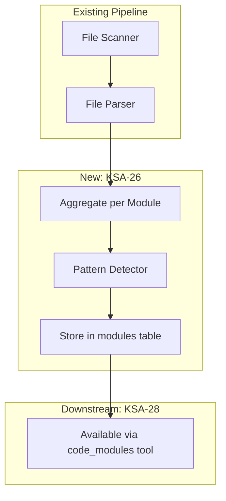
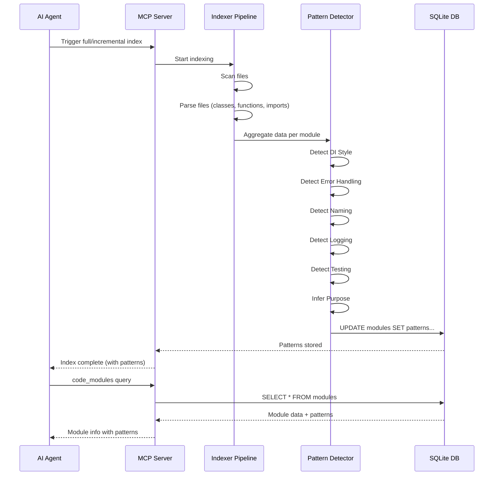

# Business Requirements Document (BRD)

## Kiro SDLC Agents — KSA-26: [Indexer] Port Pattern Detection Logic from Scripts to MCP Indexer

---

## Document Information

| Field | Value |
|-------|-------|
| Jira Ticket | KSA-26 |
| Title | [Indexer] Port pattern detection logic from scripts to MCP indexer |
| Author | BA Agent |
| Version | 1.0 |
| Date | 2026-05-16 |
| Status | Draft |

---

## Author Tracking

| Role | Name - Position | Responsibility |
|------|-----------------|----------------|
| Author | BA Agent – Business Analyst | Create document |
| Peer Reviewer | SA Agent – Solution Architect | Review document |

---

## Revision History

| Version | Date | Author | Changes |
|---------|------|--------|---------|
| 1.0 | 2026-05-16 | BA Agent | Initiate document — auto-generated from Jira ticket KSA-26 and linked tickets (KSA-24, KSA-25, KSA-27, KSA-28) |

---

## Sign-Off

| Name | Signature and date |
|------|--------------------|
| | ☐ I agree and confirm all criteria on this BRD as expected requirements |
| | ☐ I agree and confirm all criteria on this BRD as expected requirements |

---

## 1. Introduction

### 1.1 Scope

This change request covers porting the existing pattern detection logic from the Code Intelligence scripts (`scripts/python/patterns.py` and `scripts/nodejs/src/full-indexer.ts`) into the MCP (Model Context Protocol) indexer servers. The goal is to enable AI agents to query coding patterns in real-time via MCP tools instead of relying on static markdown analysis files.

**In scope:**
- Port 6 pattern detection functions: DI Style, Error Handling, Naming Conventions, Logging Framework, Testing Framework, and Module Purpose inference
- Implement full pattern detection for Tier 1 languages (Node.js/TypeScript, Python, Kotlin/Java)
- Implement basic pattern detection (DI + Naming only) for Tier 2 languages (Bash, PowerShell, CMD)
- Store detected patterns in the `modules` table (schema defined by KSA-25)
- Execute pattern detection after every full and incremental index run
- Maintain accuracy equivalent to the existing scripts
- Ensure indexing performance degradation does not exceed 10%

### 1.2 Out of Scope

- Modifying the existing scripts themselves (they remain for CI/CD batch use cases)
- Adding new pattern types beyond the 6 currently detected
- Implementing the `code_kb_export` MCP tool (covered by KSA-27)
- Enriching the `code_modules` tool response (covered by KSA-28)
- Schema migration implementation (covered by KSA-25)
- Ollama/AI-based semantic pattern detection (covered by KSA-22)

### 1.3 Preliminary Requirement

| Prerequisite | Description | Related Ticket |
|--------------|-------------|----------------|
| Schema migration | The `modules` table must have pattern metadata columns (di_style, error_handling, naming_convention, logging_framework, testing_framework, purpose) | KSA-25 |
| MCP Server scaffold | MCP servers must be operational with SQLite database and file scanner | KSA-17, KSA-18, KSA-19 |
| File parser | Multi-language regex extraction must be functional to provide class/function/import data | KSA-19 |

---

## 2. Business Requirements

### 2.1 High Level Process Map

The pattern detection system operates as a post-processing step within the MCP indexer pipeline. After files are scanned and parsed, the pattern detector analyzes aggregated class, function, and import data per module to identify coding patterns.

*[Edit in draw.io](diagrams/use-case.drawio)*

*[Edit in draw.io](diagrams/business-flow.drawio)*

### 2.2 List of User Stories / Use Cases

| # | Story / Use Case | Priority | Source Ticket |
|---|------------------|----------|---------------|
| 1 | As an AI agent, I want the MCP indexer to detect DI style patterns so that I can understand dependency injection approaches without reading static files | MUST HAVE | KSA-26 |
| 2 | As an AI agent, I want the MCP indexer to detect error handling patterns so that I can generate code consistent with the project's error handling approach | MUST HAVE | KSA-26 |
| 3 | As an AI agent, I want the MCP indexer to detect naming conventions so that I can follow established naming patterns when generating code | MUST HAVE | KSA-26 |
| 4 | As an AI agent, I want the MCP indexer to detect logging frameworks so that I can use the correct logging library in generated code | MUST HAVE | KSA-26 |
| 5 | As an AI agent, I want the MCP indexer to detect testing frameworks so that I can generate tests using the project's testing tools | MUST HAVE | KSA-26 |
| 6 | As an AI agent, I want the MCP indexer to infer module purpose so that I understand the architectural role of each module | SHOULD HAVE | KSA-26 |
| 7 | As a developer, I want pattern detection to run automatically after indexing so that patterns are always up-to-date | MUST HAVE | KSA-26 |
| 8 | As a developer, I want pattern detection to not degrade indexing performance by more than 10% so that the development experience remains fast | MUST HAVE | KSA-26 |

---

### 2.3 Details of User Stories

---

#### Business Flow

**Step 1:** MCP server receives an index trigger (full or incremental) from an AI agent or file watcher.

**Step 2:** The file scanner identifies source files across all discovered modules.

**Step 3:** The file parser extracts classes, functions, imports, and annotations from each source file using language-specific regex patterns.

**Step 4:** Parse results are aggregated per module — all classes, functions, and imports belonging to a module are collected.

**Step 5:** The Pattern Detector runs 6 detection functions on the aggregated data for each module:
- `detectDiStyle()` — analyzes annotations and constructor patterns
- `detectErrorHandling()` — analyzes class names and imports for error patterns
- `detectNaming()` — analyzes class name suffixes
- `detectLogging()` — analyzes import statements for logging libraries
- `detectTesting()` — analyzes import statements for test frameworks
- `inferModulePurpose()` — analyzes module name, class names, and package names

**Step 6:** Detected patterns are written to the `modules` table in SQLite.

**Step 7:** Patterns become queryable via the `code_modules` MCP tool (KSA-28).

> **Note:** For Tier 2 languages (Bash, PowerShell, CMD), only DI Style and Naming detection are performed due to limited annotation/import parsing capabilities.

---

#### STORY 1: Detect DI Style Patterns

> As an AI agent, I want the MCP indexer to detect DI style patterns so that I can understand dependency injection approaches without reading static files.

**Requirement Details:**

1. The pattern detector must identify the dependency injection style used in each module by analyzing class annotations, function annotations, and import statements.
2. Detection logic must recognize:
   - `@Inject` and `@Autowired` annotations → "field injection"
   - Constructor functions with parameters (named `constructor` or `__init__`) → "constructor injection"
   - No DI indicators found → "none"
3. The detection must work across all Tier 1 languages (TypeScript/Node.js, Python, Kotlin/Java).
4. For Tier 2 languages (Bash, PowerShell, CMD), basic detection via string matching on annotations is sufficient.

**Data Fields:**

| Field | Type | Required | Description | Example |
|-------|------|----------|-------------|---------|
| di_style | TEXT | Yes | Detected DI pattern | "field injection", "constructor injection", "none" |

**Acceptance Criteria:**

1. Given a module with `@Inject` or `@Autowired` annotations in class/function metadata, the detector returns "field injection"
2. Given a module with constructor functions that have parameters, the detector returns "constructor injection"
3. Given a module with no DI indicators, the detector returns "none"
4. Detection accuracy matches the output of `scripts/python/patterns.py::_detect_di()` for the same input data

**Validation Rules:**

- `di_style` must be one of: "field injection", "constructor injection", "none"
- If both field injection and constructor injection indicators are found, "field injection" takes precedence (matching existing script behavior)

---

#### STORY 2: Detect Error Handling Patterns

> As an AI agent, I want the MCP indexer to detect error handling patterns so that I can generate code consistent with the project's error handling approach.

**Requirement Details:**

1. The pattern detector must identify the error handling approach by analyzing class names and import statements.
2. Detection logic must recognize:
   - `Result` or `Either` types in imports/class names → "Result type"
   - `ExceptionHandler` or `ControllerAdvice` in imports/class names → "exception handler"
   - `Exception`, `Error`, `try`, `catch` keywords → "try-catch"
   - No error handling indicators → "unknown"
3. Priority order: Result type > exception handler > try-catch > unknown

**Data Fields:**

| Field | Type | Required | Description | Example |
|-------|------|----------|-------------|---------|
| error_handling | TEXT | Yes | Detected error handling approach | "Result type", "exception handler", "try-catch", "unknown" |

**Acceptance Criteria:**

1. Given a module importing `Result` or `Either` types, the detector returns "Result type"
2. Given a module with `@ExceptionHandler` or `@ControllerAdvice`, the detector returns "exception handler"
3. Given a module with standard try-catch patterns, the detector returns "try-catch"
4. Given a module with no error handling indicators, the detector returns "unknown"
5. Detection accuracy matches `scripts/python/patterns.py::_detect_error_handling()`

**Validation Rules:**

- `error_handling` must be one of: "Result type", "exception handler", "try-catch", "unknown"

---

#### STORY 3: Detect Naming Conventions

> As an AI agent, I want the MCP indexer to detect naming conventions so that I can follow established naming patterns when generating code.

**Requirement Details:**

1. The pattern detector must identify naming conventions by analyzing class name suffixes.
2. Detection logic must check for standard suffixes: `Controller`, `Service`, `Repository`
3. Output format: comma-separated list of found patterns (e.g., "*Controller, *Service, *Repository")
4. If no standard suffixes are found → "unknown"

**Data Fields:**

| Field | Type | Required | Description | Example |
|-------|------|----------|-------------|---------|
| naming_convention | TEXT | Yes | Detected naming patterns | "*Controller, *Service, *Repository", "unknown" |

**Acceptance Criteria:**

1. Given a module with classes ending in "Controller", the detector includes "*Controller" in the result
2. Given a module with classes ending in "Service", the detector includes "*Service" in the result
3. Given a module with classes ending in "Repository", the detector includes "*Repository" in the result
4. Multiple suffixes are comma-separated in the output
5. Given a module with no standard suffixes, the detector returns "unknown"
6. Detection accuracy matches `scripts/python/patterns.py::_detect_naming()`

**Validation Rules:**

- Output is either "unknown" or a comma-separated list of `*Suffix` patterns
- Only the 3 standard suffixes are checked (Controller, Service, Repository)

---

#### STORY 4: Detect Logging Framework

> As an AI agent, I want the MCP indexer to detect logging frameworks so that I can use the correct logging library in generated code.

**Requirement Details:**

1. The pattern detector must identify the logging framework by analyzing import statements.
2. Detection logic must recognize:
   - `slf4j` or `SLF4J` → "SLF4J"
   - `log4j` or `Log4j` → "Log4j"
   - `logging` (Python stdlib) → "logging"
   - `console` → "console.log"
   - No logging indicators → "unknown"

**Data Fields:**

| Field | Type | Required | Description | Example |
|-------|------|----------|-------------|---------|
| logging_framework | TEXT | Yes | Detected logging framework | "SLF4J", "Log4j", "logging", "console.log", "unknown" |

**Acceptance Criteria:**

1. Given a module importing `org.slf4j.*`, the detector returns "SLF4J"
2. Given a module importing `log4j`, the detector returns "Log4j"
3. Given a Python module importing `logging`, the detector returns "logging"
4. Given a Node.js module using `console`, the detector returns "console.log"
5. Given a module with no logging imports, the detector returns "unknown"
6. Detection accuracy matches `scripts/python/patterns.py::_detect_logging()`

**Validation Rules:**

- `logging_framework` must be one of: "SLF4J", "Log4j", "logging", "console.log", "unknown"

---

#### STORY 5: Detect Testing Framework

> As an AI agent, I want the MCP indexer to detect testing frameworks so that I can generate tests using the project's testing tools.

**Requirement Details:**

1. The pattern detector must identify the testing framework by analyzing import statements.
2. Detection logic must recognize:
   - `junit` or `org.junit` → "JUnit"
   - `jest` or `@jest` → "Jest"
   - `pytest` or `unittest` → "pytest"
   - `vitest` → "vitest"
   - `kotest` → "kotest"
   - No testing indicators → "unknown"

**Data Fields:**

| Field | Type | Required | Description | Example |
|-------|------|----------|-------------|---------|
| testing_framework | TEXT | Yes | Detected testing framework | "JUnit", "Jest", "pytest", "vitest", "kotest", "unknown" |

**Acceptance Criteria:**

1. Given a module importing `org.junit.*`, the detector returns "JUnit"
2. Given a module importing from `jest` or `@jest/*`, the detector returns "Jest"
3. Given a module importing `pytest` or `unittest`, the detector returns "pytest"
4. Given a module importing from `vitest`, the detector returns "vitest"
5. Given a module importing from `kotest`, the detector returns "kotest"
6. Given a module with no test imports, the detector returns "unknown"
7. Detection accuracy matches `scripts/python/patterns.py::_detect_testing()`

**Validation Rules:**

- `testing_framework` must be one of: "JUnit", "Jest", "pytest", "vitest", "kotest", "unknown"

---

#### STORY 6: Infer Module Purpose

> As an AI agent, I want the MCP indexer to infer module purpose so that I understand the architectural role of each module.

**Requirement Details:**

1. The pattern detector must infer the purpose of each module by analyzing the module name, class names, and package names.
2. Purpose inference keywords and mappings:
   - `api`, `controller` → "API layer"
   - `service`, `business` → "Business logic"
   - `repository`, `dao`, `data` → "Data access"
   - `config`, `configuration` → "Configuration"
   - `common`, `shared` → "Shared utilities"
   - `test`, `spec` → "Testing"
   - `web`, `ui` → "Web/UI layer"
   - `model`, `domain` → "Domain model"
   - No match → "Application module"
3. All name matching is case-insensitive.

**Data Fields:**

| Field | Type | Required | Description | Example |
|-------|------|----------|-------------|---------|
| purpose | TEXT | Yes | Inferred module purpose | "API layer", "Business logic", "Data access", etc. |

**Acceptance Criteria:**

1. Given a module named "user-controller" with Controller classes, the detector returns "API layer"
2. Given a module named "order-service", the detector returns "Business logic"
3. Given a module named "data-repository", the detector returns "Data access"
4. Given a module with no matching keywords, the detector returns "Application module"
5. Detection accuracy matches `scripts/python/patterns.py::infer_module_purpose()`

**Validation Rules:**

- `purpose` must be one of the defined purpose strings
- First keyword match wins (priority order as listed above)

---

#### STORY 7: Automatic Pattern Detection After Indexing

> As a developer, I want pattern detection to run automatically after indexing so that patterns are always up-to-date.

**Requirement Details:**

1. Pattern detection must execute automatically as a post-processing step after both full index and incremental index operations.
2. For full index: detect patterns for ALL modules.
3. For incremental index: detect patterns only for modules whose files were modified (re-aggregate and re-detect).
4. Pattern results must be persisted to the `modules` table immediately after detection.
5. If pattern detection fails for a module, log the error and continue with remaining modules (no full-pipeline failure).

**Acceptance Criteria:**

1. After a full index completes, all modules in the `modules` table have non-null pattern columns
2. After an incremental index modifies files in module X, module X's patterns are re-detected and updated
3. Modules not affected by an incremental index retain their existing pattern values
4. Pattern detection errors are logged but do not cause the indexing pipeline to fail
5. Pattern detection runs in all 6 MCP server variants

---

#### STORY 8: Performance Constraint

> As a developer, I want pattern detection to not degrade indexing performance by more than 10% so that the development experience remains fast.

**Requirement Details:**

1. The total time added by pattern detection must not exceed 10% of the base indexing time (scan + parse).
2. Pattern detection operates on already-parsed data (classes, functions, imports) — it does NOT re-read source files.
3. All detection functions are pure string matching / suffix checking — no complex regex or AST operations.
4. Performance must be measured and reported in the index result summary.

**Acceptance Criteria:**

1. Given a project with 1000 source files, pattern detection adds less than 10% to total indexing time
2. Pattern detection does not perform any file I/O — it operates solely on in-memory parsed data
3. The index result includes `patternDetectionMs` field showing elapsed time for pattern detection
4. Performance is validated by comparing indexing time with and without pattern detection enabled

**Validation Rules:**

- `patternDetectionMs / totalIndexMs < 0.10` (10% threshold)

---

## 3. Dependencies

| Dependency | Type | Related Ticket | Description |
|------------|------|----------------|-------------|
| Schema migration | System | KSA-25 | `modules` table must have pattern metadata columns before patterns can be stored |
| MCP Server scaffold | System | KSA-17 | MCP server must be operational with stdio transport |
| SQLite + FTS5 | System | KSA-18 | Database must be initialized with proper schema |
| File Scanner + Parser | System | KSA-19 | Multi-language regex extraction must provide class/function/import data |
| Incremental indexer | System | KSA-21 | Incremental index must support re-detection for modified modules |
| code_modules tool | Downstream | KSA-28 | Consumes pattern data stored by this ticket |
| code_kb_export tool | Downstream | KSA-27 | Consumes pattern data for KB payload generation |

---

## 4. Stakeholders

| Role | Name / Team | Responsibility | Source |
|------|-------------|----------------|--------|
| Reporter | Duc Nguyen Minh | Define requirements, validate accuracy | KSA-26 reporter |
| SA Agent | Solution Architect | Design pattern detection architecture for 6 variants | User context |
| DEV Agent | Developer | Implement pattern detection in all 6 MCP server variants | User context |
| QA Agent | Quality Assurance | Verify accuracy vs. existing scripts output | User context |

---

## 5. Risks and Assumptions

### 5.1 Risks

| Risk | Impact | Likelihood | Mitigation |
|------|--------|------------|------------|
| Parser output format differs between MCP variants | High | Medium | Define a common interface/contract for parsed data (ClassInfo, FunctionInfo, imports array) |
| Performance degradation exceeds 10% on large projects | Medium | Low | Pattern detection is pure string matching on in-memory data; benchmark early |
| Tier 2 languages have insufficient parse data for pattern detection | Medium | Medium | Accept basic detection only (DI + naming) for Tier 2; document limitation |
| Schema migration (KSA-25) delayed | High | Low | KSA-26 cannot store results without schema; coordinate delivery order |
| Inconsistent detection results across 6 variants | High | Medium | Use identical detection logic/algorithm; QA validates cross-variant consistency |

### 5.2 Assumptions

- The existing pattern detection logic in `scripts/python/patterns.py` and `scripts/nodejs/src/full-indexer.ts` is the authoritative reference for expected behavior.
- The file parser (KSA-19) provides `ClassInfo[]`, `FunctionInfo[]`, and `string[]` (imports) per file, which can be aggregated per module.
- All 6 MCP server variants share the same SQLite schema (defined by KSA-25).
- Pattern detection is deterministic — same input always produces same output.
- "Accuracy equivalent to scripts" means identical output for the same parsed input data.

---

## 6. Non-Functional Requirements

| Category | Requirement | Details |
|----------|-------------|---------|
| Performance | Pattern detection overhead < 10% | Must not add more than 10% to total indexing time |
| Performance | No file I/O during detection | Operates on in-memory parsed data only |
| Compatibility | All 6 MCP variants | Node.js, Python, Kotlin (Tier 1 full), Bash, PowerShell, CMD (Tier 2 basic) |
| Reliability | Fault tolerance | Detection failure for one module must not crash the pipeline |
| Maintainability | Single-responsibility modules | Pattern detection logic in dedicated file (e.g., `patterns.ts`, `patterns.py`) |
| Accuracy | Equivalent to scripts | Same input → same output as existing scripts |
| Backward Compatibility | Existing DB readable | Modules without patterns (null/default values) must not break queries |

---

## 7. Related Tickets

| Ticket Key | Summary | Status | Type | Relationship |
|------------|---------|--------|------|--------------|
| KSA-26 | [Indexer] Port pattern detection logic from scripts to MCP indexer | To Do | Task | Main ticket |
| KSA-24 | [Epic] Merge Code Intelligence: Scripts Pattern Detection + MCP Real-time Query | To Do | Epic | Parent epic |
| KSA-25 | [DB] Extend modules table schema for pattern metadata | To Do | Task | Blocked by (schema dependency) |
| KSA-27 | [Tool] Add code_kb_export MCP tool for KB payload generation | To Do | Task | Depends on KSA-26 |
| KSA-28 | [Tool] Enrich code_modules response with pattern metadata | To Do | Task | Depends on KSA-26 |
| KSA-16 | [MCP Server] Local Code Intelligence — Standalone MCP Server | To Do | Epic | Parent system |
| KSA-17 | MCP Server Scaffold — TypeScript + @modelcontextprotocol/sdk | In Progress | Task | Prerequisite |
| KSA-18 | SQLite Schema + FTS5 Setup — Database lifecycle and migrations | In Progress | Task | Prerequisite |
| KSA-19 | File Scanner + Signature Extractor — Multi-language regex extraction | In Progress | Task | Prerequisite |
| KSA-21 | Background Indexing + File Watcher — Non-blocking incremental updates | To Do | Task | Related (incremental detection) |

---

## 8. Appendix

### Pattern Detection Logic Reference

The following table summarizes the detection logic that must be ported from scripts to MCP indexer:

| Pattern | Input Data | Detection Logic | Possible Values |
|---------|-----------|-----------------|-----------------|
| DI Style | annotations, imports, function names | Check for `@Inject`/`@Autowired` → field injection; Check for constructor with params → constructor injection | "field injection", "constructor injection", "none" |
| Error Handling | class names, imports | Check for `Result`/`Either` → Result type; Check for `ExceptionHandler`/`ControllerAdvice` → exception handler; Check for `Exception`/`Error` → try-catch | "Result type", "exception handler", "try-catch", "unknown" |
| Naming | class names | Check suffixes: Controller, Service, Repository | "*Controller, *Service, *Repository" or "unknown" |
| Logging | imports | Check for slf4j, log4j, logging, console | "SLF4J", "Log4j", "logging", "console.log", "unknown" |
| Testing | imports | Check for junit, jest, pytest, vitest, kotest | "JUnit", "Jest", "pytest", "vitest", "kotest", "unknown" |
| Purpose | module name, class names, package names | Keyword matching (case-insensitive) against purpose map | "API layer", "Business logic", "Data access", etc. |

### Tier Classification

| Tier | Languages | Pattern Support | Rationale |
|------|-----------|----------------|-----------|
| Tier 1 | Node.js/TypeScript, Python, Kotlin/Java | Full (all 6 patterns) | Rich annotation/import parsing available |
| Tier 2 | Bash, PowerShell, CMD | Basic (DI + Naming only) | Limited parsing capabilities; no annotation system |

### Source Code References

| File | Functions | Purpose |
|------|-----------|---------|
| `scripts/python/patterns.py` | `detect_patterns()`, `infer_module_purpose()`, `_detect_di()`, `_detect_error_handling()`, `_detect_naming()`, `_detect_logging()`, `_detect_testing()` | Python reference implementation |
| `scripts/nodejs/src/full-indexer.ts` | `detectDiStyle()`, `detectErrorHandling()`, `detectNaming()`, `detectLogging()`, `detectTesting()`, `detectPatterns()`, `inferModulePurpose()` | TypeScript reference implementation |

### Glossary

| Term | Definition |
|------|------------|
| MCP | Model Context Protocol — standard for AI agent tool communication |
| DI | Dependency Injection — design pattern for managing object dependencies |
| FTS5 | Full-Text Search 5 — SQLite extension for text search |
| Tier 1 | Languages with full pattern detection support (Node.js, Python, Kotlin) |
| Tier 2 | Languages with basic pattern detection support (Bash, PowerShell, CMD) |
| Pattern Detection | Process of identifying coding patterns from parsed source code metadata |

### Reference Documents

| Document | Link / Location |
|----------|-----------------|
| Python patterns implementation | `.analysis/code-intelligence/scripts/python/patterns.py` |
| TypeScript indexer implementation | `.analysis/code-intelligence/scripts/nodejs/src/full-indexer.ts` |
| KSA-25 Schema definition | Jira ticket KSA-25 |
| Epic overview | Jira ticket KSA-24 |
