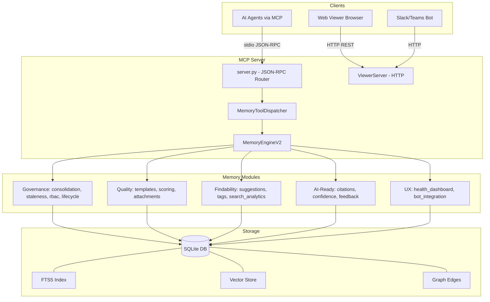
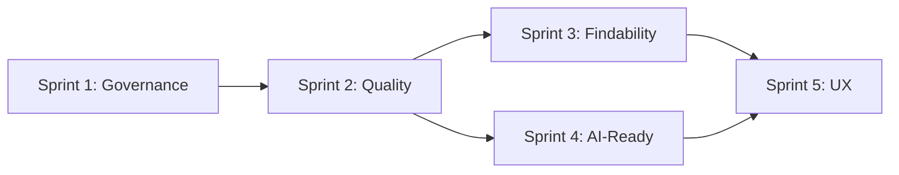
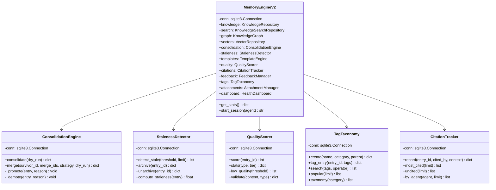
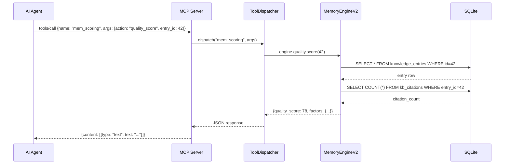

# Technical Design Document (TDD)

## KB System Enhancement — KSA-68: Achieve 100% across all 5 Pillars

---

## Document Information

| Field | Value |
|-------|-------|
| Jira Ticket | KSA-68 |
| Title | KB System Enhancement — Achieve 100% across all 5 Pillars |
| Author | SA Agent |
| Version | 1.0 |
| Date | 2026-05-23 |
| Status | Draft |
| Related BRD | BRD-v1-KSA-68.docx |
| Related FSD | FSD.md |

---

## 1. Introduction

### 1.1 Purpose

Technical design for upgrading the Python MemoryEngine from 12 to 25 MCP tools, achieving 100% compliance across all 5 KB quality pillars.

### 1.2 Technology Stack

| Layer | Technology | Version |
|-------|-----------|---------|
| Language | Python | 3.11+ |
| Database | SQLite + FTS5 | 3.40+ |
| Vector Search | ONNX Runtime + all-MiniLM-L6-v2 | 384-dim |
| MCP Transport | JSON-RPC 2.0 (stdio) | N/A |
| Web Framework | Starlette (ViewerServer) | 0.27+ |
| Embedding | sentence-transformers (ONNX) | N/A |

### 1.3 Design Principles

- **Backward compatible** — Existing 12 tools unchanged
- **Modular** — Each pillar as independent module
- **SQLite-native** — No external DB dependencies
- **Idempotent schemas** — All DDL uses IF NOT EXISTS
- **Audit everything** — All write ops logged to memory_audit

---

## 2. System Architecture

### 2.1 Architecture Overview



### 2.2 Module Dependencies



### 2.3 Component Responsibilities

| Component | File | Responsibility |
|-----------|------|----------------|
| MemoryEngineV2 | engine_v2.py | Facade — initializes all repos, manages schema |
| MemoryToolDispatcher | dispatcher_consolidated.py | Routes MCP tool calls to handlers |
| ConsolidationEngine | consolidation_engine.py | Promote/demote/merge logic |
| Staleness | staleness.py | Staleness detection & scoring |
| RBAC | rbac.py | Agent scope filtering |
| ReviewReminders | review_reminders.py | Scheduled review management |
| Templates | templates.py | Template CRUD & validation |
| QualityScoring | quality_scoring.py | Quality score computation |
| Attachments | attachments.py | File attachment management |
| Suggestions | suggestions.py | Type-ahead & related entries |
| TagTaxonomy | tag_taxonomy.py | Tag CRUD & search |
| SearchAnalytics | search_analytics.py | Query logging & gap analysis |
| Citations | citations.py | Citation tracking |
| ConfidenceScoring | confidence_scoring.py | Confidence computation |
| Feedback | feedback.py | Thumbs up/down system |
| HealthDashboard | health_dashboard.py | Metrics & recommendations |
| BotIntegration | bot_integration.py | Slack/Teams interface |
| ViewerServer | http/viewer_server.py | Web UI HTTP server |

---

## 3. API Design (MCP Tools)

### 3.1 Tool Overview

| # | Tool Name | Actions | Sprint |
|---|-----------|---------|--------|
| 1 | mem_consolidate | consolidate, merge | 1 |
| 2 | mem_lifecycle | detect_stale, archive, unarchive, due_reviews, mark_reviewed, schedule, snooze, complete | 1 |
| 3 | mem_templates | create, list, validate | 2 |
| 4 | mem_attachments | attach, list, remove, search | 2 |
| 5 | mem_scoring | quality_score, quality_stats, low_quality, validate, confidence, confidence_stats, unreliable, feedback_submit, feedback_view, top_rated, low_rated | 2+4 |
| 6 | mem_discover | suggest, related | 3 |
| 7 | mem_tags | create, tag, untag, search, taxonomy, popular, entry_tags | 3 |
| 8 | mem_citations | record, entry, most_cited, uncited, by_agent | 4 |
| 9 | mem_admin | status, audit, sessions, analytics, dashboard, sync_code, popular, gaps, zero_results, metrics, recommendations, trends | 5 |

### 3.2 Tool: mem_consolidate

```json
{
  "name": "mem_consolidate",
  "inputSchema": {
    "type": "object",
    "properties": {
      "action": { "type": "string", "enum": ["consolidate", "merge"] },
      "dry_run": { "type": "boolean", "default": false },
      "merge_ids": { "type": "string", "description": "Comma-separated IDs to merge" },
      "survivor_id": { "type": "number", "description": "ID of entry to keep" },
      "strategy": { "type": "string", "enum": ["append", "newest"], "default": "append" }
    },
    "required": ["action"]
  }
}
```

**Response (consolidate):**
```json
{
  "promoted": [{"id": 42, "from": "WORKING", "to": "EPISODIC", "reason": "high access"}],
  "demoted": [{"id": 99, "from": "EPISODIC", "to": "WORKING", "reason": "no access 90d"}],
  "summary": "Promoted 3, demoted 5"
}
```

### 3.3 Tool: mem_lifecycle

```json
{
  "name": "mem_lifecycle",
  "inputSchema": {
    "type": "object",
    "properties": {
      "action": { "type": "string", "enum": ["detect_stale", "archive", "unarchive", "due_reviews", "mark_reviewed", "schedule", "snooze", "complete"] },
      "entry_id": { "type": "number" },
      "threshold": { "type": "number", "default": 0.8 },
      "days": { "type": "number", "default": 90 },
      "interval_days": { "type": "number" },
      "snooze_days": { "type": "number", "default": 7 },
      "owner": { "type": "string" },
      "reviewer": { "type": "string" },
      "status": { "type": "string", "enum": ["pending", "approved", "rejected", "needs_revision"] },
      "dry_run": { "type": "boolean", "default": false },
      "limit": { "type": "number", "default": 20 }
    },
    "required": ["action"]
  }
}
```

### 3.4 Tool: mem_scoring

```json
{
  "name": "mem_scoring",
  "inputSchema": {
    "type": "object",
    "properties": {
      "action": { "type": "string", "enum": ["quality_score", "quality_stats", "low_quality", "validate", "confidence", "confidence_stats", "unreliable", "feedback_submit", "feedback_view", "top_rated", "low_rated"] },
      "entry_id": { "type": "number" },
      "content": { "type": "string" },
      "type": { "type": "string" },
      "rating": { "type": "number", "enum": [1, -1] },
      "comment": { "type": "string" },
      "threshold": { "type": "number", "default": 40 },
      "limit": { "type": "number", "default": 20 }
    },
    "required": ["action"]
  }
}
```

### 3.5 Web Viewer REST API

| Method | Path | Description |
|--------|------|-------------|
| GET | /api/kb/search | Search entries (query, type, tier, tags params) |
| GET | /api/kb/entries/{id} | Get entry detail |
| GET | /api/kb/entries/{id}/related | Get related entries |
| GET | /api/kb/dashboard | Health dashboard data |
| GET | /api/kb/reminders | Due reviews list |
| POST | /api/kb/entries/{id}/review | Mark entry as reviewed |
| GET | /api/kb/tags | List all tags |
| GET | /api/kb/stats | System statistics |

---

## 4. Database Design

### 4.1 Schema Migrations

All new tables added via migration scripts (idempotent, IF NOT EXISTS):

```sql
-- V5 Migration: Governance & Quality Enhancement

-- Templates table
CREATE TABLE IF NOT EXISTS kb_templates (
  id INTEGER PRIMARY KEY AUTOINCREMENT,
  name TEXT NOT NULL UNIQUE,
  type TEXT NOT NULL,
  required_sections TEXT NOT NULL DEFAULT '[]',
  created_at TEXT NOT NULL DEFAULT (datetime('now'))
);

-- Attachments table
CREATE TABLE IF NOT EXISTS kb_attachments (
  id INTEGER PRIMARY KEY AUTOINCREMENT,
  entry_id INTEGER NOT NULL,
  file_path TEXT NOT NULL,
  mime_type TEXT NOT NULL DEFAULT 'application/octet-stream',
  size INTEGER NOT NULL DEFAULT 0,
  description TEXT,
  created_at TEXT NOT NULL DEFAULT (datetime('now')),
  FOREIGN KEY (entry_id) REFERENCES knowledge_entries(id) ON DELETE CASCADE
);

-- Citations table
CREATE TABLE IF NOT EXISTS kb_citations (
  id INTEGER PRIMARY KEY AUTOINCREMENT,
  entry_id INTEGER NOT NULL,
  cited_by TEXT NOT NULL,
  context TEXT,
  created_at TEXT NOT NULL DEFAULT (datetime('now')),
  FOREIGN KEY (entry_id) REFERENCES knowledge_entries(id) ON DELETE CASCADE
);

-- Feedback table
CREATE TABLE IF NOT EXISTS kb_feedback (
  id INTEGER PRIMARY KEY AUTOINCREMENT,
  entry_id INTEGER NOT NULL,
  rating INTEGER NOT NULL CHECK(rating IN (-1, 1)),
  comment TEXT,
  agent_name TEXT,
  created_at TEXT NOT NULL DEFAULT (datetime('now')),
  FOREIGN KEY (entry_id) REFERENCES knowledge_entries(id) ON DELETE CASCADE
);

-- Tag taxonomy
CREATE TABLE IF NOT EXISTS kb_tags (
  id INTEGER PRIMARY KEY AUTOINCREMENT,
  name TEXT NOT NULL UNIQUE,
  category TEXT,
  parent_tag TEXT,
  usage_count INTEGER NOT NULL DEFAULT 0,
  created_at TEXT NOT NULL DEFAULT (datetime('now'))
);

-- Entry-tag mapping
CREATE TABLE IF NOT EXISTS kb_entry_tags (
  id INTEGER PRIMARY KEY AUTOINCREMENT,
  entry_id INTEGER NOT NULL,
  tag_id INTEGER NOT NULL,
  created_at TEXT NOT NULL DEFAULT (datetime('now')),
  FOREIGN KEY (entry_id) REFERENCES knowledge_entries(id) ON DELETE CASCADE,
  FOREIGN KEY (tag_id) REFERENCES kb_tags(id) ON DELETE CASCADE,
  UNIQUE(entry_id, tag_id)
);

-- Search analytics log
CREATE TABLE IF NOT EXISTS search_log (
  id INTEGER PRIMARY KEY AUTOINCREMENT,
  query TEXT NOT NULL,
  results_count INTEGER NOT NULL DEFAULT 0,
  agent_name TEXT,
  created_at TEXT NOT NULL DEFAULT (datetime('now'))
);

-- Additional columns on knowledge_entries (V5)
-- ALTER TABLE knowledge_entries ADD COLUMN staleness_score REAL DEFAULT 0.0;
-- ALTER TABLE knowledge_entries ADD COLUMN last_reviewed_at TEXT;
-- ALTER TABLE knowledge_entries ADD COLUMN owner TEXT;
-- ALTER TABLE knowledge_entries ADD COLUMN reviewer TEXT;
-- ALTER TABLE knowledge_entries ADD COLUMN review_interval_days INTEGER DEFAULT 90;
```

### 4.2 Index Strategy

```sql
-- Performance indexes for new features
CREATE INDEX IF NOT EXISTS idx_att_entry ON kb_attachments(entry_id);
CREATE INDEX IF NOT EXISTS idx_att_mime ON kb_attachments(mime_type);
CREATE INDEX IF NOT EXISTS idx_cit_entry ON kb_citations(entry_id);
CREATE INDEX IF NOT EXISTS idx_cit_agent ON kb_citations(cited_by);
CREATE INDEX IF NOT EXISTS idx_cit_created ON kb_citations(created_at);
CREATE INDEX IF NOT EXISTS idx_fb_entry ON kb_feedback(entry_id);
CREATE INDEX IF NOT EXISTS idx_fb_rating ON kb_feedback(rating);
CREATE INDEX IF NOT EXISTS idx_tags_category ON kb_tags(category);
CREATE INDEX IF NOT EXISTS idx_tags_parent ON kb_tags(parent_tag);
CREATE INDEX IF NOT EXISTS idx_et_entry ON kb_entry_tags(entry_id);
CREATE INDEX IF NOT EXISTS idx_et_tag ON kb_entry_tags(tag_id);
CREATE INDEX IF NOT EXISTS idx_sl_query ON search_log(query);
CREATE INDEX IF NOT EXISTS idx_sl_created ON search_log(created_at);
CREATE INDEX IF NOT EXISTS idx_ke_staleness ON knowledge_entries(staleness_score);
CREATE INDEX IF NOT EXISTS idx_ke_owner ON knowledge_entries(owner);
CREATE INDEX IF NOT EXISTS idx_ke_reviewed ON knowledge_entries(last_reviewed_at);
```

### 4.3 Query Patterns

| Operation | Query | Expected Performance |
|-----------|-------|---------------------|
| Hybrid search | FTS5 MATCH + vector cosine + graph BFS | < 500ms |
| Staleness scan | `SELECT * WHERE staleness_score > ? AND archived = 0` | < 100ms (indexed) |
| Due reviews | `SELECT * WHERE last_reviewed_at < datetime('now', '-? days')` | < 50ms |
| Quality stats | `SELECT type, AVG(quality_score) GROUP BY type` | < 100ms |
| Citation count | `SELECT entry_id, COUNT(*) FROM kb_citations GROUP BY entry_id` | < 50ms |
| Tag search (AND) | JOIN kb_entry_tags + GROUP BY HAVING COUNT = tag_count | < 200ms |
| Popular tags | `SELECT name, usage_count FROM kb_tags ORDER BY usage_count DESC` | < 10ms |

---

## 5. Class/Module Design

### 5.1 Package Structure

```
mcp_code_intel/memory/
├── engine.py              # MemoryEngine (facade)
├── engine_v2.py           # MemoryEngineV2 (enhanced facade)
├── schema.py              # Base DDL
├── schema_v3.py           # V3 migrations (core memory, conversation, quality)
├── schema_v4.py           # V4 migrations (agent_name)
├── schema_v5.py           # V5 migrations (templates, attachments, citations, tags) [NEW]
├── dispatcher_consolidated.py  # Tool routing
├── definitions_consolidated.py # Tool definitions
│
├── # Sprint 1 — Governance
├── consolidation_engine.py     # Promote/demote/merge logic
├── staleness.py                # Staleness detection & scoring
├── rbac.py                     # Agent scope filtering
├── review_reminders.py         # Review scheduling
│
├── # Sprint 2 — Quality
├── templates.py                # Template CRUD & validation
├── quality_scoring.py          # Quality score computation
├── attachments.py              # File attachment management
│
├── # Sprint 3 — Findability
├── suggestions.py              # Type-ahead & related entries
├── tag_taxonomy.py             # Tag CRUD & taxonomy
├── search_analytics.py         # Query logging & gap analysis
│
├── # Sprint 4 — AI-Ready
├── citations.py                # Citation tracking
├── confidence_scoring.py       # Confidence computation
├── feedback.py                 # Thumbs up/down
│
├── # Sprint 5 — UX
├── health_dashboard.py         # Metrics & recommendations
├── bot_integration.py          # Slack/Teams interface
└── viewer/                     # Web UI static files
```

### 5.2 Key Class Diagram



### 5.3 Design Patterns

| Pattern | Usage | Example |
|---------|-------|---------|
| Facade | MemoryEngineV2 wraps all repos | Single entry point for all operations |
| Repository | Each module owns its DB queries | KnowledgeRepository, GraphRepository |
| Strategy | Merge strategies (append, newest) | ConsolidationEngine.merge() |
| Observer | Audit logging on all writes | AuditRepository.log() called after mutations |
| Template Method | Quality scoring formula | Subclasses can override weight factors |

### 5.4 Error Handling

All tool handlers follow this pattern:
```python
def handle_action(engine: MemoryEngineV2, args: dict) -> str:
    try:
        result = engine.module.action(**validated_args)
        return json.dumps(result, indent=2)
    except ValueError as e:
        return json.dumps({"error": str(e), "code": "INVALID_INPUT"})
    except Exception as e:
        return json.dumps({"error": str(e), "code": "INTERNAL_ERROR"})
```

---

## 6. Integration Design

### 6.1 MCP Protocol Integration



### 6.2 Web Viewer Integration

- ViewerServer (Starlette) runs on configurable port (default: 3000)
- Shares same SQLite connection as MCP server
- Static files served from `shared/viewer/`
- API routes delegate to MemoryEngineV2 methods

### 6.3 Vector Embedding Pipeline

```
Ingest → Extract summary → ONNX model → 384-dim vector → Store in knowledge_vectors
Search → Query embedding → Cosine similarity → Top-K results → Merge with FTS5 + graph
```

---

## 7. Security Design

### 7.1 RBAC Model

```python
# agent_scope_config table
# Each agent role has allowed tag_set
# On search/write, filter by agent's allowed tags

class AgentScopeFilter:
    def filter_results(self, results: list, agent_role: str) -> list:
        allowed_tags = self._get_allowed_tags(agent_role)
        return [r for r in results if self._matches_scope(r, allowed_tags)]
```

### 7.2 Audit Trail

All write operations logged to `memory_audit`:
- Operation type: INGEST, DELETE, CONSOLIDATE, MERGE, ARCHIVE, REVIEW
- Entry ID, session ID, agent name
- Timestamp (auto)

### 7.3 Input Validation

- All numeric IDs validated as positive integers
- String inputs sanitized (no SQL injection via parameterized queries)
- Action enums validated against allowed values
- File paths validated for attachments (no path traversal)

---

## 8. Performance & Scalability

### 8.1 Caching Strategy

| Cache | What | TTL | Invalidation |
|-------|------|-----|-------------|
| Related entries | Precomputed related entry IDs | 1 hour | On entry update/delete |
| Tag popularity | Tag usage counts | 5 min | On tag/untag |
| Quality scores | Computed scores | Until entry modified | On entry update |
| Dashboard metrics | Aggregated stats | 1 min | On any write |

### 8.2 Performance Targets

| Operation | Target | Strategy |
|-----------|--------|----------|
| Hybrid search | < 500ms | FTS5 + vector top-K + graph BFS, merge results |
| Consolidation scan | < 30s | Batch processing, indexed queries |
| Quality scoring | < 100ms | Simple formula, cached sub-queries |
| Tag search (AND) | < 200ms | Indexed JOIN on kb_entry_tags |
| Dashboard load | < 1s | Cached aggregates |

### 8.3 Scalability

- SQLite WAL mode for concurrent reads
- Batch operations for consolidation (process 100 entries per batch)
- Vector search limited to top-K (default 50) before re-ranking
- FTS5 handles 10,000+ entries efficiently with porter tokenizer

---

## 9. Monitoring & Observability

### 9.1 Logging

All modules use stderr logging with prefix:
```
[memory] Schema initialized (V5 migrations applied)
[memory:consolidation] Promoted 3 entries, demoted 5
[memory:staleness] Detected 12 stale entries (threshold=0.8)
[memory:quality] Scored entry 42: 78/100
```

### 9.2 Health Metrics (via mem_admin dashboard)

| Metric | Description | Alert Threshold |
|--------|-------------|-----------------|
| total_entries | Total active entries | N/A |
| stale_percentage | % entries with staleness > 0.8 | > 20% |
| avg_quality_score | Average quality across all entries | < 50 |
| zero_result_rate | % searches with 0 results | > 5% |
| coverage_gaps | Topics with no entries | > 10 gaps |

### 9.3 Search Analytics

- Every search query logged to `search_log` table
- Zero-result queries flagged as content gaps
- Popular queries tracked for trending analysis
- Recommendations generated from gap analysis

---

## 10. Deployment

### 10.1 Migration Execution

Migrations are idempotent and run on server startup:
```python
def _initialize_schema(self) -> None:
    self._conn.executescript(MEMORY_SCHEMA)      # V1
    run_v3_migrations(self._conn)                # V3
    run_v4_migrations(self._conn)                # V4
    run_v5_migrations(self._conn)                # V5 [NEW]
```

### 10.2 Rollback Strategy

- All migrations use IF NOT EXISTS / IF NOT EXISTS
- ALTER TABLE failures caught and skipped (column already exists)
- No destructive migrations (no DROP TABLE/COLUMN)
- Backup SQLite file before major upgrades

### 10.3 Feature Flags

No feature flags needed — features are additive (new tools, new tables). Existing tools continue to work unchanged.

---

## 11. Implementation Checklist

| Sprint | Files to Create/Modify | Effort |
|--------|----------------------|--------|
| 1 | consolidation_engine.py, staleness.py, rbac.py, review_reminders.py, schema_v5.py | 3 days |
| 2 | templates.py, quality_scoring.py, attachments.py | 2 days |
| 3 | suggestions.py, tag_taxonomy.py, search_analytics.py | 2 days |
| 4 | citations.py, confidence_scoring.py, feedback.py | 2 days |
| 5 | health_dashboard.py, bot_integration.py, viewer updates | 3 days |
| All | dispatcher updates, definitions updates, tests | 2 days |

**Total estimated effort: 14 days (5 sprints)**
