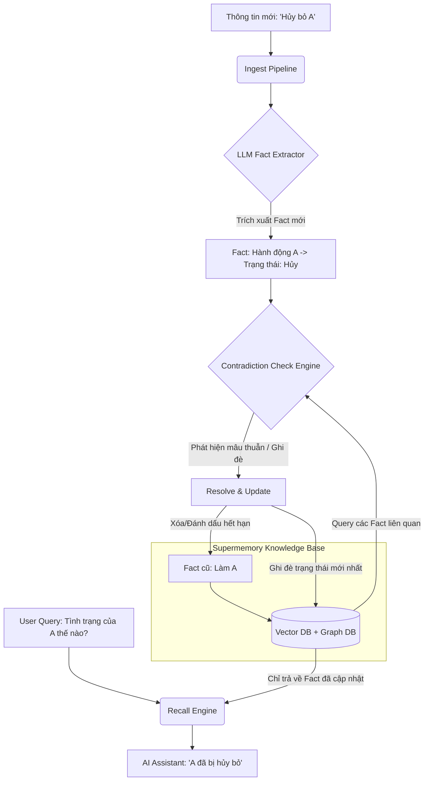

Dự án **Supermemory** (`supermemoryai/supermemory`) giải quyết bài toán cốt lõi mà các hệ thống RAG (Retrieval-Augmented Generation) truyền thống thường gặp phải: **Sự mâu thuẫn thông tin theo thời gian (Contradiction & Fact Evolution).**

Trong các hệ thống RAG thông thường (chỉ thuần Vector Database), khi bạn nạp thông tin "Làm A" (ngày 1) rồi nạp tiếp "Hủy bỏ A" (ngày 2), hệ thống sẽ lưu cả 2 đoạn văn bản này thành 2 vector độc lập. Khi AI tìm kiếm (Query), cơ chế Similarity Search có thể lôi cả 2 vector này lên, dẫn đến việc AI bị "loạn" (Hallucination hoặc Conflicting Context).

Để ngăn ngừa điều này, Supermemory không dùng cơ chế "chỉ thêm vào" (Append-only) thông thường, mà áp dụng một giải pháp quản lý tri thức động dựa trên các nguyên lý sau:

---

### 1. Bản chất giải pháp của Supermemory chống "loạn" thông tin

Supermemory giải quyết bài toán bằng cách xây dựng một tầng xử lý dữ liệu thông minh nằm trên Vector DB và Knowledge Graph, bao gồm 4 cơ chế cốt lõi:

* **Fact Extraction & Ontology-aware Graph (Trích xuất sự thật và Đồ thị thực thể):** Khi một thông tin mới đi vào hệ thống, thay vì lưu toàn bộ đoạn văn bản thô, Supermemory dùng LLM để trích xuất các "Sự thật" (Facts) và gán nhãn thực thể. Ví dụ: Thực thể `Hành động A` trạng thái hiện tại là gì.
* **Contradiction Resolution Logic (Logic giải quyết mâu thuẫn):** Đây là điểm mấu chốt. Hệ thống có một pipeline kiểm tra xem Fact mới có "phủ định", "ghi đè" hoặc "mâu thuẫn" với bất kỳ Fact nào đã tồn tại trong DB hay không. Nếu có (như từ khóa "hủy bỏ", "thay thế"), hệ thống sẽ thực hiện cập nhật (Update) hoặc đánh dấu vô hiệu hóa Fact cũ thay vì lưu song song.
* **Context Rewriting & Knowledge Merging (Ghi đè ngữ cảnh):** Tri thức trong Supermemory "tiến hóa" theo thời gian. Khi phát hiện lệnh hủy bỏ, đồ thị tri thức (Knowledge Graph) liên kết với thực thể đó sẽ cập nhật trạng thái mới nhất.
* **Smart Forgetting & Decay (Cơ chế quên thông minh):** Các thông tin cũ, hết hạn hoặc đã bị phủ định sẽ bị giảm trọng số (decay) hoặc xóa bỏ hoàn toàn khỏi không gian tìm kiếm ưu tiên, giúp AI không bao giờ nhìn thấy thông tin cũ khi gọi API.

---

### 2. Mô hình kiến trúc luồng dữ liệu (DIAGRAM)

Dưới đây là sơ đồ minh họa cách Supermemory xử lý khi bạn nạp thông tin mới vào Knowledge Base (KB) để đảm bảo dữ liệu không bị xung đột:

---

### 3. Đánh giá và Cách áp dụng giải pháp này vào dự án của bạn

Nếu bạn đang tự phát triển một hệ thống KB hoặc RAG (ví dụ: chạy trên nền Java 21 / Spring Boot / Flowable như định hướng của bạn) và muốn học tập giải pháp chống loạn thông tin giống như Supermemory, bạn có thể thiết kế theo các chiến lược sau:

#### Chiến lược 1: Metadata / Time-to-Live (TTL) và Versioning (Giải pháp kỹ thuật số)

* **Cách làm:** Mỗi khi lưu một chunk/fact vào Vector DB, luôn đính kèm `timestamp` (thời gian tạo) và `status` (active/inactive) hoặc `version`.
* **Khi Query:** Thay vì chỉ lấy Top-K vector có độ đồng dạng cao nhất, bạn phải lọc (Filter) theo metadata: Chỉ lấy những bản ghi có `status == active` hoặc nếu lấy ra 2 thông tin trùng nhóm thực thể thì **chỉ tin tưởng bản ghi có timestamp mới nhất**.

#### Chiến lược 2: Tầng "Hợp nhất tri thức" bằng LLM (Giải pháp tương tự Supermemory)

Trước khi đưa Context vào Prompt cho AI trả lời, bạn thêm một bước gọi là **Memory Consolidation**:

1. Hệ thống RAG lấy ra các chunk liên quan (bao gồm cả "Làm A" và "Hủy A").
2. Đi qua một Prompt phụ (LLM Validator):
> *"Dưới đây là các tài liệu thô thu thập được từ KB theo thời gian. Hãy rà soát xem có thông tin nào mâu thuẫn hoặc đã bị hủy bỏ/thay thế không. Hãy tổng hợp lại danh sách các thông tin chính xác và mới nhất."*

3. Kết quả sạch sau khi hợp nhất mới được gửi cho AI chính để sinh câu trả lời cho User.

#### Chiến lược 3: Sử dụng Graph RAG (Đồ thị tri thức)

* Biến các thực thể thành các Node (ví dụ: `Node: Công việc A`).
* Các mối quan hệ hoặc hành động là các Edge có thuộc tính (ví dụ: `Edge: Trạng thái -> Giá trị: Đã hủy`, cập nhật theo thời gian).
* Khi AI truy vấn về `Công việc A`, đồ thị luôn trả về thuộc tính ở trạng thái mới nhất, loại bỏ hoàn toàn việc các văn bản cũ dạng text thô làm nhiễu mô hình.