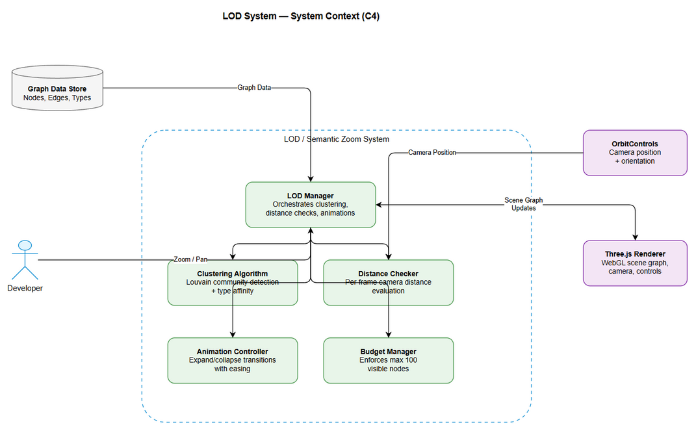
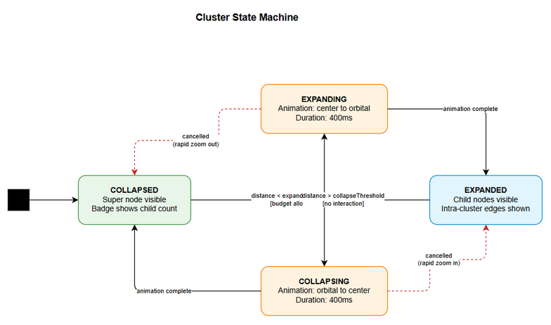

# Functional Specification Document (FSD)

## MCP Code Intelligence — KSA-143: KB Graph — Level of Detail (LOD) / Semantic Zoom

---

## Document Information

| Field | Value |
|-------|-------|
| Jira Ticket | KSA-143 |
| Title | KB Graph — Level of Detail (LOD) / Semantic Zoom |
| Author | BA Agent + TA Agent |
| Version | 1.0 |
| Date | 2026-05-25 |
| Status | Draft |
| Related BRD | BRD-v1-KSA-143.docx |

---

## Revision History

| Version | Date | Author | Changes |
|---------|------|--------|---------|
| 1.0 | 2026-05-25 | BA Agent + TA Agent | Initiate document — functional spec for LOD/Semantic Zoom |

---

## 1. Introduction

### 1.1 Purpose

This FSD specifies the functional behavior of the Level of Detail (LOD) / Semantic Zoom system for the 3D Knowledge Graph visualization. It defines use cases, data flows, API contracts, and UI behavior for the clustering and progressive disclosure mechanism.

### 1.2 Scope

The LOD system operates entirely within the VS Code extension's webview (client-side). It processes the in-memory graph data to produce a clustered view that dynamically adjusts based on camera position. No server-side changes are required.

### 1.3 Definitions and Acronyms

| Term | Definition |
|------|------------|
| LOD | Level of Detail — rendering optimization technique |
| Super Node | Visual representation of a cluster at far zoom |
| Cluster | Group of related nodes determined by algorithm |
| Expand Threshold | Camera distance triggering cluster expansion |
| Collapse Threshold | Camera distance triggering cluster collapse |
| Hysteresis | Gap between expand/collapse thresholds preventing flicker |
| Node Budget | Maximum visible nodes allowed (100) |
| Orbital Layout | Radial positioning of child nodes around cluster center |

### 1.4 References

| Document | Location |
|----------|----------|
| BRD | BRD-v1-KSA-143.docx |
| Three.js LOD API | https://threejs.org/docs/#api/en/objects/LOD |

---

## 2. System Overview

### 2.1 System Context Diagram



The LOD system sits between the Graph Data Model and the Three.js Renderer. It receives raw graph data (nodes + edges), processes it through the clustering algorithm, and outputs a scene graph with LOD-aware objects that respond to camera position changes.

**External Interfaces:**
- **Input:** Graph data from KB memory store (nodes, edges, types)
- **Input:** Camera position/orientation from Three.js OrbitControls
- **Output:** Three.js scene graph with super nodes and child nodes
- **Output:** Animation commands to Three.js renderer

### 2.2 System Architecture

The LOD Manager is the central orchestrator with four sub-components:
1. **Clustering Algorithm** — Processes graph into cluster hierarchy
2. **Distance Checker** — Monitors camera-to-cluster distances per frame
3. **Animation Controller** — Manages expand/collapse transitions
4. **Budget Manager** — Enforces max visible node count

---

## 3. Functional Requirements

### 3.1 Feature: Graph Clustering

**Source:** BRD Story 1, Story 6

#### 3.1.1 Description

The system clusters graph nodes into logical groups based on edge connectivity and node type. Each cluster is represented by a super node when viewed from far distance.

#### 3.1.2 Use Case: UC-01 — Initial Graph Clustering

**Use Case ID:** UC-01
**Actor:** System (automatic on graph load)
**Preconditions:** Graph data loaded in memory with nodes, edges, and type metadata
**Postconditions:** Cluster hierarchy created, super nodes ready for rendering

**Main Flow:**

| Step | Actor | System | Description |
|------|-------|--------|-------------|
| 1 | | System | Receive graph data (nodes[], edges[]) |
| 2 | | System | Build adjacency matrix from edges |
| 3 | | System | Run community detection algorithm (Louvain) |
| 4 | | System | Apply node type as secondary clustering factor |
| 5 | | System | Validate cluster sizes (5-50 nodes each) |
| 6 | | System | Split oversized clusters, merge undersized ones |
| 7 | | System | Calculate cluster center positions (centroid of member nodes) |
| 8 | | System | Create super node objects with metadata |
| 9 | | System | Emit clustering-complete event |

**Alternative Flows:**

| ID | Condition | Steps |
|----|-----------|-------|
| AF-01a | Graph has fewer than 100 nodes | Skip clustering, render all nodes directly (no LOD needed) |
| AF-01b | Isolated nodes detected (no edges) | Render as regular nodes, not wrapped in super node |

**Exception Flows:**

| ID | Condition | Steps |
|----|-----------|-------|
| EF-01a | Clustering exceeds 2s timeout | Abort, use simple spatial partitioning (octree) as fallback |
| EF-01b | Graph data is empty | Display empty scene with message |

#### 3.1.3 Business Rules

| ID | Rule | Description |
|----|------|-------------|
| BR-01 | Cluster Size Bounds | Min 5 nodes, Max 50 nodes per cluster (configurable) |
| BR-02 | Deterministic Output | Same input graph always produces same clusters |
| BR-03 | Connectivity Priority | Edge connectivity weight is 2x node type weight in clustering |
| BR-04 | Isolated Node Handling | Nodes with 0 edges are never clustered |
| BR-05 | Max Super Nodes | Total super nodes at max zoom-out must not exceed 100 |

#### 3.1.4 Data Specifications

**Input: GraphData**

| Field | Type | Required | Description |
|-------|------|----------|-------------|
| nodes | Node[] | Yes | Array of graph nodes |
| edges | Edge[] | Yes | Array of graph edges |

**Node:**

| Field | Type | Required | Description |
|-------|------|----------|-------------|
| id | string | Yes | Unique node identifier |
| type | string | Yes | Node type (class, function, module) |
| label | string | Yes | Display label |
| position | Vector3 | No | Current 3D position (x, y, z) |
| metadata | object | No | Additional node properties |

**Edge:**

| Field | Type | Required | Description |
|-------|------|----------|-------------|
| id | string | Yes | Unique edge identifier |
| source | string | Yes | Source node ID |
| target | string | Yes | Target node ID |
| type | string | No | Edge type (imports, calls, extends) |
| weight | number | No | Edge weight (default 1.0) |

**Output: ClusterHierarchy**

| Field | Type | Description |
|-------|------|-------------|
| clusters | Cluster[] | Array of computed clusters |
| isolatedNodes | string[] | Node IDs not assigned to any cluster |
| metadata | ClusterMetadata | Clustering statistics |

**Cluster:**

| Field | Type | Description |
|-------|------|-------------|
| id | string | Unique cluster identifier |
| label | string | Cluster display name |
| childNodeIds | string[] | IDs of nodes in this cluster |
| center | Vector3 | Centroid position of cluster |
| radius | number | Bounding sphere radius |
| dominantType | string | Most common node type in cluster |

---

### 3.2 Feature: Camera Distance Detection

**Source:** BRD Story 2, Story 5

#### 3.2.1 Description

The system continuously monitors camera position relative to each cluster and triggers expand/collapse transitions based on distance thresholds.

#### 3.2.2 Use Case: UC-02 — Expand Cluster on Zoom In

**Use Case ID:** UC-02
**Actor:** Developer (zooms camera toward super node)
**Preconditions:** Graph is clustered, super nodes are rendered, camera is at far distance
**Postconditions:** Target cluster is expanded, child nodes visible with orbital layout

**Main Flow:**

| Step | Actor | System | Description |
|------|-------|--------|-------------|
| 1 | Developer | | Zooms camera toward a super node |
| 2 | | System | On each frame, calculate distance from camera to each cluster center |
| 3 | | System | Detect cluster where distance < expandThreshold |
| 4 | | System | Check node budget: current visible + cluster.childCount <= 100 |
| 5 | | System | If budget OK: trigger expand animation for cluster |
| 6 | | System | Hide super node, create child node meshes at cluster center |
| 7 | | System | Animate child nodes to orbital positions (300-500ms) |
| 8 | | System | Show intra-cluster edges after animation completes |
| 9 | | System | Update inter-cluster edge endpoints |

**Alternative Flows:**

| ID | Condition | Steps |
|----|-----------|-------|
| AF-02a | Node budget would be exceeded | Collapse farthest expanded cluster first, then expand target |
| AF-02b | Cluster already expanded | No action (idempotent) |

**Exception Flows:**

| ID | Condition | Steps |
|----|-----------|-------|
| EF-02a | Animation interrupted by rapid zoom | Cancel current animation, snap to final state |

#### 3.2.3 Use Case: UC-03 — Collapse Cluster on Zoom Out

**Use Case ID:** UC-03
**Actor:** Developer (zooms camera away from expanded cluster)
**Preconditions:** Cluster is expanded, child nodes visible
**Postconditions:** Child nodes collapsed back into super node

**Main Flow:**

| Step | Actor | System | Description |
|------|-------|--------|-------------|
| 1 | Developer | | Zooms camera away from expanded cluster |
| 2 | | System | Detect cluster where distance > collapseThreshold |
| 3 | | System | Trigger collapse animation |
| 4 | | System | Hide intra-cluster edges |
| 5 | | System | Animate child nodes back to cluster center (300-500ms) |
| 6 | | System | Remove child node meshes |
| 7 | | System | Show super node at cluster center |
| 8 | | System | Update inter-cluster edge endpoints to super node |

**Alternative Flows:**

| ID | Condition | Steps |
|----|-----------|-------|
| AF-03a | Cluster already collapsed | No action (idempotent) |
| AF-03b | User is interacting with a child node | Delay collapse until interaction ends |

#### 3.2.4 Business Rules

| ID | Rule | Description |
|----|------|-------------|
| BR-06 | Hysteresis | collapseThreshold = expandThreshold * 1.4 |
| BR-07 | Frame Budget | Distance checks must complete within 2ms per frame |
| BR-08 | Priority | Closest cluster to camera has highest expand priority |
| BR-09 | Interaction Lock | Do not collapse cluster if user is hovering/selecting a child node |

#### 3.2.5 Configuration

| Parameter | Type | Default | Range | Description |
|-----------|------|---------|-------|-------------|
| expandThreshold | number | 50 | 20-200 | World units distance to trigger expand |
| collapseThreshold | number | 70 | 28-280 | Auto = expand * 1.4 |
| animationDuration | number | 400 | 200-1000 | Milliseconds for expand/collapse |
| maxVisibleNodes | number | 100 | 50-500 | Maximum rendered nodes |
| checkInterval | number | 16 | 16-100 | Ms between distance checks |

---

### 3.3 Feature: Node Budget Management

**Source:** BRD Story 4

#### 3.3.1 Description

The system enforces a maximum visible node count to maintain rendering performance.

#### 3.3.2 Use Case: UC-04 — Auto-Collapse on Budget Exceeded

**Use Case ID:** UC-04
**Actor:** System (automatic)
**Preconditions:** Multiple clusters expanded, user zooms into another cluster
**Postconditions:** Farthest cluster collapsed, new cluster expanded, budget maintained

**Main Flow:**

| Step | Actor | System | Description |
|------|-------|--------|-------------|
| 1 | | System | User triggers expand on cluster C |
| 2 | | System | Calculate: currentVisible + C.childCount |
| 3 | | System | If exceeds maxVisibleNodes: find farthest expanded cluster F |
| 4 | | System | Collapse F |
| 5 | | System | Recalculate budget |
| 6 | | System | If still exceeds: collapse next farthest (repeat) |
| 7 | | System | Expand C |

#### 3.3.3 Business Rules

| ID | Rule | Description |
|----|------|-------------|
| BR-10 | Budget Formula | visibleNodes = superNodes(collapsed) + sum(childNodes(expanded)) |
| BR-11 | Collapse Priority | Farthest from camera > Least recently expanded |
| BR-12 | Minimum Expanded | Always keep at least 1 cluster expanded if user is zoomed in |

---

### 3.4 Feature: Super Node Display

**Source:** BRD Story 3

#### 3.4.1 Description

Super nodes display a badge showing the count of child nodes they contain.

#### 3.4.2 Use Case: UC-05 — View Cluster Size

**Use Case ID:** UC-05
**Actor:** Developer
**Preconditions:** Graph is clustered, super nodes rendered
**Postconditions:** Developer sees child count on each super node

**Main Flow:**

| Step | Actor | System | Description |
|------|-------|--------|-------------|
| 1 | Developer | | Views graph at far zoom level |
| 2 | | System | Each super node displays: cluster label + child count badge |
| 3 | Developer | | Hovers over super node |
| 4 | | System | Show tooltip with cluster details |

#### 3.4.3 UI Specifications

**Super Node Visual:**

| Property | Value | Description |
|----------|-------|-------------|
| Shape | Sphere (3D) | Larger than regular nodes |
| Size | radius = 2.0 + log(childCount) * 0.5 | Scales with cluster size |
| Color | Based on dominant node type | Same color scheme as regular nodes |
| Opacity | 0.8 | Slightly transparent |
| Badge | White circle with count number | Top-right of sphere |
| Label | Below sphere | Cluster name |

---

### 3.5 Feature: Smooth Animations

**Source:** BRD Story 2, Story 5

#### 3.5.1 Animation Specifications

**Expand Animation (total 500ms):**

| Phase | Duration | Action |
|-------|----------|--------|
| 1 | 0-100ms | Super node opacity 1.0 to 0.0 |
| 2 | 100ms | Create child meshes at center (scale 0) |
| 3 | 100-400ms | Animate position + scale with easeOutCubic |
| 4 | 400-500ms | Fade in intra-cluster edges |

**Collapse Animation (total 500ms):**

| Phase | Duration | Action |
|-------|----------|--------|
| 1 | 0-100ms | Fade out intra-cluster edges |
| 2 | 100-400ms | Animate children to center with easeInCubic |
| 3 | 400ms | Remove child meshes |
| 4 | 400-500ms | Super node opacity 0.0 to 1.0 |

#### 3.5.2 Orbital Layout Algorithm

Child nodes positioned radially around cluster center:
- Single ring for clusters with 20 or fewer nodes
- Two concentric rings for clusters with more than 20 nodes
- Slight Y-axis variation for 3D depth

---

## 4. State Machine

### 4.1 Cluster State Diagram



| State | Description | Visual |
|-------|-------------|--------|
| COLLAPSED | Default, super node visible | Super node with badge |
| EXPANDING | Transition in progress | Animation playing |
| EXPANDED | Child nodes visible | Individual nodes + edges |
| COLLAPSING | Reverse transition | Animation playing |

**Transitions:**

| From | To | Trigger | Guard |
|------|-----|---------|-------|
| COLLAPSED | EXPANDING | distance < expandThreshold | budget allows |
| EXPANDING | EXPANDED | animation complete | — |
| EXPANDED | COLLAPSING | distance > collapseThreshold | no interaction |
| COLLAPSING | COLLAPSED | animation complete | — |
| EXPANDING | COLLAPSED | cancelled (rapid zoom out) | — |
| COLLAPSING | EXPANDED | cancelled (rapid zoom in) | — |

---

## 5. API Contracts

### 5.1 LODManager API

```typescript
interface LODManager {
  initialize(graphData: GraphData, config?: LODConfig): Promise<ClusterHierarchy>
  update(cameraPosition: Vector3): void
  expandCluster(clusterId: string): void
  collapseCluster(clusterId: string): void
  getVisibleNodeCount(): number
  getExpandedClusters(): string[]
  getClusterState(clusterId: string): ClusterState
  setConfig(config: Partial<LODConfig>): void
  getConfig(): LODConfig
  on(event: 'cluster-expanded', handler: (clusterId: string) => void): void
  on(event: 'cluster-collapsed', handler: (clusterId: string) => void): void
  on(event: 'budget-exceeded', handler: (details: BudgetExceededEvent) => void): void
  dispose(): void
}
```

### 5.2 ClusteringAlgorithm API

```typescript
interface ClusteringAlgorithm {
  cluster(graphData: GraphData, options?: ClusterOptions): ClusterHierarchy
}

interface ClusterOptions {
  minClusterSize: number    // default: 5
  maxClusterSize: number    // default: 50
  connectivityWeight: number // default: 2.0
  typeWeight: number         // default: 1.0
}
```

### 5.3 AnimationController API

```typescript
interface AnimationController {
  animateExpand(cluster: Cluster, childNodes: Node[], duration: number): Promise<void>
  animateCollapse(cluster: Cluster, childNodes: Node[], duration: number): Promise<void>
  cancel(clusterId: string): void
  isAnimating(clusterId: string): boolean
}
```

### 5.4 Type Definitions

```typescript
interface LODConfig {
  expandThreshold: number      // default: 50
  collapseThreshold: number    // default: 70
  animationDuration: number    // default: 400
  maxVisibleNodes: number      // default: 100
  checkInterval: number        // default: 16
  minClusterSize: number       // default: 5
  maxClusterSize: number       // default: 50
}

interface ClusterState {
  id: string
  state: 'COLLAPSED' | 'EXPANDING' | 'EXPANDED' | 'COLLAPSING'
  childCount: number
  distanceToCamera: number
  lastStateChange: number
}

interface BudgetExceededEvent {
  requestedClusterId: string
  currentVisible: number
  requestedAdditional: number
  collapsedClusterId: string
}

type Vector3 = { x: number; y: number; z: number }
```

---

## 6. Error Handling

| Error Code | Condition | User Impact | System Response |
|------------|-----------|-------------|-----------------|
| LOD-001 | Clustering timeout | Delayed initial render | Fall back to spatial partitioning |
| LOD-002 | WebGL context lost | Graph disappears | Attempt context restore |
| LOD-003 | Animation frame drop | Jank during transition | Skip frames, snap to end |
| LOD-004 | Memory limit exceeded | Browser tab crash risk | Reduce maxVisibleNodes, warn |
| LOD-005 | Invalid graph data | No visualization | Show error message |

---

## 7. Non-Functional Requirements

| ID | Category | Requirement | Metric | Verification |
|----|----------|-------------|--------|--------------|
| NFR-01 | Performance | Clustering computation | 2s max for 10k nodes | Benchmark test |
| NFR-02 | Performance | Frame rate | 30+ FPS with 100 nodes | Performance monitor |
| NFR-03 | Performance | Distance check latency | < 2ms per frame | Profiler |
| NFR-04 | Memory | Peak usage | < 500MB for 10k graph | Memory profiler |
| NFR-05 | Usability | Animation smoothness | No visible jank | Visual inspection |
| NFR-06 | Reliability | Deterministic clustering | Same input = same output | Unit test |
| NFR-07 | Scalability | Node count | Up to 10,000 nodes | Load test |

---

## 8. Open Issues

| ID | Issue | Impact | Owner | Status |
|----|-------|--------|-------|--------|
| OI-01 | Optimal threshold values | UX quality | Dev team | User testing needed |
| OI-02 | Multi-level clustering | Scalability beyond 10k | SA | Deferred to v2 |
| OI-03 | Edge bundling for inter-cluster edges | Visual clarity | Dev team | Nice-to-have |

---

## 9. Appendix

### 9.1 Pseudocode: Distance Check Loop

```
function updateLOD(camera, clusters):
  for each cluster in clusters:
    distance = camera.position.distanceTo(cluster.center)
    cluster.distanceToCamera = distance
    
    if cluster.state == COLLAPSED and distance < expandThreshold:
      if canExpand(cluster):
        expandCluster(cluster)
      else:
        collapseFarthest()
        expandCluster(cluster)
    
    elif cluster.state == EXPANDED and distance > collapseThreshold:
      if not isInteracting(cluster):
        collapseCluster(cluster)
```

### 9.2 Pseudocode: Louvain Clustering

```
function louvainCluster(nodes, edges):
  communities = nodes.map(n => new Community(n))
  
  improved = true
  while improved:
    improved = false
    for each node in nodes:
      bestCommunity = findBestCommunity(node, communities, edges)
      if bestCommunity != node.community:
        moveNode(node, bestCommunity)
        improved = true
  
  // Apply type affinity
  for each community in communities:
    if community.size > maxClusterSize:
      splitByType(community)
  
  // Merge tiny communities
  for each community in communities:
    if community.size < minClusterSize:
      mergeWithNearest(community)
  
  return communities.map(c => toCluster(c))
```

### Diagram Index

| # | Diagram | Image | Source (editable) |
|---|---------|-------|-------------------|
| 1 | System Context | [system-context.png](diagrams/system-context.png) | [system-context.drawio](diagrams/system-context.drawio) |
| 2 | Cluster State Machine | [state-cluster.png](diagrams/state-cluster.png) | [state-cluster.drawio](diagrams/state-cluster.drawio) |
| 3 | Sequence: Expand Cluster | [sequence-expand.png](diagrams/sequence-expand.png) | [sequence-expand.drawio](diagrams/sequence-expand.drawio) |
