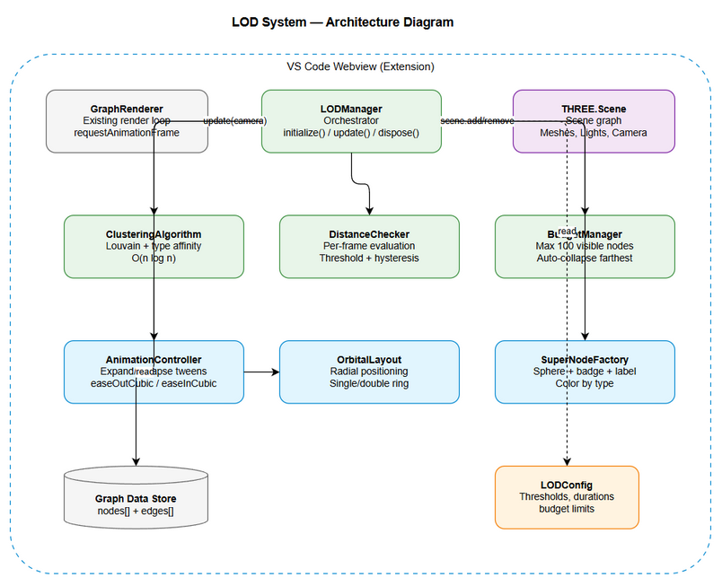
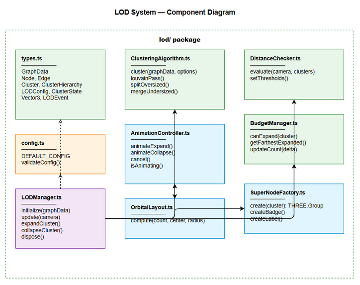

# Technical Design Document (TDD)

## MCP Code Intelligence — KSA-143: KB Graph — Level of Detail (LOD) / Semantic Zoom

---

## Document Information

| Field | Value |
|-------|-------|
| Jira Ticket | KSA-143 |
| Title | KB Graph — Level of Detail (LOD) / Semantic Zoom |
| Author | SA Agent |
| Version | 1.0 |
| Date | 2026-05-25 |
| Status | Draft |
| Related FSD | FSD-v1-KSA-143.docx |
| Related BRD | BRD-v1-KSA-143.docx |

---

## Revision History

| Version | Date | Author | Changes |
|---------|------|--------|---------|
| 1.0 | 2026-05-25 | SA Agent | Initial technical design |

---

## 1. Architecture Overview

### 1.1 Design Philosophy

The LOD system follows a **component-based architecture** with clear separation of concerns:
- **Pure computation** (clustering) separated from **rendering** (Three.js)
- **Event-driven** communication between components
- **Frame-budget aware** — all per-frame operations are O(n) where n = number of clusters (not nodes)

### 1.2 Architecture Diagram



### 1.3 Technology Stack

| Layer | Technology | Justification |
|-------|-----------|---------------|
| Language | TypeScript | Type safety, existing codebase |
| 3D Rendering | Three.js | Already used in graph visualization |
| Animation | TWEEN.js or custom | Lightweight, integrates with Three.js render loop |
| Clustering | Custom Louvain impl | No external dependency, optimized for our graph model |
| Build | Webpack (existing) | Part of extension build pipeline |

---

## 2. Component Design

### 2.1 Component Diagram



### 2.2 Module Structure

```
src/webview/graph/lod/
├── index.ts                 # Public API exports
├── LODManager.ts            # Main orchestrator
├── ClusteringAlgorithm.ts   # Louvain community detection
├── DistanceChecker.ts       # Camera distance evaluation
├── AnimationController.ts   # Expand/collapse animations
├── BudgetManager.ts         # Node budget enforcement
├── OrbitalLayout.ts         # Child node positioning
├── SuperNodeFactory.ts      # Super node mesh creation
├── types.ts                 # Shared type definitions
└── config.ts                # Default configuration
```

### 2.3 Class Design

#### LODManager (Orchestrator)

```typescript
class LODManager implements Disposable {
  private clustering: ClusteringAlgorithm
  private distanceChecker: DistanceChecker
  private animationController: AnimationController
  private budgetManager: BudgetManager
  private clusters: Map<string, ClusterState>
  private config: LODConfig
  private eventEmitter: EventEmitter

  constructor(scene: THREE.Scene, config?: Partial<LODConfig>)
  
  async initialize(graphData: GraphData): Promise<ClusterHierarchy> {
    // 1. Run clustering algorithm
    // 2. Create super node meshes
    // 3. Add to scene
    // 4. Start update loop
  }

  update(camera: THREE.Camera): void {
    // Called every frame from render loop
    // 1. distanceChecker.evaluate(camera, clusters)
    // 2. For each cluster needing state change:
    //    - budgetManager.canExpand() check
    //    - animationController.animate()
    // 3. Update edge connections
  }

  dispose(): void {
    // Cleanup all meshes, listeners, animations
  }
}
```

#### ClusteringAlgorithm

```typescript
class ClusteringAlgorithm {
  cluster(graphData: GraphData, options: ClusterOptions): ClusterHierarchy {
    // Phase 1: Build adjacency list
    // Phase 2: Louvain modularity optimization
    // Phase 3: Type affinity adjustment
    // Phase 4: Size constraint enforcement (split/merge)
    // Phase 5: Compute centroids
  }

  private buildAdjacencyList(edges: Edge[]): Map<string, Set<string>>
  private louvainPass(communities: Community[]): boolean
  private modularity(node: string, community: Community): number
  private splitOversized(community: Community): Community[]
  private mergeUndersized(communities: Community[]): Community[]
}
```

#### DistanceChecker

```typescript
class DistanceChecker {
  private expandThreshold: number
  private collapseThreshold: number

  evaluate(camera: THREE.Camera, clusters: Map<string, ClusterState>): LODEvent[] {
    const events: LODEvent[] = []
    for (const [id, state] of clusters) {
      const distance = camera.position.distanceTo(state.center)
      state.distanceToCamera = distance
      
      if (state.state === 'COLLAPSED' && distance < this.expandThreshold) {
        events.push({ type: 'EXPAND', clusterId: id })
      } else if (state.state === 'EXPANDED' && distance > this.collapseThreshold) {
        events.push({ type: 'COLLAPSE', clusterId: id })
      }
    }
    return events
  }
}
```

#### AnimationController

```typescript
class AnimationController {
  private activeAnimations: Map<string, Animation>
  private duration: number

  async animateExpand(cluster: ClusterState, childMeshes: THREE.Mesh[]): Promise<void> {
    // 1. Set all children at cluster center, scale 0
    // 2. Tween position to orbital layout
    // 3. Tween scale 0 -> 1 with easeOutCubic
    // 4. Fade in edges after position tween completes
  }

  async animateCollapse(cluster: ClusterState, childMeshes: THREE.Mesh[]): Promise<void> {
    // Reverse of expand
    // 1. Fade out edges
    // 2. Tween position to center with easeInCubic
    // 3. Tween scale 1 -> 0
    // 4. Remove meshes, show super node
  }

  cancel(clusterId: string): void {
    // Stop animation, snap to nearest stable state
  }
}
```

#### BudgetManager

```typescript
class BudgetManager {
  private maxVisible: number
  private currentVisible: number

  canExpand(cluster: ClusterState): boolean {
    return this.currentVisible + cluster.childCount <= this.maxVisible
  }

  getFarthestExpanded(clusters: Map<string, ClusterState>): string | null {
    // Return cluster ID of farthest expanded cluster from camera
    // Used for auto-collapse when budget exceeded
  }

  updateCount(delta: number): void {
    this.currentVisible += delta
  }
}
```

#### OrbitalLayout

```typescript
class OrbitalLayout {
  static compute(childCount: number, center: Vector3, radius: number): Vector3[] {
    const positions: Vector3[] = []
    
    if (childCount <= 20) {
      // Single ring
      for (let i = 0; i < childCount; i++) {
        const angle = (2 * Math.PI * i) / childCount
        positions.push({
          x: center.x + radius * Math.cos(angle),
          y: center.y + (Math.random() - 0.5) * radius * 0.3,
          z: center.z + radius * Math.sin(angle)
        })
      }
    } else {
      // Two concentric rings
      const innerCount = Math.min(10, Math.floor(childCount / 2))
      const outerCount = childCount - innerCount
      // Inner ring at 0.5 * radius
      // Outer ring at 0.8 * radius
    }
    
    return positions
  }
}
```

#### SuperNodeFactory

```typescript
class SuperNodeFactory {
  static create(cluster: Cluster): THREE.Group {
    const group = new THREE.Group()
    
    // Main sphere (larger than regular nodes)
    const radius = 2.0 + Math.log(cluster.childNodeIds.length) * 0.5
    const geometry = new THREE.SphereGeometry(radius, 32, 32)
    const material = new THREE.MeshPhongMaterial({
      color: getColorForType(cluster.dominantType),
      transparent: true,
      opacity: 0.8
    })
    const sphere = new THREE.Mesh(geometry, material)
    group.add(sphere)
    
    // Badge (child count)
    const badge = createBadge(cluster.childNodeIds.length)
    badge.position.set(radius * 0.7, radius * 0.7, 0)
    group.add(badge)
    
    // Label
    const label = createLabel(cluster.label)
    label.position.set(0, -radius - 1, 0)
    group.add(label)
    
    group.position.copy(cluster.center)
    return group
  }
}
```

---

## 3. Data Flow

### 3.1 Initialization Flow

```
GraphDataStore.getData()
  → LODManager.initialize(graphData)
    → ClusteringAlgorithm.cluster(graphData, options)
      ← ClusterHierarchy { clusters[], isolatedNodes[] }
    → SuperNodeFactory.create(cluster) for each cluster
    → scene.add(superNodes)
    → scene.add(isolatedNodes as regular nodes)
    → Start render loop with LODManager.update()
```

### 3.2 Per-Frame Update Flow

```
RenderLoop (60fps)
  → LODManager.update(camera)
    → DistanceChecker.evaluate(camera, clusters)
      ← LODEvent[] (EXPAND/COLLAPSE events)
    → For each EXPAND event:
      → BudgetManager.canExpand(cluster)?
        → If NO: BudgetManager.getFarthestExpanded()
          → AnimationController.animateCollapse(farthest)
        → AnimationController.animateExpand(cluster)
    → For each COLLAPSE event:
      → AnimationController.animateCollapse(cluster)
    → BudgetManager.updateCount()
```

---

## 4. Algorithm Details

### 4.1 Louvain Community Detection

**Complexity:** O(n * log(n)) where n = number of nodes

**Algorithm:**
1. Initialize: each node is its own community
2. For each node, calculate modularity gain of moving to each neighbor's community
3. Move node to community with highest positive gain
4. Repeat until no improvement (convergence)
5. Build new graph where communities become nodes
6. Repeat from step 2 on new graph (hierarchical)

**Modularity Formula:**
```
ΔQ = [Σin + 2*ki,in] / (2*m) - [(Σtot + ki) / (2*m)]²
     - [Σin / (2*m) - (Σtot / (2*m))² - (ki / (2*m))²]
```

Where:
- Σin = sum of weights of edges inside community
- Σtot = sum of weights of edges incident to community
- ki,in = sum of weights of edges from node i to community
- ki = sum of weights of edges incident to node i
- m = total edge weight in graph

### 4.2 Type Affinity Adjustment

After Louvain produces initial communities:
1. For each community, count node types
2. If a node's type is minority (< 20% of community), check if moving to a same-type community improves cohesion
3. Move if: same-type community exists AND modularity loss < threshold (0.01)

### 4.3 Size Constraint Enforcement

**Split oversized (> maxClusterSize):**
1. Run Louvain recursively on the oversized community
2. Split into sub-communities respecting min size

**Merge undersized (< minClusterSize):**
1. Find nearest community (by centroid distance)
2. Merge if combined size <= maxClusterSize
3. If no valid merge target, keep as-is (small cluster is OK)

---

## 5. Performance Considerations

### 5.1 Frame Budget

| Operation | Budget | Strategy |
|-----------|--------|----------|
| Distance checks | 1ms | O(clusters) not O(nodes). Max 100 clusters = 100 distance calculations |
| State transitions | 0.5ms | Only process events, actual animation is GPU-driven |
| Edge updates | 0.5ms | Batch edge visibility changes |
| Total per frame | 2ms | Leaves 14ms for Three.js render at 60fps |

### 5.2 Memory Layout

| Data Structure | Size (10k nodes) | Notes |
|----------------|-------------------|-------|
| Node array | ~2MB | id, type, position, metadata |
| Edge array | ~4MB | 50k edges with source, target, type |
| Cluster hierarchy | ~100KB | 100-200 clusters with metadata |
| Super node meshes | ~5MB | Geometry + materials for 100 super nodes |
| Child node meshes (expanded) | ~5MB | Max 100 visible child nodes |
| Total peak | ~16MB | Well within 500MB budget |

### 5.3 Optimization Strategies

1. **Spatial indexing:** Use octree for fast "which clusters are near camera" queries
2. **Frustum culling:** Don't check distance for clusters outside camera frustum
3. **Object pooling:** Reuse Three.js meshes for child nodes (avoid GC pressure)
4. **Instanced rendering:** Use InstancedMesh for child nodes of same type
5. **Web Worker:** Run clustering algorithm in Web Worker to avoid blocking main thread

---

## 6. Error Handling

| Error | Detection | Recovery | Fallback |
|-------|-----------|----------|----------|
| Clustering timeout | setTimeout(2000) | Cancel worker, use spatial partitioning | Octree-based clustering |
| WebGL context lost | canvas.addEventListener('webglcontextlost') | Wait for restore event, re-initialize | Show static 2D fallback |
| Animation frame drop | Monitor delta time > 50ms | Skip animation frames, snap to end | Instant expand/collapse |
| Memory pressure | performance.memory API | Reduce maxVisibleNodes to 50 | Warn user, suggest smaller graph |
| Invalid cluster state | State machine validation | Reset to COLLAPSED | Log error, continue |

---

## 7. Security Considerations

| Concern | Mitigation |
|---------|-----------|
| Large graph DoS (malicious data) | Enforce max 10k nodes limit at data loading |
| WebGL shader injection | No user-provided shaders, all materials are predefined |
| Memory exhaustion | Hard cap on maxVisibleNodes, memory monitoring |
| Extension sandbox | All code runs in VS Code webview sandbox |

---

## 8. Testing Strategy

### 8.1 Unit Tests

| Component | Test Focus |
|-----------|-----------|
| ClusteringAlgorithm | Determinism, size constraints, edge cases (empty graph, single node) |
| DistanceChecker | Threshold logic, hysteresis, boundary conditions |
| BudgetManager | Count tracking, overflow handling, priority ordering |
| OrbitalLayout | Position calculation, ring distribution |
| AnimationController | Timing, cancellation, state consistency |

### 8.2 Integration Tests

| Scenario | Verification |
|----------|-------------|
| Full pipeline: load → cluster → render → zoom → expand | Visual correctness + performance |
| Budget enforcement with multiple expansions | Node count never exceeds 100 |
| Rapid zoom in/out (stress test) | No crashes, state consistency |
| Large graph (10k nodes) | Clustering < 2s, render > 30fps |

### 8.3 Performance Benchmarks

| Metric | Target | Tool |
|--------|--------|------|
| Clustering time (10k nodes) | < 2000ms | performance.now() |
| Frame time with 100 visible | < 33ms (30fps) | requestAnimationFrame delta |
| Distance check time | < 2ms | performance.now() |
| Memory peak (10k graph) | < 500MB | performance.memory |

---

## 9. Implementation Checklist

### Files to Create

| # | File | Purpose | Priority |
|---|------|---------|----------|
| 1 | src/webview/graph/lod/types.ts | Type definitions | P0 |
| 2 | src/webview/graph/lod/config.ts | Default configuration | P0 |
| 3 | src/webview/graph/lod/ClusteringAlgorithm.ts | Louvain implementation | P0 |
| 4 | src/webview/graph/lod/DistanceChecker.ts | Camera distance logic | P0 |
| 5 | src/webview/graph/lod/BudgetManager.ts | Node budget enforcement | P0 |
| 6 | src/webview/graph/lod/OrbitalLayout.ts | Child positioning | P1 |
| 7 | src/webview/graph/lod/AnimationController.ts | Expand/collapse animations | P1 |
| 8 | src/webview/graph/lod/SuperNodeFactory.ts | Super node mesh creation | P1 |
| 9 | src/webview/graph/lod/LODManager.ts | Main orchestrator | P0 |
| 10 | src/webview/graph/lod/index.ts | Public exports | P0 |

### Files to Modify

| # | File | Change | Priority |
|---|------|--------|----------|
| 1 | src/webview/graph/GraphRenderer.ts | Integrate LODManager into render loop | P0 |
| 2 | src/webview/graph/GraphScene.ts | Pass graph data to LODManager | P0 |
| 3 | src/webview/graph/types.ts | Add LOD-related types if shared | P1 |

### Implementation Order

1. **Phase A (Core):** types.ts → config.ts → ClusteringAlgorithm.ts → DistanceChecker.ts → BudgetManager.ts
2. **Phase B (Visual):** OrbitalLayout.ts → SuperNodeFactory.ts → AnimationController.ts
3. **Phase C (Integration):** LODManager.ts → index.ts → GraphRenderer integration
4. **Phase D (Polish):** Performance optimization, edge cases, Web Worker migration

---

## 10. Appendix

### Diagram Index

| # | Diagram | Image | Source (editable) |
|---|---------|-------|-------------------|
| 1 | Architecture | [architecture.png](diagrams/architecture.png) | [architecture.drawio](diagrams/architecture.drawio) |
| 2 | Component Diagram | [component.png](diagrams/component.png) | [component.drawio](diagrams/component.drawio) |
