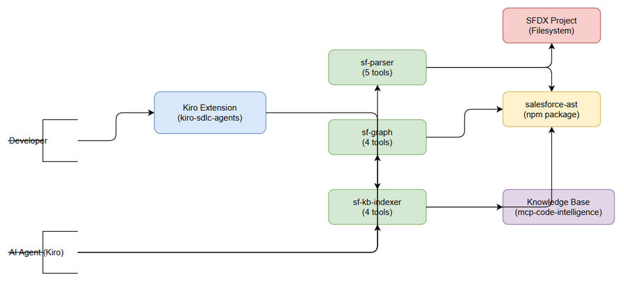
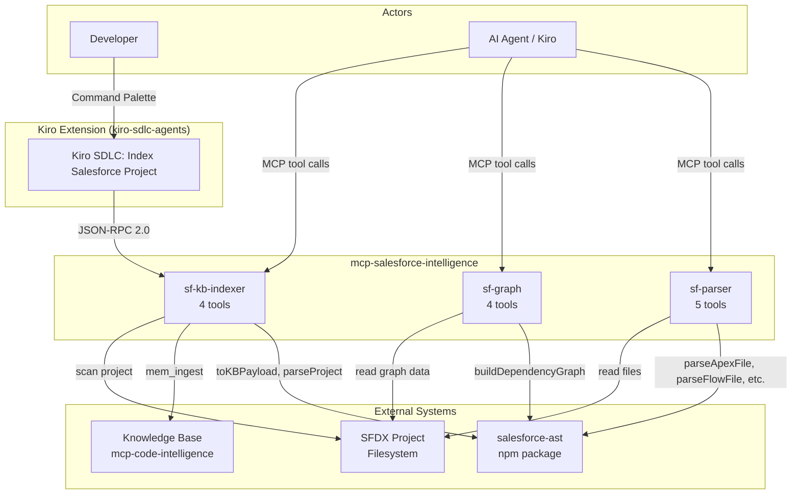
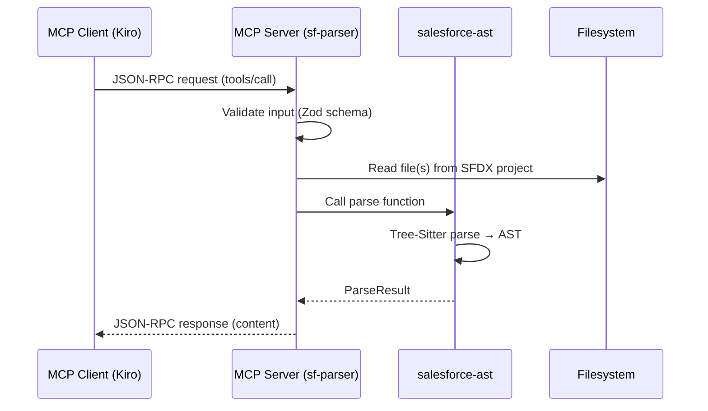
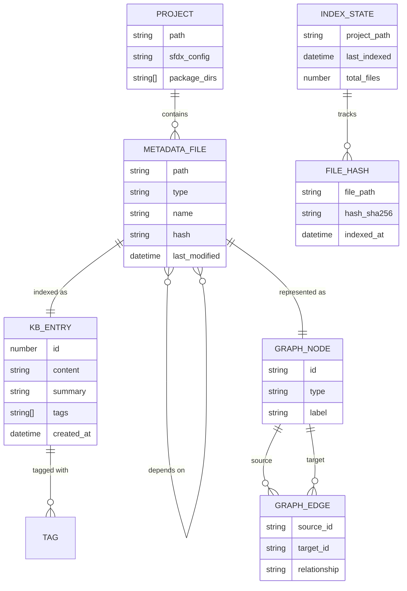
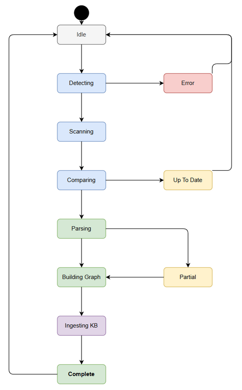
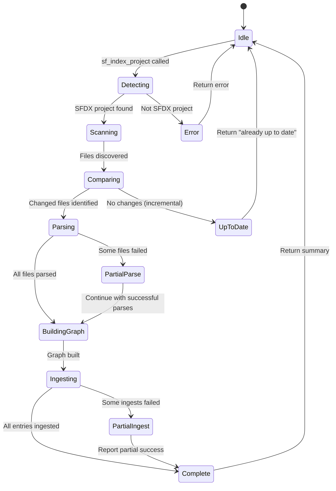

# Functional Specification Document (FSD)

## FEC_CR_Builder — KSA-191: Tích hợp salesforce-ast vào FEC_CR_Builder — 3 MCP Servers + Kiro Extension

---

## Document Information

| Field | Value |
|-------|-------|
| Jira Ticket | KSA-191 |
| Title | Tích hợp salesforce-ast (apex-ast) vào FEC_CR_Builder — 3 MCP Servers + Kiro Extension |
| Author | BA Agent |
| Version | 1.0 |
| Date | 2025-07-27 |
| Status | Draft |
| Related BRD | documents/KSA-191/BRD.md |

---

## Revision History

| Version | Date | Author | Changes |
|---------|------|--------|---------|
| 1.0 | 2025-07-27 | BA Agent | Initiate document — auto-generated from BRD and technical context |

---

## 1. Introduction

### 1.1 Purpose

This FSD specifies the functional behavior of the Salesforce Intelligence module — a set of 3 MCP servers (sf-parser, sf-graph, sf-kb-indexer) exposing 13 tools that integrate the `salesforce-ast` npm package into the FEC_CR_Builder ecosystem. It defines use cases, data flows, API contracts, processing logic, and integration specifications for developers to implement.

### 1.2 Scope

- **sf-parser** (5 tools): Parse Apex, Flow, Object, LWC metadata from SFDX projects
- **sf-graph** (4 tools): Build and query dependency graphs with impact analysis
- **sf-kb-indexer** (4 tools): Index Salesforce metadata into Knowledge Base via `mem_ingest`
- **Kiro Extension command**: "Kiro SDLC: Index Salesforce Project" for one-click indexing
- Implementation as new module `mcp-salesforce-intelligence/` following existing `mcp-code-intelligence-nodejs` patterns (stdio JSON-RPC 2.0)

### 1.3 Definitions & Acronyms

| Term | Definition |
|------|------------|
| SFDX | Salesforce DX — developer experience platform with standardized project structure |
| Apex | Salesforce proprietary language (Java-like, runs on Force.com platform) |
| LWC | Lightning Web Components — Salesforce modern frontend framework |
| Flow | Salesforce declarative automation tool (visual process builder) |
| MCP | Model Context Protocol — standard for AI tool integration via JSON-RPC 2.0 |
| Tree-Sitter | Incremental parsing library used by salesforce-ast for Apex AST generation |
| KB | Knowledge Base — local SQLite-based storage in mcp-code-intelligence |
| AST | Abstract Syntax Tree — structured representation of source code |
| JSON-RPC 2.0 | Remote procedure call protocol encoded in JSON |
| stdio | Standard input/output — transport layer for MCP servers |

### 1.4 References

| Document | Location |
|----------|----------|
| BRD | documents/KSA-191/BRD.md |
| salesforce-ast API | https://github.com/dnguyenminh/apex-ast |
| Existing MCP Server Pattern | mcp-code-intelligence-nodejs/src/tools/register-tools.ts |
| MCP SDK | @modelcontextprotocol/sdk (npm) |
| FSD Template | documents/templates/FSD-TEMPLATE.md |

---

## 2. System Overview

### 2.1 System Context Diagram


*[Edit in draw.io](diagrams/system-context.drawio)*

The Salesforce Intelligence module operates as 3 independent MCP servers communicating via stdio JSON-RPC 2.0. External actors and systems:

- **Developer (Human)**: Triggers indexing via Kiro IDE command palette
- **AI Agent (Kiro)**: Calls MCP tools directly during conversations for code understanding
- **salesforce-ast npm package**: Core parsing engine (Tree-Sitter based) — consumed as library dependency
- **SFDX Project (Filesystem)**: Source metadata files (Apex, Flow, Object, LWC)
- **Knowledge Base (mcp-code-intelligence)**: Stores indexed metadata for cross-session persistence via `mem_ingest`
- **Kiro Extension (kiro-sdlc-agents)**: VS Code extension hosting the command



### 2.2 System Architecture

The module follows the existing `mcp-code-intelligence-nodejs` pattern:

1. **Transport**: stdio (stdin/stdout) with JSON-RPC 2.0 message framing
2. **Server Framework**: `@modelcontextprotocol/sdk` McpServer class
3. **Tool Registration**: Each server registers tools via `server.tool()` with Zod schemas
4. **Shared Layer**: Common types, SFDX detection, and KB client utilities
5. **Dependency**: `salesforce-ast` consumed as npm dependency for all parsing operations

**Component Interaction:**



---

## 3. Functional Requirements

### 3.1 Feature: Parse Apex Files (sf-parser)

**Source:** BRD Story 2

#### 3.1.1 Description

Parse individual Apex class, interface, enum, or trigger files to extract structured metadata including class signatures, method declarations, properties, dependencies, and relationships. Uses `salesforce-ast.parseApexFile()` internally.

#### 3.1.2 Use Case: UC-1 — Parse Single Apex File

**Use Case ID:** UC-1
**Actor:** AI Agent
**Preconditions:** SFDX project exists on filesystem, target .cls/.trigger file is valid
**Postconditions:** Structured parse result returned with class metadata and dependencies

**Main Flow:**

| Step | Actor | System | Description |
|------|-------|--------|-------------|
| 1 | Calls `sf_parse_apex(file_path)` | | Agent sends file path to parse |
| 2 | | Validate input | Check file_path is non-empty, ends with .cls or .trigger |
| 3 | | Resolve path | Resolve relative path against workspace root |
| 4 | | Check file exists | Verify file is readable on filesystem |
| 5 | | Call `parseApexFile(path)` | Invoke salesforce-ast parser |
| 6 | | Transform result | Map ParseResult to tool output schema |
| 7 | | Return response | JSON-RPC success with structured metadata |

**Alternative Flows:**

| ID | Condition | Steps |
|----|-----------|-------|
| AF-1 | File is an interface | Parse succeeds, `type` field = "interface", no method bodies |
| AF-2 | File is an enum | Parse succeeds, `type` field = "enum", includes enum values |
| AF-3 | File is a trigger | Parse succeeds, `type` field = "trigger", includes object and events |
| AF-4 | `include_body=true` | Include method body source code in output |

**Exception Flows:**

| ID | Condition | Steps |
|----|-----------|-------|
| EF-1 | File not found | Return error: "File not found: {path}" |
| EF-2 | File is not Apex | Return error: "Unsupported file type. Expected .cls or .trigger" |
| EF-3 | Parse error (malformed Apex) | Return partial result with `errors[]` array containing line/column/message |
| EF-4 | Tree-Sitter not initialized | Call `initParser()`, retry once, fail if still errors |

#### 3.1.3 Business Rules

| Rule ID | Rule | Source |
|---------|------|--------|
| BR-1 | File path must be relative to workspace root or absolute | BRD Story 2 |
| BR-2 | Supported extensions: .cls, .trigger | BRD Story 2 |
| BR-3 | Partial results returned for malformed files (never crash) | BRD NFR |
| BR-4 | Tree-Sitter must be initialized before first parse (call `initParser()` once) | salesforce-ast API |
| BR-5 | Method bodies excluded by default (include_body=false) to reduce payload size | Performance |

#### 3.1.4 Data Specifications

**Input Data:**

| Field | Type | Required | Validation | Description |
|-------|------|----------|------------|-------------|
| file_path | string | Yes | Non-empty, ends with .cls or .trigger | Path to Apex file |
| include_body | boolean | No | Default: false | Whether to include method body source |

**Output Data (JSON Schema):**

```json
{
  "type": "object",
  "properties": {
    "file_path": { "type": "string" },
    "type": { "type": "string", "enum": ["class", "interface", "enum", "trigger"] },
    "name": { "type": "string" },
    "modifiers": { "type": "array", "items": { "type": "string" } },
    "parent_class": { "type": "string", "nullable": true },
    "interfaces": { "type": "array", "items": { "type": "string" } },
    "methods": {
      "type": "array",
      "items": {
        "type": "object",
        "properties": {
          "name": { "type": "string" },
          "modifiers": { "type": "array", "items": { "type": "string" } },
          "return_type": { "type": "string" },
          "parameters": {
            "type": "array",
            "items": {
              "type": "object",
              "properties": {
                "name": { "type": "string" },
                "type": { "type": "string" }
              }
            }
          },
          "body": { "type": "string", "nullable": true }
        }
      }
    },
    "properties": {
      "type": "array",
      "items": {
        "type": "object",
        "properties": {
          "name": { "type": "string" },
          "type": { "type": "string" },
          "modifiers": { "type": "array", "items": { "type": "string" } }
        }
      }
    },
    "inner_classes": { "type": "array", "items": { "$ref": "#" } },
    "dependencies": {
      "type": "object",
      "properties": {
        "referenced_classes": { "type": "array", "items": { "type": "string" } },
        "dml_operations": { "type": "array", "items": { "type": "string" } },
        "soql_queries": { "type": "array", "items": { "type": "string" } },
        "method_calls": { "type": "array", "items": { "type": "string" } }
      }
    },
    "trigger_info": {
      "type": "object",
      "nullable": true,
      "properties": {
        "object": { "type": "string" },
        "events": { "type": "array", "items": { "type": "string" } }
      }
    },
    "errors": {
      "type": "array",
      "items": {
        "type": "object",
        "properties": {
          "line": { "type": "number" },
          "column": { "type": "number" },
          "message": { "type": "string" }
        }
      }
    }
  }
}
```

#### 3.1.5 API Contract (Functional View)

**Tool:** `sf_parse_apex`
**Server:** sf-parser
**Purpose:** Parse a single Apex file and return structured metadata

**Input Parameters:**

| Parameter | Type | Required | Business Rule | Description |
|-----------|------|----------|---------------|-------------|
| file_path | string | Yes | BR-1, BR-2 | Path to .cls or .trigger file |
| include_body | boolean | No | BR-5 | Include method bodies (default: false) |

**Output Data:**

| Field | Type | Description |
|-------|------|-------------|
| file_path | string | Resolved absolute path |
| type | string | "class" / "interface" / "enum" / "trigger" |
| name | string | Class/interface/trigger name |
| modifiers | string[] | Access modifiers (public, private, global, virtual, abstract) |
| parent_class | string? | Extended class name (null if none) |
| interfaces | string[] | Implemented interface names |
| methods | Method[] | Method declarations with signatures |
| properties | Property[] | Class properties/fields |
| inner_classes | ParseResult[] | Nested class definitions |
| dependencies | Dependencies | Referenced classes, DML, SOQL, method calls |
| trigger_info | TriggerInfo? | Object and events (triggers only) |
| errors | ParseError[] | Parse errors (empty if successful) |

**Business Error Scenarios:**

| Scenario | User Message | Trigger Condition |
|----------|-------------|-------------------|
| File not found | "File not found: {path}" | Path doesn't exist on filesystem |
| Invalid file type | "Unsupported file type. Expected .cls or .trigger" | Extension not .cls/.trigger |
| Parse failure | Partial result with errors[] populated | Malformed Apex syntax |
| Parser not initialized | "Parser initialization failed: {error}" | Tree-Sitter WASM load failure |

---

### 3.2 Feature: Parse Flow Metadata (sf-parser)

**Source:** BRD Story 4

#### 3.2.1 Description

Parse Salesforce Flow XML metadata files (`.flow-meta.xml`) to extract automation logic structure including elements, connectors, variables, decisions, and referenced objects/fields.

#### 3.2.2 Use Case: UC-2 — Parse Flow File

**Use Case ID:** UC-2
**Actor:** AI Agent
**Preconditions:** Flow metadata file exists in SFDX project
**Postconditions:** Structured flow definition returned with elements and dependencies

**Main Flow:**

| Step | Actor | System | Description |
|------|-------|--------|-------------|
| 1 | Calls `sf_parse_flow(file_path)` | | Agent sends flow file path |
| 2 | | Validate input | Check file ends with .flow-meta.xml |
| 3 | | Read XML file | Load flow metadata from filesystem |
| 4 | | Call `parseFlowFile(path)` | Invoke salesforce-ast flow parser |
| 5 | | Extract structure | Map flow elements, connectors, variables |
| 6 | | Identify dependencies | Extract referenced objects, fields, Apex actions, subflows |
| 7 | | Return response | JSON-RPC success with flow structure |

**Alternative Flows:**

| ID | Condition | Steps |
|----|-----------|-------|
| AF-1 | Screen Flow | Include screen elements with field references |
| AF-2 | Record-Triggered Flow | Include trigger conditions (object, when, criteria) |
| AF-3 | Scheduled Flow | Include schedule configuration |
| AF-4 | Autolaunched Flow | Include entry conditions |

**Exception Flows:**

| ID | Condition | Steps |
|----|-----------|-------|
| EF-1 | File not found | Return error: "File not found: {path}" |
| EF-2 | Invalid XML | Return error: "Invalid Flow XML: {parse_error}" |
| EF-3 | Unsupported flow version | Return partial result with warning |

#### 3.2.3 Business Rules

| Rule ID | Rule | Source |
|---------|------|--------|
| BR-6 | File must end with .flow-meta.xml | BRD Story 4 |
| BR-7 | All flow element types must be captured (decisions, assignments, loops, screens, actions, subflows) | BRD Story 4 |
| BR-8 | Connector relationships must preserve flow execution order | BRD Story 4 |
| BR-9 | Referenced objects/fields extracted for dependency tracking | BRD Story 4 |

#### 3.2.4 Data Specifications

**Input Data:**

| Field | Type | Required | Validation | Description |
|-------|------|----------|------------|-------------|
| file_path | string | Yes | Ends with .flow-meta.xml | Path to Flow metadata file |

**Output Data (JSON Schema):**

```json
{
  "type": "object",
  "properties": {
    "file_path": { "type": "string" },
    "name": { "type": "string" },
    "type": { "type": "string", "enum": ["Screen", "RecordTriggered", "Scheduled", "Autolaunched", "PlatformEvent"] },
    "api_version": { "type": "string" },
    "status": { "type": "string", "enum": ["Active", "Draft", "Obsolete"] },
    "trigger_config": {
      "type": "object",
      "nullable": true,
      "properties": {
        "object": { "type": "string" },
        "trigger_type": { "type": "string" },
        "record_condition": { "type": "string" }
      }
    },
    "elements": {
      "type": "array",
      "items": {
        "type": "object",
        "properties": {
          "name": { "type": "string" },
          "type": { "type": "string" },
          "label": { "type": "string" },
          "connector": { "type": "string", "nullable": true }
        }
      }
    },
    "variables": {
      "type": "array",
      "items": {
        "type": "object",
        "properties": {
          "name": { "type": "string" },
          "data_type": { "type": "string" },
          "is_input": { "type": "boolean" },
          "is_output": { "type": "boolean" }
        }
      }
    },
    "dependencies": {
      "type": "object",
      "properties": {
        "objects": { "type": "array", "items": { "type": "string" } },
        "fields": { "type": "array", "items": { "type": "string" } },
        "apex_actions": { "type": "array", "items": { "type": "string" } },
        "subflows": { "type": "array", "items": { "type": "string" } }
      }
    }
  }
}
```

#### 3.2.5 API Contract (Functional View)

**Tool:** `sf_parse_flow`
**Server:** sf-parser
**Purpose:** Parse Flow metadata XML and return structured automation logic

**Input Parameters:**

| Parameter | Type | Required | Business Rule | Description |
|-----------|------|----------|---------------|-------------|
| file_path | string | Yes | BR-6 | Path to .flow-meta.xml file |

**Business Error Scenarios:**

| Scenario | User Message | Trigger Condition |
|----------|-------------|-------------------|
| File not found | "File not found: {path}" | Path doesn't exist |
| Invalid XML | "Invalid Flow XML: {error}" | XML parse failure |
| Unsupported version | "Warning: Flow API version {v} may have unsupported elements" | Very old/new API version |

---

### 3.3 Feature: Parse Object/Field Metadata (sf-parser)

**Source:** BRD Story 5

#### 3.3.1 Description

Parse Salesforce Custom Object and Custom Field metadata to extract data model definitions including field types, relationships, validation rules, and record types.

#### 3.3.2 Use Case: UC-3 — Parse Object Metadata

**Use Case ID:** UC-3
**Actor:** AI Agent
**Preconditions:** Object metadata directory exists in SFDX project
**Postconditions:** Complete object definition returned with fields, relationships, validations

**Main Flow:**

| Step | Actor | System | Description |
|------|-------|--------|-------------|
| 1 | Calls `sf_parse_object(file_path)` | | Agent sends object metadata path |
| 2 | | Validate input | Check path ends with .object-meta.xml or is a directory |
| 3 | | Read metadata | Load object XML and associated field files |
| 4 | | Call `parseObjectFile(path)` | Invoke salesforce-ast object parser |
| 5 | | Extract fields | Map all custom fields with types and relationships |
| 6 | | Extract validations | Parse validation rule formulas |
| 7 | | Return response | JSON-RPC success with object structure |

**Alternative Flows:**

| ID | Condition | Steps |
|----|-----------|-------|
| AF-1 | Path is directory | Parse all .field-meta.xml files within the object directory |
| AF-2 | Standard object | Parse custom fields only (standard fields implied) |

**Exception Flows:**

| ID | Condition | Steps |
|----|-----------|-------|
| EF-1 | File/directory not found | Return error: "Object metadata not found: {path}" |
| EF-2 | Invalid XML structure | Return partial result with errors |

#### 3.3.3 Business Rules

| Rule ID | Rule | Source |
|---------|------|--------|
| BR-10 | Support both .object-meta.xml files and object directories | BRD Story 5 |
| BR-11 | Relationship fields must identify related object and relationship type | BRD Story 5 |
| BR-12 | Validation rules must include formula expression and error message | BRD Story 5 |

#### 3.3.4 Data Specifications

**Input Data:**

| Field | Type | Required | Validation | Description |
|-------|------|----------|------------|-------------|
| file_path | string | Yes | .object-meta.xml or directory path | Path to object metadata |

**Output Data (JSON Schema):**

```json
{
  "type": "object",
  "properties": {
    "file_path": { "type": "string" },
    "name": { "type": "string" },
    "label": { "type": "string" },
    "type": { "type": "string", "enum": ["CustomObject", "StandardObject"] },
    "fields": {
      "type": "array",
      "items": {
        "type": "object",
        "properties": {
          "name": { "type": "string" },
          "label": { "type": "string" },
          "type": { "type": "string" },
          "required": { "type": "boolean" },
          "relationship": {
            "type": "object",
            "nullable": true,
            "properties": {
              "related_object": { "type": "string" },
              "relationship_type": { "type": "string", "enum": ["Lookup", "MasterDetail", "ExternalLookup"] },
              "relationship_name": { "type": "string" }
            }
          }
        }
      }
    },
    "validation_rules": {
      "type": "array",
      "items": {
        "type": "object",
        "properties": {
          "name": { "type": "string" },
          "active": { "type": "boolean" },
          "formula": { "type": "string" },
          "error_message": { "type": "string" }
        }
      }
    },
    "record_types": {
      "type": "array",
      "items": {
        "type": "object",
        "properties": {
          "name": { "type": "string" },
          "label": { "type": "string" },
          "active": { "type": "boolean" }
        }
      }
    }
  }
}
```

#### 3.3.5 API Contract (Functional View)

**Tool:** `sf_parse_object`
**Server:** sf-parser
**Purpose:** Parse Object/Field metadata and return data model structure

**Input Parameters:**

| Parameter | Type | Required | Business Rule | Description |
|-----------|------|----------|---------------|-------------|
| file_path | string | Yes | BR-10 | Path to .object-meta.xml or object directory |

**Business Error Scenarios:**

| Scenario | User Message | Trigger Condition |
|----------|-------------|-------------------|
| Not found | "Object metadata not found: {path}" | Path doesn't exist |
| Invalid XML | "Invalid object metadata: {error}" | XML parse failure |

---

### 3.4 Feature: Parse LWC Components (sf-parser)

**Source:** BRD Story 6

#### 3.4.1 Description

Parse Lightning Web Component bundles (HTML template, JS controller, CSS, metadata) to extract component structure, public API, wire adapters, Apex imports, and child component dependencies.

#### 3.4.2 Use Case: UC-4 — Parse LWC Component

**Use Case ID:** UC-4
**Actor:** AI Agent
**Preconditions:** LWC component directory exists with at least one of: .html, .js, .css
**Postconditions:** Component structure returned with properties, methods, and dependencies

**Main Flow:**

| Step | Actor | System | Description |
|------|-------|--------|-------------|
| 1 | Calls `sf_parse_lwc(file_path)` | | Agent sends LWC component path |
| 2 | | Validate input | Check path is a directory or .js/.html/.css file |
| 3 | | Detect bundle files | Find .html, .js, .css, .js-meta.xml in component dir |
| 4 | | Parse JS controller | Call `parseLWCJsFile()` — extract properties, methods, imports |
| 5 | | Parse HTML template | Call `parseLWCHtmlFile()` — extract component references, iterations |
| 6 | | Parse CSS | Call `parseLWCCssFile()` — extract custom properties, tokens |
| 7 | | Merge results | Combine all bundle file results into unified component view |
| 8 | | Return response | JSON-RPC success with component structure |

**Alternative Flows:**

| ID | Condition | Steps |
|----|-----------|-------|
| AF-1 | Path is a single .js file | Parse only JS, skip HTML/CSS |
| AF-2 | Path is a single .html file | Parse only template, skip JS/CSS |
| AF-3 | No CSS file in bundle | Skip CSS parsing, return without styles |

**Exception Flows:**

| ID | Condition | Steps |
|----|-----------|-------|
| EF-1 | Directory not found | Return error: "LWC component not found: {path}" |
| EF-2 | No parseable files | Return error: "No LWC files found in: {path}" |
| EF-3 | JS parse error | Return partial result with JS errors, continue with HTML/CSS |

#### 3.4.3 Business Rules

| Rule ID | Rule | Source |
|---------|------|--------|
| BR-13 | If path is directory, parse all bundle files (.js, .html, .css) | BRD Story 6 |
| BR-14 | @api decorated properties are public API | BRD Story 6 |
| BR-15 | @wire decorated properties identify data dependencies | BRD Story 6 |
| BR-16 | Import statements from @salesforce/* identify platform dependencies | BRD Story 6 |
| BR-17 | Template references to `c-*` or `lightning-*` identify child components | BRD Story 6 |

#### 3.4.4 Data Specifications

**Input Data:**

| Field | Type | Required | Validation | Description |
|-------|------|----------|------------|-------------|
| file_path | string | Yes | Directory or .js/.html/.css file | Path to LWC component |

**Output Data (JSON Schema):**

```json
{
  "type": "object",
  "properties": {
    "file_path": { "type": "string" },
    "name": { "type": "string" },
    "bundle_files": { "type": "array", "items": { "type": "string" } },
    "public_properties": {
      "type": "array",
      "items": {
        "type": "object",
        "properties": {
          "name": { "type": "string" },
          "type": { "type": "string" },
          "decorator": { "type": "string", "enum": ["api", "track", "wire"] }
        }
      }
    },
    "methods": {
      "type": "array",
      "items": {
        "type": "object",
        "properties": {
          "name": { "type": "string" },
          "is_public": { "type": "boolean" },
          "parameters": { "type": "array", "items": { "type": "string" } }
        }
      }
    },
    "wire_adapters": {
      "type": "array",
      "items": {
        "type": "object",
        "properties": {
          "adapter": { "type": "string" },
          "target_property": { "type": "string" },
          "params": { "type": "object" }
        }
      }
    },
    "apex_imports": {
      "type": "array",
      "items": {
        "type": "object",
        "properties": {
          "class_name": { "type": "string" },
          "method_name": { "type": "string" }
        }
      }
    },
    "child_components": { "type": "array", "items": { "type": "string" } },
    "event_handlers": { "type": "array", "items": { "type": "string" } },
    "css_custom_properties": { "type": "array", "items": { "type": "string" } }
  }
}
```

#### 3.4.5 API Contract (Functional View)

**Tool:** `sf_parse_lwc`
**Server:** sf-parser
**Purpose:** Parse LWC component bundle and return frontend structure

**Input Parameters:**

| Parameter | Type | Required | Business Rule | Description |
|-----------|------|----------|---------------|-------------|
| file_path | string | Yes | BR-13 | Path to LWC component directory or file |

**Business Error Scenarios:**

| Scenario | User Message | Trigger Condition |
|----------|-------------|-------------------|
| Not found | "LWC component not found: {path}" | Path doesn't exist |
| No files | "No LWC files found in: {path}" | Directory has no .js/.html/.css |
| JS parse error | Partial result with errors[] | Invalid JavaScript syntax |

---

### 3.5 Feature: Scan SFDX Project (sf-parser)

**Source:** BRD Story 1 (discovery phase)

#### 3.5.1 Description

Scan an entire SFDX project directory to discover all metadata components without deep parsing. Returns a manifest of all files organized by metadata type. This is the lightweight discovery step before full indexing.

#### 3.5.2 Use Case: UC-5 — Scan Project Structure

**Use Case ID:** UC-5
**Actor:** AI Agent / Extension Command
**Preconditions:** Directory contains sfdx-project.json or force-app/ structure
**Postconditions:** Project manifest returned with all discovered metadata files

**Main Flow:**

| Step | Actor | System | Description |
|------|-------|--------|-------------|
| 1 | Calls `sf_scan_project(project_path)` | | Agent sends project root path |
| 2 | | Validate SFDX project | Check for sfdx-project.json or force-app/ |
| 3 | | Call `scanProject(path)` | Invoke salesforce-ast project scanner |
| 4 | | Categorize files | Group by metadata type (Apex, Flow, Object, LWC, etc.) |
| 5 | | Compute stats | Count files per type, total size |
| 6 | | Return manifest | JSON-RPC success with project structure |

**Alternative Flows:**

| ID | Condition | Steps |
|----|-----------|-------|
| AF-1 | Multiple package directories | Scan all directories listed in sfdx-project.json |
| AF-2 | Nested SFDX project | Use nearest sfdx-project.json as root |

**Exception Flows:**

| ID | Condition | Steps |
|----|-----------|-------|
| EF-1 | Not an SFDX project | Return error: "No SFDX project found at: {path}" |
| EF-2 | Permission denied | Return error: "Cannot read directory: {path}" |

#### 3.5.3 Business Rules

| Rule ID | Rule | Source |
|---------|------|--------|
| BR-18 | SFDX detection: sfdx-project.json OR force-app/ directory | BRD Story 1 |
| BR-19 | Scan is non-destructive, read-only operation | BRD Story 1 |
| BR-20 | All standard SFDX metadata types must be recognized | BRD Story 1 |

#### 3.5.4 Data Specifications

**Input Data:**

| Field | Type | Required | Validation | Description |
|-------|------|----------|------------|-------------|
| project_path | string | Yes | Must contain SFDX markers | Path to SFDX project root |

**Output Data (JSON Schema):**

```json
{
  "type": "object",
  "properties": {
    "project_path": { "type": "string" },
    "sfdx_config": { "type": "object" },
    "package_directories": { "type": "array", "items": { "type": "string" } },
    "metadata_types": {
      "type": "object",
      "properties": {
        "apex_classes": { "type": "array", "items": { "type": "string" } },
        "apex_triggers": { "type": "array", "items": { "type": "string" } },
        "flows": { "type": "array", "items": { "type": "string" } },
        "objects": { "type": "array", "items": { "type": "string" } },
        "lwc_components": { "type": "array", "items": { "type": "string" } },
        "permissions": { "type": "array", "items": { "type": "string" } },
        "labels": { "type": "array", "items": { "type": "string" } },
        "layouts": { "type": "array", "items": { "type": "string" } }
      }
    },
    "stats": {
      "type": "object",
      "properties": {
        "total_files": { "type": "number" },
        "by_type": { "type": "object" }
      }
    }
  }
}
```

#### 3.5.5 API Contract (Functional View)

**Tool:** `sf_scan_project`
**Server:** sf-parser
**Purpose:** Discover all metadata files in SFDX project (lightweight scan, no deep parse)

**Input Parameters:**

| Parameter | Type | Required | Business Rule | Description |
|-----------|------|----------|---------------|-------------|
| project_path | string | Yes | BR-18 | Path to SFDX project root |

**Business Error Scenarios:**

| Scenario | User Message | Trigger Condition |
|----------|-------------|-------------------|
| Not SFDX | "No SFDX project found at: {path}" | No sfdx-project.json or force-app/ |
| Permission denied | "Cannot read directory: {path}" | Filesystem permission error |

---

### 3.6 Feature: Query Dependencies (sf-graph)

**Source:** BRD Story 3

#### 3.6.1 Description

Query forward dependencies of a Salesforce component — what other components does it reference or depend on. Uses the dependency graph built from parsed metadata.

#### 3.6.2 Use Case: UC-6 — Get Forward Dependencies

**Use Case ID:** UC-6
**Actor:** AI Agent
**Preconditions:** Project has been indexed (dependency graph exists in memory/cache)
**Postconditions:** List of dependencies returned with relationship types

**Main Flow:**

| Step | Actor | System | Description |
|------|-------|--------|-------------|
| 1 | Calls `sf_dependencies(node_name, depth, include_types)` | | Agent queries dependencies |
| 2 | | Validate node exists | Check node_name in graph |
| 3 | | Traverse graph forward | Follow outgoing edges up to depth |
| 4 | | Filter by types | Apply include_types filter if specified |
| 5 | | Return dependency tree | JSON-RPC success with dependency list |

**Alternative Flows:**

| ID | Condition | Steps |
|----|-----------|-------|
| AF-1 | depth not specified | Use default depth=3 |
| AF-2 | include_types specified | Filter results to only matching metadata types |
| AF-3 | Node has no dependencies | Return empty array with success |

**Exception Flows:**

| ID | Condition | Steps |
|----|-----------|-------|
| EF-1 | Node not found in graph | Return error: "Component not found: {node_name}. Run sf_index_project first." |
| EF-2 | Graph not built | Return error: "No dependency graph available. Run sf_index_project first." |

#### 3.6.3 Business Rules

| Rule ID | Rule | Source |
|---------|------|--------|
| BR-21 | Default traversal depth is 3 | BRD Story 3 |
| BR-22 | Graph must be built before queries (via sf_index_project or sf_graph_export) | BRD Story 3 |
| BR-23 | Circular dependencies must be detected and reported (not infinite loop) | BRD Story 3 |

#### 3.6.4 API Contract (Functional View)

**Tool:** `sf_dependencies`
**Server:** sf-graph
**Purpose:** Get forward dependencies of a component (what does X depend on?)

**Input Parameters:**

| Parameter | Type | Required | Business Rule | Description |
|-----------|------|----------|---------------|-------------|
| node_name | string | Yes | BR-22 | Fully qualified component name |
| depth | number | No | BR-21 (default: 3) | Max traversal depth |
| include_types | string[] | No | | Filter by metadata types |

**Output Data:**

```json
{
  "type": "object",
  "properties": {
    "node": { "type": "string" },
    "node_type": { "type": "string" },
    "dependencies": {
      "type": "array",
      "items": {
        "type": "object",
        "properties": {
          "name": { "type": "string" },
          "type": { "type": "string" },
          "relationship": { "type": "string", "enum": ["extends", "implements", "references", "dml", "soql", "calls", "imports", "triggers"] },
          "depth": { "type": "number" }
        }
      }
    },
    "circular_refs": { "type": "array", "items": { "type": "string" } },
    "total_count": { "type": "number" }
  }
}
```

---

### 3.7 Feature: Query Dependents (sf-graph)

**Source:** BRD Story 3

#### 3.7.1 Description

Query reverse dependencies — what components depend on a given component. Essential for understanding the impact of changes.

#### 3.7.2 Use Case: UC-7 — Get Reverse Dependents

**Use Case ID:** UC-7
**Actor:** AI Agent
**Preconditions:** Project has been indexed
**Postconditions:** List of dependent components returned

**Main Flow:**

| Step | Actor | System | Description |
|------|-------|--------|-------------|
| 1 | Calls `sf_dependents(node_name, depth, include_types)` | | Agent queries dependents |
| 2 | | Validate node exists | Check node_name in graph |
| 3 | | Traverse graph backward | Follow incoming edges up to depth |
| 4 | | Filter by types | Apply include_types filter if specified |
| 5 | | Return dependents tree | JSON-RPC success with dependent list |

**Alternative Flows:**

| ID | Condition | Steps |
|----|-----------|-------|
| AF-1 | No dependents found | Return empty array (leaf node) |
| AF-2 | include_types filter applied | Only return matching types |

**Exception Flows:**

| ID | Condition | Steps |
|----|-----------|-------|
| EF-1 | Node not found | Return error: "Component not found: {node_name}" |
| EF-2 | Graph not available | Return error: "No dependency graph. Run sf_index_project first." |

#### 3.7.3 API Contract (Functional View)

**Tool:** `sf_dependents`
**Server:** sf-graph
**Purpose:** Get reverse dependencies (what depends on X?)

**Input Parameters:**

| Parameter | Type | Required | Business Rule | Description |
|-----------|------|----------|---------------|-------------|
| node_name | string | Yes | | Fully qualified component name |
| depth | number | No | Default: 3 | Max traversal depth |
| include_types | string[] | No | | Filter by metadata types |

**Output Data:** Same structure as `sf_dependencies` but with incoming relationships.

---

### 3.8 Feature: Impact Analysis (sf-graph)

**Source:** BRD Story 3

#### 3.8.1 Description

Perform transitive impact analysis — compute the full closure of reverse dependencies to determine all components that could be affected by a change to a given component.

#### 3.8.2 Use Case: UC-8 — Perform Impact Analysis

**Use Case ID:** UC-8
**Actor:** AI Agent
**Preconditions:** Project indexed, dependency graph available
**Postconditions:** Complete impact tree returned with severity classification

**Main Flow:**

| Step | Actor | System | Description |
|------|-------|--------|-------------|
| 1 | Calls `sf_impact_analysis(node_name, depth)` | | Agent requests impact analysis |
| 2 | | Validate node | Check node exists in graph |
| 3 | | Compute transitive closure | BFS/DFS traversal of reverse edges |
| 4 | | Classify impact | Direct (depth=1) vs Indirect (depth>1) |
| 5 | | Group by type | Organize impacted components by metadata type |
| 6 | | Return impact report | JSON-RPC success with impact tree |

**Alternative Flows:**

| ID | Condition | Steps |
|----|-----------|-------|
| AF-1 | depth=1 | Only direct dependents (no transitive) |
| AF-2 | Circular dependency detected | Mark cycle, don't traverse further |

**Exception Flows:**

| ID | Condition | Steps |
|----|-----------|-------|
| EF-1 | Node not found | Return error with suggestion to run indexing |
| EF-2 | Depth exceeds 10 | Cap at 10, return warning |

#### 3.8.3 Business Rules

| Rule ID | Rule | Source |
|---------|------|--------|
| BR-24 | Impact analysis uses BFS for level-ordered results | BRD Story 3 |
| BR-25 | Maximum depth capped at 10 to prevent performance issues | Performance |
| BR-26 | Circular dependencies detected and reported, not traversed infinitely | BRD Story 3 |
| BR-27 | Results classified as Direct (depth=1) or Indirect (depth>1) | BRD Story 3 |

#### 3.8.4 API Contract (Functional View)

**Tool:** `sf_impact_analysis`
**Server:** sf-graph
**Purpose:** Transitive impact analysis — all components affected by a change

**Input Parameters:**

| Parameter | Type | Required | Business Rule | Description |
|-----------|------|----------|---------------|-------------|
| node_name | string | Yes | | Component to analyze |
| depth | number | No | BR-25 (default: 3, max: 10) | Max traversal depth |

**Output Data:**

```json
{
  "type": "object",
  "properties": {
    "node": { "type": "string" },
    "total_impacted": { "type": "number" },
    "direct_impact": {
      "type": "array",
      "items": {
        "type": "object",
        "properties": {
          "name": { "type": "string" },
          "type": { "type": "string" },
          "relationship": { "type": "string" }
        }
      }
    },
    "indirect_impact": {
      "type": "array",
      "items": {
        "type": "object",
        "properties": {
          "name": { "type": "string" },
          "type": { "type": "string" },
          "depth": { "type": "number" },
          "path": { "type": "array", "items": { "type": "string" } }
        }
      }
    },
    "by_type": {
      "type": "object",
      "additionalProperties": { "type": "number" }
    },
    "circular_refs": { "type": "array", "items": { "type": "string" } }
  }
}
```

---

### 3.9 Feature: Export Dependency Graph (sf-graph)

**Source:** BRD Story 3

#### 3.9.1 Description

Export the complete dependency graph in standard formats (JSON adjacency list or DOT/Graphviz) for visualization or external tool consumption.

#### 3.9.2 Use Case: UC-9 — Export Graph

**Use Case ID:** UC-9
**Actor:** AI Agent
**Preconditions:** Project indexed, graph available
**Postconditions:** Graph exported in requested format

**Main Flow:**

| Step | Actor | System | Description |
|------|-------|--------|-------------|
| 1 | Calls `sf_graph_export(format, include_types)` | | Agent requests export |
| 2 | | Validate format | Check format is "json" or "dot" |
| 3 | | Filter graph | Apply include_types filter if specified |
| 4 | | Serialize | Convert graph to requested format |
| 5 | | Return export | JSON-RPC success with serialized graph |

#### 3.9.3 API Contract (Functional View)

**Tool:** `sf_graph_export`
**Server:** sf-graph
**Purpose:** Export full dependency graph in JSON or DOT format

**Input Parameters:**

| Parameter | Type | Required | Business Rule | Description |
|-----------|------|----------|---------------|-------------|
| format | string | No | Default: "json" | Output format: "json" or "dot" |
| include_types | string[] | No | | Filter nodes by metadata type |

**Output Data (format=json):**

```json
{
  "type": "object",
  "properties": {
    "nodes": {
      "type": "array",
      "items": {
        "type": "object",
        "properties": {
          "id": { "type": "string" },
          "type": { "type": "string" },
          "label": { "type": "string" }
        }
      }
    },
    "edges": {
      "type": "array",
      "items": {
        "type": "object",
        "properties": {
          "source": { "type": "string" },
          "target": { "type": "string" },
          "relationship": { "type": "string" }
        }
      }
    },
    "stats": {
      "type": "object",
      "properties": {
        "node_count": { "type": "number" },
        "edge_count": { "type": "number" }
      }
    }
  }
}
```

---

### 3.10 Feature: Index Full Project (sf-kb-indexer)

**Source:** BRD Story 1, Story 8

#### 3.10.1 Description

Full project indexing — parse all metadata in an SFDX project and store structured results in the Knowledge Base via `mem_ingest`. This is the primary entry point triggered by the Kiro extension command.

#### 3.10.2 Use Case: UC-10 — Index SFDX Project

**Use Case ID:** UC-10
**Actor:** Developer (via Extension) / AI Agent
**Preconditions:** SFDX project exists, KB (mcp-code-intelligence) is accessible
**Postconditions:** All metadata indexed in KB, dependency graph built

**Main Flow:**

| Step | Actor | System | Description |
|------|-------|--------|-------------|
| 1 | Calls `sf_index_project(project_path)` | | Trigger full indexing |
| 2 | | Detect SFDX project | Validate sfdx-project.json exists |
| 3 | | Scan project | Call `scanProject(path)` to discover all files |
| 4 | | Check incremental | Compare file hashes with previous index |
| 5 | | Parse all files | Call `parseProject(path)` for full AST parsing |
| 6 | | Build dependency graph | Call `buildDependencyGraph(data)` |
| 7 | | Convert to KB payloads | Call `toKBPayload(index)` |
| 8 | | Ingest into KB | Call `mem_ingest` for each payload entry |
| 9 | | Return summary | Report: files parsed, errors, time elapsed |


*[Edit in draw.io](diagrams/sequence-index-project.drawio)*

**Alternative Flows:**

| ID | Condition | Steps |
|----|-----------|-------|
| AF-1 | Incremental re-index | Only parse files with changed hashes (skip unchanged) |
| AF-2 | force=true parameter | Skip hash check, re-index everything |
| AF-3 | Large project (>1000 files) | Process in batches of 100, report progress per batch |

**Exception Flows:**

| ID | Condition | Steps |
|----|-----------|-------|
| EF-1 | Not SFDX project | Return error: "No SFDX project found at: {path}" |
| EF-2 | KB unavailable | Return error: "Knowledge Base not accessible. Ensure mcp-code-intelligence is running." |
| EF-3 | Parse errors on some files | Continue indexing, collect errors, report in summary |
| EF-4 | Memory limit exceeded | Abort with partial results, suggest reducing scope |

#### 3.10.3 Business Rules

| Rule ID | Rule | Source |
|---------|------|--------|
| BR-28 | Incremental indexing by default (hash-based change detection) | BRD Story 1 AC-2 |
| BR-29 | Summary report must include: total files, parsed OK, errors, time elapsed | BRD Story 1 AC-3 |
| BR-30 | KB entries tagged with: salesforce, {metadata-type}, {component-name} | BRD Story 8 |
| BR-31 | Dependency graph stored alongside KB entries for query tools | BRD Story 3 |
| BR-32 | Parse errors don't abort indexing — continue with remaining files | BRD NFR |

#### 3.10.4 Data Specifications

**Input Data:**

| Field | Type | Required | Validation | Description |
|-------|------|----------|------------|-------------|
| project_path | string | Yes | Must be SFDX project | Path to project root |
| force | boolean | No | Default: false | Force full re-index (skip hash check) |

**Output Data:**

```json
{
  "type": "object",
  "properties": {
    "project_path": { "type": "string" },
    "status": { "type": "string", "enum": ["success", "partial", "failed"] },
    "summary": {
      "type": "object",
      "properties": {
        "total_files": { "type": "number" },
        "parsed_ok": { "type": "number" },
        "errors": { "type": "number" },
        "skipped_unchanged": { "type": "number" },
        "time_ms": { "type": "number" },
        "kb_entries_created": { "type": "number" },
        "graph_nodes": { "type": "number" },
        "graph_edges": { "type": "number" }
      }
    },
    "by_type": {
      "type": "object",
      "properties": {
        "apex_classes": { "type": "number" },
        "apex_triggers": { "type": "number" },
        "flows": { "type": "number" },
        "objects": { "type": "number" },
        "lwc_components": { "type": "number" },
        "other": { "type": "number" }
      }
    },
    "errors": {
      "type": "array",
      "items": {
        "type": "object",
        "properties": {
          "file": { "type": "string" },
          "error": { "type": "string" }
        }
      }
    }
  }
}
```

#### 3.10.5 API Contract (Functional View)

**Tool:** `sf_index_project`
**Server:** sf-kb-indexer
**Purpose:** Full SFDX project indexing into Knowledge Base

**Input Parameters:**

| Parameter | Type | Required | Business Rule | Description |
|-----------|------|----------|---------------|-------------|
| project_path | string | Yes | BR-28 | Path to SFDX project root |
| force | boolean | No | BR-28 | Force full re-index |

**Business Error Scenarios:**

| Scenario | User Message | Trigger Condition |
|----------|-------------|-------------------|
| Not SFDX | "No SFDX project found at: {path}" | Missing sfdx-project.json |
| KB unavailable | "Knowledge Base not accessible" | mem_ingest call fails |
| Partial failure | Status "partial" with error list | Some files failed to parse |
| Memory exceeded | "Project too large. Try indexing specific directories." | OOM during parsing |

---

### 3.11 Feature: Index Single File (sf-kb-indexer)

**Source:** BRD Story 8

#### 3.11.1 Description

Index a single metadata file into the Knowledge Base. Useful for incremental updates when a developer modifies one file.

#### 3.11.2 Use Case: UC-11 — Index Single File

**Use Case ID:** UC-11
**Actor:** AI Agent
**Preconditions:** File exists, KB accessible
**Postconditions:** File metadata stored/updated in KB

**Main Flow:**

| Step | Actor | System | Description |
|------|-------|--------|-------------|
| 1 | Calls `sf_index_file(file_path)` | | Agent sends file to index |
| 2 | | Detect file type | Determine metadata type from extension |
| 3 | | Parse file | Call appropriate parse function |
| 4 | | Convert to KB payload | Call `toKBPayload()` for single entry |
| 5 | | Upsert in KB | Call `mem_ingest` (replace if exists) |
| 6 | | Update graph | Add/update node and edges in dependency graph |
| 7 | | Return result | Confirmation with entry details |

#### 3.11.3 API Contract (Functional View)

**Tool:** `sf_index_file`
**Server:** sf-kb-indexer
**Purpose:** Index a single metadata file into KB

**Input Parameters:**

| Parameter | Type | Required | Business Rule | Description |
|-----------|------|----------|---------------|-------------|
| file_path | string | Yes | | Path to metadata file |

**Output Data:**

```json
{
  "type": "object",
  "properties": {
    "file_path": { "type": "string" },
    "component_name": { "type": "string" },
    "metadata_type": { "type": "string" },
    "kb_entry_id": { "type": "number" },
    "dependencies_updated": { "type": "boolean" }
  }
}
```

---

### 3.12 Feature: Search KB with SF Filters (sf-kb-indexer)

**Source:** BRD Story 8

#### 3.12.1 Description

Search the Knowledge Base with Salesforce-specific filters. Wraps the standard `mem_search` with pre-applied tags and type filters for Salesforce metadata.

#### 3.12.2 Use Case: UC-12 — Search Salesforce KB

**Use Case ID:** UC-12
**Actor:** AI Agent
**Preconditions:** Project has been indexed into KB
**Postconditions:** Matching KB entries returned

**Main Flow:**

| Step | Actor | System | Description |
|------|-------|--------|-------------|
| 1 | Calls `sf_kb_search(query, metadata_type)` | | Agent searches SF metadata |
| 2 | | Build search query | Combine user query with SF tags |
| 3 | | Call `mem_search` | Execute KB search with filters |
| 4 | | Enrich results | Add metadata type and relationship info |
| 5 | | Return results | Ranked list of matching entries |

#### 3.12.3 API Contract (Functional View)

**Tool:** `sf_kb_search`
**Server:** sf-kb-indexer
**Purpose:** Search KB with Salesforce-specific filters

**Input Parameters:**

| Parameter | Type | Required | Business Rule | Description |
|-----------|------|----------|---------------|-------------|
| query | string | Yes | | Search query (component name, keyword) |
| metadata_type | string | No | | Filter: "ApexClass", "ApexTrigger", "Flow", "CustomObject", "LWC" |
| limit | number | No | Default: 10, max: 50 | Max results to return |

**Output Data:**

```json
{
  "type": "object",
  "properties": {
    "results": {
      "type": "array",
      "items": {
        "type": "object",
        "properties": {
          "name": { "type": "string" },
          "metadata_type": { "type": "string" },
          "summary": { "type": "string" },
          "kb_entry_id": { "type": "number" },
          "relevance_score": { "type": "number" },
          "last_indexed": { "type": "string" }
        }
      }
    },
    "total_count": { "type": "number" }
  }
}
```

---

### 3.13 Feature: Check Sync Status (sf-kb-indexer)

**Source:** BRD Story 8

#### 3.13.1 Description

Compare the current state of files on disk with what's indexed in the KB. Reports which files are out of sync (modified, added, or deleted since last indexing).

#### 3.13.2 Use Case: UC-13 — Check Sync Status

**Use Case ID:** UC-13
**Actor:** AI Agent
**Preconditions:** Project was previously indexed
**Postconditions:** Sync status report returned

**Main Flow:**

| Step | Actor | System | Description |
|------|-------|--------|-------------|
| 1 | Calls `sf_kb_sync(project_path)` | | Agent checks sync status |
| 2 | | Scan current files | Get current file list and hashes |
| 3 | | Load index state | Read stored hashes from last indexing |
| 4 | | Compare | Identify added, modified, deleted files |
| 5 | | Return report | List of out-of-sync files with status |

#### 3.13.3 API Contract (Functional View)

**Tool:** `sf_kb_sync`
**Server:** sf-kb-indexer
**Purpose:** Check sync status between disk and KB index

**Input Parameters:**

| Parameter | Type | Required | Business Rule | Description |
|-----------|------|----------|---------------|-------------|
| project_path | string | Yes | | Path to SFDX project root |

**Output Data:**

```json
{
  "type": "object",
  "properties": {
    "in_sync": { "type": "boolean" },
    "last_indexed": { "type": "string" },
    "changes": {
      "type": "object",
      "properties": {
        "added": { "type": "array", "items": { "type": "string" } },
        "modified": { "type": "array", "items": { "type": "string" } },
        "deleted": { "type": "array", "items": { "type": "string" } }
      }
    },
    "stats": {
      "type": "object",
      "properties": {
        "total_indexed": { "type": "number" },
        "total_on_disk": { "type": "number" },
        "out_of_sync": { "type": "number" }
      }
    }
  }
}
```

---

### 3.14 Feature: Kiro Extension Command

**Source:** BRD Story 7

#### 3.14.1 Description

A VS Code/Kiro extension command "Kiro SDLC: Index Salesforce Project" that provides one-click indexing from the command palette. Follows the existing "Index Workspace" command pattern in `kiro-sdlc-agents`.

#### 3.14.2 Use Case: UC-14 — One-Click Indexing

**Use Case ID:** UC-14
**Actor:** Developer (Human)
**Preconditions:** Kiro IDE open with SFDX project in workspace
**Postconditions:** Project indexed, notification shown with results

**Main Flow:**

| Step | Actor | System | Description |
|------|-------|--------|-------------|
| 1 | Opens Command Palette (Ctrl+Shift+P) | | Developer initiates |
| 2 | Types "Index Salesforce" | | Filter commands |
| 3 | Selects "Kiro SDLC: Index Salesforce Project" | | Trigger command |
| 4 | | Detect SFDX project root | Look for sfdx-project.json in workspace folders |
| 5 | | Show progress notification | "Indexing Salesforce project..." with spinner |
| 6 | | Call sf_index_project via MCP | Invoke sf-kb-indexer server |
| 7 | | Show result notification | "{N} files indexed, {M} components discovered" |

**Alternative Flows:**

| ID | Condition | Steps |
|----|-----------|-------|
| AF-1 | Multiple workspace folders | Show picker to select which folder to index |
| AF-2 | Indexing already in progress | Show info: "Indexing already in progress" |

**Exception Flows:**

| ID | Condition | Steps |
|----|-----------|-------|
| EF-1 | No SFDX project found | Show error notification: "No SFDX project found in workspace" |
| EF-2 | MCP server not running | Show error: "sf-kb-indexer server not available. Check MCP configuration." |
| EF-3 | Indexing fails | Show error notification with summary of failures |

#### 3.14.3 Business Rules

| Rule ID | Rule | Source |
|---------|------|--------|
| BR-33 | Command registered as "kiro-sdlc.indexSalesforceProject" | BRD Story 7 |
| BR-34 | Auto-detect SFDX root (nearest sfdx-project.json) | BRD Story 7 |
| BR-35 | Progress shown via VS Code notification API (withProgress) | BRD Story 7 |
| BR-36 | Only one indexing operation at a time (singleton lock) | BRD Story 7 AC-3 |
| BR-37 | Follow existing "Index Workspace" pattern in kiro-sdlc-agents | BRD Story 7 |

---

## 4. Data Model

### 4.1 Entity Relationship Diagram

The data model is primarily in-memory (graph) and KB-stored (JSON entries). No traditional RDBMS tables.



### 4.2 Logical Entities

#### Entity: ProjectIndex

| Attribute | Type | Required | Business Rule | Description |
|-----------|------|----------|---------------|-------------|
| project_path | string | Yes | BR-18 | Root path of SFDX project |
| sfdx_config | object | Yes | | Parsed sfdx-project.json content |
| package_directories | string[] | Yes | | Source directories from config |
| metadata_files | MetadataFile[] | Yes | | All discovered metadata files |
| last_indexed | ISO8601 | Yes | | Timestamp of last full index |

#### Entity: MetadataFile

| Attribute | Type | Required | Business Rule | Description |
|-----------|------|----------|---------------|-------------|
| path | string | Yes | | Relative path from project root |
| type | MetadataType | Yes | BR-20 | ApexClass, ApexTrigger, Flow, CustomObject, LWC, etc. |
| name | string | Yes | | Component name (e.g., "AccountService") |
| hash | string | Yes | BR-28 | SHA-256 hash for change detection |
| parse_result | ParseResult | No | | Cached parse output |

#### Entity: DependencyGraph

| Attribute | Type | Required | Business Rule | Description |
|-----------|------|----------|---------------|-------------|
| nodes | Map<string, GraphNode> | Yes | | All components as graph nodes |
| edges | GraphEdge[] | Yes | | All dependency relationships |
| built_at | ISO8601 | Yes | | When graph was last computed |

#### Entity: GraphNode

| Attribute | Type | Required | Description |
|-----------|------|----------|-------------|
| id | string | Yes | Fully qualified component name |
| type | MetadataType | Yes | Component type |
| label | string | Yes | Display name |
| file_path | string | Yes | Source file path |

#### Entity: GraphEdge

| Attribute | Type | Required | Description |
|-----------|------|----------|-------------|
| source | string | Yes | Source node ID |
| target | string | Yes | Target node ID |
| relationship | RelationType | Yes | extends, implements, references, dml, soql, calls, imports, triggers |

**Relationships:**

| From Entity | To Entity | Cardinality | Description |
|-------------|-----------|-------------|-------------|
| ProjectIndex | MetadataFile | 1:N | Project contains many metadata files |
| MetadataFile | KB_Entry | 1:1 | Each file indexed as one KB entry |
| MetadataFile | GraphNode | 1:1 | Each file represented as one graph node |
| GraphNode | GraphEdge | 1:N | Node can have many outgoing edges |
| GraphEdge | GraphNode | N:1 | Many edges can point to same target |

---

## 5. Integration Specifications

### 5.1 External System: salesforce-ast (npm package)

| Attribute | Value |
|-----------|-------|
| Purpose | Core parsing engine for all Salesforce metadata types |
| Direction | Outbound (call library functions) |
| Data Format | TypeScript function calls → structured objects |
| Frequency | On-demand (per tool call or indexing operation) |

**API Surface Used:**

| Our Call | salesforce-ast Function | Direction | Business Rule |
|----------|----------------------|-----------|---------------|
| Parse project | `parseProject(path, options?)` → ProjectIndex | Call → Return | BR-28: incremental support |
| KB payload | `toKBPayload(index)` → KBPayload[] | Call → Return | BR-30: tagged entries |
| Scan project | `scanProject(path)` → manifest | Call → Return | BR-18: SFDX detection |
| Build graph | `buildDependencyGraph(data)` → graph | Call → Return | BR-31: graph storage |
| Parse Apex | `parseApexFile(path)` → ParseResult | Call → Return | BR-4: Tree-Sitter init |
| Parse Flow | `parseFlowFile(path)` → ParseResult | Call → Return | BR-6: .flow-meta.xml |
| Parse Object | `parseObjectFile(path)` → ParseResult | Call → Return | BR-10: object metadata |
| Parse LWC JS | `parseLWCJsFile(path)` → ParseResult | Call → Return | BR-13: bundle parsing |
| Parse LWC HTML | `parseLWCHtmlFile(path)` → ParseResult | Call → Return | BR-17: template refs |
| Parse LWC CSS | `parseLWCCssFile(path)` → ParseResult | Call → Return | CSS custom properties |
| Init parser | `initParser()` → void | Call | BR-4: one-time init |

**Integration Pattern:**

```typescript
import { parseProject, toKBPayload, scanProject, buildDependencyGraph,
         parseApexFile, parseFlowFile, parseObjectFile,
         parseLWCJsFile, parseLWCHtmlFile, parseLWCCssFile,
         initParser } from 'salesforce-ast';

// Initialize once at server startup
await initParser();
```

### 5.2 Internal System: Knowledge Base (mcp-code-intelligence)

| Attribute | Value |
|-----------|-------|
| Purpose | Persistent storage of indexed Salesforce metadata for cross-session access |
| Direction | Outbound (write entries via mem_ingest) |
| Data Format | JSON (structured KB entries with tags) |
| Frequency | Batch (during indexing) + On-demand (single file index) |

**Data Exchange:**

| Our Data | KB Operation | Direction | Business Rule |
|----------|-------------|-----------|---------------|
| KBPayload[] from toKBPayload() | `mem_ingest(content, type, tags)` | Send | BR-30: tagged with salesforce, type, name |
| Search query + filters | `mem_search(query, tags)` | Send/Receive | sf_kb_search wraps this |
| File hash state | Internal storage (JSON file) | Local | BR-28: incremental detection |

**KB Entry Format (per component):**

```json
{
  "content": "## AccountService (ApexClass)\n\nMethods: ...\nDependencies: ...",
  "type": "CONTEXT",
  "tags": "salesforce, ApexClass, AccountService, KSA-191",
  "summary": "Apex class AccountService with 5 methods, depends on Account, Contact objects"
}
```

### 5.3 Internal System: Kiro Extension (kiro-sdlc-agents)

| Attribute | Value |
|-----------|-------|
| Purpose | VS Code extension hosting the "Index Salesforce Project" command |
| Direction | Outbound (extension calls MCP server) |
| Data Format | JSON-RPC 2.0 over stdio |
| Frequency | On-demand (user-triggered) |

**Integration Pattern:**

```typescript
// In kiro-sdlc-agents extension
import { McpClient } from '@modelcontextprotocol/sdk/client/mcp.js';

// Register command
vscode.commands.registerCommand('kiro-sdlc.indexSalesforceProject', async () => {
  const sfdxRoot = await detectSfdxProject(vscode.workspace.workspaceFolders);
  if (!sfdxRoot) {
    vscode.window.showErrorMessage('No SFDX project found in workspace');
    return;
  }
  
  await vscode.window.withProgress({
    location: vscode.ProgressLocation.Notification,
    title: 'Indexing Salesforce project...',
    cancellable: false
  }, async (progress) => {
    const result = await mcpClient.callTool('sf_index_project', { project_path: sfdxRoot });
    vscode.window.showInformationMessage(
      `${result.summary.parsed_ok} files indexed, ${result.summary.graph_nodes} components discovered`
    );
  });
});
```

---

## 6. Processing Logic

### 6.1 Full Project Indexing Process

**Trigger:** `sf_index_project` tool call or Extension command
**Schedule:** On-demand (user-triggered)
**Input:** SFDX project path, force flag
**Output:** Indexing summary with stats

**Processing Steps:**

| Step | Description | Error Handling |
|------|-------------|----------------|
| 1 | Validate SFDX project (check sfdx-project.json) | Return error if not SFDX |
| 2 | Call `scanProject(path)` to discover all metadata files | Return error if scan fails |
| 3 | Load previous index state (file hashes) | If no state, treat as first-time index |
| 4 | Compare current file hashes with stored hashes | |
| 5 | Filter to changed/new files (skip unchanged unless force=true) | |
| 6 | Call `initParser()` if not already initialized | Retry once on failure |
| 7 | Call `parseProject(path, { files: changedFiles })` | Collect errors, continue |
| 8 | Call `buildDependencyGraph(parseResult)` | Log warning if graph build fails |
| 9 | Call `toKBPayload(parseResult)` to generate KB entries | |
| 10 | For each payload: call `mem_ingest(entry)` | Log failed entries, continue |
| 11 | Save updated file hashes to index state | |
| 12 | Return summary report | Include all collected errors |

**State Diagram — Indexing Lifecycle:**


*[Edit in draw.io](diagrams/state-indexing.drawio)*



### 6.2 Dependency Graph Building Process

**Trigger:** After successful project parsing (Step 8 of indexing)
**Input:** ParseResult from `parseProject()`
**Output:** DependencyGraph with nodes and edges

**Processing Steps:**

| Step | Description | Error Handling |
|------|-------------|----------------|
| 1 | Extract all component names from parse results | Skip files with no valid name |
| 2 | Create graph nodes for each component | |
| 3 | For each Apex class: extract referenced classes → create edges | Skip unresolvable refs |
| 4 | For each Apex class: extract DML operations → create edges to objects | |
| 5 | For each Apex class: extract SOQL queries → create edges to objects/fields | |
| 6 | For each trigger: create edge to trigger object | |
| 7 | For each Flow: extract referenced objects/fields/Apex → create edges | |
| 8 | For each LWC: extract Apex imports → create edges | |
| 9 | For each LWC: extract child component refs → create edges | |
| 10 | Detect circular dependencies (Tarjan's algorithm) | Mark cycles, don't fail |
| 11 | Store graph in memory for query tools | |

**Pseudocode:**

```typescript
async function buildGraph(parseResult: ProjectIndex): Promise<DependencyGraph> {
  const graph = new DependencyGraph();
  
  // Create nodes
  for (const file of parseResult.files) {
    graph.addNode({
      id: file.name,
      type: file.type,
      label: file.name,
      file_path: file.path
    });
  }
  
  // Create edges from Apex dependencies
  for (const apex of parseResult.apexClasses) {
    for (const ref of apex.dependencies.referenced_classes) {
      graph.addEdge(apex.name, ref, 'references');
    }
    for (const dml of apex.dependencies.dml_operations) {
      graph.addEdge(apex.name, dml, 'dml');
    }
    if (apex.parent_class) {
      graph.addEdge(apex.name, apex.parent_class, 'extends');
    }
    for (const iface of apex.interfaces) {
      graph.addEdge(apex.name, iface, 'implements');
    }
  }
  
  // Create edges from triggers
  for (const trigger of parseResult.triggers) {
    graph.addEdge(trigger.name, trigger.object, 'triggers');
  }
  
  // Create edges from Flows
  for (const flow of parseResult.flows) {
    for (const obj of flow.dependencies.objects) {
      graph.addEdge(flow.name, obj, 'references');
    }
    for (const apex of flow.dependencies.apex_actions) {
      graph.addEdge(flow.name, apex, 'calls');
    }
  }
  
  // Create edges from LWC
  for (const lwc of parseResult.lwcComponents) {
    for (const imp of lwc.apex_imports) {
      graph.addEdge(lwc.name, imp.class_name, 'imports');
    }
    for (const child of lwc.child_components) {
      graph.addEdge(lwc.name, child, 'references');
    }
  }
  
  // Detect cycles
  graph.detectCycles(); // Tarjan's SCC algorithm
  
  return graph;
}
```

### 6.3 Incremental Change Detection Process

**Trigger:** `sf_index_project` called (without force=true)
**Input:** Current files on disk, stored index state
**Output:** List of changed files to re-parse

**Processing Steps:**

| Step | Description | Error Handling |
|------|-------------|----------------|
| 1 | Load stored index state (`.sf-index-state.json`) | If missing, return all files |
| 2 | Scan current files and compute SHA-256 hashes | |
| 3 | Compare: new files (in current, not in stored) → mark as ADDED | |
| 4 | Compare: missing files (in stored, not in current) → mark as DELETED | |
| 5 | Compare: hash mismatch → mark as MODIFIED | |
| 6 | Return changed file list | |
| 7 | After successful indexing: update stored state with new hashes | |

---

## 7. Security Requirements

### 7.1 Authentication & Authorization

| Role | Permissions | Features |
|------|-------------|----------|
| Any MCP client | Full access to all 13 tools | All sf-parser, sf-graph, sf-kb-indexer tools |
| Developer (Extension) | Trigger indexing command | "Kiro SDLC: Index Salesforce Project" |

No authentication required — all tools run locally on the developer's machine. MCP servers communicate via stdio (no network exposure).

### 7.2 Data Sensitivity Classification

| Data Type | Classification | Business Requirement |
|-----------|---------------|---------------------|
| Apex source code | Internal | Parsed locally, never transmitted externally |
| Flow metadata | Internal | Parsed locally, stored in local KB only |
| Object/Field definitions | Internal | May contain business logic in validation rules |
| Dependency graph | Internal | Structural information about codebase |
| KB entries | Internal | Stored in local SQLite, workspace-scoped |
| File hashes (index state) | Public | SHA-256 hashes, no sensitive content |

### 7.3 Audit Trail

| Event | Logged Fields | Retention | Business Reason |
|-------|--------------|-----------|-----------------|
| Project indexed | project_path, timestamp, file_count, duration | Session | Debugging indexing issues |
| Parse error | file_path, error_message, timestamp | Session | Developer troubleshooting |
| KB ingest | entry_id, component_name, type | Persistent (KB) | Cross-session retrieval |

---

## 8. Non-Functional Requirements

| Category | Business Requirement | Acceptance Criteria |
|----------|---------------------|---------------------|
| Performance | Full project indexing < 30 seconds | 500 Apex files + 100 flows + 200 objects indexed in < 30s |
| Performance | Individual file parse < 500ms | Single Apex class parse response time |
| Performance | Dependency query < 200ms | Graph traversal for impact analysis (depth=3) |
| Performance | KB search < 100ms | sf_kb_search response time |
| Scalability | Support up to 5000 metadata components | Without degradation in query performance |
| Scalability | Dependency graph up to 10,000 edges | Graph operations remain < 200ms |
| Reliability | Never crash MCP server | Partial results for malformed files, graceful error handling |
| Reliability | Survive corrupted index state | Reset state and re-index from scratch |
| Compatibility | Node.js 20+ | Same runtime as mcp-code-intelligence-nodejs |
| Compatibility | Cross-platform | Windows, macOS, Linux |
| Maintainability | TypeScript strict mode | Consistent with existing codebase |
| Maintainability | Vitest for testing | Consistent with mcp-code-intelligence-nodejs |
| Startup | MCP server startup < 2 seconds | Lazy-load graph, don't parse on startup |
| Memory | Max 512MB for graph + cache | For projects with 5000 components |

---

## 9. Error Handling (User-Facing)

### 9.1 Error Scenarios

| Scenario | Severity | User Message | Expected Behavior |
|----------|----------|-------------|-------------------|
| File not found | Warning | "File not found: {path}" | Return error response, server continues |
| Not SFDX project | Warning | "No SFDX project found at: {path}" | Return error, suggest checking path |
| Parse error (malformed file) | Info | Partial result with errors[] | Return what was parseable, list errors |
| Tree-Sitter init failure | Critical | "Parser initialization failed: {error}" | Retry once, then return error |
| KB unavailable | Warning | "Knowledge Base not accessible" | Return error, suggest checking mcp-code-intelligence |
| Graph not built | Info | "No dependency graph. Run sf_index_project first." | Guide user to index first |
| Memory limit exceeded | Critical | "Project too large for available memory" | Abort gracefully, suggest reducing scope |
| Invalid input | Warning | "Invalid parameter: {details}" | Return validation error with expected format |
| Indexing already in progress | Info | "Indexing already in progress" | Reject duplicate request |
| Network error (if any) | Warning | N/A (all operations are local) | No network calls in normal operation |

### 9.2 Error Code Table

| Code | Category | Severity | Message Template | Recovery Action |
|------|----------|----------|-----------------|-----------------|
| SF-001 | Input | Warning | "File not found: {path}" | Check file path |
| SF-002 | Input | Warning | "Unsupported file type: {ext}" | Use supported extension |
| SF-003 | Input | Warning | "No SFDX project found at: {path}" | Check project structure |
| SF-004 | Parse | Info | "Parse error in {file}: {error}" | Fix source file syntax |
| SF-005 | System | Critical | "Parser initialization failed" | Reinstall salesforce-ast |
| SF-006 | Integration | Warning | "KB not accessible" | Start mcp-code-intelligence |
| SF-007 | State | Info | "No dependency graph available" | Run sf_index_project |
| SF-008 | Resource | Critical | "Memory limit exceeded" | Reduce project scope |
| SF-009 | Concurrency | Info | "Indexing already in progress" | Wait for current operation |
| SF-010 | State | Info | "Index state corrupted, resetting" | Automatic recovery |

### 9.3 Notification Requirements

| Event | Who is Notified | Channel | Timing |
|-------|----------------|---------|--------|
| Indexing complete | Developer | VS Code notification | Immediate |
| Indexing failed | Developer | VS Code error notification | Immediate |
| Parse errors during indexing | Developer | Included in summary notification | End of indexing |
| No SFDX project found | Developer | VS Code error notification | Immediate |

---

## 10. Testing Considerations

### 10.1 Test Scenarios

| ID | Scenario | Input | Expected Output | Priority |
|----|----------|-------|-----------------|----------|
| TC-1 | Parse valid Apex class | AccountService.cls | Full class metadata with methods, properties, dependencies | High |
| TC-2 | Parse Apex trigger | AccountTrigger.trigger | Trigger metadata with object, events, referenced classes | High |
| TC-3 | Parse malformed Apex | File with syntax errors | Partial result with errors[] populated | High |
| TC-4 | Parse Flow (Record-Triggered) | Account_Update.flow-meta.xml | Flow structure with trigger config, elements, dependencies | High |
| TC-5 | Parse Flow (Screen) | Create_Case.flow-meta.xml | Flow with screen elements and field references | Medium |
| TC-6 | Parse Custom Object | Account.object-meta.xml | Object with fields, relationships, validation rules | High |
| TC-7 | Parse LWC component | accountList/ directory | Component with properties, methods, Apex imports, child refs | High |
| TC-8 | Parse LWC single JS file | accountList.js | JS-only parse with properties and methods | Medium |
| TC-9 | Scan SFDX project | Valid SFDX project root | Manifest with all metadata types categorized | High |
| TC-10 | Scan non-SFDX directory | Regular directory | Error: "No SFDX project found" | High |
| TC-11 | Full project indexing | SFDX project with 50 files | All files indexed, graph built, KB entries created | High |
| TC-12 | Incremental re-indexing | Project with 2 changed files | Only 2 files re-parsed, rest skipped | High |
| TC-13 | Force re-indexing | force=true | All files re-parsed regardless of hash | Medium |
| TC-14 | Get forward dependencies | "AccountService" | List of classes/objects it references | High |
| TC-15 | Get reverse dependents | "Account" (object) | All triggers, classes, flows referencing Account | High |
| TC-16 | Impact analysis depth=1 | "AccountService" | Direct dependents only | High |
| TC-17 | Impact analysis depth=3 | "AccountService" | Transitive impact tree up to 3 levels | High |
| TC-18 | Impact analysis with circular ref | Class A → B → A | Cycle detected, reported, no infinite loop | High |
| TC-19 | Export graph as JSON | format="json" | Valid JSON with nodes and edges arrays | Medium |
| TC-20 | Export graph as DOT | format="dot" | Valid Graphviz DOT format | Low |
| TC-21 | KB search by component name | query="AccountService" | Matching KB entries returned | High |
| TC-22 | KB search by metadata type | metadata_type="Flow" | Only Flow entries returned | Medium |
| TC-23 | Sync status (all in sync) | Previously indexed project, no changes | in_sync=true | Medium |
| TC-24 | Sync status (files changed) | Modified 3 files since last index | changes.modified has 3 entries | Medium |
| TC-25 | Extension command (happy path) | SFDX project open in Kiro | Indexing completes, notification shown | High |
| TC-26 | Extension command (no SFDX) | Non-SFDX workspace | Error notification shown | High |
| TC-27 | Large project performance | 500 Apex + 100 Flows + 200 Objects | Indexing < 30 seconds | Medium |
| TC-28 | Memory usage | 5000 components in graph | Memory < 512MB | Medium |

---

## 11. Appendix

### Diagrams

| # | Diagram | Image | Source (editable) |
|---|---------|-------|-------------------|
| 1 | System Context | [system-context.png](diagrams/system-context.png) | [system-context.drawio](diagrams/system-context.drawio) |
| 2 | Sequence: Index Project | [sequence-index-project.png](diagrams/sequence-index-project.png) | [sequence-index-project.drawio](diagrams/sequence-index-project.drawio) |
| 3 | State: Indexing Lifecycle | [state-indexing.png](diagrams/state-indexing.png) | [state-indexing.drawio](diagrams/state-indexing.drawio) |

### MCP Server Tool Summary

| # | Server | Tool | Use Case | Priority |
|---|--------|------|----------|----------|
| 1 | sf-parser | sf_parse_apex | UC-1 | MUST HAVE |
| 2 | sf-parser | sf_parse_flow | UC-2 | SHOULD HAVE |
| 3 | sf-parser | sf_parse_object | UC-3 | SHOULD HAVE |
| 4 | sf-parser | sf_parse_lwc | UC-4 | SHOULD HAVE |
| 5 | sf-parser | sf_scan_project | UC-5 | MUST HAVE |
| 6 | sf-graph | sf_dependencies | UC-6 | MUST HAVE |
| 7 | sf-graph | sf_dependents | UC-7 | MUST HAVE |
| 8 | sf-graph | sf_impact_analysis | UC-8 | MUST HAVE |
| 9 | sf-graph | sf_graph_export | UC-9 | SHOULD HAVE |
| 10 | sf-kb-indexer | sf_index_project | UC-10 | MUST HAVE |
| 11 | sf-kb-indexer | sf_index_file | UC-11 | SHOULD HAVE |
| 12 | sf-kb-indexer | sf_kb_search | UC-12 | MUST HAVE |
| 13 | sf-kb-indexer | sf_kb_sync | UC-13 | SHOULD HAVE |

### Change Log from BRD

- Added detailed JSON schemas for all 13 tool inputs/outputs
- Specified incremental indexing algorithm (SHA-256 hash comparison)
- Added dependency graph building pseudocode with Tarjan's cycle detection
- Specified extension command integration pattern (VS Code API)
- Added error code table (SF-001 through SF-010)
- Clarified KB entry format and tagging strategy
- Added state diagram for indexing lifecycle
- Specified memory limits (512MB) and performance targets per operation
