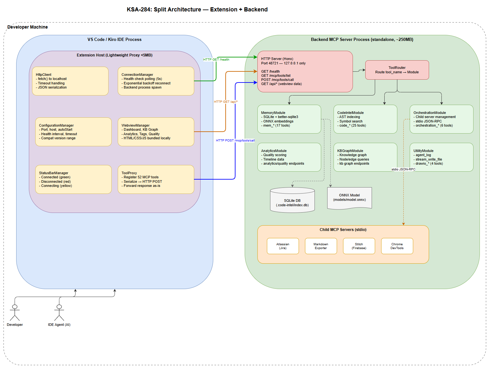
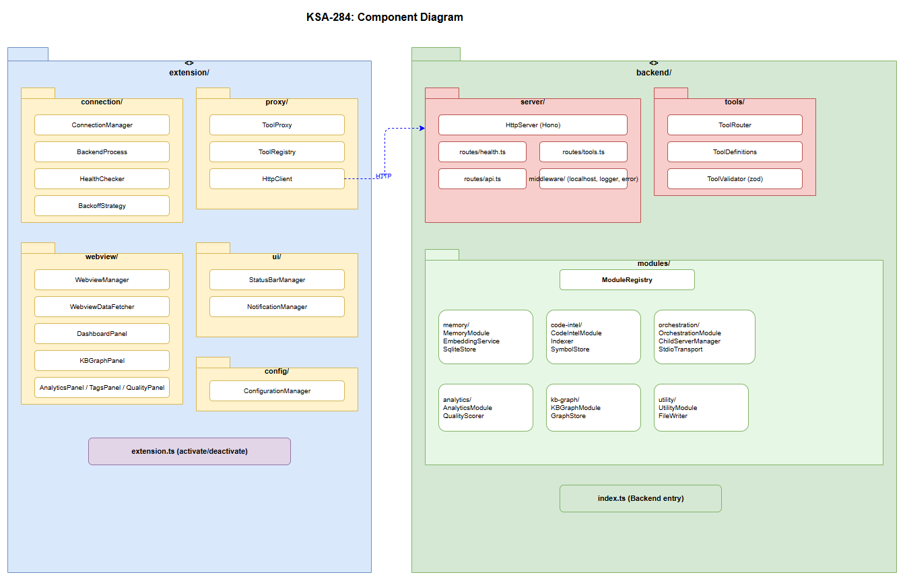
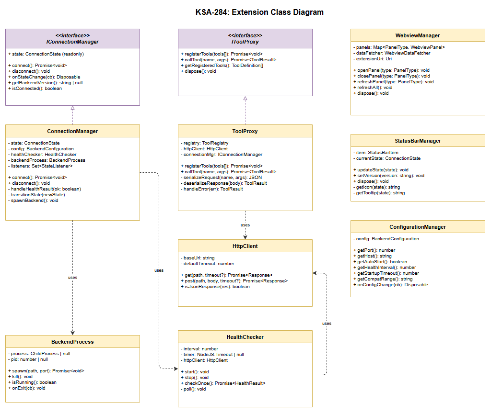
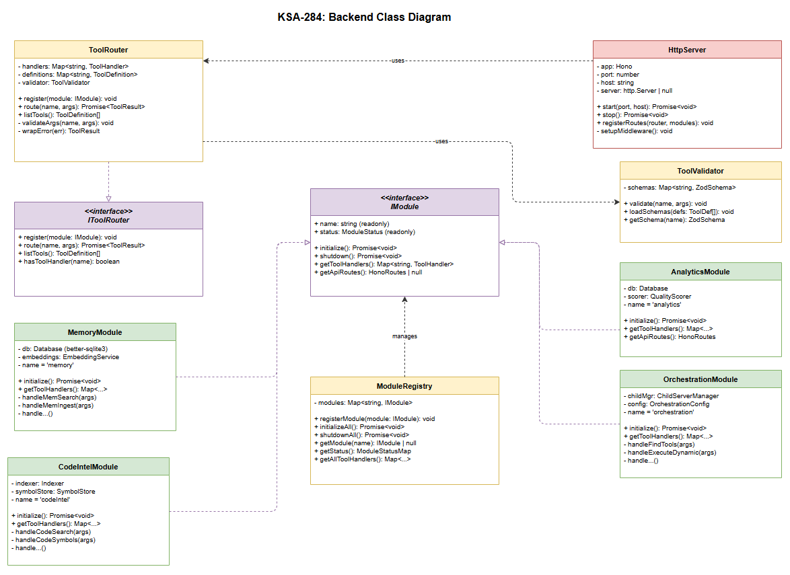

# Technical Design Document (TDD)

## Code Intelligence Extension — KSA-284: Split Extension: Lightweight Proxy + Backend MCP Server

---

## Document Information

| Field | Value |
|-------|-------|
| Jira Ticket | KSA-284 |
| Title | Split Extension: Lightweight Proxy + Backend MCP Server |
| Author | SA Agent |
| Version | 1.0 |
| Date | 2025-07-11 |
| Status | Draft |
| Related BRD | BRD-v1-KSA-284.docx |
| Related FSD | FSD-v1-KSA-284.docx |

---

## Author Tracking

| Role | Name - Position | Responsibility |
|------|-----------------|----------------|
| Author | SA Agent – Solution Architect | Create document |
| Peer Reviewer | DEV Lead – Senior Developer | Review document |

---

## Revision History

| Version | Date | Author | Changes |
|---------|------|--------|---------|
| 1.0 | 2025-07-11 | SA Agent | Initiate document from BRD and FSD |

---

## Sign-Off

| Name | Signature and date |
|------|--------------------|
| | ☐ I agree and confirm the technical design in this TDD |
| | ☐ I agree and confirm the technical design in this TDD |

---

## 1. Introduction

> **Scope Boundary:** This TDD specifies HOW to implement the split architecture defined in FSD KSA-284. It does NOT repeat functional requirements, business rules, or use cases — refer to the FSD for those. This document focuses on: technology choices, architecture decisions, implementation patterns, module/class design, and deployment concerns.

### 1.1 Purpose

This TDD provides the technical blueprint for splitting the monolithic Code Intelligence VS Code/Kiro extension into two independently deployable components:

1. **Extension (Thin Proxy)** — Lightweight IDE extension (~2MB) handling tool registration, request forwarding, Webview rendering, and connection lifecycle.
2. **Backend MCP Server** — Standalone Node.js HTTP process handling all business logic: Memory, Code Intelligence, Orchestration, Analytics/Quality, KB Graph.

### 1.2 Scope

| Component | Coverage |
|-----------|----------|
| Extension (extension/) | ConnectionManager, ToolProxy, WebviewManager, StatusBarManager, Configuration |
| Backend (backend/) | HttpServer, ToolRouter, MemoryModule, CodeIntelModule, OrchestrationModule, AnalyticsModule, KBGraphModule |
| Communication | HTTP/JSON on localhost, health checks, tool call proxy protocol |
| Build & Package | Separate package.json, separate build pipelines, independent versioning |

### 1.3 Technology Stack

| Layer | Technology | Version | Rationale |
|-------|-----------|---------|-----------|
| Language | TypeScript | ^5.5.0 | Match existing codebase |
| Runtime | Node.js | >= 18.0 | LTS, native fetch, performance |
| Extension Host | VS Code Extension API | >= 1.85.0 | Target IDE |
| Backend HTTP | Hono | ^4.0 | Lightweight (14KB), fast, TypeScript-first |
| Database | better-sqlite3 | ^11.0 | Already used in monolith |
| ML Runtime | onnxruntime-node | ^1.18 | Embedding generation |
| Test Framework | Vitest | ^2.0 | Match existing tests |
| Build | esbuild | ^0.21 | Fast bundling for extension |
| Package Manager | npm | >= 9.0 | Match existing workflow |
| Logging | pino | ^9.2 | Already in codebase |
| Schema Validation | zod | ^3.23 | Type-safe validation |

### 1.4 Design Principles

- **Separation of Concerns** — IDE-specific code in extension/, business logic in backend/
- **Transparency** — Proxy is invisible to callers; tool names, schemas, and responses are unchanged
- **Crash Isolation** — Backend runs as separate OS process; crash ≠ IDE disruption
- **Zero Config** — Works out of the box with sensible defaults (port 48721, autoStart: true)
- **IDE-Agnostic Backend** — No vscode imports in backend/; HTTP API is the contract

### 1.5 Constraints

- Extension .vsix must be < 5MB (no native binaries)
- Backend startup includes ONNX model load (~5-10s), must be async
- Communication is localhost-only (127.0.0.1) — no network exposure
- No authentication between Extension and Backend (trusted localhost)
- All 52 existing MCP tools must work identically through proxy

### 1.6 References

| Document | Location |
|----------|----------|
| BRD | BRD-v1-KSA-284.docx |
| FSD | FSD-v1-KSA-284.docx |
| Tool Inventory | .code-intel/tool-list.txt (52 tools) |
| Orchestration Config | .code-intel/orchestration.json |
| VS Code Extension API | https://code.visualstudio.com/api |
| MCP Specification | https://modelcontextprotocol.io |
| Hono Documentation | https://hono.dev |

---

## 2. System Architecture

### 2.1 Architecture Overview

The system follows a **client-server split** pattern where the Extension acts as a thin HTTP client and the Backend acts as the server. Both run on the same machine, communicating over localhost HTTP.


*[Edit in draw.io](diagrams/architecture.drawio)*

```
┌─────────────────────────────────────────────────────────────────┐
│                        DEVELOPER MACHINE                         │
├─────────────────────────┬───────────────────────────────────────┤
│   VS Code / Kiro IDE    │         Backend Process               │
│  ┌───────────────────┐  │  ┌─────────────────────────────────┐  │
│  │  Extension Host   │  │  │   Backend MCP Server            │  │
│  │  ┌─────────────┐  │  │  │  ┌─────────────────────────┐   │  │
│  │  │ Tool Proxy  │──┼──┼──┼─→│ HTTP Server (Hono)      │   │  │
│  │  │ (52 tools)  │  │  │  │  │ POST /mcp/tools/call    │   │  │
│  │  └─────────────┘  │  │  │  │ GET  /mcp/tools/list    │   │  │
│  │  ┌─────────────┐  │  │  │  │ GET  /health            │   │  │
│  │  │ Connection  │──┼──┼──┼─→│ GET  /api/*             │   │  │
│  │  │ Manager     │  │  │  │  └──────────┬──────────────┘   │  │
│  │  └─────────────┘  │  │  │             │                   │  │
│  │  ┌─────────────┐  │  │  │  ┌──────────▼──────────────┐   │  │
│  │  │ Webview Mgr │  │  │  │  │ Tool Router             │   │  │
│  │  └─────────────┘  │  │  │  └──────────┬──────────────┘   │  │
│  │  ┌─────────────┐  │  │  │             │                   │  │
│  │  │ Status Bar  │  │  │  │  ┌──────────▼──────────────┐   │  │
│  │  └─────────────┘  │  │  │  │ Module Dispatcher       │   │  │
│  └───────────────────┘  │  │  │ ┌────────┐ ┌──────────┐ │   │  │
│                         │  │  │ │Memory  │ │Code Intel│ │   │  │
│  ┌───────────────────┐  │  │  │ │Module  │ │Module    │ │   │  │
│  │  Webview Panels   │  │  │  │ ├────────┤ ├──────────┤ │   │  │
│  │  - Dashboard      │  │  │  │ │Orchest.│ │Analytics │ │   │  │
│  │  - KB Graph       │  │  │  │ │Module  │ │Module    │ │   │  │
│  │  - Analytics      │  │  │  │ ├────────┤ ├──────────┤ │   │  │
│  │  - Tags           │  │  │  │ │KB Graph│ │Agent Log │ │   │  │
│  │  - Quality        │  │  │  │ │Module  │ │Module    │ │   │  │
│  └───────────────────┘  │  │  │ └────────┘ └──────────┘ │   │  │
│                         │  │  └──────────────────────────────┘   │
│                         │  │  ┌──────────────────────────────┐   │
│                         │  │  │ Child MCP Servers (stdio)    │   │
│                         │  │  │ - Atlassian (Jira)           │   │
│                         │  │  │ - Markdown Exporter          │   │
│                         │  │  │ - Draw.io                    │   │
│                         │  │  └──────────────────────────────┘   │
└─────────────────────────┴───────────────────────────────────────┘
```

### 2.2 Component Diagram


*[Edit in draw.io](diagrams/component.drawio)*

| Component | Responsibility | Technology | Implements |
|-----------|---------------|------------|------------|
| ToolProxy | Register 52 MCP tools, serialize/forward requests to Backend | VS Code API + fetch | UC-2, BR-6..BR-11 |
| ConnectionManager | Health checks, reconnect logic, Backend process spawn | child_process, timers | UC-1, UC-3, UC-4 |
| WebviewManager | Create panels, load HTML/JS, proxy data from Backend API | VS Code Webview API | UC-5, BR-22..BR-25 |
| StatusBarManager | Show connection state indicator | VS Code StatusBar API | BR-15, BR-30 |
| ConfigurationManager | Read/validate VS Code settings | VS Code Configuration API | BR-1, BR-4 |
| HttpServer | Expose /mcp/*, /health, /api/* endpoints | Hono on Node.js | UC-2, UC-7 |
| ToolRouter | Route tool calls to appropriate module | Hono router | BR-6 |
| MemoryModule | SQLite + ONNX embeddings, mem_* tools | better-sqlite3, onnxruntime | BR-6 |
| CodeIntelModule | Indexing, search, symbols, code_* tools | AST parsers, SQLite | BR-6 |
| OrchestrationModule | Manage child MCP servers, orchestration_* tools | child_process, stdio JSON-RPC | BR-6 |
| AnalyticsModule | Quality scoring, analytics_* tools | SQLite queries | BR-6 |
| KBGraphModule | Knowledge graph operations, kb_* tools | SQLite, graph algorithms | BR-6 |

### 2.3 Deployment Architecture

Both components run on the developer's local machine as separate OS processes:

| Process | Lifecycle | Port | Memory | Disk |
|---------|-----------|------|--------|------|
| Extension (in VS Code Extension Host) | Starts with IDE, stops with IDE | N/A (inproc) | ~20MB | <5MB (.vsix) |
| Backend MCP Server | Auto-started by Extension, or manual | 48721 (configurable) | ~300MB (ONNX) | ~220MB (installed) |

### 2.4 Communication Patterns

| From | To | Protocol | Pattern | Timeout | Description |
|------|----|----------|---------|---------|-------------|
| Extension.ToolProxy | Backend.HttpServer | HTTP POST | Sync Request/Response | 5 min | Tool call execution |
| Extension.ConnectionManager | Backend.HttpServer | HTTP GET | Sync Polling (5s interval) | 3s | Health check |
| Extension.WebviewManager | Backend.HttpServer | HTTP GET/POST | Sync Request/Response | 10s | Webview data fetch |
| Backend.OrchestrationModule | Child MCP Servers | stdio JSON-RPC | Sync Request/Response | 30s | Child server tool calls |

---

## 3. API Design

### 3.1 API Overview

| # | Endpoint | Method | Description | Source |
|---|----------|--------|-------------|--------|
| 1 | /health | GET | Backend health and version info | UC-1, UC-3, UC-4 |
| 2 | /mcp/tools/list | GET | List all available tool definitions | UC-2, UC-7 |
| 3 | /mcp/tools/call | POST | Execute an MCP tool | UC-2 |
| 4 | /api/dashboard/summary | GET | Dashboard overview metrics | UC-5 |
| 5 | /api/dashboard/recent | GET | Recent activity list | UC-5 |
| 6 | /api/kb/graph | GET | KB graph nodes and edges | UC-5 |
| 7 | /api/kb/graph/node/:id | GET | Single KB node details | UC-5 |
| 8 | /api/analytics/overview | GET | Analytics summary | UC-5 |
| 9 | /api/analytics/timeline | GET | Time-series analytics data | UC-5 |
| 10 | /api/tags/list | GET | All tags with counts | UC-5 |
| 11 | /api/tags | POST | Create a tag | UC-5 |
| 12 | /api/tags/:id | PUT | Update a tag | UC-5 |
| 13 | /api/tags/:id | DELETE | Delete a tag | UC-5 |
| 14 | /api/quality/scores | GET | Quality scores per entry | UC-5 |
| 15 | /api/quality/summary | GET | Overall quality metrics | UC-5 |

---

### 3.2 API: GET /health

**Implements:** UC-1 (Step 5), UC-3, UC-4, BR-13, BR-27, BR-30

| Attribute | Value |
|-----------|-------|
| Method | GET |
| Path | /health |
| Auth | None (localhost only) |
| Rate Limit | None |

**Response — 200 OK:**

```json
{
  "status": "healthy",
  "version": "1.0.0",
  "uptime": 3600,
  "tools_loaded": 52,
  "modules": {
    "memory": "ready",
    "codeIntel": "ready",
    "orchestration": "ready",
    "analytics": "ready",
    "kbGraph": "ready"
  }
}
```

**Error Responses:**

| Status | Condition | Body |
|--------|-----------|------|
| 503 | Backend still initializing | `{"status": "starting", "version": "1.0.0", "modules": {...}}` |

---

### 3.3 API: GET /mcp/tools/list

**Implements:** UC-2, UC-7, BR-6, BR-7, BR-11

| Attribute | Value |
|-----------|-------|
| Method | GET |
| Path | /mcp/tools/list |
| Auth | None |

**Response — 200 OK:**

```json
{
  "tools": [
    {
      "name": "mem_search",
      "description": "Search memory entries by semantic similarity",
      "inputSchema": {
        "type": "object",
        "properties": {
          "query": { "type": "string", "description": "Search query" },
          "limit": { "type": "number", "default": 10 }
        },
        "required": ["query"]
      },
      "category": "memory"
    }
  ]
}
```

---

### 3.4 API: POST /mcp/tools/call

**Implements:** UC-2, BR-6, BR-7, BR-8, BR-9

| Attribute | Value |
|-----------|-------|
| Method | POST |
| Path | /mcp/tools/call |
| Auth | None |
| Content-Type | application/json |

**Request Body:**

```json
{
  "tool_name": "mem_search",
  "arguments": {
    "query": "authentication flow",
    "limit": 5
  }
}
```

**Response — 200 OK (success):**

```json
{
  "content": [
    {
      "type": "text",
      "text": "Found 3 relevant entries..."
    }
  ],
  "isError": false
}
```

**Response — 200 OK (tool error, forwarded as-is per BR-9):**

```json
{
  "content": [
    {
      "type": "text",
      "text": "Error: Entry not found"
    }
  ],
  "isError": true
}
```

**Error Responses:**

| Status | Code | Message | Condition |
|--------|------|---------|-----------|
| 400 | INVALID_REQUEST | "Missing required field: tool_name" | Malformed request body |
| 404 | TOOL_NOT_FOUND | "Tool 'xyz' not found" | tool_name not in registry |
| 422 | VALIDATION_ERROR | "Validation failed: {details}" | Arguments don't match schema |
| 500 | INTERNAL_ERROR | "Tool execution failed: {message}" | Unhandled Backend error |
| 503 | MODULE_UNAVAILABLE | "Module 'memory' is not ready" | Module still initializing |

---

### 3.5 API: Webview Data Endpoints (/api/*)

All /api/* endpoints follow the same pattern:

**Common Response Envelope:**

```json
{
  "data": { ... },
  "timestamp": "2025-07-11T10:00:00Z"
}
```

**Common Error Response:**

```json
{
  "error": {
    "code": "DATA_UNAVAILABLE",
    "message": "Module not ready"
  }
}
```

**Key endpoints (see FSD §3.5.4 for full list):**

- `GET /api/dashboard/summary` → `{ data: { totalEntries, recentCount, topCategories } }`
- `GET /api/kb/graph` → `{ data: { nodes: [...], edges: [...] } }`
- `GET /api/tags/list` → `{ data: { tags: [{ id, name, count }] } }`
- `POST /api/tags` → `{ data: { id, name, createdAt } }` (body: `{ name: string }`)

---

## 4. Data Model (In-Memory State)

> **Note:** This project does NOT use a traditional database schema. The Backend uses SQLite for persistence (existing from monolith). This section documents the **in-memory state entities** that the Extension manages.

### 4.1 Extension State (In-Memory)

No persistent database in the Extension. All state is held in memory and reset on restart.

#### ConnectionState (TypeScript Interface)

```typescript
interface ConnectionState {
  state: 'DISCONNECTED' | 'CONNECTING' | 'CONNECTED' | 'STARTING';
  backendVersion: string | null;
  lastHealthCheck: number;        // Unix timestamp ms
  reconnectAttempts: number;
  reconnectDelay: number;         // Current backoff ms
  backendPid: number | null;      // OS process ID if auto-started
  connectedAt: number | null;     // Unix timestamp ms
}
```

#### ToolRegistry (TypeScript Interface)

```typescript
interface ToolRegistryEntry {
  name: string;                   // e.g., "mem_search"
  description: string;
  inputSchema: Record<string, unknown>;  // JSON Schema
  category: 'memory' | 'code' | 'orchestration' | 'utility';
  registered: boolean;            // Active in IDE
}

type ToolRegistry = Map<string, ToolRegistryEntry>;
```

#### ProxyRequest (TypeScript Interface)

```typescript
interface ProxyRequest {
  id: string;                     // UUID
  toolName: string;
  arguments: Record<string, unknown>;
  timestamp: number;
  status: 'PENDING' | 'IN_FLIGHT' | 'COMPLETED' | 'FAILED' | 'TIMEOUT';
  responseTime?: number;          // ms
}
```

### 4.2 Backend Persistence

Backend uses existing SQLite database (unchanged from monolith). No schema migrations required for this ticket — business logic is re-hosted, not rewritten.

---

## 5. Class / Module Design

### 5.1 Extension Package Structure

```
extension/
├── src/
│   ├── extension.ts              # activate() / deactivate() entry point
│   ├── connection/
│   │   ├── ConnectionManager.ts  # Health check, reconnect, process spawn
│   │   ├── BackendProcess.ts     # child_process spawn/kill wrapper
│   │   └── HealthChecker.ts      # GET /health poller
│   ├── proxy/
│   │   ├── ToolProxy.ts          # Register tools, forward calls
│   │   ├── ToolRegistry.ts       # Tool metadata cache
│   │   ├── HttpClient.ts         # HTTP POST /mcp/tools/call
│   │   └── FileProxyHandler.ts   # File Gateway — read/write files for Backend
│   ├── webview/
│   │   ├── WebviewManager.ts     # Panel lifecycle, HTML loading
│   │   ├── panels/
│   │   │   ├── DashboardPanel.ts
│   │   │   ├── KBGraphPanel.ts
│   │   │   ├── AnalyticsPanel.ts
│   │   │   ├── TagsPanel.ts
│   │   │   └── QualityPanel.ts
│   │   └── WebviewDataFetcher.ts # GET /api/* data proxy
│   ├── ui/
│   │   ├── StatusBarManager.ts   # Connection state indicator
│   │   └── NotificationManager.ts # Error/warning notifications
│   ├── config/
│   │   └── ConfigurationManager.ts # VS Code settings reader
│   └── types/
│       ├── connection.ts         # ConnectionState, etc.
│       ├── proxy.ts              # ProxyRequest, ToolRegistryEntry
│       └── config.ts             # BackendConfiguration
├── media/                        # Webview HTML/CSS/JS bundles
├── package.json
├── tsconfig.json
└── esbuild.config.js
```

### 5.2 Backend Package Structure

```
backend/
├── src/
│   ├── index.ts                  # Server entry point
│   ├── server/
│   │   ├── HttpServer.ts         # Hono app setup, middleware
│   │   ├── routes/
│   │   │   ├── health.ts         # GET /health
│   │   │   ├── tools.ts          # GET /mcp/tools/list, POST /mcp/tools/call
│   │   │   └── api.ts            # GET/POST /api/* (webview data)
│   │   └── middleware/
│   │       ├── localhost-only.ts  # Reject non-127.0.0.1 requests
│   │       ├── request-logger.ts  # pino request logging
│   │       └── error-handler.ts   # Global error boundary
│   ├── modules/
│   │   ├── ModuleRegistry.ts     # Module lifecycle management
│   │   ├── memory/
│   │   │   ├── MemoryModule.ts   # mem_* tool handlers
│   │   │   ├── EmbeddingService.ts
│   │   │   └── SqliteStore.ts
│   │   ├── code-intel/
│   │   │   ├── CodeIntelModule.ts # code_* tool handlers
│   │   │   ├── Indexer.ts
│   │   │   └── SymbolStore.ts
│   │   ├── orchestration/
│   │   │   ├── OrchestrationModule.ts # orchestration_* tools
│   │   │   ├── ChildServerManager.ts
│   │   │   └── StdioTransport.ts
│   │   ├── analytics/
│   │   │   ├── AnalyticsModule.ts # analytics data
│   │   │   └── QualityScorer.ts
│   │   ├── kb-graph/
│   │   │   ├── KBGraphModule.ts   # KB graph operations
│   │   │   └── GraphStore.ts
│   │   └── utility/
│   │       ├── UtilityModule.ts   # agent_log, stream_write_file, drawio_*
│   │       └── FileWriter.ts
│   ├── tools/
│   │   ├── ToolRouter.ts         # Route tool_name → module handler
│   │   ├── ToolDefinitions.ts    # Tool schemas (from tool-list.txt)
│   │   └── ToolValidator.ts      # Zod schema validation
│   ├── config/
│   │   └── BackendConfig.ts      # Port, paths, module settings
│   └── types/
│       ├── tool.ts               # ToolDefinition, ToolResult
│       └── module.ts             # ModuleInterface
├── package.json
├── tsconfig.json
└── vitest.config.ts
```

### 5.3 Key Interfaces


*[Edit in draw.io](diagrams/class-extension.drawio)*


*[Edit in draw.io](diagrams/class-backend.drawio)*

#### Extension Interfaces

```typescript
// connection/ConnectionManager.ts
interface IConnectionManager {
  readonly state: ConnectionState;
  connect(): Promise<void>;
  disconnect(): void;
  onStateChange(listener: (state: ConnectionState) => void): Disposable;
}

// proxy/ToolProxy.ts
interface IToolProxy {
  registerTools(tools: ToolDefinition[]): Promise<void>;
  callTool(name: string, args: Record<string, unknown>): Promise<ToolResult>;
  getRegisteredTools(): ToolDefinition[];
}

// proxy/FileProxyHandler.ts
interface IFileProxyHandler {
  /** Detect if tool requires file input and inject content into args */
  enrichWithFileContent(toolName: string, args: Record<string, unknown>): Promise<Record<string, unknown>>;
  /** Detect if response contains file output and write to workspace */
  handleFileOutput(response: ToolResult & { __file_output?: FileOutput }): Promise<void>;
  /** Check if tool is classified as file-input, file-output, or text-only */
  getToolPattern(toolName: string): 'file-input' | 'file-output' | 'file-both' | 'text-only';
}

interface FileOutput {
  path: string;      // Relative from workspace root
  data: string;      // UTF-8 or Base64 encoded
  encoding: 'utf-8' | 'base64';
}

// Constants
const MAX_FILE_SIZE = 10 * 1024 * 1024; // 10MB
const FILE_INPUT_TOOLS = ['mem_ingest_file', 'drawio_auto_layout'];
const FILE_OUTPUT_TOOLS = ['stream_write_file'];
const FILE_BOTH_TOOLS = ['drawio_export_png', 'export_docx'];
const EXTENSION_LOCAL_TOOLS = ['embed_images']; // Runs entirely in Extension, no Backend call

// webview/WebviewManager.ts
interface IWebviewManager {
  openPanel(panelId: PanelType): void;
  closePanel(panelId: PanelType): void;
  refreshPanel(panelId: PanelType): void;
}

// ui/StatusBarManager.ts
interface IStatusBarManager {
  updateState(state: ConnectionState): void;
  dispose(): void;
}
```

#### Backend Interfaces

```typescript
// modules/ModuleRegistry.ts
interface IModule {
  readonly name: string;
  readonly status: 'initializing' | 'ready' | 'error';
  initialize(): Promise<void>;
  shutdown(): Promise<void>;
  getToolHandlers(): Map<string, ToolHandler>;
}

type ToolHandler = (args: Record<string, unknown>) => Promise<ToolResult>;

// tools/ToolRouter.ts
interface IToolRouter {
  register(module: IModule): void;
  route(toolName: string, args: Record<string, unknown>): Promise<ToolResult>;
  listTools(): ToolDefinition[];
}

// server/HttpServer.ts
interface IHttpServer {
  start(port: number, host: string): Promise<void>;
  stop(): Promise<void>;
  readonly isRunning: boolean;
}
```

### 5.4 Design Patterns

| Pattern | Where Used | Rationale |
|---------|-----------|-----------|
| **Proxy** | Extension.ToolProxy | Transparent forwarding per BR-7, BR-9 |
| **Observer** | ConnectionManager.onStateChange | Decouple state changes from UI updates |
| **Registry** | ToolRouter, ModuleRegistry | Dynamic module/tool discovery |
| **Strategy** | HealthChecker (backoff strategy) | Configurable retry algorithms |
| **Facade** | WebviewManager | Simplify panel lifecycle for consumers |
| **Factory** | BackendProcess.spawn() | Platform-specific process creation |
| **Module** | IModule interface | Consistent lifecycle for all Backend modules |

### 5.5 State Machine: Connection State

```
                  ┌─────────────┐
                  │ DISCONNECTED│◄──────────────────┐
                  └──────┬──────┘                   │
                         │ autoStart=true           │ health fail
                         ▼                          │ OR timeout
                  ┌─────────────┐                   │
                  │  STARTING   │───────────────────┘
                  └──────┬──────┘
                         │ process spawned
                         ▼
                  ┌─────────────┐     health fail
              ┌──▶│ CONNECTING  │─────────────────┐
              │   └──────┬──────┘                  │
              │          │ health OK               │
              │          ▼                         ▼
              │   ┌─────────────┐          ┌─────────────┐
              └───│  CONNECTED  │─────────▶│ DISCONNECTED│
  reconnect       └─────────────┘  crash   └─────────────┘
  timer fires                       detected
```

### 5.6 Error Handling Strategy

| Layer | Strategy | Implementation |
|-------|----------|----------------|
| Extension.activate() | Catch-all, never throw | try/catch wrapping entire activate(), log error, show notification |
| Extension.ToolProxy | Return error content block | `{ content: [{type:"text", text: error.message}], isError: true }` |
| Extension.ConnectionManager | State transition + retry | Move to DISCONNECTED, trigger reconnect loop |
| Backend.HttpServer | Global error middleware | Hono onError → log + 500 response |
| Backend.ToolRouter | Per-tool try/catch | Catch module errors → return isError:true response |
| Backend.Modules | Module-level isolation | One module crash doesn't affect others |

**Error Code Mapping (Extension → User):**

| Internal Error | User-Facing Code | User Message |
|----------------|-----------------|--------------|
| ECONNREFUSED | BACKEND_UNAVAILABLE | "Backend is not connected" |
| ETIMEDOUT (health) | BACKEND_UNAVAILABLE | "Backend is not responding" |
| ETIMEDOUT (tool call) | TIMEOUT | "Tool call timed out" |
| HTTP 404 (tool) | TOOL_NOT_FOUND | "Tool '{name}' not found" |
| HTTP 500 | INTERNAL_ERROR | "Tool execution failed: {msg}" |
| JSON parse error | PARSE_ERROR | "Invalid response from Backend" |

---

## 6. Integration Design

### 6.1 Extension ↔ Backend (HTTP)

| Attribute | Value |
|-----------|-------|
| Protocol | HTTP/1.1 over TCP |
| Host | 127.0.0.1 |
| Port | 48721 (configurable) |
| Content-Type | application/json |
| Timeout (health) | 3,000 ms |
| Timeout (tool call) | 300,000 ms (5 min) |
| Timeout (webview data) | 10,000 ms |
| Retry Policy | Health: exponential backoff (1s..30s). Tool calls: no retry (return error). |
| Keep-Alive | Yes (default Node.js behavior) |

**Request Flow (Tool Call):**

```
Extension                          Backend
   │                                  │
   │  POST /mcp/tools/call            │
   │  {"tool_name":"mem_search",      │
   │   "arguments":{"query":"x"}}     │
   ├─────────────────────────────────▶│
   │                                  │ route to MemoryModule
   │                                  │ execute handler
   │                                  │
   │  200 OK                          │
   │  {"content":[...],"isError":f}   │
   │◀─────────────────────────────────┤
   │                                  │
```

### 6.2 Backend ↔ Child MCP Servers (stdio)

| Attribute | Value |
|-----------|-------|
| Protocol | JSON-RPC 2.0 over stdio |
| Transport | child_process stdin/stdout |
| Servers | atlassian, markdown-exporter-local, stitch, chrome-devtools-mcp |
| Management | OrchestrationModule spawns/monitors/restarts child servers |
| Config Source | .code-intel/orchestration.json |

### 6.3 Extension ↔ VS Code Host

| Integration Point | VS Code API | Usage |
|-------------------|-------------|-------|
| Tool Registration | `vscode.lm.registerTool()` | Register 52 MCP tool proxies |
| Webview Panels | `vscode.window.createWebviewPanel()` | Dashboard, KB Graph, etc. |
| Status Bar | `vscode.window.createStatusBarItem()` | Connection state |
| Configuration | `vscode.workspace.getConfiguration()` | Read extension settings |
| Output Channel | `vscode.window.createOutputChannel()` | Debug logging |
| Commands | `vscode.commands.registerCommand()` | User actions (open panel, reconnect) |

---

## 7. Security Design

### 7.1 Network Security

| Control | Implementation | Business Rule |
|---------|---------------|---------------|
| Localhost binding | Backend: `server.listen(port, '127.0.0.1')` | BR-35, BR-37 |
| No auth required | No Authorization header needed | BR-36 |
| Response validation | Extension validates JSON with zod before processing | BR-38 |
| No CORS | Backend doesn't set CORS headers (localhost-only) | — |

### 7.2 Process Security

| Control | Implementation |
|---------|---------------|
| Process isolation | Backend = separate PID, separate memory space |
| No privilege escalation | Backend runs as same user (no sudo/admin) |
| Port range restriction | Only ports 1024-65535 (no privileged ports) |
| Signal handling | Backend gracefully shuts down on SIGTERM/SIGINT |

### 7.3 Data Protection

All data stays on localhost. No network transmission of source code, embeddings, or tool call content.

| Data Type | Storage | Protection |
|-----------|---------|------------|
| Source code | Backend RAM (indexing) | Process memory isolation |
| Embeddings | SQLite file (local) | OS file permissions |
| Tool arguments | HTTP body (localhost) | No network exposure |
| Health status | HTTP response (localhost) | No sensitive data included |

### 7.4 Input Validation

| Input | Validation | Library |
|-------|-----------|---------|
| tool_name | String, must exist in ToolRegistry | zod `.string().refine()` |
| arguments | Validated against tool's inputSchema | zod + tool-specific schemas |
| Port config | Number 1024-65535 | zod `.number().min(1024).max(65535)` |
| Backend path | Valid file path, exists on disk | `fs.existsSync()` |

---

## 8. Performance & Scalability

### 8.1 Performance Targets

| Metric | Target | Measurement Method | Source |
|--------|--------|--------------------|--------|
| Extension activate() | < 2,000 ms | VS Code Extension Host profiler | BR-1 |
| Proxy latency (p99) | < 50 ms | Timestamp diff (before POST → after response) | BR-8 |
| Backend startup | < 10,000 ms | Time from spawn to first healthy /health | BRD NFR |
| Health check round-trip | < 100 ms | Network round-trip on localhost | — |
| Tool list fetch | < 200 ms | Time for GET /mcp/tools/list response | — |

### 8.2 Extension Optimization

| Optimization | Implementation | Impact |
|-------------|----------------|--------|
| Lazy activation | Only activate when workspace detected | Reduce IDE startup overhead |
| Async tool registration | Register tools in background after activate() returns | Keep activate() < 2s |
| Connection pooling | HTTP keep-alive (Node.js default Agent) | Reduce TCP handshake per request |
| No bundled binaries | esbuild bundle = JS only, ~500KB | .vsix < 5MB |

### 8.3 Backend Optimization

| Optimization | Implementation | Impact |
|-------------|----------------|--------|
| ONNX model caching | Load once at startup, reuse for all embeddings | Avoid 5s reload |
| SQLite WAL mode | `PRAGMA journal_mode=WAL` | Concurrent reads during writes |
| Module parallel init | Initialize all modules concurrently at startup | Reduce total startup time |
| Hono lightweight | 14KB framework, near-zero overhead | Minimal latency added |

### 8.4 Latency Budget (Tool Call)

```
Total budget: 50ms (proxy overhead only, excludes Backend processing)

Serialization (JSON.stringify):   ~1ms
HTTP request (localhost):         ~2ms
HTTP response (localhost):        ~2ms
Deserialization (JSON.parse):     ~1ms
Framework overhead (Hono route):  ~1ms
─────────────────────────────────────
Total estimated:                  ~7ms (well within 50ms budget)
```

---

## 9. Monitoring & Observability

### 9.1 Logging

| Component | Framework | Destination | Level |
|-----------|-----------|-------------|-------|
| Extension | VS Code OutputChannel | "Code Intelligence" output panel | INFO |
| Backend | pino (structured JSON) | stdout → captured by Extension | INFO |

**Log Events:**

| Event | Level | Fields |
|-------|-------|--------|
| Backend started | INFO | `{ pid, port, version }` |
| Health check success | DEBUG | `{ uptime, tools_loaded }` |
| Health check failed | WARN | `{ error, attempt, nextRetry }` |
| Connection state change | INFO | `{ from, to, reason }` |
| Tool call start | DEBUG | `{ tool_name, requestId }` |
| Tool call complete | DEBUG | `{ tool_name, requestId, duration_ms }` |
| Tool call error | ERROR | `{ tool_name, requestId, error }` |
| Backend crash detected | ERROR | `{ pid, exitCode, signal }` |
| Reconnection success | INFO | `{ attempts, totalTime }` |

### 9.2 Metrics (In-Process)

| Metric | Type | Description |
|--------|------|-------------|
| `proxy.calls.total` | Counter | Total tool calls proxied |
| `proxy.calls.errors` | Counter | Failed tool calls |
| `proxy.latency_ms` | Histogram | Proxy overhead latency |
| `connection.reconnects` | Counter | Number of reconnections |
| `backend.uptime_s` | Gauge | Backend uptime seconds |

### 9.3 Health Checks

| Endpoint | Checks | Response |
|----------|--------|----------|
| GET /health | Server running, modules loaded | 200 with module statuses |

### 9.4 Status Bar Indicator

| State | Icon | Color | Tooltip |
|-------|------|-------|---------|
| CONNECTED | $(check) | Green | "Backend v1.0.0 — Connected (uptime: 1h 23m)" |
| CONNECTING | $(sync~spin) | Yellow | "Connecting to Backend..." |
| STARTING | $(loading~spin) | Yellow | "Starting Backend..." |
| DISCONNECTED | $(error) | Red | "Backend Disconnected — Click to retry" |

---

## 10. Deployment & Configuration

### 10.1 Extension Configuration (VS Code Settings)

```json
{
  "codeIntel.backend.port": 48721,
  "codeIntel.backend.host": "127.0.0.1",
  "codeIntel.backend.path": "",
  "codeIntel.backend.autoStart": true,
  "codeIntel.backend.healthCheckInterval": 5000,
  "codeIntel.backend.startupTimeout": 30000,
  "codeIntel.backend.compatRange": "^1.0.0"
}
```

### 10.2 Backend Configuration (Environment / Config File)

```json
{
  "port": 48721,
  "host": "127.0.0.1",
  "dataDir": ".code-intel",
  "onnxModelPath": "models/model.onnx",
  "sqliteDbPath": "index.db",
  "orchestrationConfigPath": "orchestration.json",
  "logLevel": "info"
}
```

### 10.3 Distribution Strategy

| Component | Distribution | Update Mechanism |
|-----------|-------------|-----------------|
| Extension | VS Code Marketplace (.vsix < 5MB) | Marketplace auto-update |
| Backend | npm package / standalone binary | `npm update` or auto-download |

### 10.4 Rollback Strategy

| Scenario | Rollback Steps |
|----------|---------------|
| Extension update breaks proxy | Downgrade Extension via marketplace (install specific version) |
| Backend update breaks tools | Stop new Backend → start old Backend binary → Extension auto-reconnects |
| Both need rollback | Downgrade Extension + revert Backend binary |

---

## 11. Implementation Checklist

### Phase 1: Project Setup (Day 1-2)

| # | Task | Priority | Estimate |
|---|------|----------|----------|
| 1.1 | Create `extension/` directory with package.json, tsconfig, esbuild config | MUST | 2h |
| 1.2 | Create `backend/` directory with package.json, tsconfig, vitest config | MUST | 2h |
| 1.3 | Setup shared types package (tool definitions, response types) | MUST | 1h |
| 1.4 | Configure esbuild for Extension bundling (.vsix target) | MUST | 2h |
| 1.5 | Configure Backend entry point with Hono server | MUST | 2h |

### Phase 2: Backend Core (Day 3-5)

| # | Task | Priority | Estimate |
|---|------|----------|----------|
| 2.1 | Implement HttpServer with Hono (routes, middleware) | MUST | 4h |
| 2.2 | Implement localhost-only middleware | MUST | 1h |
| 2.3 | Implement GET /health endpoint | MUST | 1h |
| 2.4 | Implement GET /mcp/tools/list endpoint | MUST | 2h |
| 2.5 | Implement POST /mcp/tools/call with ToolRouter | MUST | 4h |
| 2.6 | Implement ModuleRegistry (lifecycle management) | MUST | 3h |
| 2.7 | Implement ToolValidator (zod schemas) | MUST | 3h |
| 2.8 | Extract MemoryModule from monolith | MUST | 6h |
| 2.9 | Extract CodeIntelModule from monolith | MUST | 6h |
| 2.10 | Extract OrchestrationModule from monolith | MUST | 4h |
| 2.11 | Extract AnalyticsModule from monolith | SHOULD | 3h |
| 2.12 | Extract KBGraphModule from monolith | SHOULD | 3h |
| 2.13 | Extract UtilityModule (agent_log, stream_write_file, drawio) | MUST | 2h |
| 2.14 | Implement /api/* Webview data endpoints | MUST | 4h |

### Phase 3: Extension Core (Day 6-8)

| # | Task | Priority | Estimate |
|---|------|----------|----------|
| 3.1 | Implement activate() with async Backend connection | MUST | 3h |
| 3.2 | Implement ConfigurationManager | MUST | 2h |
| 3.3 | Implement ConnectionManager (state machine) | MUST | 4h |
| 3.4 | Implement HealthChecker (polling + backoff) | MUST | 3h |
| 3.5 | Implement BackendProcess (spawn/kill) | MUST | 3h |
| 3.6 | Implement ToolProxy (register + forward) | MUST | 4h |
| 3.7 | Implement HttpClient (POST /mcp/tools/call) | MUST | 2h |
| 3.8 | Implement StatusBarManager | MUST | 2h |
| 3.9 | Implement WebviewManager + panels | MUST | 4h |
| 3.10 | Implement WebviewDataFetcher | MUST | 2h |
| 3.11 | Implement NotificationManager | SHOULD | 1h |

### Phase 4: Integration & Testing (Day 9-10)

| # | Task | Priority | Estimate |
|---|------|----------|----------|
| 4.1 | Unit tests: ConnectionManager state transitions | MUST | 3h |
| 4.2 | Unit tests: ToolProxy request/response handling | MUST | 3h |
| 4.3 | Unit tests: HealthChecker backoff timing | MUST | 2h |
| 4.4 | Integration tests: Extension ↔ Backend (real HTTP) | MUST | 4h |
| 4.5 | Parity tests: All 52 tools produce same results | MUST | 6h |
| 4.6 | Performance test: activate() < 2s | MUST | 1h |
| 4.7 | Performance test: proxy latency < 50ms | MUST | 1h |
| 4.8 | Crash isolation test: kill Backend, verify Extension stable | MUST | 2h |
| 4.9 | Reconnection test: stop/start Backend | MUST | 2h |
| 4.10 | Extension size verification: .vsix < 5MB | MUST | 1h |

### Phase 5: Polish & Documentation (Day 11-12)

| # | Task | Priority | Estimate |
|---|------|----------|----------|
| 5.1 | Error messages and notifications (UX) | SHOULD | 2h |
| 5.2 | Output channel logging (debug info) | SHOULD | 2h |
| 5.3 | Package.json contributes (commands, settings, statusbar) | MUST | 2h |
| 5.4 | README.md for Extension and Backend | SHOULD | 2h |
| 5.5 | Update CI/CD pipeline for dual-package build | MUST | 3h |

**Total Estimate:** ~12 working days (1 developer)

---

## 12. Appendix

### Glossary

| Term | Definition |
|------|------------|
| MCP | Model Context Protocol — standard for AI tool integration |
| Extension Host | VS Code process that runs extensions in isolation |
| Hono | Lightweight TypeScript-first web framework (14KB) |
| ONNX | Open Neural Network Exchange — ML model format |
| Proxy | Pattern where Extension forwards requests without processing |
| Health Check | HTTP GET /health endpoint for availability verification |
| Exponential Backoff | Retry strategy: 1s, 2s, 4s, 8s, 16s, max 30s |

### Open Questions

| # | Question | Status | Answer |
|---|----------|--------|--------|
| 1 | Should Backend support WebSocket for real-time Webview updates? | Open | Phase 2 consideration. Polling sufficient for v1. |
| 2 | Should Backend auto-update be implemented in v1? | Resolved | No — manual update only in v1. Auto-update is Phase 2. |
| 3 | Which HTTP framework for Backend (Hono vs Fastify)? | Resolved | Hono — smaller (14KB), TypeScript-first, sufficient perf for localhost. |

### Diagram Index

| # | Diagram | Image | Source (editable) |
|---|---------|-------|-------------------|
| 1 | Architecture | [architecture.png](diagrams/architecture.png) | [architecture.drawio](diagrams/architecture.drawio) |
| 2 | Component | [component.png](diagrams/component.png) | [component.drawio](diagrams/component.drawio) |
| 3 | Class — Extension | [class-extension.png](diagrams/class-extension.png) | [class-extension.drawio](diagrams/class-extension.drawio) |
| 4 | Class — Backend | [class-backend.png](diagrams/class-backend.png) | [class-backend.drawio](diagrams/class-backend.drawio) |

---

## ⛔ MANDATORY: Diagram Requirements

| # | Diagram | File | Section | Status |
|---|---------|------|---------|--------|
| 1 | Architecture Overview | `diagrams/architecture.drawio` + `.png` | §2.1 | ✅ |
| 2 | Component Diagram | `diagrams/component.drawio` + `.png` | §2.2 | ✅ |
| 3 | Class — Extension | `diagrams/class-extension.drawio` + `.png` | §5.3 | ✅ |
| 4 | Class — Backend | `diagrams/class-backend.drawio` + `.png` | §5.3 | ✅ |
