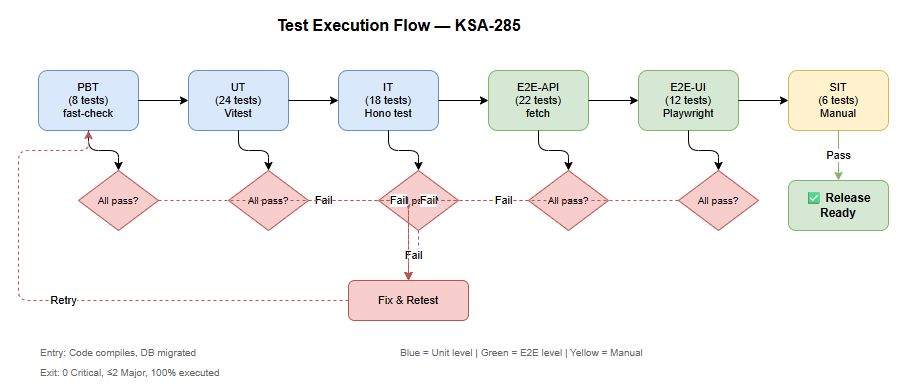
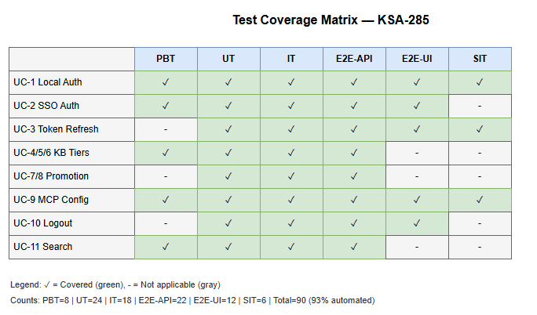

# Software Test Plan (STP)

## Code Intelligence Extension — KSA-285: Authentication, Multi-Tenant KB, and MCP Server Configuration

---

## Document Information

| Field | Value |
|-------|-------|
| Jira Ticket | KSA-285 |
| Title | Authentication, Multi-Tenant KB, and MCP Server Configuration |
| Author | QA Agent |
| Version | 1.0 |
| Date | 2025-07-15 |
| Status | Draft |
| Architecture Pattern | Plugin (IDE Extension) |
| Related BRD | BRD-v1-KSA-285.docx |
| Related FSD | FSD-v1.1-KSA-285.docx |
| Related TDD | TDD-v1-KSA-285.docx |

---

## Author Tracking

| Role | Name - Position | Responsibility |
|------|-----------------|----------------|
| Author | QA Agent – QA Engineer | Create document |
| Peer Reviewer | SM Agent – Scrum Master | Review document |

---

## Revision History

| Version | Date | Author | Changes |
|---------|------|--------|---------|
| 1.0 | 2025-07-15 | QA Agent | Initiate document — auto-generated from BRD, FSD v1.1, and TDD KSA-285 |

---

## Sign-Off

| Name | Signature and date |
|------|--------------------|
| | ☐ I agree and confirm the test plan in this STP |
| | ☐ I agree and confirm the test plan in this STP |

---

## 1. Introduction

### 1.1 Purpose

This test plan defines the testing strategy, scope, schedule, and resources for validating the Authentication, Multi-Tenant Knowledge Base, and MCP Server Configuration features added to the Code Intelligence Extension (KSA-285). These three interconnected capabilities transform the extension into a secure, multi-tenant system with JWT-based auth, 3-tier KB isolation, and per-user MCP server credential management.

### 1.2 Test Objectives

- Verify all 11 Use Cases (UC-1 through UC-11) from FSD are implemented correctly
- Validate all 29 Business Rules (BR-1 through BR-29) are enforced
- Ensure non-functional requirements are met (performance, security, scalability per FSD §8)
- Verify data isolation between KB tiers and user boundaries (BR-9, BR-22)
- Validate integration with external systems (OIDC IdP, VS Code SecretStorage, Child MCP Servers)
- Confirm Plugin lifecycle compatibility (extension activation, SecretStorage, Webview)
- Verify graceful degradation (auth failure does NOT block IDE — BR-29)

### 1.3 References

| Document | Location |
|----------|----------|
| BRD | BRD-v1-KSA-285.docx |
| FSD | FSD-v1.1-KSA-285.docx |
| TDD | TDD-v1-KSA-285.docx |
| VS Code SecretStorage API | https://code.visualstudio.com/api/references/vscode-api#SecretStorage |
| OpenID Connect Core 1.0 | https://openid.net/specs/openid-connect-core-1_0.html |
| OAuth 2.0 PKCE RFC 7636 | https://datatracker.ietf.org/doc/html/rfc7636 |

---

## 2. Test Strategy

### 2.1 Test Levels

| Level | Scope | Automation | Tools |
|-------|-------|------------|-------|
| PBT | Correctness properties (random inputs) — token generation, encryption, hash uniqueness | Automated | Vitest + fast-check |
| UT | Unit/edge case tests — services, validators, repositories | Automated | Vitest |
| IT | API integration (Hono testApp) — route handlers with real SQLite | Automated | Vitest + Hono test client |
| E2E-API | REST endpoint E2E (real server on localhost:48721) | Automated | Vitest + fetch/undici |
| E2E-UI | Browser UI E2E (VS Code Extension Test + Webview) | Automated | @vscode/test-electron + Playwright |
| SIT | Manual exploratory / visual / UX edge cases only | Manual | Browser + VS Code |



### 2.2 Test Types

| Type | Description | Applicable |
|------|-------------|------------|
| Functional Testing | Verify features work per FSD use cases (UC-1 to UC-11) | Yes |
| Security Testing | Verify auth, authorization, token handling, encryption at rest | Yes |
| Performance Testing | Verify response times (login <3s, search <500ms, refresh <500ms) | Yes |
| Integration Testing | Verify OIDC flow, SecretStorage, SQLite multi-tier queries | Yes |
| Regression Testing | Ensure existing mem_* tools and HTTP server still work | Yes |
| Compatibility Testing | VS Code >= 1.85.0, Node.js 20+, multiple OS | Yes |
| Usability Testing | Login Webview, MCP Config Webview UI/UX | Yes |

### 2.3 Test Approach

**Risk-Based Prioritization:**
1. **High Risk**: Authentication flows (credentials, tokens, lockout), KB tier isolation, data encryption
2. **Medium Risk**: Auto-promotion logic, search ranking, MCP config save/load
3. **Low Risk**: UI cosmetics, audit logging, background job scheduling

**Automation-First Strategy:**
- All deterministic scenarios automated (E2E-API + E2E-UI)
- Manual SIT only for visual verification and complex UX timing
- Property-based tests for cryptographic correctness and input validation

### 2.4 Entry/Exit Criteria

| Level | Entry Criteria | Exit Criteria |
|-------|---------------|--------------|
| PBT | Code compiles, crypto modules available | All properties hold for 1000+ random inputs |
| UT | Code compiles, Vitest configured | 100% unit test pass, branch coverage ≥ 80% |
| IT | SQLite DB accessible, migrations run | All API integration tests pass |
| E2E-API | Backend server running on localhost:48721 | All CRUD lifecycle + auth + error tests pass |
| E2E-UI | VS Code Extension Host running, Backend running | All Webview interaction scenarios pass |
| SIT | E2E-API + E2E-UI pass, environment stable | 0 Critical, ≤ 2 Major defects open |

### 2.5 E2E Automation Coverage

| Scenario Type | Classification | Rationale |
|--------------|---------------|-----------|
| Login/Logout CRUD (credentials, tokens) | E2E-API | API-level verification sufficient |
| SSO flow initiation + callback | E2E-API | Backend-only, no browser needed |
| Token refresh lifecycle | E2E-API | API timing verification |
| KB ingest/search (all tiers) | E2E-API | Data CRUD via API |
| KB promotion (manual + auto) | E2E-API | Background job + API trigger |
| MCP config save/load | E2E-API | REST CRUD |
| Login Webview form interaction | E2E-UI | Form fill + button click |
| MCP Config Webview tabs + save | E2E-UI | Tab switching + form validation |
| Status bar auth state changes | E2E-UI | UI element verification |
| Account lockout countdown display | SIT (manual) | Visual timing animation |
| Webview loading spinner timing | SIT (manual) | CSS animation |
| Cross-window token refresh mutex | SIT (manual) | Multi-instance UX |

---

## 3. Test Scope

### 3.1 Features In Scope

| # | Feature / Story | Priority | FSD Reference | Test Type |
|---|----------------|----------|---------------|-----------|
| 1 | Local Authentication (Username/Password) | High | UC-1, BR-1,2,4,5 | Functional, Security |
| 2 | SSO Authentication (OIDC + PKCE) | High | UC-2, BR-6,7,26,27 | Functional, Security, Integration |
| 3 | Secure Token Storage & Auto-Refresh | High | UC-3, BR-3,8 | Functional, Security |
| 4 | Personal User KB (Tier 1) | High | UC-4, BR-9,22,23 | Functional, Security |
| 5 | Project KB (Tier 2) | High | UC-5, BR-10,24 | Functional, Integration |
| 6 | Shared KB (Tier 3) | High | UC-6, BR-11,25 | Functional, Security |
| 7 | Auto-Promotion Between Tiers | Medium | UC-7/8, BR-12,13,14,15 | Functional, Integration |
| 8 | MCP Server Configuration | High | UC-9, BR-16,17 | Functional, Security |
| 9 | Secure Logout | High | UC-10, BR-18 | Functional, Security |
| 10 | Unified KB Search Across Tiers | High | UC-11, BR-19,20,21 | Functional, Performance |



### 3.2 Features Out of Scope

| # | Feature | Reason |
|---|---------|--------|
| 1 | External IdP provisioning/setup | Customer responsibility per BRD §1.2 |
| 2 | RBAC beyond tier visibility | Not in scope per BRD §1.2 |
| 3 | KB content moderation workflows | Future ticket per BRD §1.2 |
| 4 | MCP server deployment/provisioning | Only configuration tested |
| 5 | Multi-machine Backend deployment | Single-machine per KSA-284 |
| 6 | Audit logging completeness | Out of scope per BRD §1.2 |

---

## 4. Test Environment

### 4.1 Environment Requirements

| Environment | URL | Database | Purpose |
|-------------|-----|----------|---------|
| Local Dev | localhost:48721 | .code-intel/index.db (SQLite WAL) | Unit + Integration + E2E-API |
| Extension Host | VS Code Test Electron | Same SQLite | E2E-UI |
| SIT | localhost:48721 (fresh DB) | Seeded test data | Manual SIT |

### 4.2 Software Requirements

| Software | Version | OS | Required |
|----------|---------|-----|----------|
| VS Code | >= 1.85.0 | Windows/Mac/Linux | Yes |
| Node.js | 20+ | Any | Yes |
| SQLite | built-in (better-sqlite3 12.x) | Any | Yes |
| Vitest | 2.x+ | Any | Yes (test runner) |

### 4.3 Test Data Requirements

| Data Type | Description | Source | Preparation |
|-----------|-------------|--------|-------------|
| Users (admin + regular) | Pre-seeded user accounts | SQL migration seed | testdata/pre-seeded-users.csv |
| KB Entries (all tiers) | Sample entries for search/promotion | API ingestion script | testdata/pre-seeded-data.csv |
| SSO Config | Mock OIDC issuer config | Mock IdP server | Environment variable |
| MCP Server Config | Jira/DrawIO/Export sample credentials | Test values | testdata/auth-testdata.csv |

### 4.4 External Dependencies

| System | Dependency | Mock/Stub Available |
|--------|-----------|---------------------|
| Identity Provider (OIDC) | Token exchange, discovery endpoint | Yes — Mock IdP with jose library |
| VS Code SecretStorage | Encrypted credential storage | Yes — VS Code test framework mocks |
| Child MCP Servers (Jira) | Connection test endpoint | Yes — Mock HTTP server |

---

## 5. Test Schedule

| Phase | Start Date | End Date | Duration | Milestone |
|-------|-----------|----------|----------|-----------|
| Test Planning | Day 1 | Day 2 | 2 days | STP + STC approved |
| Test Data Preparation | Day 2 | Day 3 | 1 day | CSV + SQL seeds ready |
| PBT + UT Development | Day 3 | Day 5 | 3 days | All unit tests pass |
| IT Development | Day 5 | Day 7 | 2 days | Integration tests pass |
| E2E-API Development | Day 7 | Day 9 | 2 days | All API E2E pass |
| E2E-UI Development | Day 9 | Day 11 | 2 days | All UI E2E pass |
| SIT Execution (Manual) | Day 11 | Day 12 | 1 day | SIT sign-off |
| Defect Fix & Retest | Day 12 | Day 14 | 2 days | All Critical/Major fixed |
| UAT | Day 14 | Day 15 | 1 day | Business sign-off |

---

## 6. Resources & Responsibilities

| Role | Name | Responsibility |
|------|------|---------------|
| Test Lead | QA Agent | Test planning, coordination, reporting |
| QA Engineer | QA Agent | Test case design, execution, defect reporting |
| BA | BA Agent | UAT support, acceptance criteria clarification |
| Developer | DEV Agent | Bug fixing, unit test coverage |
| DevOps | DevOps Agent | Environment setup, deployment |

---

## 7. Risk & Mitigation

| # | Risk | Impact | Likelihood | Mitigation |
|---|------|--------|------------|------------|
| 1 | Mock OIDC IdP differs from real IdP behavior | High | Medium | Use jose library with realistic OIDC discovery doc |
| 2 | SecretStorage mock doesn't match real OS keychain | Medium | Low | Test on real VS Code instance in E2E-UI |
| 3 | SQLite concurrent access issues under load | Medium | Medium | WAL mode + busy_timeout=5000ms configured |
| 4 | PKCE flow timing issues in browser redirect | High | Low | Set 30s timeout, test with delays |
| 5 | Encryption key mismatch after Backend restart | High | Low | Verify key persistence in .code-intel/ |
| 6 | Background job conflicts with active requests | Medium | Medium | Test with concurrent ingestion + promotion |

---

## 8. Defect Management

### 8.1 Severity Levels

| Severity | Definition | Example |
|----------|-----------|---------|
| Critical | Auth bypass, data leak, token exposure | User B sees User A's KB entries |
| Major | Feature not working, no workaround | Login always returns 500, search returns wrong tier |
| Minor | Feature works with workaround | SSO button misaligned, error message unclear |
| Trivial | Cosmetic, no functional impact | Typo in status bar text |

### 8.2 Priority Levels

| Priority | Definition | SLA (Fix Time) |
|----------|-----------|----------------|
| P1 | Security breach, data loss | 4 hours |
| P2 | Feature broken, blocks testing | 1 business day |
| P3 | Non-critical issue | 3 business days |
| P4 | Nice to have | Next release |

### 8.3 Defect Lifecycle

```
New → Open → In Progress → Fixed → Ready for Retest → Verified → Closed
                                                     → Reopened → In Progress
```

---

## 9. Test Metrics & Reporting

### 9.1 Metrics

| Metric | Formula | Target |
|--------|---------|--------|
| Test Execution Rate | Executed / Total × 100% | 100% |
| Pass Rate | Passed / Executed × 100% | ≥ 95% |
| Defect Density | Defects / Test Cases | ≤ 0.1 |
| Critical Defect Count | Count of Critical severity | 0 |
| Automation Coverage | Automated / Total × 100% | ≥ 85% |
| Defect Fix Rate | Fixed / Total Defects × 100% | ≥ 90% |

### 9.2 Reporting Schedule

| Report | Frequency | Audience |
|--------|-----------|----------|
| Daily Test Status | Daily during SIT | Project team |
| Defect Summary | Daily during SIT | Dev team + PM |
| Test Completion Report | End of SIT / UAT | All stakeholders |

---

## 10. Test Cases Summary

| Level | Count | Automated | Manual |
|-------|-------|-----------|--------|
| PBT | 8 | 8 | 0 |
| UT | 24 | 24 | 0 |
| IT | 18 | 18 | 0 |
| E2E-API | 22 | 22 | 0 |
| E2E-UI | 12 | 12 | 0 |
| SIT | 6 | 0 | 6 |
| **Total** | **90** | **84 (93%)** | **6 (7%)** |

---

## 11. Appendix

### Glossary

| Term | Definition |
|------|------------|
| PBT | Property-Based Testing — random input generation to verify invariants |
| UT | Unit Test — isolated function/method testing |
| IT | Integration Test — component interaction with real dependencies |
| E2E-API | End-to-End API — full HTTP request/response cycle on running server |
| E2E-UI | End-to-End UI — browser/extension UI automation |
| SIT | System Integration Test — manual exploratory testing |
| UAT | User Acceptance Testing — business validation |

### Assumptions

- Backend server runs locally on port 48721 (per KSA-284 architecture)
- SQLite database is clean (fresh migration) for each test run
- Mock OIDC IdP available at configurable URL for SSO testing
- VS Code >= 1.85.0 installed with SecretStorage API support

### Diagram Index

| # | Diagram | Image | Source (editable) |
|---|---------|-------|-------------------|
| 1 | Test Coverage Overview | [test-coverage.png](diagrams/test-coverage.png) | [test-coverage.drawio](diagrams/test-coverage.drawio) |
| 2 | Test Execution Flow | [test-execution-flow.png](diagrams/test-execution-flow.png) | [test-execution-flow.drawio](diagrams/test-execution-flow.drawio) |
