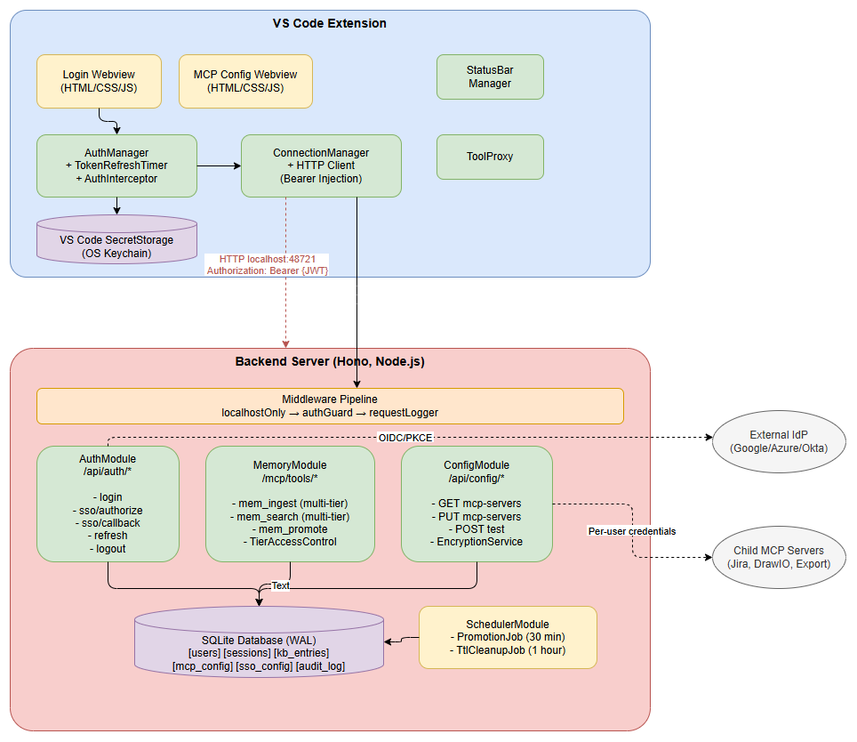
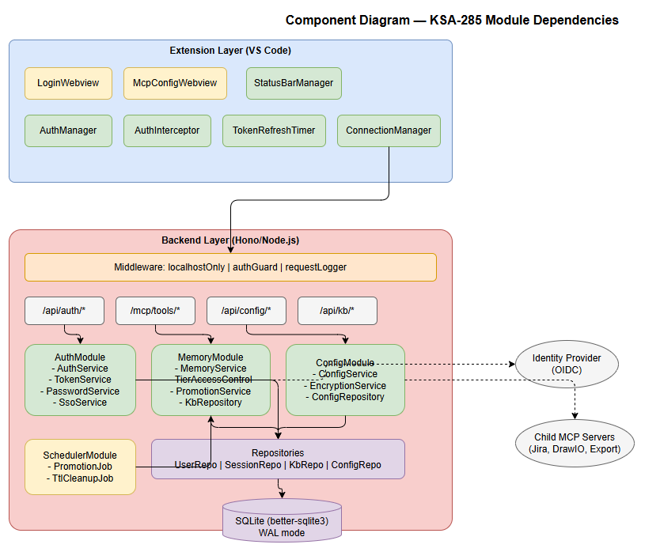
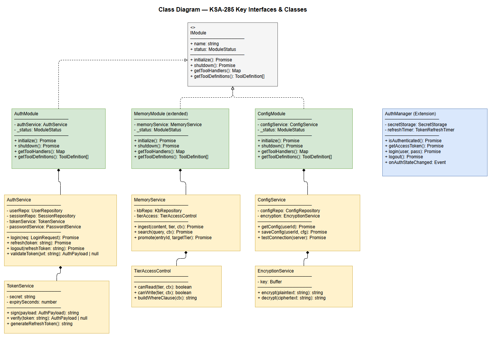

# Technical Design Document (TDD)

## Code Intelligence Extension — KSA-285: Authentication, Multi-Tenant KB, and MCP Server Configuration

---

## Document Information

| Field | Value |
|-------|-------|
| Jira Ticket | KSA-285 |
| Title | Authentication, Multi-Tenant KB, and MCP Server Configuration |
| Author | SA Agent |
| Version | 1.0 |
| Date | 2025-07-14 |
| Status | Draft |
| Architecture Pattern | Plugin (IDE Extension) |
| Related BRD | BRD-v1-KSA-285.docx |
| Related FSD | FSD-v1-KSA-285.docx |
| Parent Ticket | KSA-284 (Split Extension: Lightweight Proxy + Backend MCP Server) |

---

## Author Tracking

| Role | Name - Position | Responsibility |
|------|-----------------|----------------|
| Author | SA Agent – Solution Architect | Create document |
| Peer Reviewer | DEV Agent – Senior Developer | Review document |

---

## Revision History

| Version | Date | Author | Changes |
|---------|------|--------|---------|
| 1.0 | 2025-07-14 | SA Agent | Initiate document — auto-generated from BRD and FSD KSA-285 |

---

## Sign-Off

| Name | Signature and date |
|------|--------------------|
| | ☐ I agree and confirm the technical design in this TDD |
| | ☐ I agree and confirm the technical design in this TDD |

---

## 1. Introduction

> **Scope Boundary:** This TDD specifies HOW to implement the requirements defined in the FSD. It does NOT repeat functional requirements, business rules, use cases, or UI specifications — refer to the FSD for those. This document focuses on: technology choices, architecture decisions, implementation patterns, and deployment concerns.

### 1.1 Purpose

This TDD provides the technical design for adding Authentication, Multi-Tenant 3-Tier Knowledge Base, and MCP Server Configuration to the Code Intelligence Extension (KSA-284 split architecture). It details the implementation approach for:

1. **Auth Module** — JWT-based local auth + OpenID Connect SSO with PKCE in the Backend, token storage in VS Code SecretStorage in the Extension
2. **Multi-Tenant KB** — Extending the existing MemoryModule to support 3-tier isolation (User/Project/Shared) with auto-promotion
3. **Config Module** — Per-user MCP server credential management via Webview + Backend API

### 1.2 Scope

**Technical scope includes:**
- New AuthModule in Backend (src/backend/src/modules/auth/)
- New ConfigModule in Backend (src/backend/src/modules/config/)
- Extended MemoryModule for multi-tier KB support
- New auth middleware for Hono routes
- New Login Webview and MCP Config Webview in Extension
- SecretStorage integration and token refresh timer in Extension
- SQLite schema extensions (users, sessions, kb_entries enhancements, mcp_config, sso_config)
- Background job scheduler for KB promotion and TTL cleanup

### 1.3 Technology Stack

| Layer | Technology | Version | Notes |
|-------|-----------|---------|-------|
| Language | TypeScript | 5.5+ | Both Extension and Backend |
| Runtime | Node.js | 20+ | Backend server |
| HTTP Framework | Hono | 4.x | Lightweight, existing in Backend |
| Database | SQLite (better-sqlite3) | 12.x | Existing, synchronous driver |
| Extension Host | VS Code | >= 1.85.0 | SecretStorage API required |
| Build (Extension) | esbuild | 0.21+ | Existing bundler |
| Build (Backend) | tsc | 5.5+ | TypeScript compiler |
| Test | Vitest | 2.x+ | Existing test framework |
| JWT | jose | latest | JOSE library (already in node_modules) |
| PKCE | pkce-challenge | latest | Already in node_modules |
| Password Hashing | Node.js crypto (scrypt) | built-in | No external bcrypt needed |
| Encryption | Node.js crypto (AES-256-GCM) | built-in | For MCP config at-rest |
| Embedding | ONNX Runtime | 1.18.x | Existing for semantic search |
| Validation | Zod | 3.23+ | Existing in Backend |

### 1.4 Design Principles

- **Modular Architecture** — Each feature is an independent IModule registered in ModuleRegistry (existing pattern)
- **Secure by Default** — All endpoints require Bearer token; localhost-only binding retained
- **Zero External Dependencies** — Use Node.js built-in crypto for hashing/encryption; jose library already present
- **Non-Breaking Migration** — Existing mem_* tools continue working; tier parameter is additive
- **Graceful Degradation** — Auth failure shows Login Webview but doesn't crash IDE (BR-29)
- **Convention over Configuration** — Follow existing patterns from HttpServer.ts, ModuleRegistry.ts

### 1.5 Constraints

- Backend runs on localhost only — no TLS required (loopback interface)
- SQLite is single-writer — background jobs use WAL mode for concurrent reads
- VS Code SecretStorage is async and per-extension scope
- Extension must activate within 2 seconds (heavy ops are async/non-blocking)
- JWT secret is generated per Backend instance and stored locally (no distributed key management)

---

## 2. Architecture Overview

### 2.1 System Architecture

*[Edit in draw.io](diagrams/architecture.drawio)*

The system extends the KSA-284 split architecture (Extension Proxy + Backend Server) with three new modules:

`
┌──────────────────── VS Code Extension ────────────────────┐
│                                                            │
│  ┌─────────────┐  ┌──────────────┐  ┌─────────────────┐  │
│  │Login Webview│  │Config Webview│  │ Auth Interceptor │  │
│  └──────┬──────┘  └──────┬───────┘  └────────┬────────┘  │
│         │                │                    │            │
│  ┌──────┴────────────────┴────────────────────┴────────┐  │
│  │              SecretStorage Manager                   │  │
│  │     (JWT + Refresh Token + User Profile)            │  │
│  └─────────────────────┬──────────────────────────────┘  │
│                         │                                  │
│  ┌──────────────────────┴──────────────────────────────┐  │
│  │        ConnectionManager (HTTP Client)              │  │
│  │     + Bearer Token Injection (AuthInterceptor)      │  │
│  └──────────────────────┬──────────────────────────────┘  │
└─────────────────────────┼──────────────────────────────────┘
                          │ HTTP (localhost:48721)
┌─────────────────────────┼──────────────────────────────────┐
│                    Backend Server (Hono)                    │
│                                                            │
│  ┌──────────────────────────────────────────────────────┐  │
│  │  Middleware: localhostOnly → authGuard → requestLogger│ │
│  └──────────────────────────────────────────────────────┘  │
│                                                            │
│  ┌────────────┐  ┌──────────────┐  ┌──────────────────┐  │
│  │ AuthModule │  │ MemoryModule │  │  ConfigModule    │  │
│  │(auth/*)    │  │(mem_* tools) │  │(config/*)        │  │
│  │- login     │  │- multi-tier  │  │- mcp-servers     │  │
│  │- sso       │  │- promotion   │  │- test connection │  │
│  │- refresh   │  │- search      │  │- encryption      │  │
│  │- logout    │  │- TTL cleanup │  │                  │  │
│  └─────┬──────┘  └──────┬───────┘  └────────┬─────────┘  │
│        │                │                    │            │
│  ┌─────┴────────────────┴────────────────────┴─────────┐  │
│  │              SQLite Database (WAL mode)              │  │
│  │  [users] [sessions] [kb_entries] [mcp_config]       │  │
│  │  [sso_config]                                       │  │
│  └─────────────────────────────────────────────────────┘  │
│                                                            │
│  ┌──────────────────────────────────────────────────────┐  │
│  │       Background Scheduler                          │  │
│  │  - KB Promotion (every 30 min)                      │  │
│  │  - TTL Cleanup (every 1 hour)                       │  │
│  └──────────────────────────────────────────────────────┘  │
└────────────────────────────────────────────────────────────┘
`

### 2.2 Component Diagram

*[Edit in draw.io](diagrams/component.drawio)*

### 2.3 Request Flow (Authenticated)

`
Extension                    Backend
   │                            │
   │── POST /api/auth/login ──→ │ (no auth required)
   │←── 200 {jwt, refresh} ────│
   │                            │
   │── GET /mcp/tools/list ───→ │
   │   [Authorization: Bearer]  │
   │   authGuard validates JWT  │
   │←── 200 {tools} ──────────│
   │                            │
   │── POST /mcp/tools/call ──→ │
   │   [Bearer + tool args]     │
   │   authGuard → ToolRouter   │
   │←── 200 {result} ─────────│
`

---

## 3. API Design

### 3.1 Authentication APIs

All auth APIs are under /api/auth/*. Login and SSO authorize endpoints are **public** (no Bearer required). All others require valid JWT.

#### 3.1.1 POST /api/auth/login

**Implements:** UC-1 (Local Login), BR-2, BR-4, BR-5

`json
// Request
POST /api/auth/login
Content-Type: application/json

{
  "username": "john.doe",
  "password": "securePassword123"
}

// Success Response (200)
{
  "access_token": "eyJhbGciOiJIUzI1NiIs...",
  "refresh_token": "rt_a1b2c3d4e5f6...",
  "token_type": "Bearer",
  "expires_in": 3600,
  "user": {
    "id": "550e8400-e29b-41d4-a716-446655440000",
    "username": "john.doe",
    "email": "john.doe@company.com",
    "display_name": "John Doe",
    "role": "user",
    "projects": ["proj-frontend", "proj-backend"]
  }
}

// Error Responses
// 401 - Invalid credentials
{
  "error": {
    "code": "AUTH_INVALID_CREDENTIALS",
    "message": "Invalid username or password."
  }
}

// 403 - Account locked
{
  "error": {
    "code": "AUTH_ACCOUNT_LOCKED",
    "message": "Account locked. Try again in 12 minutes.",
    "details": { "locked_until": "2025-07-14T10:15:00Z", "remaining_minutes": 12 }
  }
}
`

**Validation (Zod schema):**
`	ypescript
const LoginSchema = z.object({
  username: z.string().min(1).max(100).regex(/^[a-zA-Z0-9._]+$/),
  password: z.string().min(8).max(128),
});
`

#### 3.1.2 POST /api/auth/sso/authorize

**Implements:** UC-2 (SSO Login), BR-6

`json
// Request
POST /api/auth/sso/authorize
Content-Type: application/json

{
  "code_challenge": "E9Melhoa2OwvFrEMTJguCHaoeK1t8URWbuGJSstw-cM",
  "redirect_uri": "http://localhost:48721/api/auth/sso/callback"
}

// Success Response (200)
{
  "authorization_url": "https://accounts.google.com/o/oauth2/v2/auth?client_id=...&response_type=code&scope=openid+email+profile&code_challenge=...&code_challenge_method=S256&state=xyz123&redirect_uri=...",
  "state": "xyz123"
}
`

#### 3.1.3 GET /api/auth/sso/callback

**Implements:** UC-2 Steps 9-14, BR-6, BR-7

`
// Browser redirects to:
GET /api/auth/sso/callback?code=AUTH_CODE_HERE&state=xyz123

// Backend processes internally, then signals Extension via:
// Option A: Returns HTML page that posts message to Extension
// Option B: Extension polls GET /api/auth/sso/token?state=xyz123

// Poll Response (200) — when token ready
{
  "access_token": "eyJhbGciOiJIUzI1NiIs...",
  "refresh_token": "rt_x1y2z3...",
  "token_type": "Bearer",
  "expires_in": 3600,
  "user": { ... }
}

// Poll Response (202) — still processing
{
  "status": "pending"
}
`

#### 3.1.4 POST /api/auth/refresh

**Implements:** UC-3 (Token Refresh), BR-3, BR-8

`json
// Request (requires current valid JWT OR expired JWT with valid refresh)
POST /api/auth/refresh
Content-Type: application/json

{
  "refresh_token": "rt_a1b2c3d4e5f6..."
}

// Success Response (200)
{
  "access_token": "eyJhbGciOiJIUzI1NiIs...(new)",
  "refresh_token": "rt_newtoken...",
  "token_type": "Bearer",
  "expires_in": 3600
}

// Error (401) - Refresh token expired/revoked
{
  "error": {
    "code": "AUTH_REFRESH_INVALID",
    "message": "Refresh token expired or revoked. Please log in again."
  }
}
`

#### 3.1.5 POST /api/auth/logout

**Implements:** UC-10 (Logout), BR-18

`json
// Request (requires valid JWT)
POST /api/auth/logout
Authorization: Bearer {jwt}
Content-Type: application/json

{
  "refresh_token": "rt_a1b2c3d4e5f6..."
}

// Success Response (200)
{
  "message": "Logged out successfully"
}
`

### 3.2 KB APIs (Multi-Tier Extensions)

The existing mem_* MCP tool calls are routed via POST /mcp/tools/call. The multi-tier extensions add **tier** and **project** parameters to existing tools.

#### 3.2.1 mem_ingest (Extended)

`json
// Request via MCP tools/call
{
  "name": "mem_ingest",
  "arguments": {
    "title": "API Authentication Pattern",
    "content": "JWT-based auth with refresh tokens...",
    "tags": "authentication,pattern,project-relevant",
    "tier": 2,
    "project": "proj-frontend"
  }
}

// tier is optional (defaults to 1 = User KB)
// project is required when tier=2
`

#### 3.2.2 mem_search (Extended)

`json
// Request
{
  "name": "mem_search",
  "arguments": {
    "query": "authentication pattern",
    "limit": 10,
    "tier_filter": [1, 2, 3]
  }
}

// Response
{
  "content": [{
    "type": "text",
    "text": "Found 5 results across 3 tiers:\n\n[Personal] API Auth Pattern (score: 0.92)\n[Project: frontend] JWT Refresh Flow (score: 0.87)\n[Shared] OAuth2 Best Practices (score: 0.81)\n..."
  }]
}
`

#### 3.2.3 POST /api/kb/promote (New)

**Implements:** UC-7/UC-8 manual promotion (AF-1)

`json
// Request (requires admin role or entry owner)
POST /api/kb/promote
Authorization: Bearer {jwt}
Content-Type: application/json

{
  "entry_id": "550e8400-e29b-41d4-a716-446655440000",
  "target_tier": 2,
  "project_id": "proj-frontend"
}

// Success Response (200)
{
  "promoted_entry_id": "new-uuid-in-target-tier",
  "source_entry_id": "550e8400-...",
  "from_tier": 1,
  "to_tier": 2,
  "promoted_at": "2025-07-14T10:00:00Z"
}
`

### 3.3 Configuration APIs

#### 3.3.1 GET /api/config/mcp-servers

**Implements:** UC-9 Steps 3-4, BR-17

`json
// Request
GET /api/config/mcp-servers
Authorization: Bearer {jwt}

// Response (200)
{
  "servers": {
    "jira": {
      "url": "https://company.atlassian.net",
      "username": "john.doe@company.com",
      "token_configured": true,
      "project_key": "KSA"
    },
    "drawio": {
      "path": "C:\\Program Files\\draw.io\\draw.io.exe",
      "format": "png"
    },
    "export": {
      "output_dir": "./documents"
    }
  },
  "last_updated": "2025-07-14T09:00:00Z"
}
`

**Note:** Sensitive fields (token, password) return *_configured: true/false — NEVER plaintext (BR-17).

#### 3.3.2 PUT /api/config/mcp-servers

**Implements:** UC-9 Steps 8-12, BR-16

`json
// Request
PUT /api/config/mcp-servers
Authorization: Bearer {jwt}
Content-Type: application/json

{
  "jira": {
    "url": "https://company.atlassian.net",
    "username": "john.doe@company.com",
    "token": "ATATT3xFfGF0...",
    "project_key": "KSA"
  },
  "drawio": {
    "path": "C:\\Program Files\\draw.io\\draw.io.exe",
    "format": "png"
  },
  "export": {
    "output_dir": "./documents"
  }
}

// Success Response (200)
{
  "message": "Configuration saved",
  "updated_at": "2025-07-14T10:00:00Z"
}
`

#### 3.3.3 POST /api/config/mcp-servers/test

**Implements:** UC-9 AF-1

`json
// Request
POST /api/config/mcp-servers/test
Authorization: Bearer {jwt}
Content-Type: application/json

{
  "server": "jira"
}

// Success (200)
{
  "server": "jira",
  "status": "success",
  "message": "Connected to Jira (version 9.x). User: john.doe@company.com"
}

// Failure (200 with status=failed)
{
  "server": "jira",
  "status": "failed",
  "message": "Connection failed: 401 Unauthorized. Check API token."
}
`

---

## 4. Database Design

### 4.1 Schema Overview

All tables reside in the existing SQLite database (.code-intel/index.db). Using WAL mode for concurrent read access.

### 4.2 DDL Scripts

`sql
-- Enable WAL mode for concurrent access
PRAGMA journal_mode = WAL;
PRAGMA busy_timeout = 5000;

-- ============================================
-- Table: users
-- Implements: FSD §4.2 Entity: users, BR-4, BR-5, BR-7
-- ============================================
CREATE TABLE IF NOT EXISTS users (
  id TEXT PRIMARY KEY DEFAULT (lower(hex(randomblob(4)) || '-' || hex(randomblob(2)) || '-4' || substr(hex(randomblob(2)),2) || '-' || substr('89ab', abs(random()) % 4 + 1, 1) || substr(hex(randomblob(2)),2) || '-' || hex(randomblob(6)))),
  username TEXT NOT NULL UNIQUE,
  email TEXT NOT NULL UNIQUE,
  display_name TEXT,
  password_hash TEXT,  -- scrypt hash, NULL for SSO-only users
  role TEXT NOT NULL DEFAULT 'user' CHECK (role IN ('user', 'admin')),
  sso_provider TEXT,
  sso_subject TEXT,
  projects TEXT NOT NULL DEFAULT '[]',  -- JSON array of project IDs
  failed_attempts INTEGER NOT NULL DEFAULT 0,
  locked_until TEXT,  -- ISO 8601 timestamp
  created_at TEXT NOT NULL DEFAULT (datetime('now')),
  updated_at TEXT NOT NULL DEFAULT (datetime('now'))
);

CREATE INDEX idx_users_username ON users(username);
CREATE INDEX idx_users_email ON users(email);
CREATE INDEX idx_users_sso ON users(sso_provider, sso_subject);

-- ============================================
-- Table: sessions
-- Implements: FSD §4.2 Entity: sessions, BR-3, BR-18
-- ============================================
CREATE TABLE IF NOT EXISTS sessions (
  id TEXT PRIMARY KEY DEFAULT (lower(hex(randomblob(4)) || '-' || hex(randomblob(2)) || '-4' || substr(hex(randomblob(2)),2) || '-' || substr('89ab', abs(random()) % 4 + 1, 1) || substr(hex(randomblob(2)),2) || '-' || hex(randomblob(6)))),
  user_id TEXT NOT NULL REFERENCES users(id) ON DELETE CASCADE,
  refresh_token_hash TEXT NOT NULL,  -- SHA-256 hash of refresh token
  issued_at TEXT NOT NULL DEFAULT (datetime('now')),
  expires_at TEXT NOT NULL,
  revoked INTEGER NOT NULL DEFAULT 0,
  revoked_at TEXT,
  user_agent TEXT,
  created_at TEXT NOT NULL DEFAULT (datetime('now'))
);

CREATE INDEX idx_sessions_user_id ON sessions(user_id);
CREATE INDEX idx_sessions_refresh_token ON sessions(refresh_token_hash);
CREATE INDEX idx_sessions_expires ON sessions(expires_at) WHERE revoked = 0;

-- ============================================
-- Table: kb_entries (Extended for multi-tier)
-- Implements: FSD §4.2 Entity: kb_entries, BR-9 through BR-14
-- Note: This ALTERs existing table or creates new if fresh install
-- ============================================
CREATE TABLE IF NOT EXISTS kb_entries (
  id TEXT PRIMARY KEY,
  tier INTEGER NOT NULL DEFAULT 1 CHECK (tier IN (1, 2, 3)),
  owner_id TEXT NOT NULL REFERENCES users(id),
  project_id TEXT,  -- Required for tier=2
  title TEXT,
  content TEXT NOT NULL,
  content_hash TEXT NOT NULL,  -- SHA-256 for deduplication
  embedding BLOB,  -- 384-dim float32 vector
  tags TEXT DEFAULT '[]',  -- JSON array
  quality_score REAL DEFAULT 0.0,
  ttl_days INTEGER,  -- Only for tier=1 (NULL = no expiry)
  promoted INTEGER NOT NULL DEFAULT 0,
  promoted_from TEXT REFERENCES kb_entries(id),
  promoted_by TEXT REFERENCES users(id),
  referenced_by_projects TEXT DEFAULT '[]',  -- JSON array
  admin_promoted INTEGER NOT NULL DEFAULT 0,
  created_at TEXT NOT NULL DEFAULT (datetime('now')),
  updated_at TEXT NOT NULL DEFAULT (datetime('now'))
);

-- Tier-based access indexes
CREATE INDEX idx_kb_tier_owner ON kb_entries(tier, owner_id) WHERE tier = 1;
CREATE INDEX idx_kb_tier_project ON kb_entries(tier, project_id) WHERE tier = 2;
CREATE INDEX idx_kb_tier3 ON kb_entries(tier) WHERE tier = 3;
CREATE INDEX idx_kb_promotion ON kb_entries(tier, promoted) WHERE promoted = 0;
CREATE INDEX idx_kb_ttl ON kb_entries(tier, ttl_days, created_at) WHERE tier = 1 AND ttl_days IS NOT NULL;
CREATE INDEX idx_kb_content_hash ON kb_entries(content_hash);

-- ============================================
-- Table: mcp_config
-- Implements: FSD §4.2 Entity: mcp_config, BR-16
-- ============================================
CREATE TABLE IF NOT EXISTS mcp_config (
  id TEXT PRIMARY KEY DEFAULT (lower(hex(randomblob(4)) || '-' || hex(randomblob(2)) || '-4' || substr(hex(randomblob(2)),2) || '-' || substr('89ab', abs(random()) % 4 + 1, 1) || substr(hex(randomblob(2)),2) || '-' || hex(randomblob(6)))),
  user_id TEXT NOT NULL REFERENCES users(id) ON DELETE CASCADE,
  server_name TEXT NOT NULL CHECK (server_name IN ('jira', 'drawio', 'export')),
  config_data TEXT NOT NULL,  -- JSON with sensitive fields AES-256-GCM encrypted
  created_at TEXT NOT NULL DEFAULT (datetime('now')),
  updated_at TEXT NOT NULL DEFAULT (datetime('now')),
  UNIQUE(user_id, server_name)
);

CREATE INDEX idx_mcp_config_user ON mcp_config(user_id);

-- ============================================
-- Table: sso_config
-- Implements: FSD §4.2 Entity: sso_config, BR-6, BR-27
-- ============================================
CREATE TABLE IF NOT EXISTS sso_config (
  id TEXT PRIMARY KEY DEFAULT (lower(hex(randomblob(4)) || '-' || hex(randomblob(2)) || '-4' || substr(hex(randomblob(2)),2) || '-' || substr('89ab', abs(random()) % 4 + 1, 1) || substr(hex(randomblob(2)),2) || '-' || hex(randomblob(6)))),
  issuer_url TEXT NOT NULL,
  client_id TEXT NOT NULL,
  allowed_domains TEXT NOT NULL DEFAULT '[]',  -- JSON array
  redirect_uri TEXT NOT NULL,
  enabled INTEGER NOT NULL DEFAULT 1,
  created_at TEXT NOT NULL DEFAULT (datetime('now'))
);

-- ============================================
-- Table: audit_log (lightweight)
-- Implements: FSD §7.3
-- ============================================
CREATE TABLE IF NOT EXISTS audit_log (
  id INTEGER PRIMARY KEY AUTOINCREMENT,
  event_type TEXT NOT NULL,
  user_id TEXT,
  details TEXT,  -- JSON
  created_at TEXT NOT NULL DEFAULT (datetime('now'))
);

CREATE INDEX idx_audit_event_type ON audit_log(event_type, created_at);
CREATE INDEX idx_audit_user ON audit_log(user_id, created_at);
`

### 4.3 Migration Strategy

`	ypescript
// src/backend/src/database/migrations/002-auth-multitenant.ts
export const MIGRATION_002 = {
  version: 2,
  name: 'auth-multitenant-kb',
  up: (db: Database) => {
    db.exec(DDL_SCRIPT); // Above DDL
  },
  down: (db: Database) => {
    db.exec('DROP TABLE IF EXISTS audit_log');
    db.exec('DROP TABLE IF EXISTS sso_config');
    db.exec('DROP TABLE IF EXISTS mcp_config');
    db.exec('DROP TABLE IF EXISTS sessions');
    db.exec('DROP TABLE IF EXISTS users');
    // kb_entries columns handled separately
  }
};
`

### 4.4 Key Query Patterns

| Operation | Query | Expected Performance |
|-----------|-------|---------------------|
| Login lookup | SELECT * FROM users WHERE username = ? | < 1ms (indexed) |
| Session validate | SELECT * FROM sessions WHERE refresh_token_hash = ? AND revoked = 0 AND expires_at > datetime('now') | < 1ms |
| User KB entries | SELECT * FROM kb_entries WHERE tier = 1 AND owner_id = ? | < 5ms |
| Project KB entries | SELECT * FROM kb_entries WHERE tier = 2 AND project_id IN (...) | < 10ms |
| Shared KB entries | SELECT * FROM kb_entries WHERE tier = 3 | < 10ms |
| TTL cleanup | DELETE FROM kb_entries WHERE tier = 1 AND ttl_days IS NOT NULL AND datetime(created_at, '+' \|\| ttl_days \|\| ' days') < datetime('now') | Background, < 100ms |
| Promotion candidates | SELECT * FROM kb_entries WHERE tier = 1 AND promoted = 0 AND quality_score > 0.8 | Background, < 50ms |

---

## 5. Class/Module Design

### 5.1 Package Structure

`
src/backend/src/
├── config/
│   └── BackendConfig.ts          (existing, extended with auth config)
├── database/
│   ├── DatabaseManager.ts        (NEW - SQLite connection + migration runner)
│   └── migrations/
│       ├── 001-initial.ts        (existing)
│       └── 002-auth-multitenant.ts (NEW)
├── modules/
│   ├── ModuleRegistry.ts         (existing)
│   ├── auth/                     (NEW MODULE)
│   │   ├── AuthModule.ts         (IModule implementation)
│   │   ├── AuthService.ts        (business logic)
│   │   ├── TokenService.ts       (JWT sign/verify/refresh)
│   │   ├── PasswordService.ts    (scrypt hash/verify)
│   │   ├── SsoService.ts         (OIDC + PKCE flow)
│   │   ├── SessionRepository.ts  (sessions CRUD)
│   │   ├── UserRepository.ts     (users CRUD)
│   │   └── types.ts              (auth-specific types)
│   ├── config/                   (NEW MODULE)
│   │   ├── ConfigModule.ts       (IModule implementation)
│   │   ├── ConfigService.ts      (business logic)
│   │   ├── EncryptionService.ts  (AES-256-GCM)
│   │   ├── ConfigRepository.ts   (mcp_config CRUD)
│   │   └── types.ts              (config-specific types)
│   ├── memory/                   (EXTENDED)
│   │   ├── MemoryModule.ts       (extended tool definitions)
│   │   ├── MemoryService.ts      (NEW - multi-tier business logic)
│   │   ├── TierAccessControl.ts  (NEW - tier visibility rules)
│   │   ├── PromotionService.ts   (NEW - auto-promotion logic)
│   │   ├── KbRepository.ts       (NEW - kb_entries CRUD)
│   │   └── types.ts              (NEW - KB-specific types)
│   ├── scheduler/                (NEW MODULE)
│   │   ├── SchedulerModule.ts    (IModule, manages cron jobs)
│   │   ├── PromotionJob.ts       (30-min promotion check)
│   │   └── TtlCleanupJob.ts     (1-hour TTL cleanup)
│   └── ...existing modules...
├── server/
│   ├── HttpServer.ts             (existing, register new routes)
│   ├── middleware/
│   │   ├── auth-guard.ts         (NEW - JWT validation middleware)
│   │   ├── error-handler.ts      (existing, extended error codes)
│   │   ├── localhost-only.ts     (existing)
│   │   └── request-logger.ts     (existing)
│   └── routes/
│       ├── auth.ts               (NEW - /api/auth/* routes)
│       ├── config.ts             (NEW - /api/config/* routes)
│       ├── kb.ts                 (NEW - /api/kb/* routes)
│       ├── api.ts                (existing, extended)
│       ├── health.ts             (existing)
│       └── tools.ts              (existing)
├── tools/
│   ├── ToolRouter.ts             (existing, now passes userId context)
│   └── ToolValidator.ts          (existing)
└── types/
    ├── module.ts                 (existing)
    └── tool.ts                   (existing, extended with context)

src/extension/src/
├── auth/                         (NEW)
│   ├── AuthManager.ts            (token lifecycle, SecretStorage)
│   ├── AuthInterceptor.ts        (Bearer token injection)
│   └── TokenRefreshTimer.ts      (auto-refresh scheduler)
├── config/
│   └── ConfigurationManager.ts   (existing)
├── connection/
│   └── ConnectionManager.ts      (existing, extended with auth)
├── proxy/
│   └── ToolProxy.ts              (existing)
├── ui/
│   ├── StatusBarManager.ts       (existing, extended with auth state)
│   └── NotificationManager.ts    (existing)
├── webview/
│   ├── WebviewManager.ts         (existing, extended)
│   ├── LoginWebview.ts           (NEW)
│   └── McpConfigWebview.ts       (NEW)
├── types/
│   └── config.ts                 (existing, extended)
└── extension.ts                  (existing, extended with auth init)
`

### 5.2 Key Interfaces

`	ypescript
// ===== Backend Auth Module =====

// src/backend/src/modules/auth/types.ts
export interface AuthPayload {
  userId: string;
  username: string;
  email: string;
  role: 'user' | 'admin';
  projects: string[];
  iat: number;
  exp: number;
}

export interface LoginRequest {
  username: string;
  password: string;
}

export interface TokenPair {
  access_token: string;
  refresh_token: string;
  token_type: 'Bearer';
  expires_in: number;
}

export interface UserRecord {
  id: string;
  username: string;
  email: string;
  display_name: string | null;
  password_hash: string | null;
  role: 'user' | 'admin';
  sso_provider: string | null;
  sso_subject: string | null;
  projects: string[];
  failed_attempts: number;
  locked_until: string | null;
  created_at: string;
  updated_at: string;
}

// ===== Backend Memory Module (Extended) =====

// src/backend/src/modules/memory/types.ts
export interface KbEntry {
  id: string;
  tier: 1 | 2 | 3;
  owner_id: string;
  project_id: string | null;
  title: string | null;
  content: string;
  content_hash: string;
  embedding: Buffer | null;
  tags: string[];
  quality_score: number;
  ttl_days: number | null;
  promoted: boolean;
  promoted_from: string | null;
  promoted_by: string | null;
  referenced_by_projects: string[];
  created_at: string;
  updated_at: string;
}

export interface SearchResult {
  entry: KbEntry;
  similarity: number;
  boosted_score: number;
  tier_badge: string;  // "[Personal]" | "[Project: name]" | "[Shared]"
}

export interface TierAccessContext {
  userId: string;
  projects: string[];
  role: 'user' | 'admin';
}

// ===== Extension Auth =====

// src/extension/src/auth/AuthManager.ts
export interface IAuthManager {
  isAuthenticated(): Promise<boolean>;
  getAccessToken(): Promise<string | null>;
  login(username: string, password: string): Promise<void>;
  loginSso(): Promise<void>;
  logout(): Promise<void>;
  onAuthStateChanged: vscode.Event<AuthState>;
}

export type AuthState = 'authenticated' | 'unauthenticated' | 'refreshing';
`

### 5.3 Class Diagram

*[Edit in draw.io](diagrams/class-diagram.drawio)*

### 5.4 Design Patterns

| Pattern | Usage | Location |
|---------|-------|----------|
| **Module (Registry)** | Each feature is an IModule registered in ModuleRegistry | Existing pattern, new modules follow |
| **Middleware Chain** | authGuard inserted in Hono middleware pipeline | server/middleware/auth-guard.ts |
| **Repository** | Data access abstraction for each table | UserRepository, SessionRepository, KbRepository, ConfigRepository |
| **Service Layer** | Business logic isolated from HTTP handlers | AuthService, MemoryService, ConfigService |
| **Strategy** | Tier-based access control rules | TierAccessControl.ts |
| **Observer** | Extension emits auth state changes, UI subscribes | AuthManager.onAuthStateChanged |
| **Scheduler** | Background jobs for promotion/cleanup | SchedulerModule with setInterval |

### 5.5 Dependency Injection

No DI framework — manual constructor injection (existing pattern):

`	ypescript
// In Backend index.ts (startup)
const db = new DatabaseManager(config.dbPath);
const userRepo = new UserRepository(db);
const sessionRepo = new SessionRepository(db);
const tokenService = new TokenService(config.jwtSecret);
const passwordService = new PasswordService();
const authService = new AuthService(userRepo, sessionRepo, tokenService, passwordService);
const authModule = new AuthModule(authService);

moduleRegistry.register(authModule);
`

---

## 6. Security Design

### 6.1 Authentication Flow

**Local Auth:**
1. Extension submits credentials over localhost HTTP (loopback — no network exposure)
2. Backend validates password via scrypt (time-cost=2^14, blockSize=8, parallelism=1, keyLen=64)
3. Backend checks lockout (failed_attempts >= 5 AND locked_until > now)
4. On success: generate JWT (HS256, 1h) + refresh token (crypto.randomBytes(32).toString('hex'), 7d)
5. Store refresh token hash (SHA-256) in sessions table
6. Extension stores tokens in VS Code SecretStorage

**SSO (OIDC + PKCE):**
1. Extension generates code_verifier = crypto.randomBytes(32).toString('base64url')
2. Extension computes code_challenge = SHA256(code_verifier).toString('base64url')
3. Backend constructs IdP authorization URL with challenge
4. Browser authenticates with IdP → callback to Backend
5. Backend exchanges code + verifier for IdP tokens
6. Backend validates IdP tokens, extracts claims, auto-provisions user
7. Backend issues own JWT (decoupled from IdP token lifetime)

### 6.2 JWT Structure

`json
{
  "alg": "HS256",
  "typ": "JWT"
}
.
{
  "sub": "550e8400-e29b-41d4-a716-446655440000",
  "username": "john.doe",
  "email": "john.doe@company.com",
  "role": "user",
  "projects": ["proj-frontend", "proj-backend"],
  "iat": 1720958400,
  "exp": 1720962000
}
`

**JWT Secret Management:**
- Generated on first Backend start: crypto.randomBytes(64).toString('hex')
- Stored in .code-intel/jwt-secret.key (file permissions: owner-only)
- Rotated manually by admin (restart required)

### 6.3 Auth Guard Middleware

`	ypescript
// src/backend/src/server/middleware/auth-guard.ts
import { Context, Next } from 'hono';
import { TokenService } from '../../modules/auth/TokenService';

const PUBLIC_PATHS = ['/health', '/api/auth/login', '/api/auth/sso/authorize', '/api/auth/sso/callback'];

export function createAuthGuard(tokenService: TokenService) {
  return async (c: Context, next: Next) => {
    const path = c.req.path;

    // Skip auth for public endpoints
    if (PUBLIC_PATHS.some(p => path.startsWith(p))) {
      return next();
    }

    const authHeader = c.req.header('Authorization');
    if (!authHeader?.startsWith('Bearer ')) {
      return c.json({ error: { code: 'AUTH_TOKEN_MISSING', message: 'Authorization header required' } }, 401);
    }

    const token = authHeader.slice(7);
    const payload = tokenService.verify(token);

    if (!payload) {
      return c.json({ error: { code: 'AUTH_TOKEN_EXPIRED', message: 'Token expired or invalid' } }, 401);
    }

    // Attach user context for downstream handlers
    c.set('user', payload);
    return next();
  };
}
`

### 6.4 Encryption at Rest (MCP Config)

`	ypescript
// AES-256-GCM for sensitive config fields
import { createCipheriv, createDecipheriv, randomBytes } from 'crypto';

const ALGORITHM = 'aes-256-gcm';
const KEY_LENGTH = 32; // 256 bits

export class EncryptionService {
  private key: Buffer;

  constructor(encryptionKey: string) {
    // Derive 32-byte key from config secret
    this.key = crypto.scryptSync(encryptionKey, 'mcp-config-salt', KEY_LENGTH);
  }

  encrypt(plaintext: string): string {
    const iv = randomBytes(16);
    const cipher = createCipheriv(ALGORITHM, this.key, iv);
    const encrypted = Buffer.concat([cipher.update(plaintext, 'utf8'), cipher.final()]);
    const authTag = cipher.getAuthTag();
    // Format: base64(iv:authTag:ciphertext)
    return Buffer.concat([iv, authTag, encrypted]).toString('base64');
  }

  decrypt(ciphertext: string): string {
    const data = Buffer.from(ciphertext, 'base64');
    const iv = data.subarray(0, 16);
    const authTag = data.subarray(16, 32);
    const encrypted = data.subarray(32);
    const decipher = createDecipheriv(ALGORITHM, this.key, iv);
    decipher.setAuthTag(authTag);
    return decipher.update(encrypted) + decipher.final('utf8');
  }
}
`

### 6.5 Data Isolation Rules

| Tier | Access Rule | Enforcement Layer |
|------|------------|-------------------|
| Tier 1 (User) | owner_id = JWT.sub | SQL WHERE clause + TierAccessControl |
| Tier 2 (Project) | project_id IN JWT.projects[] | SQL WHERE clause + TierAccessControl |
| Tier 3 (Shared) | All authenticated users | Auth guard ensures authentication |

---

## 7. Error Handling

### 7.1 Error Response Format

`	ypescript
// Standard error response (extends existing error-handler.ts pattern)
interface ErrorResponse {
  error: {
    code: string;       // Machine-readable error code
    message: string;    // Human-readable message
    details?: Record<string, unknown>; // Additional context
  };
}
`

### 7.2 Error Codes Registry

| Code | HTTP | Module | Recovery |
|------|------|--------|----------|
| AUTH_INVALID_CREDENTIALS | 401 | Auth | Re-enter credentials |
| AUTH_ACCOUNT_LOCKED | 403 | Auth | Wait for lockout period |
| AUTH_TOKEN_MISSING | 401 | Auth | Include Bearer token |
| AUTH_TOKEN_EXPIRED | 401 | Auth | Refresh or re-login |
| AUTH_REFRESH_INVALID | 401 | Auth | Re-login required |
| AUTH_SSO_TIMEOUT | 408 | Auth | Retry SSO flow |
| AUTH_SSO_DOMAIN_REJECTED | 403 | Auth | Contact admin |
| AUTH_SSO_PROVIDER_ERROR | 502 | Auth | Try local login |
| KB_CONTENT_TOO_SHORT | 422 | Memory | Provide longer content |
| KB_CAPACITY_EXCEEDED | 507 | Memory | Delete entries or promote |
| KB_ACCESS_DENIED | 403 | Memory | Use own KB or Shared |
| KB_PROJECT_NOT_MEMBER | 403 | Memory | Join project or use correct project |
| CONFIG_INVALID_URL | 422 | Config | Fix URL format |
| CONFIG_TEST_FAILED | 502 | Config | Check credentials/URL |
| CONFIG_SAVE_FAILED | 500 | Config | Retry later |
| BACKEND_UNAVAILABLE | 503 | Server | Start Backend, retry |

### 7.3 Exception Hierarchy

`	ypescript
// src/backend/src/types/errors.ts
export class AppError extends Error {
  constructor(
    public readonly code: string,
    message: string,
    public readonly httpStatus: number = 500,
    public readonly details?: Record<string, unknown>
  ) {
    super(message);
    this.name = 'AppError';
  }
}

export class AuthError extends AppError {
  constructor(code: string, message: string, status: 401 | 403 = 401) {
    super(code, message, status);
    this.name = 'AuthError';
  }
}

export class ValidationError extends AppError {
  constructor(code: string, message: string, details?: Record<string, unknown>) {
    super(code, message, 422, details);
    this.name = 'ValidationError';
  }
}

export class KbError extends AppError {
  constructor(code: string, message: string, status: number = 403) {
    super(code, message, status);
    this.name = 'KbError';
  }
}
`

### 7.4 Updated Error Handler

`	ypescript
// Extended error-handler.ts
export function errorHandler(err: Error, c: Context): Response {
  console.error('[ErrorHandler]', err.message);

  if (err instanceof AppError) {
    return c.json({
      error: { code: err.code, message: err.message, details: err.details }
    }, err.httpStatus as any);
  }

  if (err instanceof HTTPException) {
    return c.json({ error: { code: 'HTTP_ERROR', message: err.message } }, err.status);
  }

  return c.json({ error: { code: 'INTERNAL_ERROR', message: 'An unexpected error occurred' } }, 500);
}
`

---

## 8. Performance & Scalability

### 8.1 Caching Strategy

| Cache | Location | TTL | Eviction | Purpose |
|-------|----------|-----|----------|---------|
| JWT payload (verified) | Backend in-memory Map | 5 min | LRU (max 200) | Avoid re-parsing JWT on every request |
| User record | Backend in-memory Map | 5 min | LRU (max 100) | Reduce DB lookups for role/projects |
| KB embedding model | Backend singleton | App lifetime | None | ONNX model loaded once |
| Search results | None (real-time) | — | — | Always fresh results |

### 8.2 Connection Pooling

SQLite with better-sqlite3 is synchronous and uses a single connection. Concurrency is managed via:
- **WAL mode**: Multiple concurrent readers, single writer
- **busy_timeout = 5000ms**: Writer retries for 5s before failing
- **No connection pool needed** (SQLite limitation/feature)

### 8.3 Performance Targets

| Operation | Target | Approach |
|-----------|--------|----------|
| Login (local) | < 300ms | scrypt fast params + indexed lookup |
| Token refresh | < 50ms | JWT verify + new sign (in-memory) |
| KB ingest | < 100ms | Async embedding computation |
| KB search (all tiers) | < 500ms | Parallel tier queries + vector cosine similarity |
| MCP config save | < 100ms | Direct SQLite write |
| Promotion job (30 min) | < 5s | Batch query + batch insert |
| TTL cleanup (1 hour) | < 2s | Single DELETE with condition |

### 8.4 Scalability Limits

| Resource | Limit | Rationale |
|----------|-------|-----------|
| Concurrent users | 100 | SQLite single-writer, localhost only |
| User KB entries | 10,000/user | Vector search performance |
| Project KB entries | 100,000/project | SQLite row scan limits |
| Shared KB entries | 50,000 | Company-wide ceiling |
| Active sessions | Unlimited | Lightweight table rows |
| Embedding dimensions | 384 | ONNX model constraint |

---

## 9. Monitoring & Observability

### 9.1 Logging Standards

Using pino (existing dependency) with structured JSON logging:

`	ypescript
// Log levels by category
// ERROR: Auth failures, DB errors, unhandled exceptions
// WARN: Account lockouts, capacity nearing limits, slow queries
// INFO: Login/logout events, promotion events, config changes
// DEBUG: Request details, query plans, timer events

logger.info({ userId, event: 'login_success', method: 'local' }, 'User authenticated');
logger.warn({ username, attempts: 5, locked_until }, 'Account locked');
logger.error({ code: 'DB_ERROR', table: 'kb_entries' }, 'Database write failed');
`

### 9.2 Health Check Extension

`	ypescript
// Extended /health response
{
  "status": "healthy",
  "version": "1.0.0",
  "modules": {
    "auth": "ready",
    "memory": "ready",
    "config": "ready",
    "scheduler": "ready"
  },
  "database": {
    "status": "connected",
    "wal_mode": true,
    "users_count": 5,
    "kb_entries_count": 12500,
    "active_sessions": 3
  },
  "uptime_seconds": 3600
}
`

### 9.3 Audit Events

| Event | Fields Logged | Retention |
|-------|--------------|-----------|
| login_success | userId, method, timestamp | 90 days |
| login_failure | username, reason, IP, timestamp | 90 days |
| account_locked | username, failed_count, locked_until | 90 days |
| logout | userId, timestamp | 30 days |
| kb_promoted | entry_id, from_tier, to_tier, criteria | Permanent |
| kb_ttl_deleted | entry_id, owner_id, age_days | 30 days |
| config_changed | userId, server_name, timestamp | 90 days |

---

## 10. Deployment & Configuration

### 10.1 Configuration Extensions

`	ypescript
// Extended BackendConfig
export interface BackendConfig {
  // Existing
  port: number;
  host: string;
  dbPath: string;
  modelsPath: string;
  orchestrationConfigPath: string;
  logLevel: 'debug' | 'info' | 'warn' | 'error';

  // NEW: Auth config
  jwtSecret: string;          // Auto-generated if not set
  jwtExpirySeconds: number;   // Default: 3600 (1h)
  refreshExpiryDays: number;  // Default: 7
  lockoutAttempts: number;    // Default: 5
  lockoutMinutes: number;     // Default: 15

  // NEW: SSO config
  ssoEnabled: boolean;        // Default: false
  ssoIssuerUrl?: string;
  ssoClientId?: string;
  ssoAllowedDomains?: string[];

  // NEW: Encryption
  encryptionKey: string;      // Auto-generated if not set

  // NEW: Scheduler
  promotionIntervalMs: number;  // Default: 1800000 (30 min)
  ttlCleanupIntervalMs: number; // Default: 3600000 (1 hour)
}
`

### 10.2 Extension Commands (New)

`json
// package.json contributes.commands additions
[
  { "command": "codeIntel.login", "title": "Code Intel: Login" },
  { "command": "codeIntel.logout", "title": "Code Intel: Logout" },
  { "command": "codeIntel.loginSso", "title": "Code Intel: Login with SSO" },
  { "command": "codeIntel.configureMcp", "title": "Code Intel: Configure MCP Servers" }
]
`

### 10.3 Environment Variables

| Variable | Default | Description |
|----------|---------|-------------|
| JWT_SECRET | (auto-generated) | HS256 signing key |
| JWT_EXPIRY | 3600 | Token lifetime in seconds |
| REFRESH_EXPIRY_DAYS | 7 | Refresh token lifetime |
| ENCRYPTION_KEY | (auto-generated) | AES-256 key for MCP config |
| SSO_ENABLED | false | Enable OIDC SSO |
| SSO_ISSUER_URL | — | OIDC provider URL |
| SSO_CLIENT_ID | — | OAuth2 client ID |
| SSO_ALLOWED_DOMAINS | [] | Comma-separated domains |

### 10.4 Migration Execution Plan

1. Backend detects schema version on startup (migrations table)
2. If version < 2, run migration 002-auth-multitenant
3. Generate JWT secret if not exists (write to .code-intel/jwt-secret.key)
4. Generate encryption key if not exists (write to .code-intel/encryption.key)
5. Create default admin user if users table is empty

---

## 11. Implementation Checklist

### Phase 1: Foundation (Auth Module)
- [ ] Create DatabaseManager with migration runner
- [ ] Implement migration 002-auth-multitenant (DDL)
- [ ] Implement PasswordService (scrypt hash/verify)
- [ ] Implement TokenService (JWT sign/verify using jose)
- [ ] Implement UserRepository (CRUD operations)
- [ ] Implement SessionRepository (CRUD + revocation)
- [ ] Implement AuthService (login/logout/refresh logic + lockout)
- [ ] Implement AuthModule (IModule interface)
- [ ] Create uth-guard.ts middleware
- [ ] Create /api/auth/* routes
- [ ] Register AuthModule in Backend startup
- [ ] Write unit tests for AuthService, TokenService, PasswordService
- [ ] Write integration tests for auth routes

### Phase 2: Extension Auth Integration
- [ ] Implement AuthManager (SecretStorage read/write)
- [ ] Implement AuthInterceptor (Bearer token injection on requests)
- [ ] Implement TokenRefreshTimer (auto-refresh at expiry - 5min)
- [ ] Implement LoginWebview (username/password form + SSO button)
- [ ] Extend xtension.ts activate() with auth initialization
- [ ] Extend StatusBarManager with auth state display
- [ ] Register new commands (login, logout, loginSso)
- [ ] Handle auth state transitions (authenticated ↔ unauthenticated)
- [ ] Write tests for AuthManager, TokenRefreshTimer

### Phase 3: Multi-Tenant KB
- [ ] Implement KbRepository (tier-aware CRUD)
- [ ] Implement TierAccessControl (visibility rules from JWT context)
- [ ] Implement MemoryService (multi-tier ingest, multi-tier search)
- [ ] Extend MemoryModule tool definitions (add tier, project params)
- [ ] Extend ToolRouter to pass user context to tool handlers
- [ ] Implement deduplication logic (content_hash comparison)
- [ ] Implement tier boost scoring (User×1.2, Project×1.0, Shared×0.9)
- [ ] Write unit tests for TierAccessControl, MemoryService
- [ ] Write integration tests for multi-tier search

### Phase 4: Auto-Promotion & Scheduler
- [ ] Implement SchedulerModule (setInterval-based job runner)
- [ ] Implement PromotionService (criteria evaluation + copy logic)
- [ ] Implement PromotionJob (User→Project + Project→Shared)
- [ ] Implement TtlCleanupJob (expired Tier 1 entry deletion)
- [ ] Create /api/kb/promote route (manual promotion)
- [ ] Write unit tests for PromotionService
- [ ] Write integration tests for promotion flow

### Phase 5: MCP Server Configuration
- [ ] Implement EncryptionService (AES-256-GCM)
- [ ] Implement ConfigRepository (mcp_config CRUD)
- [ ] Implement ConfigService (save/load/test logic)
- [ ] Implement ConfigModule (IModule interface)
- [ ] Create /api/config/* routes
- [ ] Implement McpConfigWebview (tab-based form)
- [ ] Wire config to child MCP server credential injection
- [ ] Write unit tests for EncryptionService, ConfigService
- [ ] Write integration tests for config routes

### Phase 6: SSO (Optional, SHOULD HAVE)
- [ ] Implement SsoService (OIDC discovery, PKCE, token exchange)
- [ ] Create /api/auth/sso/* routes (authorize, callback, poll)
- [ ] Implement user auto-provisioning from IdP claims
- [ ] Handle domain validation (BR-27)
- [ ] Write integration tests for SSO flow (mock IdP)

---

## Appendix A: Diagram Index

| # | Diagram | Image | Source (editable) |
|---|---------|-------|-------------------|
| 1 | Architecture Diagram | [architecture.png](diagrams/architecture.png) | [architecture.drawio](diagrams/architecture.drawio) |
| 2 | Component Diagram | [component.png](diagrams/component.png) | [component.drawio](diagrams/component.drawio) |
| 3 | Class Diagram | [class-diagram.png](diagrams/class-diagram.png) | [class-diagram.drawio](diagrams/class-diagram.drawio) |

---

## Appendix B: FSD → TDD Traceability

| FSD Requirement | TDD Section | Implementation |
|----------------|-------------|----------------|
| UC-1 Local Login | §3.1.1, §6.1 | AuthService.login(), /api/auth/login route |
| UC-2 SSO Login | §3.1.2-3.1.3, §6.1 | SsoService, /api/auth/sso/* routes |
| UC-3 Token Refresh | §3.1.4, §6.1 | TokenService, AuthManager.TokenRefreshTimer |
| UC-4 User KB Ingest | §3.2.1, §5.1 | MemoryService.ingest(tier=1) |
| UC-5 Project KB Ingest | §3.2.1, §5.1 | MemoryService.ingest(tier=2) |
| UC-6 Admin Shared KB | §3.2.1, §5.1 | MemoryService.ingest(tier=3) + role check |
| UC-7/8 Auto-Promotion | §5.1 (Scheduler) | PromotionJob, PromotionService |
| UC-9 MCP Config | §3.3.1-3.3.3 | ConfigService, McpConfigWebview |
| UC-10 Logout | §3.1.5 | AuthService.logout(), AuthManager.logout() |
| UC-11 Multi-Tier Search | §3.2.2, §8.3 | MemoryService.search(), TierAccessControl |
| BR-1 Bearer required | §6.3 | auth-guard.ts middleware |
| BR-4 Account lockout | §3.1.1, §5.2 | AuthService lockout logic |
| BR-5 Password hashing | §6.1 | PasswordService (scrypt) |
| BR-9-11 Tier rules | §6.5 | TierAccessControl |
| BR-16 AES encryption | §6.4 | EncryptionService |
| BR-19-20 Search boost | §3.2.2, §8.3 | MemoryService boost + dedup |
