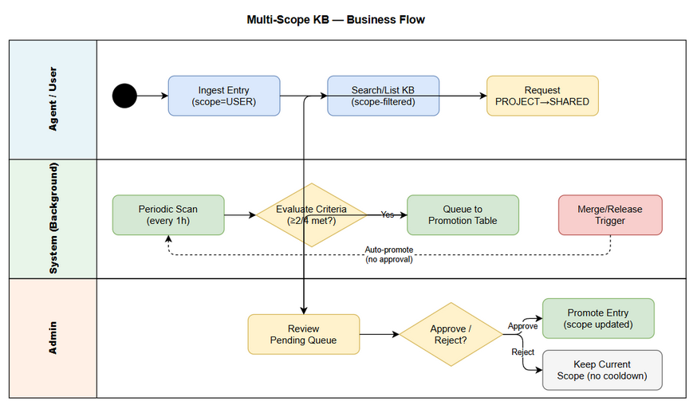
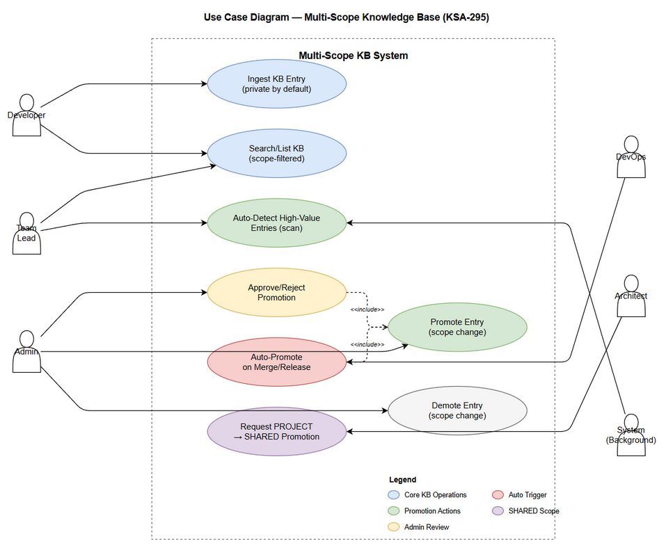

# Business Requirements Document (BRD)

## FEC Knowledge Base - KSA-295: Multi-Scope KB - 3-Level Scope Isolation with Auto-Promotion Service

---

## Document Information

| Field | Value |
|-------|-------|
| Jira Ticket | KSA-295 |
| Title | Multi-Scope KB - 3-level scope isolation (USER/PROJECT/SHARED) with auto-promotion service |
| Author | BA Agent |
| Version | 1.0 |
| Date | 2026-07-02 |
| Status | Draft |

---

## Author Tracking

| Role | Name - Position | Responsibility |
|------|-----------------|----------------|
| Author | BA Agent - Business Analyst | Create document |
| Peer Reviewer | SA Agent - Solution Architect | Review document |

---

## Revision History

| Version | Date | Author | Changes |
|---------|------|--------|---------|
| 1.0 | 2026-07-02 | BA Agent | Initiate document - auto-generated retroactively from implementation of KSA-295 |

---

## Sign-Off

| Name | Signature and date |
|------|--------------------|
| | I agree and confirm all criteria on this BRD as expected requirements |
| | I agree and confirm all criteria on this BRD as expected requirements |

---

## 1. Introduction

### 1.1 Scope

This BRD documents the requirements for implementing a 3-level scope isolation system in the FEC Knowledge Base (KB). The feature introduces visibility boundaries (USER, PROJECT, SHARED) so that knowledge entries are accessible only to appropriate audiences. Additionally, an auto-promotion service detects high-value private entries and surfaces them for team or company-wide sharing through a controlled approval workflow.

Key capabilities:
- Three scope levels: USER (private), PROJECT (team-visible), SHARED (company-wide)
- Scope-based filtering on all KB queries (search, list, get)
- Background scan to detect high-value USER entries for promotion
- Admin approval workflow for promotions
- Automatic promotion on code merge/release events
- Manual promotion request for PROJECT to SHARED

### 1.2 Out of Scope

- Multi-project isolation (separate database per project) - future enhancement
- Role-based access control (RBAC) beyond scope-level visibility - future enhancement
- Detailed audit trail for scope changes (basic consolidation_log exists)
- UI dashboard for promotion queue management
- Cross-project KB federation

### 1.3 Preliminary Requirement

- Existing KB system with knowledge_entries table operational
- SQLite database (better-sqlite3) in use
- MCP tool router functional for mem_search, mem_crud, mem_ingest
- X-User-Id HTTP header available for user identification in requests
---

## 2. Business Requirements

### 2.1 High Level Process Map

The Multi-Scope KB system operates through three main business processes:

1. Ingestion with Scope - Entries are created with default USER scope (private). Agents may explicitly set PROJECT scope during ingestion.
2. Scope-Filtered Access - All search and retrieval operations respect scope visibility rules. Users see their own USER entries plus all PROJECT plus all SHARED entries.
3. Promotion Lifecycle - Background scan identifies high-value entries, queues them for review, and admin approves/rejects. Merge/release events trigger automatic bulk promotion.

*[Edit in draw.io](diagrams/business-flow.drawio)*

*[Edit in draw.io](diagrams/use-case.drawio)*

### 2.2 List of User Stories / Use Cases

| # | Story / Use Case | Priority | Source Ticket |
|---|-----------------|----------|---------------|
| 1 | As a developer, I want my KB entries to be private by default (USER scope) so that incomplete/draft knowledge does not pollute the team KB | MUST HAVE | KSA-295 |
| 2 | As a team lead, I want high-value knowledge to be automatically detected and suggested for PROJECT promotion so that good patterns spread to the team | MUST HAVE | KSA-295 |
| 3 | As an admin, I want to approve/reject promotion requests via mem_promote tool so that I control what enters PROJECT scope | MUST HAVE | KSA-295 |
| 4 | As a DevOps engineer, I want all ticket-related knowledge to auto-promote to PROJECT when code is merged/released so that validated knowledge becomes team knowledge | SHOULD HAVE | KSA-295 |
| 5 | As a company architect, I want PROJECT to SHARED promotion to always require manual approval so that only cross-project relevant knowledge enters company scope | MUST HAVE | KSA-295 |
| 6 | As a user, I want mem_search to automatically filter results by my scope visibility so that I only see relevant entries | MUST HAVE | KSA-295 |
---

### 2.3 Details of User Stories

---

#### Business Flow

Step 1: Agent ingests a knowledge entry via mem_ingest. The entry defaults to scope=USER with user_id set from request context (X-User-Id header).

Step 2: User performs searches via mem_search. The system applies scope clause: user sees own USER entries plus all PROJECT entries plus all SHARED entries.

Step 3: Background scan runs every 1 hour. It evaluates USER-scope entries older than 24 hours against promotion criteria (citations >= 2, access_count >= 5, quality_score >= 70, cross_agent_cites >= 2). Entries meeting >= 2 of 4 criteria are queued as PENDING.

Step 4: Admin reviews pending promotions via mem_promote(action=list) and either approves or rejects.

Step 5: On code merge/release for a ticket, system auto-promotes ALL USER entries tagged with that ticket key to PROJECT scope (no approval needed).

Step 6: For PROJECT to SHARED promotion, any user can request via mem_promote(action=request_shared). Admin MUST manually approve.

Note: Scope transitions are strictly one-step: USER to PROJECT to SHARED (promotion) and SHARED to PROJECT to USER (demotion). Direct USER to SHARED is not allowed.

---

#### STORY 1: Private-by-Default Ingestion

As a developer, I want my KB entries to be private by default (USER scope) so that incomplete/draft knowledge does not pollute the team KB.

Requirement Details:

1. All entries ingested via mem_ingest tool default to scope = USER
2. The user_id field is automatically set from the request context (X-User-Id HTTP header)
3. Agent may explicitly override scope to PROJECT during ingestion if the knowledge is already validated team-level
4. Setting scope = SHARED directly on ingestion is NOT allowed (must go through promotion)

Data Fields:

| Field | Type | Required | Description | Example |
|-------|------|----------|-------------|---------|
| scope | TEXT (enum) | Yes (default USER) | Visibility level: USER, PROJECT, SHARED | USER |
| user_id | TEXT | Yes (for USER scope) | Owner identifier from X-User-Id header | agent-ba-001 |

Acceptance Criteria:

1. KB entries have field scope (USER/PROJECT/SHARED) and user_id
2. mem_ingest default scope=USER, can explicitly set scope=PROJECT
3. user_id is auto-set from X-User-Id header context
4. Direct ingestion with scope=SHARED is rejected

Validation Rules:

- scope must be one of: USER, PROJECT, SHARED
- user_id is required when scope = USER
- If no X-User-Id header present, ingestion still succeeds but entry has null user_id

Error Handling:

- Invalid scope value: Return error Invalid scope. Must be USER, PROJECT, or SHARED
- Attempt to ingest as SHARED directly: Return error Cannot ingest directly to SHARED scope. Use promotion workflow.

---

#### STORY 2: Auto-Detection of High-Value Entries

As a team lead, I want high-value knowledge to be automatically detected and suggested for PROJECT promotion so that good patterns spread to the team.

Requirement Details:

1. A background scan service (ScopePromotionService) runs periodically (every 1 hour)
2. The scan evaluates USER-scope entries against 4 criteria
3. An entry must meet >= 2 of the 4 criteria to become a promotion candidate
4. Eligible entries must be at least 24 hours old (not transient working memory)
5. Entries already in promotion queue (PENDING or APPROVED) are excluded from scan

Data Fields - Promotion Criteria:

| Criterion | Type | Threshold | Score Weight |
|-----------|------|-----------|-------------|
| Citations (cross-agent usage) | INTEGER | >= 2 | 30 |
| Access count | INTEGER | >= 5 | 25 |
| Quality score (0-100) | INTEGER | >= 70 | 25 |
| Cross-agent citations (distinct agents) | INTEGER | >= 2 | 20 |

Acceptance Criteria:

1. ScopePromotionService scan correctly evaluates >= 2/4 criteria
2. Entries must be >= 24h old to be eligible
3. Entries already queued (PENDING/APPROVED) are excluded
4. Scan runs as a background interval (non-blocking)
5. Scan results are queued into kb_promotion_queue table with status PENDING

Validation Rules:

- Entry age: created_at <= NOW - 24 hours
- Entry archived: archived = 0 (only active entries)
- Entry scope: must be USER (only private entries are candidates)
- Minimum criteria met: configurable via PromotionConfig.minCriteriaMet (default: 2)
---

#### STORY 3: Admin Approval/Rejection Workflow

As an admin, I want to approve/reject promotion requests via mem_promote tool so that I control what enters PROJECT scope.

Requirement Details:

1. New tool mem_promote with 5 actions: scan, list, approve, reject, request_shared
2. Admin can list all PENDING promotions sorted by score (highest first)
3. Admin can approve: entry scope changes from USER to PROJECT immediately
4. Admin can reject: entry remains USER scope, NO cooldown applied - entry can be re-scanned next cycle
5. All actions are logged with reviewer ID and timestamp

Data Fields - Promotion Queue:

| Field | Type | Required | Description | Example |
|-------|------|----------|-------------|---------|
| promotion_id | TEXT (PK) | Yes | Unique promotion request ID | promo-1706000000-abc123 |
| entry_id | INTEGER (FK) | Yes | Reference to knowledge_entries.id | 42 |
| source_tier | TEXT | Yes | Current scope before promotion | USER |
| target_tier | TEXT | Yes | Target scope after promotion | PROJECT |
| reason | TEXT | Yes | Auto-generated reason from criteria | citations=3; access_count=7 |
| score | REAL | Yes | Weighted score from criteria evaluation | 55.0 |
| status | TEXT | Yes | PENDING, APPROVED, REJECTED | PENDING |
| reviewed_by | TEXT | No | Admin who reviewed | admin-001 |
| review_comment | TEXT | No | Admin comment on decision | Good pattern, promote |
| reviewed_at | TEXT | No | ISO timestamp of review | 2025-01-27T10:00:00Z |
| created_at | TEXT | Yes | When promotion was queued | 2025-01-27T09:00:00Z |

Acceptance Criteria:

1. mem_promote tool operational with 5 actions (scan, list, approve, reject, request_shared)
2. Admin approve - entry scope updated from USER to PROJECT
3. Admin reject - NO cooldown - entry eligible for next scan cycle
4. Promotion list sorted by score descending
5. All approve/reject actions logged with reviewer ID and timestamp

Tool Interface (mem_promote):

| No. | Action | Input | Output | Description |
|-----|--------|-------|--------|-------------|
| 1 | scan | action: scan | Summary string | Run background scan manually |
| 2 | list | action: list, limit?: number | Array of pending items | Show pending promotions |
| 3 | approve | action: approve, entry_id: number, comment: string | Boolean success | Approve promotion |
| 4 | reject | action: reject, entry_id: number, comment: string | Boolean success | Reject promotion |
| 5 | request_shared | action: request_shared, entry_id: number, reason: string | Boolean success | Request PROJECT to SHARED |

Error Handling:

- Approve non-existent entry: Return false
- Approve already-approved entry: Return false (no double promotion)
- Reject non-pending entry: Return false

---

#### STORY 4: Auto-Promote on Merge/Release

As a DevOps engineer, I want all ticket-related knowledge to auto-promote to PROJECT when code is merged/released so that validated knowledge becomes team knowledge.

Requirement Details:

1. When code for a ticket is merged to main/master or released, ALL USER-scope entries related to that ticket are promoted to PROJECT
2. Relation detection: entries where tags LIKE %ticketKey% OR source LIKE %ticketKey% OR summary LIKE %ticketKey%
3. This bypasses normal scan criteria - merge/release = team-validated knowledge
4. No admin approval needed for this transition
5. Each promotion is logged in consolidation_log with reason including ticket key

Acceptance Criteria:

1. promoteOnMerge(ticketKey) promotes all matching USER entries to PROJECT
2. No approval required - automatic on trigger
3. Only USER scope entries are affected (already PROJECT/SHARED are skipped)
4. Promotion logged in consolidation_log
5. Returns count of promoted vs skipped entries

Validation Rules:

- Only entries with scope = USER and archived = 0 are eligible
- Ticket key matching uses LIKE pattern on tags, source, and summary fields
- Entries already at PROJECT or SHARED are counted as skipped
---

#### STORY 5: Manual Approval for PROJECT to SHARED

As a company architect, I want PROJECT to SHARED promotion to always require manual approval so that only cross-project relevant knowledge enters company scope.

Requirement Details:

1. PROJECT to SHARED promotion ALWAYS requires explicit admin approval
2. Any user/agent can request SHARED promotion via mem_promote(action=request_shared)
3. Request creates a PENDING entry in kb_promotion_queue with target_tier = SHARED
4. Duplicate requests for same entry are blocked (existing PENDING for SHARED)
5. Only PROJECT-scope entries can be requested for SHARED promotion

Acceptance Criteria:

1. PROJECT to SHARED: ALWAYS requires manual admin approval
2. requestSharedPromotion(entryId, reason) creates PENDING queue entry
3. Only PROJECT-scope entries are eligible
4. Duplicate pending requests are blocked
5. Admin approve changes scope to SHARED
6. No auto-promotion path exists for PROJECT to SHARED

Error Handling:

- Request for non-PROJECT entry: Return false
- Duplicate pending request: Return false
- Entry does not exist: Return false

---

#### STORY 6: Scope-Filtered Search and Retrieval

As a user, I want mem_search to automatically filter results by my scope visibility so that I only see relevant entries.

Requirement Details:

1. All mem_search queries apply scope visibility clause automatically
2. All mem_crud list/get operations filter by scope
3. Visibility rule: (scope IN ('PROJECT', 'SHARED') OR (scope = 'USER' AND user_id = ?))
4. User context (userId) is extracted from X-User-Id HTTP header
5. No additional parameters needed - filtering is transparent to the caller

Data Fields - Scope Context:

| Field | Type | Required | Description | Example |
|-------|------|----------|-------------|---------|
| userId | TEXT | Yes | Current user identifier from header | agent-dev-001 |
| projectId | TEXT | No | Current project context (future use) | FEC |

Acceptance Criteria:

1. mem_search returns only entries matching scope visibility rules
2. mem_crud list/get operations filter correctly by scope
3. User can see: own USER entries plus all PROJECT entries plus all SHARED entries
4. User CANNOT see: other users USER entries
5. X-User-Id HTTP header provides user context for scope filtering

Validation Rules:

- If no userId available, only PROJECT and SHARED entries are visible
- Scope filter is applied at SQL level (indexed for performance)
- Filter clause: (scope IN ('PROJECT', 'SHARED') OR (scope = 'USER' AND user_id = ?))
---

## 3. Dependencies

| Dependency | Type | Related Ticket | Description |
|------------|------|----------------|-------------|
| SQLite Database (better-sqlite3) | System | N/A | Core storage engine for knowledge_entries and kb_promotion_queue tables |
| MCP Tool Router | System | N/A | Routes tool calls to MemoryEngine - must support new mem_promote tool |
| X-User-Id HTTP Header | Infrastructure | N/A | Provides user identity context for scope isolation |
| Existing knowledge_entries table | System | N/A | Base table requires schema migration (add scope, user_id columns) |
| Background Interval Service | System | N/A | Node.js setInterval for periodic promotion scan |

---

## 4. Stakeholders

| Role | Name / Team | Responsibility | Source |
|------|-------------|----------------|--------|
| Developer | Development Team | Implement scope isolation and promotion service | KSA-295 assignee |
| Admin | System Administrator | Approve/reject promotion requests | KSA-295 stakeholder |
| Team Lead | Team Leads | Benefit from auto-detected team knowledge | KSA-295 stakeholder |
| Company Architect | Architecture Team | Control SHARED scope quality | KSA-295 stakeholder |
| DevOps Engineer | DevOps Team | Trigger merge/release promotion | KSA-295 stakeholder |

---

## 5. Risks and Assumptions

### 5.1 Risks

| Risk | Impact | Likelihood | Mitigation |
|------|--------|------------|------------|
| Migration breaks existing queries | High | Low | Default all existing entries to USER scope; add column with DEFAULT |
| Promotion scan impacts performance | Medium | Low | Run in background interval (non-blocking); limit scan batch size (50) |
| No cooldown on reject causes spam in queue | Low | Medium | Rejected entries excluded from current queue; only re-scanned if criteria still met |
| X-User-Id header missing | Medium | Low | Fall back to showing only PROJECT/SHARED entries (safe default) |
| Orphaned entries (user deleted) | Low | Low | Entries remain accessible via PROJECT/SHARED scope or admin tools |

### 5.2 Assumptions

- All clients pass X-User-Id HTTP header consistently
- The 1-hour scan interval is sufficient for timely promotion detection
- Meeting 2 of 4 criteria is a reasonable threshold for quality detection
- Merge/release events are reliably detectable by the calling system
- Admin availability for promotion review is adequate (no SLA on review time)
- SQLite performance is acceptable for the expected KB size (less than 100K entries)

---

## 6. Non-Functional Requirements

| Category | Requirement | Details |
|----------|-------------|---------|
| Backward Compatibility | Existing entries must work without changes | All existing entries default to USER scope via migration; existing queries unaffected |
| Performance | Scope filtering adds minimal query overhead | Indexed columns: idx_ke_scope, idx_ke_user_id, idx_ke_scope_user (composite) |
| Performance | Promotion scan is non-blocking | Runs in background setInterval; does not block request handling |
| Scalability | Scan handles growing KB | Batch limit (50 entries per scan); sorted by access_count DESC |
| Data Migration | Migration script for existing databases | Adds scope column (DEFAULT USER), user_id column, and indexes |
| Reliability | Promotion queue persisted | kb_promotion_queue table with proper foreign key constraints |
| Configurability | Promotion thresholds are tunable | PromotionConfig interface allows customizing all thresholds |

---

## 7. Related Tickets

| Ticket Key | Summary | Status | Type | Relationship |
|------------|---------|--------|------|--------------|
| KSA-295 | Multi-Scope KB - 3-level scope isolation with auto-promotion service | Done | Story | Main ticket |

---

## 8. Appendix

### Business Rules Summary

| Rule ID | Rule | Source |
|---------|------|--------|
| BR-1 | All ingests default scope=USER | KSA-295 |
| BR-2 | Background scan criteria: citations>=2, access>=5, quality>=70, cross-agent>=2 (need >=2/4) | KSA-295 |
| BR-3 | Entry must be >=24h old for auto-scan eligibility | KSA-295 |
| BR-4 | No cooldown on reject (admin may miss, entry re-scannable) | KSA-295 |
| BR-5 | Merge/release = auto-promote ALL ticket entries to PROJECT (no approval needed) | KSA-295 |
| BR-6 | PROJECT to SHARED always requires manual admin approval | KSA-295 |
| BR-7 | Scope transitions: only 1 step at a time (USER to PROJECT to SHARED, SHARED to PROJECT to USER) | KSA-295 |
| BR-8 | Periodic scan runs every 1 hour | KSA-295 |
| BR-9 | X-User-Id HTTP header provides user context for scope filtering | KSA-295 |

### Glossary

| Term | Definition |
|------|------------|
| USER scope | Private visibility - only the entry owner can see it |
| PROJECT scope | Team visibility - all project members can see it |
| SHARED scope | Company-wide visibility - everyone can see it |
| Promotion | Transitioning an entry from a lower scope to a higher scope (USER to PROJECT to SHARED) |
| Demotion | Transitioning an entry from a higher scope to a lower scope (SHARED to PROJECT to USER) |
| Auto-promotion | Background service detecting and queueing high-value entries for promotion |
| Promotion Queue | kb_promotion_queue table holding PENDING/APPROVED/REJECTED promotion requests |
| ScopeContext | Interface providing userId and optional projectId for scope enforcement |

### Diagram Index

| # | Diagram | Image | Source (editable) |
|---|---------|-------|-------------------|
| 1 | Business Flow | [business-flow.png](diagrams/business-flow.png) | [business-flow.drawio](diagrams/business-flow.drawio) |
| 2 | Use Case Diagram | [use-case.png](diagrams/use-case.png) | [use-case.drawio](diagrams/use-case.drawio) |

### Reference Documents

| Document | Link / Location |
|----------|-----------------|
| Jira Ticket Specification | documents/JIRA-TICKET-MULTI-SCOPE-KB.md |
| ScopePromotionService Implementation | backend/src/modules/memory/ScopePromotionService.ts |
| Data Models | backend/src/modules/memory/models.ts |
| Memory Engine (scope clause) | backend/src/modules/memory/MemoryEngine.ts |