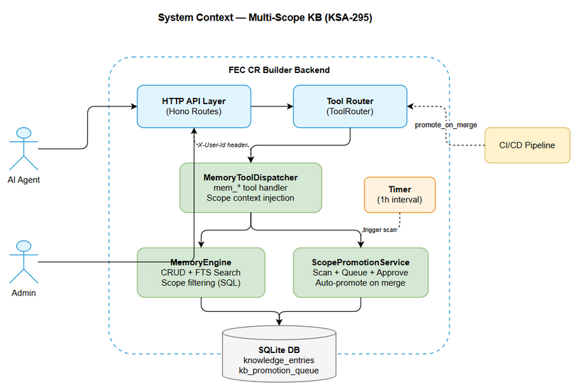
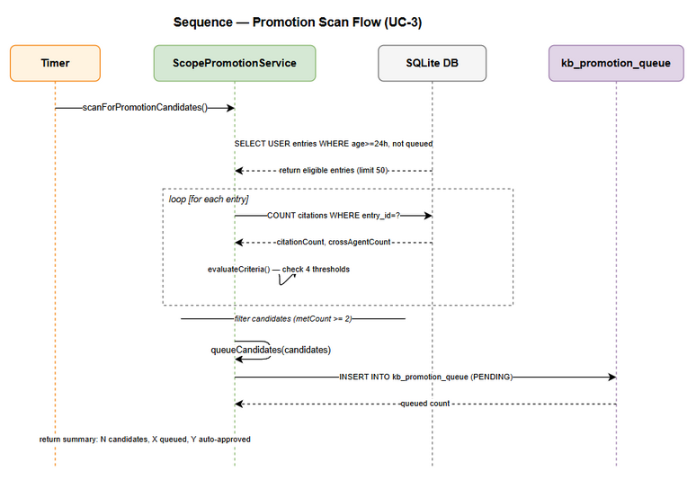
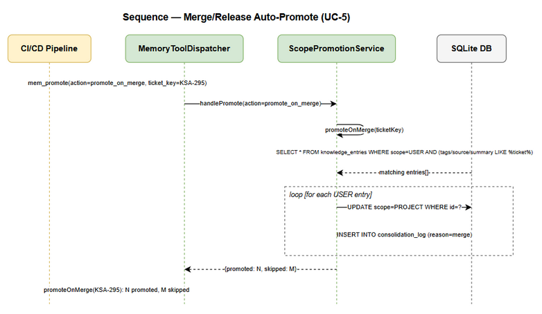
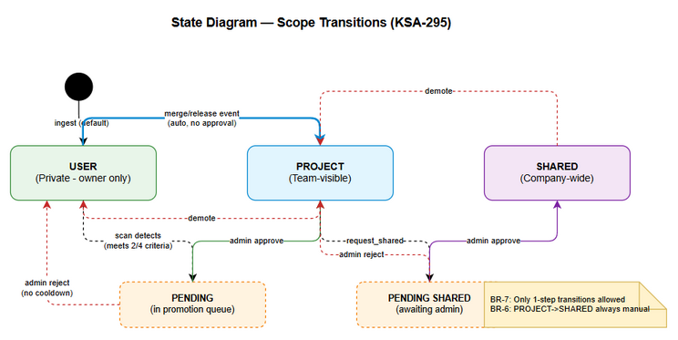

# Functional Specification Document (FSD)

## FEC Knowledge Base — KSA-295: Multi-Scope KB - 3-Level Scope Isolation with Auto-Promotion Service

---

## Document Information

| Field | Value |
|-------|-------|
| Jira Ticket | KSA-295 |
| Title | Multi-Scope KB - 3-level scope isolation (USER/PROJECT/SHARED) with auto-promotion service |
| Author | BA Agent |
| Version | 1.0 |
| Date | 2025-07-02 |
| Status | Draft |
| Related BRD | documents/KSA-295/BRD.md |

---

## Revision History

| Version | Date | Author | Changes |
|---------|------|--------|---------|
| 1.0 | 2025-07-02 | BA Agent | Initiate document — retroactively generated from BRD and implementation |

---

## 1. Introduction

### 1.1 Purpose

This FSD specifies the functional behavior of the Multi-Scope Knowledge Base system. It defines how the 3-level scope isolation (USER/PROJECT/SHARED) operates, how entries are promoted between scopes, and how scope-based filtering is enforced across all KB operations.

### 1.2 Scope

This document covers:
- Scope assignment during ingestion (UC-1)
- Scope-filtered search and retrieval (UC-2)
- Background auto-detection of high-value entries (UC-3)
- Admin approval/rejection workflow (UC-4)
- Auto-promotion on merge/release events (UC-5)
- Manual promotion request for PROJECT to SHARED (UC-6)

### 1.3 Definitions & Acronyms

| Term | Definition |
|------|------------|
| KB | Knowledge Base — the persistent store for structured knowledge entries |
| USER scope | Private visibility — only the entry owner can see it |
| PROJECT scope | Team visibility — all project members can see it |
| SHARED scope | Company-wide visibility — everyone can see it |
| Promotion | Transitioning an entry from lower to higher scope (USER->PROJECT->SHARED) |
| Demotion | Transitioning an entry from higher to lower scope (SHARED->PROJECT->USER) |
| ScopeContext | Interface providing userId for scope enforcement |
| MCP | Model Context Protocol — tool communication standard |
| FTS | Full-Text Search — SQLite FTS5 module |

### 1.4 References

| Document | Location |
|----------|----------|
| BRD | documents/KSA-295/BRD.md |
| ScopePromotionService | backend/src/modules/memory/ScopePromotionService.ts |
| MemoryEngine | backend/src/modules/memory/MemoryEngine.ts |
| MemoryToolDispatcher | backend/src/modules/memory/MemoryToolDispatcher.ts |
| Data Models | backend/src/modules/memory/models.ts |
| HTTP Routes | backend/src/server/routes/tools.ts |

---

## 2. System Overview

### 2.1 System Context Diagram

*[Edit in draw.io](diagrams/system-context.drawio)*

The Multi-Scope KB system operates within the FEC CR Builder backend. External actors interact via MCP tool calls routed through an HTTP API layer. The system components are:

- **HTTP API Layer** (Hono routes) — receives tool calls, extracts X-User-Id header
- **ToolRouter** — routes tool names to appropriate dispatchers
- **MemoryToolDispatcher** — handles all mem_* tools, injects ScopeContext
- **MemoryEngine** — core CRUD + search with scope filtering at SQL level
- **ScopePromotionService** — background scan, promotion queue management
- **SQLite Database** — knowledge_entries + kb_promotion_queue tables

### 2.2 System Architecture

The system follows a layered architecture:

1. **Transport Layer**: Hono HTTP server with JSON-RPC style endpoints
2. **Routing Layer**: ToolRouter dispatches by tool_name
3. **Application Layer**: MemoryToolDispatcher resolves aliases, injects context
4. **Domain Layer**: MemoryEngine (CRUD/search) + ScopePromotionService (promotion logic)
5. **Persistence Layer**: better-sqlite3 with FTS5 for full-text search

---

## 3. Functional Requirements

### 3.1 Feature: Private-by-Default Ingestion

**Source:** BRD Story 1

#### 3.1.1 Description

All knowledge entries are ingested with USER scope by default. The user_id is automatically captured from the HTTP request context. Agents may explicitly set PROJECT scope during ingestion for already-validated team knowledge. Direct ingestion to SHARED scope is prohibited.

#### 3.1.2 Use Case

**Use Case ID:** UC-1
**Actor:** Agent (any AI agent or user calling mem_ingest)
**Preconditions:** MCP server running, tool router configured
**Postconditions:** New knowledge_entry created with correct scope and user_id

**Main Flow:**

| Step | Actor | System | Description |
|------|-------|--------|-------------|
| 1 | Agent calls mem_ingest with content, type, tags | | Agent sends tool call via HTTP POST /mcp/tools/call |
| 2 | | Extract X-User-Id from HTTP header | System reads request context for user identity |
| 3 | | Validate scope parameter | If scope not provided, default to USER |
| 4 | | Set user_id from ScopeContext | Assign ownership based on extracted header |
| 5 | | Insert entry into knowledge_entries | Create record with scope, user_id, content, metadata |
| 6 | | Return success with entry ID | Response: id, type, scope, tier, summary |

**Alternative Flows:**

| ID | Condition | Steps |
|----|-----------|-------|
| AF-1 | Agent explicitly sets scope=PROJECT | Skip default; insert with scope=PROJECT, user_id still set |
| AF-2 | No X-User-Id header present | Insert with user_id=null; entry visible only if scope>=PROJECT |

**Exception Flows:**

| ID | Condition | Steps |
|----|-----------|-------|
| EF-1 | Agent attempts scope=SHARED | Return error: "Cannot ingest directly to SHARED scope. Use promotion workflow." |
| EF-2 | Missing required content field | Return error: "content required" |
| EF-3 | Invalid scope value | Return error: "Invalid scope. Must be USER, PROJECT, or SHARED" |

### 3.2 Feature: Scope-Filtered Search and Retrieval

**Source:** BRD Story 6

#### 3.2.1 Description

All mem_search and mem_crud operations automatically apply scope-based visibility filtering. Users see their own USER entries plus all PROJECT and SHARED entries. Other users' USER entries are invisible.

#### 3.2.2 Use Case

**Use Case ID:** UC-2
**Actor:** Agent (any AI agent performing KB search/retrieval)
**Preconditions:** Knowledge entries exist in database; user context available via X-User-Id header
**Postconditions:** Results returned respecting scope visibility rules

**Main Flow:**

| Step | Actor | System | Description |
|------|-------|--------|-------------|
| 1 | Agent calls mem_search with query | | Tool call includes search query and optional filters |
| 2 | | Extract ScopeContext from request | userId from X-User-Id header |
| 3 | | Build FTS query with scope clause | WHERE clause: (scope IN ('PROJECT','SHARED') OR (scope='USER' AND user_id=?)) |
| 4 | | Execute FTS5 search | Join knowledge_fts with knowledge_entries, apply scope filter |
| 5 | | Record access for each result | Increment access_count, update last_accessed_at |
| 6 | | Return filtered results with scores | Results sorted by FTS rank, include scope field |

**Alternative Flows:**

| ID | Condition | Steps |
|----|-----------|-------|
| AF-1 | Agent passes scope='all' parameter | Skip scope filtering (admin override); return all entries matching query |
| AF-2 | Agent uses mem_crud action=list | Apply same scope clause to findFiltered() method |
| AF-3 | Agent uses mem_crud action=get with specific ID | Return entry regardless of scope (direct ID access) |
| AF-4 | No userId available (header missing) | Only PROJECT and SHARED entries returned |

**Exception Flows:**

| ID | Condition | Steps |
|----|-----------|-------|
| EF-1 | Empty query string | Return error: "query required" |
| EF-2 | FTS parse error (invalid characters) | Sanitize query (remove special chars), retry; if still fails return empty results |

#### 3.2.3 Business Rules

| Rule ID | Rule | Source |
|---------|------|--------|
| BR-1 | All ingests default scope=USER | KSA-295 |
| BR-7 | Scope transitions: only 1 step at a time (USER->PROJECT->SHARED, SHARED->PROJECT->USER) | KSA-295 |
| BR-9 | X-User-Id HTTP header provides user context for scope filtering | KSA-295 |

#### 3.2.4 Data Specifications

**Input Data (mem_search):**

| Field | Type | Required | Validation | Description |
|-------|------|----------|------------|-------------|
| query | string | Yes | Non-empty, special chars sanitized | FTS search query |
| limit | number | No | Default 10, max 100 | Maximum results to return |
| tier | string | No | WORKING/SEMANTIC/EPISODIC | Filter by knowledge tier |
| scope | string | No | 'all' for admin override | Scope filter override |
| detail | boolean | No | Default false | Include content snippet in results |

**Output Data:**

| Field | Type | Description |
|-------|------|-------------|
| results[].entry.id | number | Entry unique identifier |
| results[].entry.summary | string | Entry summary (first 120 chars) |
| results[].entry.type | string | Entry type (CONTEXT, REQUIREMENT, etc.) |
| results[].entry.tier | string | Knowledge tier |
| results[].entry.scope | KBScope | Scope level (USER/PROJECT/SHARED) |
| results[].score | number | FTS relevance score (negated rank) |
| results[].matchType | string | Always 'fts' for search results |

---

### 3.3 Feature: Auto-Detection of High-Value Entries

**Source:** BRD Story 2

#### 3.3.1 Description

A background service (ScopePromotionService) runs periodically to scan USER-scope entries and identify those with high reuse value. Entries meeting promotion criteria are queued for admin review or auto-promoted to PROJECT scope.

#### 3.3.2 Use Case

**Use Case ID:** UC-3
**Actor:** System (background timer) or Admin (manual trigger via mem_promote action=scan)
**Preconditions:** USER-scope entries exist that are >= 24 hours old and not already in promotion queue
**Postconditions:** Qualified entries added to kb_promotion_queue with status PENDING (or auto-promoted if configured)

**Main Flow:**

| Step | Actor | System | Description |
|------|-------|--------|-------------|
| 1 | System timer triggers (every 1 hour) | | setInterval fires scanForPromotionCandidates |
| 2 | | Query eligible USER entries | WHERE scope='USER' AND archived=0 AND created_at <= NOW-24h AND id NOT IN (SELECT entry_id FROM kb_promotion_queue WHERE status IN ('PENDING','APPROVED')) |
| 3 | | Evaluate each entry against 4 criteria | citations>=2 (30pts), access_count>=5 (25pts), quality_score>=70 (25pts), cross_agent_cites>=2 (20pts) |
| 4 | | Filter entries meeting >= 2 criteria | Compare metCount against config.minCriteriaMet |
| 5 | | Queue candidates into kb_promotion_queue | Insert with status=PENDING, reason=criteria summary, score=weighted sum |
| 6 | | Return summary | "Promotion cycle: N candidates found. Queued: X, Auto-approved: Y" |

**Alternative Flows:**

| ID | Condition | Steps |
|----|-----------|-------|
| AF-1 | Admin triggers via mem_promote(action=scan) | Same logic as timer, but executed on-demand |
| AF-2 | config.autoApproveToProject = true | Instead of PENDING, directly promote to PROJECT; record as APPROVED in queue |
| AF-3 | No candidates found | Return "No promotion candidates found." |

**Exception Flows:**

| ID | Condition | Steps |
|----|-----------|-------|
| EF-1 | Database error during scan | Log error, return partial results or empty |
| EF-2 | Entry deleted between scan and queue | INSERT OR IGNORE prevents duplicate; foreign key constraint handles deleted entries |

*[Edit in draw.io](diagrams/sequence-promotion-scan.drawio)*

---

### 3.4 Feature: Admin Approval/Rejection Workflow

**Source:** BRD Story 3

#### 3.4.1 Description

Administrators review pending promotions via the mem_promote tool. They can list pending items (sorted by score), approve (entry promoted to target scope), or reject (entry stays in current scope, eligible for future scans).

#### 3.4.2 Use Case

**Use Case ID:** UC-4
**Actor:** Admin (system administrator with promotion authority)
**Preconditions:** At least one entry exists in kb_promotion_queue with status=PENDING
**Postconditions:** Entry either promoted to target scope or remains unchanged; queue entry updated with review details

**Main Flow (Approve):**

| Step | Actor | System | Description |
|------|-------|--------|-------------|
| 1 | Admin calls mem_promote(action=list) | | Retrieve pending promotions sorted by score DESC |
| 2 | | Return list with entry details | Show promotion_id, entry summary, type, reason, score |
| 3 | Admin calls mem_promote(action=approve, entry_id=X, comment="...") | | Admin selects entry to approve |
| 4 | | Find PENDING queue entry for entry_id | Query kb_promotion_queue WHERE entry_id=X AND status='PENDING' |
| 5 | | Update queue: status=APPROVED, reviewed_by, reviewed_at | Record reviewer identity and timestamp |
| 6 | | Update knowledge_entries: scope = target_tier | Change entry scope from USER to PROJECT |
| 7 | | Return success | "Approved #X" |

**Alternative Flows:**

| ID | Condition | Steps |
|----|-----------|-------|
| AF-1 | Admin rejects (action=reject) | Update queue status=REJECTED, entry scope unchanged, no cooldown applied |
| AF-2 | Queue is empty | list returns empty array [] |

**Exception Flows:**

| ID | Condition | Steps |
|----|-----------|-------|
| EF-1 | entry_id not found in PENDING queue | Return false / "Not found or not pending: #X" |
| EF-2 | entry_id missing from request | Return "Error: entry_id required" |
| EF-3 | Entry already approved (double-approve) | Return false (no duplicate promotion) |

---

### 3.5 Feature: Auto-Promote on Merge/Release

**Source:** BRD Story 4

#### 3.5.1 Description

When code associated with a ticket is merged to main/master or released, all USER-scope entries related to that ticket are automatically promoted to PROJECT scope. This bypasses scan criteria because merge/release implies team-validated knowledge.

#### 3.5.2 Use Case

**Use Case ID:** UC-5
**Actor:** DevOps system (CI/CD pipeline or manual trigger via mem_promote action=promote_on_merge)
**Preconditions:** Ticket key exists; USER-scope entries tagged/sourced from that ticket exist
**Postconditions:** All matching USER entries promoted to PROJECT; logged in consolidation_log

**Main Flow:**

| Step | Actor | System | Description |
|------|-------|--------|-------------|
| 1 | DevOps calls mem_promote(action=promote_on_merge, ticket_key="KSA-295") | | Trigger after merge/release event |
| 2 | | Find all USER entries matching ticket | WHERE scope='USER' AND archived=0 AND (tags LIKE '%KSA-295%' OR source LIKE '%KSA-295%' OR summary LIKE '%KSA-295%') |
| 3 | | Promote each matching entry to PROJECT | UPDATE scope='PROJECT', updated_at=now() |
| 4 | | Log each promotion in consolidation_log | INSERT (entry_id, from_tier='USER', to_tier='PROJECT', reason='Auto-promoted on merge/release: KSA-295') |
| 5 | | Return summary | "promoteOnMerge(KSA-295): N entries promoted to PROJECT, M skipped." |

**Alternative Flows:**

| ID | Condition | Steps |
|----|-----------|-------|
| AF-1 | No matching entries found | Return "promoteOnMerge(KSA-295): 0 entries promoted to PROJECT, 0 skipped." |
| AF-2 | Some entries already PROJECT/SHARED | Count as skipped, do not modify |

**Exception Flows:**

| ID | Condition | Steps |
|----|-----------|-------|
| EF-1 | ticket_key missing | Return "Error: ticket_key required" |
| EF-2 | Database error during bulk update | Transaction rollback, return error |

*[Edit in draw.io](diagrams/sequence-merge-promote.drawio)*

---

### 3.6 Feature: Request PROJECT to SHARED Promotion

**Source:** BRD Story 5

#### 3.6.1 Description

Any user or agent can request that a PROJECT-scope entry be promoted to SHARED scope (company-wide visibility). This ALWAYS requires manual admin approval — there is no auto-promotion path to SHARED.

#### 3.6.2 Use Case

**Use Case ID:** UC-6
**Actor:** Agent/User (requesting promotion) + Admin (approving)
**Preconditions:** Entry exists with scope=PROJECT; no existing PENDING request for same entry to SHARED
**Postconditions:** New PENDING entry in kb_promotion_queue with target_tier=SHARED

**Main Flow:**

| Step | Actor | System | Description |
|------|-------|--------|-------------|
| 1 | Agent calls mem_promote(action=request_shared, entry_id=X, reason="Cross-project relevance") | | Request to elevate entry visibility |
| 2 | | Validate entry exists and scope=PROJECT | Query knowledge_entries WHERE id=X AND scope='PROJECT' |
| 3 | | Check no duplicate pending SHARED request | Query kb_promotion_queue WHERE entry_id=X AND target_tier='SHARED' AND status='PENDING' |
| 4 | | Create PENDING queue entry | INSERT (promotion_id, entry_id, source_tier='PROJECT', target_tier='SHARED', reason, score=0, status='PENDING') |
| 5 | | Return success | "SHARED promotion requested for #X" |
| 6 | Admin approves via UC-4 flow | | Admin reviews and approves; scope changes to SHARED |

**Alternative Flows:**

| ID | Condition | Steps |
|----|-----------|-------|
| AF-1 | Admin rejects SHARED request | Entry remains PROJECT, queue entry REJECTED |

**Exception Flows:**

| ID | Condition | Steps |
|----|-----------|-------|
| EF-1 | Entry not in PROJECT scope | Return false / "Entry not in PROJECT scope or already queued" |
| EF-2 | Duplicate pending request exists | Return false / "Entry not in PROJECT scope or already queued" |
| EF-3 | Entry does not exist | Return false |

---

## 3.7 Business Rules (Consolidated)

| Rule ID | Rule | Affected Use Cases | Implementation |
|---------|------|--------------------|----------------|
| BR-1 | All ingests default scope=USER | UC-1 | MemoryToolDispatcher.handleIngest(): scope defaults to 'USER' |
| BR-2 | Background scan criteria: citations>=2, access>=5, quality>=70, cross-agent>=2 (need >=2/4) | UC-3 | ScopePromotionService.evaluateCriteria() |
| BR-3 | Entry must be >=24h old for auto-scan eligibility | UC-3 | ScopePromotionService.scanForPromotionCandidates(): minAge filter |
| BR-4 | No cooldown on reject (entry re-scannable next cycle) | UC-4 | ScopePromotionService.reject(): no cooldown_until update |
| BR-5 | Merge/release = auto-promote ALL ticket entries to PROJECT (no approval needed) | UC-5 | ScopePromotionService.promoteOnMerge() |
| BR-6 | PROJECT to SHARED always requires manual admin approval | UC-6 | ScopePromotionService.requestSharedPromotion() always creates PENDING |
| BR-7 | Scope transitions: only 1 step at a time (USER->PROJECT->SHARED) | UC-1, UC-4, UC-5, UC-6 | MemoryEngine.promoteEntry(): validTransitions map |
| BR-8 | Periodic scan runs every 1 hour | UC-3 | Background setInterval(3600000) |
| BR-9 | X-User-Id HTTP header provides user context for scope filtering | UC-2 | tools.ts route extracts header, injects as __userId |

---

## 4. Data Model

### 4.1 Entity Relationship Diagram

The data model extends the existing knowledge_entries table with scope fields and adds a new kb_promotion_queue table.

### 4.2 Logical Entities

#### Entity: knowledge_entries (Extended)

| Attribute | Type | Required | Business Rule | Description |
|-----------|------|----------|---------------|-------------|
| id | INTEGER (PK) | Yes | Auto-increment | Unique entry identifier |
| content | TEXT | Yes | - | Full knowledge content |
| summary | TEXT | Yes | - | Short summary (max 120 chars) |
| type | TEXT | Yes | - | Entry type: CONTEXT, REQUIREMENT, ARCHITECTURE, etc. |
| tier | TEXT | Yes | Derived from type | Knowledge tier: WORKING, SEMANTIC, EPISODIC |
| scope | TEXT | Yes | BR-1, BR-7 | Visibility level: USER, PROJECT, SHARED (default USER) |
| user_id | TEXT | Conditional | BR-9 | Owner identifier; required for USER scope entries |
| source | TEXT | No | - | Origin file path or reference |
| source_ref | TEXT | No | - | Additional source reference |
| tags | TEXT | No | - | Comma-separated tags for categorization |
| confidence | REAL | Yes | Default 1.0 | Confidence score 0-1 |
| access_count | INTEGER | Yes | Default 0, BR-2 | Number of times entry was accessed |
| quality_score | INTEGER | No | BR-2 | Quality score 0-100 (nullable) |
| created_at | TEXT | Yes | BR-3 | ISO timestamp of creation |
| updated_at | TEXT | Yes | - | ISO timestamp of last update |
| last_accessed_at | TEXT | No | - | ISO timestamp of last access |
| expires_at | TEXT | No | - | Optional expiration timestamp |
| pinned | INTEGER | Yes | Default 0 | Whether entry is pinned (0/1) |
| pin_order | INTEGER | Yes | Default 0 | Pin display order |
| structured_map | TEXT | No | - | JSON structured data map |
| archived | INTEGER | Yes | Default 0, BR-3 | Whether entry is archived (0/1) |
| agent_name | TEXT | No | - | Name of agent that created entry |
| owner | TEXT | No | - | Inferred owner role (ba-agent, sa-agent, etc.) |

**Indexes:**

| Index Name | Columns | Purpose |
|------------|---------|---------|
| idx_ke_scope | scope | Fast scope-based filtering |
| idx_ke_user_id | user_id | Fast user-specific queries |
| idx_ke_scope_user | scope, user_id | Composite for scope visibility clause |

#### Entity: kb_promotion_queue (New)

| Attribute | Type | Required | Business Rule | Description |
|-----------|------|----------|---------------|-------------|
| promotion_id | TEXT (PK) | Yes | - | Unique ID: promo-{timestamp}-{random} |
| entry_id | INTEGER (FK) | Yes | BR-2, BR-6 | Reference to knowledge_entries.id |
| source_tier | TEXT | Yes | BR-7 | Scope before promotion (USER or PROJECT) |
| target_tier | TEXT | Yes | BR-7 | Target scope after promotion (PROJECT or SHARED) |
| reason | TEXT | Yes | BR-2 | Auto-generated reason from criteria evaluation |
| score | REAL | Yes | Default 0 | Weighted score from criteria (0-100) |
| status | TEXT | Yes | Default PENDING | Queue status: PENDING, APPROVED, REJECTED |
| review_comment | TEXT | No | - | Admin comment on decision |
| reviewed_by | TEXT | No | - | Admin who reviewed (userId) |
| reviewed_at | TEXT | No | - | ISO timestamp of review action |
| cooldown_until | TEXT | No | BR-4 | Reserved field (currently unused, no cooldown) |
| created_at | TEXT | Yes | Default NOW | When promotion was queued |

**Indexes:**

| Index Name | Columns | Purpose |
|------------|---------|---------|
| idx_kpq_status | status | Fast filtering of PENDING items |
| idx_kpq_entry | entry_id | Fast lookup by entry |

**Foreign Keys:**

| Column | References | On Delete |
|--------|-----------|-----------|
| entry_id | knowledge_entries(id) | CASCADE |

#### Entity: consolidation_log (Existing — used for audit)

| Attribute | Type | Required | Description |
|-----------|------|----------|-------------|
| id | INTEGER (PK) | Yes | Auto-increment |
| entry_id | INTEGER | Yes | Referenced knowledge entry |
| from_tier | TEXT | Yes | Previous scope/tier |
| to_tier | TEXT | Yes | New scope/tier |
| reason | TEXT | Yes | Reason for transition |
| created_at | TEXT | Yes | Timestamp |

#### Entity: citations (Existing — used for promotion criteria)

| Attribute | Type | Required | Description |
|-----------|------|----------|-------------|
| id | INTEGER (PK) | Yes | Auto-increment |
| entry_id | INTEGER | Yes | Cited knowledge entry |
| cited_by | TEXT | No | Agent/user who cited |
| created_at | TEXT | Yes | Timestamp |

**Relationships:**

| From Entity | To Entity | Cardinality | Description |
|-------------|-----------|-------------|-------------|
| kb_promotion_queue | knowledge_entries | N:1 | Each queue item references one entry |
| citations | knowledge_entries | N:1 | Multiple citations per entry |
| consolidation_log | knowledge_entries | N:1 | Multiple log entries per knowledge entry |

---

## 5. Integration Specifications

### 5.1 External System: HTTP API (MCP Tool Interface)

| Attribute | Value |
|-----------|-------|
| Purpose | Primary interface for all KB operations from AI agents |
| Direction | Bidirectional |
| Data Format | JSON |
| Frequency | Real-time (per tool call) |
| Protocol | HTTP POST /mcp/tools/call |

**Data Exchange:**

| Our Data | External Data | Direction | Business Rule |
|----------|--------------|-----------|---------------|
| tool_name + arguments | Agent request body | Receive | Must include valid tool_name |
| X-User-Id header | Agent identity | Receive | BR-9: Provides scope context |
| Tool result (string) | Agent response | Send | Formatted result with scope info |

### 5.2 Internal Integration: Background Timer

| Attribute | Value |
|-----------|-------|
| Purpose | Trigger periodic promotion scan |
| Direction | Internal |
| Frequency | Every 1 hour (3600000ms) |
| Mechanism | Node.js setInterval |

### 5.3 Internal Integration: CI/CD Pipeline (Merge/Release Hook)

| Attribute | Value |
|-----------|-------|
| Purpose | Trigger auto-promotion when code is merged/released |
| Direction | Inbound |
| Data Format | Tool call with ticket_key parameter |
| Frequency | On-demand (per merge/release event) |
| Mechanism | mem_promote(action=promote_on_merge, ticket_key=X) |

---

## 5.4 API Contract: mem_promote Tool

**Tool Name:** mem_promote
**Purpose:** Manage scope promotion lifecycle — scan, review, approve, reject, request

**Input Schema:**

| Parameter | Type | Required | Validation | Description |
|-----------|------|----------|------------|-------------|
| action | string | Yes | Enum: scan, list, approve, reject, request_shared, promote_on_merge | Operation to perform |
| entry_id | number | Conditional | Required for approve, reject, request_shared | Target knowledge entry ID |
| comment | string | No | Free text | Review comment (approve/reject) |
| reason | string | No | Free text | Reason for SHARED request |
| ticket_key | string | Conditional | Required for promote_on_merge; pattern [A-Z]+-\d+ | Ticket key for merge promotion |
| limit | number | No | Default 20, max 100 | Max items for list action |
| reviewer | string | No | Auto from ScopeContext | Override reviewer identity |

**Output by Action:**

| Action | Success Output | Error Output |
|--------|---------------|--------------|
| scan | "Promotion cycle: N candidates found. Queued: X, Auto-approved: Y." | "No promotion candidates found." |
| list | JSON array of pending items with entry details | "[]" (empty) |
| approve | "Approved #X" | "Not found or not pending: #X" |
| reject | "Rejected #X" | "Not found or not pending: #X" |
| request_shared | "SHARED promotion requested for #X" | "Entry not in PROJECT scope or already queued" |
| promote_on_merge | "promoteOnMerge(KEY): N promoted, M skipped." | "Error: ticket_key required" |

**Business Error Scenarios:**

| Scenario | User Message | Trigger Condition |
|----------|-------------|-------------------|
| Unknown action | "Unknown promote action: X. Valid: scan, list, approve, reject, request_shared, promote_on_merge" | Invalid action parameter |
| Service unavailable | "Error: promotion service not available" | PromotionService not initialized |
| Missing entry_id | "Error: entry_id required" | approve/reject/request_shared without entry_id |
| Missing ticket_key | "Error: ticket_key required" | promote_on_merge without ticket_key |

---

## 6. Processing Logic

### 6.1 Promotion Scan Cycle

**Trigger:** Background timer (every 1 hour) or manual via mem_promote(action=scan)
**Input:** All USER-scope entries older than 24 hours, not archived, not already queued
**Output:** Candidates queued in kb_promotion_queue

**Processing Steps:**

| Step | Description | Error Handling |
|------|-------------|----------------|
| 1 | Calculate minAge = NOW - 24 hours | N/A |
| 2 | Query eligible entries (limit 50, sorted by access_count DESC) | Return empty on DB error |
| 3 | For each entry: count citations (total and distinct agents) | Skip entry on count error |
| 4 | Evaluate 4 criteria, calculate metCount and score | Use 0 for null quality_score |
| 5 | Filter entries where metCount >= config.minCriteriaMet | N/A |
| 6 | For each candidate: generate promotion_id | UUID-like: promo-{timestamp}-{random6} |
| 7 | If autoApproveToProject: directly promote + insert APPROVED | Transactional |
| 8 | Else: insert as PENDING | INSERT OR IGNORE prevents duplicates |

### 6.2 Scope Transition Validation

**Trigger:** Any scope change operation (promote, demote)
**Input:** Current entry scope + target scope
**Output:** Boolean validity

**Valid Transitions:**

| Current Scope | Valid Targets (Promotion) | Valid Targets (Demotion) |
|---------------|--------------------------|--------------------------|
| USER | PROJECT | — |
| PROJECT | SHARED | USER |
| SHARED | — | PROJECT |

Invalid transitions are rejected silently (return false).

---

## 7. Security Requirements

### 7.1 Authentication & Authorization

| Role | Permissions | Features |
|------|-------------|----------|
| Agent (any) | Read (scope-filtered), Write (USER/PROJECT), Request SHARED | mem_search, mem_ingest, mem_promote(request_shared) |
| Admin | All agent permissions + Approve/Reject promotions | mem_promote(approve, reject, scan, list) |
| System | Background scan, auto-promote on merge | Internal timer, promote_on_merge |

### 7.2 Data Sensitivity Classification

| Data Type | Classification | Business Requirement |
|-----------|---------------|---------------------|
| USER-scope entries | Confidential (per-user) | Only owner can read; prevents knowledge pollution |
| PROJECT-scope entries | Internal | Team-visible; validated knowledge |
| SHARED-scope entries | Internal (company-wide) | Cross-project relevant; admin-approved |
| Promotion queue | Internal | Admin review data |

### 7.3 Audit Trail

| Event | Logged Fields | Retention | Business Reason |
|-------|--------------|-----------|-----------------|
| INGEST | entry_id, session_id | Indefinite | Track knowledge creation |
| SEARCH | session_id | Indefinite | Track usage patterns |
| PROMOTE | entry_id, from_scope, to_scope | Indefinite | Audit scope changes |
| DEMOTE | entry_id | Indefinite | Track scope reverts |
| Approve/Reject | entry_id, reviewed_by, comment, timestamp | Indefinite | Admin accountability |

---

## 8. Non-Functional Requirements

| Category | Business Requirement | Acceptance Criteria |
|----------|---------------------|---------------------|
| Performance | Scope filtering adds minimal query overhead | < 5ms additional latency per query with indexed columns |
| Performance | Promotion scan is non-blocking | Background scan does not block request handling; completes within 10 seconds for 50 entries |
| Scalability | KB supports growth to 100K entries | Batch limit (50) on scan; indexed scope columns; FTS5 handles large corpus |
| Availability | KB operational during scan | Scan uses read-only queries until queue insert; no locks on knowledge_entries |
| Backward Compatibility | Existing entries work without changes | All existing entries default to USER scope via migration; existing queries unaffected |
| Configurability | Promotion thresholds tunable | PromotionConfig interface: minCitations, minAccessCount, minQualityScore, minAgeHours, minCriteriaMet, autoApproveToProject |
| Data Integrity | Promotion queue referential integrity | Foreign key entry_id -> knowledge_entries(id) ON DELETE CASCADE |

---

## 9. Error Handling (User-Facing)

### 9.1 Error Scenarios

| Scenario | Severity | User Message | Expected Behavior |
|----------|----------|-------------|-------------------|
| Invalid scope value on ingest | Warning | "Invalid scope. Must be USER, PROJECT, or SHARED" | Entry not created; user retries with valid scope |
| Direct SHARED ingestion | Warning | "Cannot ingest directly to SHARED scope. Use promotion workflow." | Entry not created; user uses promotion flow |
| Approve non-pending entry | Info | "Not found or not pending: #X" | No state change; admin selects different entry |
| Reject non-pending entry | Info | "Not found or not pending: #X" | No state change |
| Missing required field | Warning | "Error: {field} required" | Tool call rejected; user provides missing field |
| Promotion service unavailable | Critical | "Error: promotion service not available" | All promotion actions fail; system restart needed |
| Tool not found | Warning | "Tool '{name}' not found" | HTTP 404; user checks tool name spelling |
| Invalid JSON body | Warning | "Invalid JSON body" | HTTP 400; user fixes request format |
| SHARED request for non-PROJECT entry | Info | "Entry not in PROJECT scope or already queued" | Request rejected; user verifies entry scope first |
| Duplicate SHARED request | Info | "Entry not in PROJECT scope or already queued" | Request rejected; existing pending request exists |

### 9.2 Notification Requirements

| Event | Who is Notified | Channel | Timing |
|-------|----------------|---------|--------|
| New promotion candidate queued | Admin | Tool response (mem_promote list) | On-demand (pull model) |
| Entry promoted to PROJECT | Original entry owner | Not implemented (future) | N/A |
| Scan completed | System log | Logger (pino) | Immediate |

---

## 10. Testing Considerations

### 10.1 Test Scenarios

| ID | Scenario | Input | Expected Output | Priority |
|----|----------|-------|-----------------|----------|
| TC-1 | Ingest with default scope | mem_ingest(content="test") | Entry created with scope=USER | High |
| TC-2 | Ingest with explicit PROJECT scope | mem_ingest(content="test", scope="PROJECT") | Entry created with scope=PROJECT | High |
| TC-3 | Ingest with SHARED scope (blocked) | mem_ingest(content="test", scope="SHARED") | Error: Cannot ingest directly to SHARED | High |
| TC-4 | Search returns only visible entries | User A searches; User B has USER entries | User A sees own USER + all PROJECT/SHARED, NOT B's USER entries | High |
| TC-5 | Scan detects eligible entry | Entry with access_count=6, citations=3, age>24h | Entry queued as PENDING candidate | High |
| TC-6 | Scan skips young entries | Entry with high metrics but created 1 hour ago | Entry NOT queued | Medium |
| TC-7 | Scan skips already-queued entries | Entry already in PENDING queue | Entry NOT re-queued | Medium |
| TC-8 | Admin approves promotion | mem_promote(action=approve, entry_id=X) | Entry scope changes USER->PROJECT | High |
| TC-9 | Admin rejects — no cooldown | mem_promote(action=reject, entry_id=X), then re-scan | Entry can be re-scanned in next cycle | High |
| TC-10 | Merge auto-promotes ticket entries | mem_promote(action=promote_on_merge, ticket_key="KSA-295") | All matching USER entries -> PROJECT | High |
| TC-11 | SHARED request from PROJECT entry | mem_promote(action=request_shared, entry_id=X) where X is PROJECT | PENDING queue entry created | High |
| TC-12 | SHARED request from USER entry (blocked) | mem_promote(action=request_shared, entry_id=X) where X is USER | Return false | Medium |
| TC-13 | Duplicate SHARED request blocked | Request SHARED for entry already PENDING SHARED | Return false | Medium |
| TC-14 | Scope visibility with missing header | No X-User-Id header | Only PROJECT and SHARED entries visible | Medium |

---

## 11. State Diagram: Scope Transitions

*[Edit in draw.io](diagrams/state-scope-transitions.drawio)*

The scope of a knowledge entry follows strict one-step transitions:

- **USER** (initial state for all new entries)
  - -> PROJECT: via auto-promotion scan + admin approve, OR merge/release event
  - Cannot skip to SHARED
- **PROJECT** (team-visible)
  - -> SHARED: via manual request + admin approve ONLY
  - -> USER: via demotion (admin action)
- **SHARED** (company-wide)
  - -> PROJECT: via demotion (admin action)
  - Cannot be directly ingested

---

## 12. Appendix

### Diagram Index

| # | Diagram | Image | Source (editable) |
|---|---------|-------|-------------------|
| 1 | System Context | [system-context.png](diagrams/system-context.png) | [system-context.drawio](diagrams/system-context.drawio) |
| 2 | Sequence - Promotion Scan | [sequence-promotion-scan.png](diagrams/sequence-promotion-scan.png) | [sequence-promotion-scan.drawio](diagrams/sequence-promotion-scan.drawio) |
| 3 | Sequence - Merge Promote | [sequence-merge-promote.png](diagrams/sequence-merge-promote.png) | [sequence-merge-promote.drawio](diagrams/sequence-merge-promote.drawio) |
| 4 | State - Scope Transitions | [state-scope-transitions.png](diagrams/state-scope-transitions.png) | [state-scope-transitions.drawio](diagrams/state-scope-transitions.drawio) |

### Change Log from BRD

- No deviations from BRD. FSD provides implementation-level detail for all 6 BRD user stories.
- Scope override (scope='all') for admin search discovered from implementation — not explicitly in BRD but consistent with admin role.
- promote_on_merge action added to mem_promote tool interface (mentioned in BRD Story 4, formalized here).
