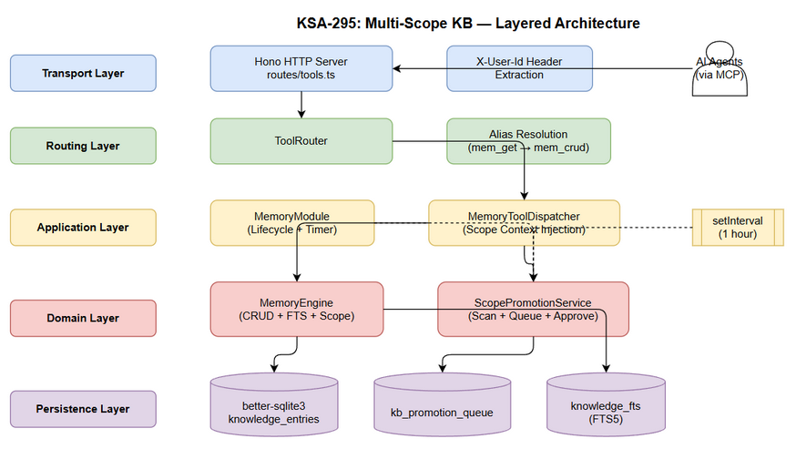
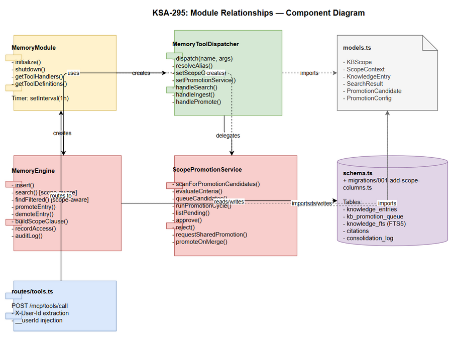

# Technical Design Document (TDD)

## FEC Knowledge Base - KSA-295: Multi-Scope KB - 3-Level Scope Isolation with Auto-Promotion Service

---

## Document Information

| Field | Value |
|-------|-------|
| Jira Ticket | KSA-295 |
| Title | Multi-Scope KB - Technical Design |
| Author | SA Agent |
| Version | 1.0 |
| Date | 2025-07-02 |
| Status | Final (retroactive) |
| Related BRD | BRD-v1-KSA-295.docx |
| Related FSD | FSD-v1-KSA-295.docx |

---

## Revision History

| Version | Date | Author | Changes |
|---------|------|--------|---------|
| 1.0 | 2025-07-02 | SA Agent | Initial TDD - retroactively generated from implemented source code |

---

## 1. Architecture Overview

### 1.1 System Context

The Multi-Scope KB feature operates within the FEC CR Builder backend - a Node.js/TypeScript MCP server. External AI agents interact via HTTP POST to /mcp/tools/call. The system enforces 3-level visibility isolation (USER/PROJECT/SHARED) at the SQL query level and provides a background promotion service.

### 1.2 Layered Architecture



*[Edit in draw.io](diagrams/architecture.drawio)*

The system follows a 5-layer architecture:

| Layer | Responsibility | Key Components |
|-------|---------------|----------------|
| Transport | HTTP request handling, header extraction | Hono routes (tools.ts) |
| Routing | Tool name dispatch, alias resolution | ToolRouter, MemoryToolDispatcher |
| Application | Tool orchestration, scope context injection | MemoryModule, MemoryToolDispatcher |
| Domain | Business logic, scope enforcement | MemoryEngine, ScopePromotionService |
| Persistence | SQLite CRUD, FTS5 search, indexing | better-sqlite3, DatabaseManager |

### 1.3 Design Principles

| Principle | Application |
|-----------|-------------|
| Private-by-default | All ingestion defaults to USER scope |
| SQL-level isolation | Scope filtering is a WHERE clause, not application filter |
| Single-step transitions | USER-PROJECT-SHARED only (no skip) |
| Zero-trust headers | Missing X-User-Id = restricted visibility (PROJECT+SHARED only) |
| Non-blocking background | Promotion scan runs via setInterval, never blocks requests |

---

## 2. Technology Stack

| Category | Technology | Version | Purpose |
|----------|-----------|---------|---------|
| Runtime | Node.js | >=18.14.1 | Server runtime |
| Language | TypeScript | ^5.5.0 | Type-safe development |
| HTTP Framework | Hono | ^4.0.0 | Lightweight HTTP server |
| Database | better-sqlite3 | ^11.10.0 | Embedded SQLite with FTS5 |
| Logging | Pino | ^9.2.0 | Structured JSON logging |
| Validation | Zod | ^3.23.0 | Request schema validation |
| Testing | Vitest | ^4.1.9 | Unit + integration tests |
| E2E Testing | Playwright | ^1.60.0 | E2E API/UI tests |
| Build | tsx | ^4.0.0 | TypeScript execution (dev) |
| Compiler | tsc | ^5.5.0 | Production build |

---
## 3. Module Design

### 3.1 Module Relationship Diagram



*[Edit in draw.io](diagrams/component.drawio)*

### 3.2 MemoryEngine (Domain Layer)

**File:** `backend/src/modules/memory/MemoryEngine.ts`
**Responsibility:** Core CRUD + FTS search with scope-aware filtering

#### Key Methods

| Method | Signature | Implements |
|--------|-----------|------------|
| insert | (entry: Partial KnowledgeEntry): number | UC-1 |
| search | (query, limit, tier, type, scopeCtx): SearchResult[] | UC-2 |
| findFiltered | (tier, type, limit, scopeCtx): KnowledgeEntry[] | UC-2 |
| promoteEntry | (entryId: number, targetScope: KBScope): boolean | UC-4, UC-5, BR-7 |
| demoteEntry | (entryId: number, targetScope: KBScope): boolean | BR-7 |
| buildScopeClause | (ctx: ScopeContext, alias?): string | UC-2, BR-9 |

#### Scope Clause Logic (SQL Injection Prevention)

```sql
-- Generated by buildScopeClause()
(scope IN ('PROJECT', 'SHARED') OR (scope = 'USER' AND user_id = ?))
-- Parameter: ctx.userId (parameterized, never concatenated)
```

#### Scope Transition Validation

```typescript
const validTransitions: Record<string, KBScope[]> = {
  USER: ['PROJECT'],      // promotion only
  PROJECT: ['SHARED'],    // promotion only
  SHARED: [],             // cannot promote further
};
```

### 3.3 ScopePromotionService (Domain Layer)

**File:** `backend/src/modules/memory/ScopePromotionService.ts`
**Responsibility:** Background scan, promotion queue management, approval workflow

#### Class Interface

```typescript
class ScopePromotionService {
  constructor(db: Database.Database, logger: Logger, config?: Partial<PromotionConfig>)

  // Scan and Queue
  scanForPromotionCandidates(limit?: number): PromotionCandidate[]
  queueCandidates(candidates: PromotionCandidate[]): { queued: number; autoApproved: number }
  runPromotionCycle(): string

  // Admin Actions
  listPending(limit?: number): any[]
  approve(entryId: number, reviewerId: string, comment: string): boolean
  reject(entryId: number, reviewerId: string, comment: string): boolean

  // Promotion Paths
  requestSharedPromotion(entryId: number, reason: string): boolean
  promoteOnMerge(ticketKey: string): { promoted: number; skipped: number }
}
```

#### Promotion Criteria Evaluation

| Criterion | Threshold | Weight (pts) | SQL Query |
|-----------|-----------|-------------|-----------|
| Citations count | >= 2 | 30 | SELECT COUNT(*) FROM citations WHERE entry_id = ? |
| Access count | >= 5 | 25 | entry.access_count (from main query) |
| Quality score | >= 70 | 25 | entry.quality_score (from main query) |
| Cross-agent cites | >= 2 distinct agents | 20 | SELECT COUNT(DISTINCT cited_by) FROM citations WHERE entry_id = ? |

**Decision:** Entry qualifies when metCount >= config.minCriteriaMet (default: 2)

#### Configuration (PromotionConfig)

```typescript
interface PromotionConfig {
  minCitations: number;          // 2
  minAccessCount: number;        // 5
  minQualityScore: number;       // 70
  minAgeHours: number;           // 24
  minCriteriaMet: number;        // 2
  autoApproveToProject: boolean; // false
}
```

### 3.4 MemoryToolDispatcher (Application Layer)

**File:** `backend/src/modules/memory/MemoryToolDispatcher.ts`
**Responsibility:** Tool routing, alias resolution, scope context injection

#### Dispatch Flow

```
dispatch(name, args)
  -> resolveAlias(name, args)     // Resolve mem_get -> mem_crud{action:'get'}
  -> switch(resolved)             // Route to handler method
  -> handler reads this.scopeCtx  // Injected per-request by MemoryModule
  -> return string result
```

#### Alias Map

| Alias Tool | Resolves To | Injected Args |
|-----------|-------------|---------------|
| mem_get | mem_crud | { action: 'get' } |
| mem_delete | mem_crud | { action: 'delete' } |
| mem_list | mem_crud | { action: 'list' } |
| mem_status | mem_admin | { action: 'status' } |
| mem_audit | mem_admin | { action: 'audit' } |
| mem_sessions | mem_admin | { action: 'sessions' } |
| mem_sync_code | mem_admin | { action: 'sync_code' } |

#### handlePromote Router

| Action | Delegates To | Returns |
|--------|-------------|---------|
| scan | promotionService.runPromotionCycle() | Summary string |
| list | promotionService.listPending(limit) | JSON array |
| approve | promotionService.approve(id, reviewer, comment) | "Approved #X" or error |
| reject | promotionService.reject(id, reviewer, comment) | "Rejected #X" or error |
| request_shared | promotionService.requestSharedPromotion(id, reason) | Success or error |
| promote_on_merge | promotionService.promoteOnMerge(ticketKey) | Count summary |

### 3.5 MemoryModule (Lifecycle Layer)

**File:** `backend/src/modules/memory/MemoryModule.ts`
**Responsibility:** Module initialization, periodic scan timer, tool handler registration

#### Lifecycle

```
initialize()
  -> loadConfig()
  -> DatabaseManager.initialize()
  -> migrate001AddScopeColumns(db)        // Run migration
  -> new MemoryEngine(db)
  -> engine.startSession(sessionName)
  -> new MemoryToolDispatcher(engine, workspace, queryLayer)
  -> new ScopePromotionService(db, logger)
  -> dispatcher.setPromotionService(svc)
  -> setInterval(scan, 3600000)           // 1 hour periodic scan

shutdown()
  -> clearInterval(promotionInterval)
  -> engine.endSession()
  -> dbManager.close()
```

#### Tool Handler Registration

Each tool definition from MEMORY_TOOL_DEFINITIONS gets a handler that:
1. Extracts __userId from args (injected by HTTP layer)
2. Sets dispatcher.setScopeContext({ userId }) for the request
3. Calls dispatcher.dispatch(tool_name, args)
4. Returns MCP-formatted response { content: [{ type: 'text', text }] }

### 3.6 HTTP Routes (Transport Layer)

**File:** `backend/src/server/routes/tools.ts`
**Responsibility:** HTTP endpoint, header extraction, user context injection

#### Scope Context Injection Flow

```
POST /mcp/tools/call
  -> Parse JSON body (Zod validation: tool_name + arguments)
  -> Extract X-User-Id header (case-insensitive)
  -> Inject userId into args as __userId
  -> router.route({ tool_name, arguments })
  -> Return JSON response
```

#### Security: Header Extraction

```typescript
const userId = c.req.header('X-User-Id') || c.req.header('x-user-id');
if (userId) {
  (args as any).__userId = userId;
}
```

---
## 4. Database Design

### 4.1 DDL - knowledge_entries (Extended)

```sql
CREATE TABLE IF NOT EXISTS knowledge_entries (
  id INTEGER PRIMARY KEY AUTOINCREMENT,
  content TEXT NOT NULL,
  summary TEXT NOT NULL,
  type TEXT NOT NULL,
  tier TEXT NOT NULL DEFAULT 'WORKING',
  scope TEXT NOT NULL DEFAULT 'USER',
  user_id TEXT DEFAULT NULL,
  source TEXT,
  source_ref TEXT,
  tags TEXT NOT NULL DEFAULT '',
  confidence REAL NOT NULL DEFAULT 1.0,
  access_count INTEGER NOT NULL DEFAULT 0,
  created_at TEXT NOT NULL DEFAULT (datetime('now')),
  updated_at TEXT NOT NULL DEFAULT (datetime('now')),
  last_accessed_at TEXT,
  expires_at TEXT,
  pinned INTEGER NOT NULL DEFAULT 0,
  pin_order INTEGER NOT NULL DEFAULT 0,
  structured_map TEXT NOT NULL DEFAULT '{}',
  quality_score INTEGER DEFAULT NULL,
  archived INTEGER NOT NULL DEFAULT 0,
  agent_name TEXT DEFAULT NULL,
  owner TEXT DEFAULT NULL
);
```

### 4.2 DDL - kb_promotion_queue (New Table)

```sql
CREATE TABLE IF NOT EXISTS kb_promotion_queue (
  promotion_id TEXT PRIMARY KEY,
  entry_id INTEGER NOT NULL,
  source_tier TEXT NOT NULL,
  target_tier TEXT NOT NULL,
  reason TEXT NOT NULL,
  score REAL NOT NULL DEFAULT 0,
  status TEXT NOT NULL DEFAULT 'PENDING',
  review_comment TEXT,
  reviewed_by TEXT,
  reviewed_at TEXT,
  cooldown_until TEXT,
  created_at TEXT NOT NULL DEFAULT (datetime('now')),
  FOREIGN KEY (entry_id) REFERENCES knowledge_entries(id) ON DELETE CASCADE
);
```

### 4.3 Indexes

```sql
-- Scope filtering (performance-critical)
CREATE INDEX IF NOT EXISTS idx_ke_scope ON knowledge_entries(scope);
CREATE INDEX IF NOT EXISTS idx_ke_user_id ON knowledge_entries(user_id);
CREATE INDEX IF NOT EXISTS idx_ke_scope_user ON knowledge_entries(scope, user_id);

-- Promotion queue
CREATE INDEX IF NOT EXISTS idx_kpq_status ON kb_promotion_queue(status);
CREATE INDEX IF NOT EXISTS idx_kpq_entry ON kb_promotion_queue(entry_id);
```

### 4.4 FTS5 Virtual Table

```sql
CREATE VIRTUAL TABLE IF NOT EXISTS knowledge_fts USING fts5(
  summary, content, tags, type,
  content=knowledge_entries, content_rowid=id,
  tokenize='porter unicode61'
);
```

FTS triggers (INSERT/UPDATE/DELETE) keep the index synchronized with knowledge_entries.

### 4.5 Migration Script

**File:** `backend/src/modules/memory/migrations/001-add-scope-columns.ts`

```typescript
export function migrate001AddScopeColumns(db: Database.Database): void {
  const columns = db.pragma('table_info(knowledge_entries)') as Array<{ name: string }>;
  const hasScope = columns.some(c => c.name === 'scope');
  if (hasScope) return; // Idempotent

  db.exec(`
    ALTER TABLE knowledge_entries ADD COLUMN scope TEXT NOT NULL DEFAULT 'USER';
    ALTER TABLE knowledge_entries ADD COLUMN user_id TEXT DEFAULT NULL;
    CREATE INDEX IF NOT EXISTS idx_ke_scope ON knowledge_entries(scope);
    CREATE INDEX IF NOT EXISTS idx_ke_user_id ON knowledge_entries(user_id);
    CREATE INDEX IF NOT EXISTS idx_ke_scope_user ON knowledge_entries(scope, user_id);
  `);
}
```

**Migration Strategy:**
- Runs at module initialization (before any queries)
- Idempotent: checks column existence via PRAGMA
- All existing entries default to scope='USER'
- No data loss - additive only

---

## 5. API Design

### 5.1 Tool: mem_promote

**Endpoint:** POST /mcp/tools/call
**Body:** { "tool_name": "mem_promote", "arguments": { ... } }

#### Actions

| Action | Required Params | Optional Params | Response |
|--------|----------------|-----------------|----------|
| scan | - | - | "Promotion cycle: N candidates found. Queued: X, Auto-approved: Y." |
| list | - | limit (default 20) | JSON array of pending items |
| approve | entry_id | comment, reviewer | "Approved #X" |
| reject | entry_id | comment, reviewer | "Rejected #X" |
| request_shared | entry_id | reason | "SHARED promotion requested for #X" |
| promote_on_merge | ticket_key | - | "promoteOnMerge(KEY): N promoted, M skipped." |

#### Input Schema

```json
{
  "type": "object",
  "properties": {
    "action": { "type": "string", "enum": ["scan", "list", "approve", "reject", "request_shared", "promote_on_merge"] },
    "entry_id": { "type": "number" },
    "ticket_key": { "type": "string" },
    "reviewer": { "type": "string" },
    "comment": { "type": "string" },
    "reason": { "type": "string" },
    "limit": { "type": "number" }
  },
  "required": ["action"]
}
```

#### Error Responses

| Condition | Response |
|-----------|----------|
| Service not initialized | "Error: promotion service not available" |
| Missing entry_id (approve/reject) | "Error: entry_id required" |
| Missing ticket_key (promote_on_merge) | "Error: ticket_key required" |
| Entry not pending | "Not found or not pending: #X" |
| Entry not PROJECT (request_shared) | "Entry not in PROJECT scope or already queued" |
| Unknown action | "Unknown promote action: X. Valid: scan, list, approve, reject, request_shared, promote_on_merge" |

### 5.2 Scope Changes to Existing Tools

#### mem_ingest - Scope Parameter Added

| Parameter | Type | Default | Validation |
|-----------|------|---------|------------|
| scope | string | 'USER' | Must be USER or PROJECT. SHARED rejected. |
| user_id | string | Auto from context | From __userId injected by HTTP layer |

#### mem_search - Scope Filtering

| Parameter | Type | Default | Behavior |
|-----------|------|---------|----------|
| scope | string | Auto | 'all' = admin override (no filter); omitted = auto from ScopeContext |

#### mem_crud (list) - Scope Filtering

Applies buildScopeClause() automatically when scopeCtx is available.

### 5.3 HTTP Header Contract

| Header | Required | Purpose | Fallback |
|--------|----------|---------|----------|
| X-User-Id | Recommended | Identifies user for scope isolation | Only PROJECT+SHARED visible |

---
## 6. Class/Interface Design

### 6.1 Type Definitions

```typescript
// models.ts
type KBScope = 'USER' | 'PROJECT' | 'SHARED';

interface ScopeContext {
  userId: string;
  projectId?: string;  // Future use
}

interface KnowledgeEntry {
  id: number;
  content: string;
  summary: string;
  type: string;
  tier: string;
  scope: KBScope;
  user_id: string | null;
  source: string | null;
  source_ref: string | null;
  tags: string;
  confidence: number;
  access_count: number;
  created_at: string;
  updated_at: string;
  last_accessed_at: string | null;
  expires_at: string | null;
  pinned: number;
  pin_order: number;
  structured_map: string;
  quality_score: number | null;
  archived: number;
  agent_name: string | null;
  owner: string | null;
}
```

### 6.2 Promotion Types

```typescript
// ScopePromotionService.ts
interface PromotionCandidate {
  entryId: number;
  currentScope: KBScope;
  targetScope: KBScope;
  reason: string;
  score: number;
}

interface PromotionConfig {
  minCitations: number;          // default: 2
  minAccessCount: number;        // default: 5
  minQualityScore: number;       // default: 70
  minAgeHours: number;           // default: 24
  minCriteriaMet: number;        // default: 2
  autoApproveToProject: boolean; // default: false
}
```

### 6.3 Module Interface

```typescript
// IModule interface (from types/module.ts)
interface IModule {
  readonly name: string;
  readonly status: ModuleStatus;
  initialize(): Promise<void>;
  shutdown(): Promise<void>;
  getToolHandlers(): Map<string, ToolHandler>;
  getToolDefinitions(): ToolDefinition[];
}

type ModuleStatus = 'initializing' | 'ready' | 'error' | 'stopped';
```

### 6.4 Tool Handler Type

```typescript
type ToolHandler = (args: Record<string, unknown>) => Promise<{
  content: Array<{ type: string; text: string }>;
  isError: boolean;
}>;
```

---

## 7. Implementation Checklist

### 7.1 Files Created

| # | File | Purpose | Lines |
|---|------|---------|-------|
| 1 | backend/src/modules/memory/models.ts | KBScope, ScopeContext types + all data models | ~95 |
| 2 | backend/src/modules/memory/ScopePromotionService.ts | Promotion scan, queue, approve/reject, promoteOnMerge | ~190 |
| 3 | backend/src/modules/memory/migrations/001-add-scope-columns.ts | ALTER TABLE migration | ~18 |

### 7.2 Files Modified

| # | File | Changes |
|---|------|---------|
| 1 | MemoryEngine.ts | Added promoteEntry, demoteEntry, buildScopeClause, buildScopeParams; updated search and findFiltered to accept scopeCtx |
| 2 | MemoryToolDispatcher.ts | Added handlePromote, setScopeContext, setPromotionService; updated handleSearch and handleIngest for scope |
| 3 | MemoryToolDefinitions.ts | Added mem_promote tool definition + scope params to mem_ingest/mem_search |
| 4 | MemoryModule.ts | Import ScopePromotionService + migration; init promotion service; setup periodic scan interval; extract __userId |
| 5 | schema.ts | Added scope, user_id columns; added idx_ke_scope, idx_ke_user_id, idx_ke_scope_user indexes |
| 6 | routes/tools.ts | Extract X-User-Id header and inject as __userId into tool arguments |

### 7.3 Traceability Matrix

| Requirement | Implementation |
|-------------|---------------|
| UC-1 (Private-by-Default Ingestion) | handleIngest() scope default + user_id from context |
| UC-2 (Scope-Filtered Search) | buildScopeClause() in search() and findFiltered() |
| UC-3 (Auto-Detection) | ScopePromotionService.scanForPromotionCandidates() |
| UC-4 (Admin Approval) | ScopePromotionService.approve() / reject() |
| UC-5 (Promote on Merge) | ScopePromotionService.promoteOnMerge() |
| UC-6 (Request SHARED) | ScopePromotionService.requestSharedPromotion() |
| BR-1 | handleIngest(): scope defaults to 'USER' |
| BR-2 | evaluateCriteria(): 4 criteria with weights |
| BR-3 | scanForPromotionCandidates(): minAge filter |
| BR-4 | reject(): no cooldown_until update |
| BR-5 | promoteOnMerge(): direct promote without approval |
| BR-6 | requestSharedPromotion(): always creates PENDING |
| BR-7 | promoteEntry(): validTransitions map |
| BR-8 | MemoryModule: setInterval(3600000) |
| BR-9 | routes/tools.ts: X-User-Id extraction |

---

## 8. Error Handling Strategy

### 8.1 Error Categories

| Category | Handling Pattern | Example |
|----------|-----------------|---------|
| Validation | Return descriptive error string | "Error: entry_id required" |
| Not Found | Return false or descriptive message | "Not found or not pending: #X" |
| Database Error | Log via Pino, return partial/empty results | FTS parse error -> return [] |
| Service Unavailable | Return service error | "Error: promotion service not available" |
| Unknown Tool/Action | Return listing of valid options | "Unknown promote action: X. Valid: ..." |

### 8.2 FTS Query Sanitization

```typescript
// MemoryEngine.search()
const ftsQuery = query.replace(/[^\w\s*":.]/g, ' ').trim() || '*';
```

Special characters are stripped to prevent FTS5 syntax errors. If query becomes empty after sanitization, '*' matches all entries.

### 8.3 Transaction Safety

ScopePromotionService uses db.transaction() for batch operations:
- queueCandidates() - atomic insert of all candidates
- promoteOnMerge() - atomic bulk promotion of all matching entries

Failure in any entry rolls back the entire batch.

### 8.4 Graceful Degradation

| Failure | Behavior |
|---------|----------|
| Promotion service not initialized | handlePromote returns error message |
| Periodic scan fails | Error logged, next interval retries |
| DB constraint violation (duplicate promo) | INSERT OR IGNORE prevents crash |
| Entry deleted between scan and queue | Foreign key CASCADE handles cleanup |

---

## 9. Security Design

### 9.1 Scope Isolation at SQL Level

Scope filtering is enforced at the database query level, not in application code post-filtering. This prevents data leaks even if application logic is bypassed.

```sql
-- Every query that returns entries includes:
WHERE (scope IN ('PROJECT', 'SHARED') OR (scope = 'USER' AND user_id = ?))
-- Parameter: current user's ID (from X-User-Id header)
```

### 9.2 Attack Surface Analysis

| Vector | Mitigation |
|--------|-----------|
| Missing X-User-Id header | Graceful degradation: only PROJECT+SHARED entries visible |
| Forged X-User-Id header | Trusted at transport boundary (header set by API gateway/proxy) |
| Direct SHARED ingestion | Rejected by handleIngest: scope=SHARED -> error |
| Scope skip (USER->SHARED) | promoteEntry() validates transition map; returns false |
| SQL injection via query | FTS query sanitized; user_id passed as parameterized ? |
| Promotion without auth | approve/reject use scopeCtx.userId as reviewer (audit trail) |

### 9.3 Authorization Model

| Operation | Who Can Do It | Enforcement |
|-----------|--------------|-------------|
| Ingest (USER) | Any agent | Default behavior |
| Ingest (PROJECT) | Any agent | Explicit scope param |
| Ingest (SHARED) | Nobody directly | Rejected in handleIngest |
| Search (scope-filtered) | Any agent | Auto from ScopeContext |
| Search (scope=all) | Admin | Explicit override param |
| Approve/Reject | Admin | Via mem_promote tool |
| Promote on merge | System/DevOps | Via mem_promote tool |
| Request SHARED | Any agent | Creates PENDING (requires admin) |

### 9.4 Audit Trail

All scope-changing operations are logged:
- consolidation_log: records from_tier, to_tier, reason for every promotion
- memory_audit: records PROMOTE/DEMOTE operations with entry_id
- kb_promotion_queue: records reviewed_by, reviewed_at for admin actions

---

## 10. Migration Strategy

### 10.1 Migration Execution Order

1. Module init -> migrate001AddScopeColumns(db) runs BEFORE any queries
2. Check if scope column exists via PRAGMA table_info
3. If not exists -> ALTER TABLE + CREATE INDEX
4. All existing entries get scope='USER' (safe default)
5. FTS index is unaffected (scope/user_id not in FTS)

### 10.2 Rollback Plan

- Columns can remain even if feature is disabled (no-op)
- To fully rollback: SQLite does not support DROP COLUMN before 3.35.0
- Alternative: create new table without scope/user_id, copy data, rename

### 10.3 Data Compatibility

| Scenario | Behavior |
|----------|----------|
| Old client (no X-User-Id) | user_id=null; sees PROJECT+SHARED only |
| Old entries (pre-migration) | scope=USER by default; visible to everyone until claimed |
| New client with header | Full scope isolation enforced |

---

## Diagram Index

| # | Diagram | Image | Source (editable) |
|---|---------|-------|-------------------|
| 1 | Architecture (Layered) | [architecture.png](diagrams/architecture.png) | [architecture.drawio](diagrams/architecture.drawio) |
| 2 | Component (Module Relationships) | [component.png](diagrams/component.png) | [component.drawio](diagrams/component.drawio) |