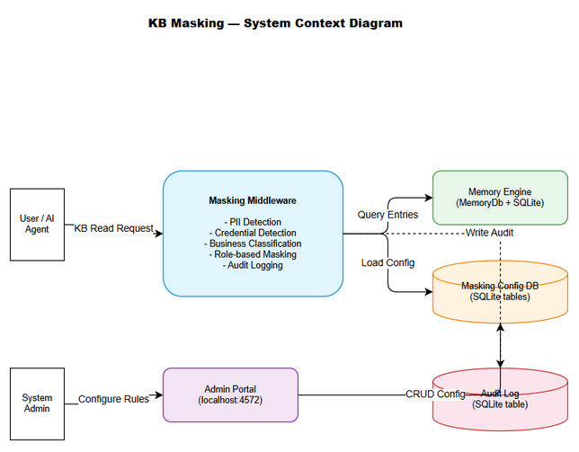
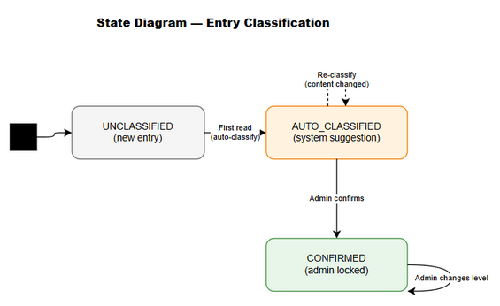
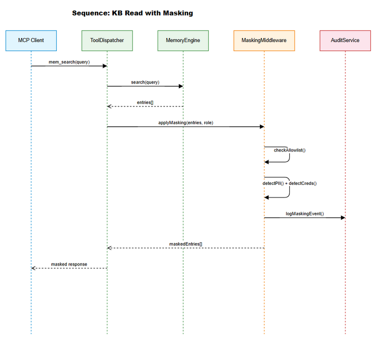
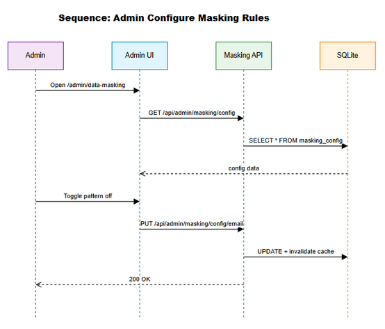

# Functional Specification Document (FSD)

## FEC Code Intelligence — KSA-296: KB Sensitive Data Masking - Read-time PII/Business Logic Redaction

---

## Document Information

| Field | Value |
|-------|-------|
| Jira Ticket | KSA-296 |
| Title | KB Sensitive Data Masking - Read-time PII/Business Logic Redaction |
| Author | BA Agent + TA Agent |
| Version | 1.0 |
| Date | 2025-01-27 |
| Status | Draft |
| Related BRD | BRD-v1-KSA-296.docx |

---

## Revision History

| Version | Date | Author | Changes |
|---------|------|--------|---------|
| 1.0 | 2025-01-27 | BA + TA Agent | Initiate document from BRD with technical enrichment |

---

## 1. Introduction

### 1.1 Purpose

This FSD specifies the functional behavior of the KB Sensitive Data Masking system — a read-time middleware that detects and redacts PII, credentials, and business-sensitive content before returning KB responses based on requester roles.

### 1.2 Scope

Implements read-time masking for Memory module KB read operations (mem_search, mem_map, mem_crud). Includes admin configuration UI, auto-classification, allowlist management, and audit logging.

### 1.3 Definitions and Acronyms

| Term | Definition |
|------|------------|
| PII | Personally Identifiable Information |
| KB | Knowledge Base (Memory module) |
| Masking | Replacing sensitive content with redacted placeholders |
| Sensitivity Level | Classification: PUBLIC, INTERNAL, CONFIDENTIAL, RESTRICTED |
| Allowlist | Entries/patterns exempt from masking |

### 1.4 References

| Document | Location |
|----------|----------|
| BRD | BRD-v1-KSA-296.docx |
| Memory Module | backend/src/modules/memory/ |
| Admin Portal | backend/src/admin/ |

---

## 2. System Overview

### 2.1 System Context Diagram



The masking middleware sits between the Memory Engine and the MCP tool response layer. It intercepts all KB read responses, applies classification and masking rules, logs audit events, and returns processed responses.

### 2.2 Target Architecture

The masking middleware inserts into the existing read path:
1. MCP client sends tool call (mem_search, mem_map, etc.)
2. MemoryToolDispatcher routes to MemoryEngine
3. MemoryEngine queries SQLite via MemoryDb
4. **MaskingMiddleware intercepts results**
5. **Classify -> Detect -> Mask -> Audit**
6. Masked results returned to client

---

## 3. Functional Requirements

### 3.1 Feature: Masking Pipeline

**Source:** BRD Stories 1, 2, 3

#### 3.1.1 Use Case: UC-01 — Read KB Entry with Masking

| Field | Value |
|-------|-------|
| ID | UC-01 |
| Name | Read KB Entry with Masking |
| Actor | User / AI Agent |
| Precondition | User authenticated, KB entry exists |
| Trigger | User calls mem_search, mem_map, or mem_crud (read) |

**Main Flow:**

| Step | Actor | System |
|------|-------|--------|
| 1 | User sends KB read request | |
| 2 | | Retrieves entries from SQLite |
| 3 | | Checks each entry against allowlist |
| 4 | | Extracts code blocks (preserve) |
| 5 | | Runs PII pattern detection |
| 6 | | Runs credential pattern detection |
| 7 | | Runs business logic classification |
| 8 | | Determines masking action (role + sensitivity) |
| 9 | | Applies masking transformations |
| 10 | | Logs audit event |
| 11 | | Returns masked response |

**Alternative Flow — Entry Allowlisted:**

| Step | Action |
|------|--------|
| 3a | Entry matches allowlist rule |
| 3b | Skip all detection, return original content |

**Alternative Flow — Admin Full Access:**

| Step | Action |
|------|--------|
| 8a | Requester has ADMIN role |
| 8b | PII masking skipped for INTERNAL/CONFIDENTIAL |
| 8c | Credentials still masked (always-on) |

**Exception Flow — Detection Error:**

| Step | Action |
|------|--------|
| 5a | Regex throws error |
| 5b | Log error, return unmasked (fail-open for non-credentials) |
| 5c | For credentials: fail-closed (mask entire block) |

---

#### 3.1.2 Use Case: UC-02 — Reveal Masked Credential

| Field | Value |
|-------|-------|
| ID | UC-02 |
| Name | Reveal Masked Credential |
| Actor | System Admin |
| Precondition | Admin authenticated, entry has masked credentials |
| Trigger | Admin requests reveal with explicit flag |

**Main Flow:**

| Step | Actor | System |
|------|-------|--------|
| 1 | Admin sends read with `reveal=true` | |
| 2 | | Verifies ADMIN role |
| 3 | | Retrieves original content |
| 4 | | Creates REVEAL audit entry |
| 5 | | Returns unmasked content |

**Exception — Non-Admin:**

| Step | Action |
|------|--------|
| 2a | Not ADMIN -> 403 Forbidden + audit log |

---

#### 3.1.3 Use Case: UC-03 — Configure Masking Rules

| Field | Value |
|-------|-------|
| ID | UC-03 |
| Name | Configure Masking Rules |
| Actor | System Admin |
| Trigger | Admin navigates to /admin/data-masking |

**Main Flow:**

| Step | Actor | System |
|------|-------|--------|
| 1 | Admin opens config page | |
| 2 | | Loads current config |
| 3 | Admin toggles pattern on/off | |
| 4 | | Saves to SQLite, invalidates cache |
| 5 | | Takes effect on next read |

---

#### 3.1.4 Use Case: UC-04 — Manage Allowlist

| Field | Value |
|-------|-------|
| ID | UC-04 |
| Name | Manage Allowlist |
| Actor | System Admin |

**Main Flow:**

| Step | Actor | System |
|------|-------|--------|
| 1 | Admin adds entry ID / tag / source rule | |
| 2 | | Validates input |
| 3 | | Saves to allowlist table |
| 4 | | Cache invalidated, immediate effect |

---

#### 3.1.5 Use Case: UC-05 — Review Auto-Classification

| Field | Value |
|-------|-------|
| ID | UC-05 |
| Name | Review Auto-Classification |
| Actor | System Admin |

**Main Flow:**

| Step | Actor | System |
|------|-------|--------|
| 1 | Admin views pending classifications | |
| 2 | | Shows entry summary + suggested level + confidence |
| 3 | Admin confirms or changes | |
| 4 | | Locks classification |

---

## 4. Business Rules

| ID | Rule | Applies To |
|----|------|-----------|
| BR-01 | Credentials ALWAYS masked regardless of role (except explicit reveal) | All reads |
| BR-02 | PII masked for non-admin; admin sees unmasked | INTERNAL level |
| BR-03 | CONFIDENTIAL = summary-only for developers | Role = DEV |
| BR-04 | RESTRICTED = hidden entirely for non-admin | Role != ADMIN |
| BR-05 | Allowlist check runs FIRST | Pipeline |
| BR-06 | Auto-classification = suggestion; admin confirms to lock | New entries |
| BR-07 | Masking MUST NOT break markdown/code formatting | All masking |
| BR-08 | Code blocks extracted before masking, restored after | Pipeline |
| BR-09 | Config changes immediate (no restart) | Admin config |
| BR-10 | Audit retention default 90 days | Audit |
| BR-11 | Fail-open (non-credentials), fail-closed (credentials) | Errors |
| BR-12 | < 5ms overhead for entries < 10KB | Performance |

---

## 5. Data Specifications

### 5.1 Masking Configuration Schema

```typescript
interface MaskingConfig {
  id: number;
  pattern_type: 'email' | 'phone' | 'ip' | 'credit_card' | 'ssn' | 'api_key' | 'jwt' | 'password' | 'connection_string' | 'private_key';
  enabled: boolean;
  regex_pattern: string | null;
  mask_format: string;
  category: 'pii' | 'credential' | 'business';
  created_at: string;
  updated_at: string;
}
```

### 5.2 Sensitivity Classification Schema

```typescript
interface SensitivityClassification {
  id: number;
  entry_id: number;
  level: 'PUBLIC' | 'INTERNAL' | 'CONFIDENTIAL' | 'RESTRICTED';
  source: 'auto' | 'manual';
  confidence: number;
  confirmed_by: string | null;
  confirmed_at: string | null;
  created_at: string;
  updated_at: string;
}
```

### 5.3 Allowlist Schema

```typescript
interface AllowlistRule {
  id: number;
  rule_type: 'entry_id' | 'tag' | 'source' | 'pattern';
  rule_value: string;
  description: string;
  created_by: string;
  created_at: string;
}
```

### 5.4 Masking Audit Log Schema

```typescript
interface MaskingAuditEntry {
  id: number;
  entry_id: number;
  requester_id: string;
  requester_role: string;
  action: 'mask_pii' | 'mask_credential' | 'summary_only' | 'hide' | 'reveal' | 'skip_allowlist';
  patterns_matched: string;
  sensitivity_level: string;
  timestamp: string;
}
```

### 5.5 Role-Permission Matrix

| Role | PUBLIC | INTERNAL | CONFIDENTIAL | RESTRICTED |
|------|--------|----------|--------------|------------|
| ADMIN | Full | Full | Full | Masked creds (reveal available) |
| DEVELOPER | Full | Masked PII | Summary only | Hidden |
| USER | Full | Masked PII | Summary only | Hidden |
| EXTERNAL | Full | Hidden | Hidden | Hidden |

---

## 6. API Specifications

### 6.1 GET /api/admin/masking/config

Returns current masking configuration.

**Response 200:**
```json
{
  "patterns": [
    { "pattern_type": "email", "enabled": true, "regex_pattern": null, "mask_format": "u***@d***.com", "category": "pii" }
  ],
  "role_permissions": { "ADMIN": ["PUBLIC","INTERNAL","CONFIDENTIAL","RESTRICTED"], "DEVELOPER": ["PUBLIC"] }
}
```

### 6.2 PUT /api/admin/masking/config/:patternType

Update a specific pattern config.

**Request:**
```json
{ "enabled": false }
```

**Response:** 200 with updated pattern

### 6.3 GET /api/admin/masking/allowlist

**Response 200:**
```json
{ "rules": [{ "id": 1, "rule_type": "entry_id", "rule_value": "42", "description": "Public README" }] }
```

### 6.4 POST /api/admin/masking/allowlist

**Request:**
```json
{ "rule_type": "tag", "rule_value": "public-docs", "description": "All public docs" }
```

**Response:** 201 Created

### 6.5 DELETE /api/admin/masking/allowlist/:id

**Response:** 204 No Content

### 6.6 GET /api/admin/masking/classifications?status=pending

**Response 200:**
```json
{
  "entries": [
    { "entry_id": 99, "suggested_level": "CONFIDENTIAL", "confidence": 0.85, "entry_summary": "..." }
  ]
}
```

### 6.7 PUT /api/admin/masking/classifications/:entryId

**Request:**
```json
{ "level": "CONFIDENTIAL", "action": "confirm" }
```

**Response:** 200

### 6.8 GET /api/admin/masking/audit?from=&to=&entry_id=

**Response 200:**
```json
{
  "events": [{ "id": 1, "entry_id": 42, "requester_id": "agent-1", "action": "mask_pii", "timestamp": "..." }],
  "total": 150,
  "page": 1
}
```

### 6.9 mem_search Enhancement (Transparent)

No new parameters for normal users. Response enhanced with masking metadata:

```json
{
  "content": "[MASKED] This entry contains u***@e***.com",
  "masking_applied": true,
  "sensitivity_level": "INTERNAL",
  "masked_patterns": ["email"]
}
```

Admin-only `reveal` parameter:
```
mem_search(query: "...", reveal: true)
```

---

## 7. Detection Pseudocode

### 7.1 Main Pipeline

```pseudocode
function applyMasking(entries, requesterRole, reveal):
  config = loadCachedConfig()
  allowlist = loadCachedAllowlist()
  
  for each entry:
    if isAllowlisted(entry, allowlist): skip
    
    classification = getOrAutoClassify(entry)
    if not canAccess(requesterRole, classification.level): hide entry
    
    {text, codeBlocks} = extractCodeBlocks(entry.content)
    pii = detectPII(text, config)
    creds = detectCredentials(text, config)
    
    masked = entry.content
    if creds and not (reveal and role == ADMIN):
      masked = applyCredMask(masked, creds)
    if pii and role != ADMIN:
      masked = applyPIIMask(masked, pii)
    if classification == CONFIDENTIAL and role != ADMIN:
      masked = entry.summary
    
    masked = restoreCodeBlocks(masked, codeBlocks)
    logAudit(entry.id, role, pii, creds, classification)
    yield {entry with content: masked}
```

### 7.2 Auto-Classification

```pseudocode
function autoClassify(entry):
  // Source rules (highest priority)
  rule = findSourceRule(entry.source)
  if rule: return {level: rule.level, confidence: 1.0}
  
  // Content analysis
  hasPII = detectPII(entry.content).length > 0
  hasCreds = detectCredentials(entry.content).length > 0
  
  if hasCreds: return {level: RESTRICTED, confidence: 0.95}
  if hasPII: return {level: INTERNAL, confidence: 0.9}
  
  // Keyword heuristic
  score = keywordScore(entry.content, BUSINESS_KEYWORDS)
  if score >= 0.5: return {level: CONFIDENTIAL, confidence: score}
  
  return {level: PUBLIC, confidence: 0.8}
```

---

## 8. State Diagram



| State | Transitions |
|-------|-------------|
| UNCLASSIFIED | -> AUTO_CLASSIFIED (first read) |
| AUTO_CLASSIFIED | -> CONFIRMED (admin confirms) |
| CONFIRMED | -> CONFIRMED (admin changes) |

---

## 9. Sequence Diagrams





---

## 10. Error Handling

| Scenario | Behavior | User Impact |
|----------|----------|-------------|
| Regex error | Log, skip pattern | Unmasked for that pattern |
| Classification fails | Default INTERNAL | Slightly over-masked |
| DB write fails (audit) | Log, continue | No audit (non-blocking) |
| Config load fails | Use defaults (all enabled) | Default masking |
| Credential detection fails | Fail-closed: mask block | Content hidden (safe) |

---

## 11. Non-Functional Requirements

| Category | Target |
|----------|--------|
| Latency overhead | < 5ms (p95) for < 10KB entries |
| Large entry | < 20ms (p95) for 10-100KB |
| Classification accuracy | > 80% |
| Concurrent reads | 100 without degradation |
| Audit storage | ~100 bytes/event, 90-day purge |

---

## Appendix

### Diagram Index

| # | Diagram | Image | Source (editable) |
|---|---------|-------|-------------------|
| 1 | System Context | [system-context.png](diagrams/system-context.png) | [system-context.drawio](diagrams/system-context.drawio) |
| 2 | Sequence: Read with Masking | [sequence-read-masking.png](diagrams/sequence-read-masking.png) | [sequence-read-masking.drawio](diagrams/sequence-read-masking.drawio) |
| 3 | Sequence: Admin Config | [sequence-admin-config.png](diagrams/sequence-admin-config.png) | [sequence-admin-config.drawio](diagrams/sequence-admin-config.drawio) |
| 4 | State: Classification | [state-classification.png](diagrams/state-classification.png) | [state-classification.drawio](diagrams/state-classification.drawio) |
