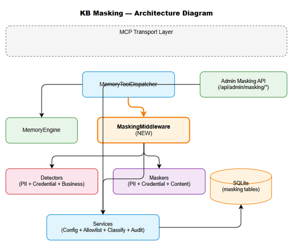
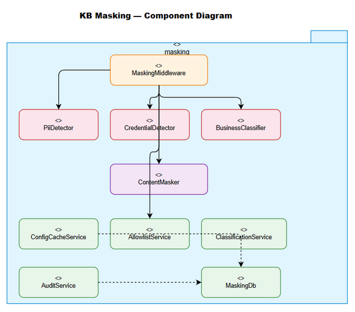

# Technical Design Document (TDD)

## FEC Code Intelligence — KSA-296: KB Sensitive Data Masking - Read-time PII/Business Logic Redaction

---

## Document Information

| Field | Value |
|-------|-------|
| Jira Ticket | KSA-296 |
| Title | KB Sensitive Data Masking - Technical Design |
| Author | SA Agent |
| Version | 1.0 |
| Date | 2025-01-27 |
| Status | Draft |
| Related FSD | FSD-v1-KSA-296.docx |
| Related BRD | BRD-v1-KSA-296.docx |

---

## Revision History

| Version | Date | Author | Changes |
|---------|------|--------|---------|
| 1.0 | 2025-01-27 | SA Agent | Initial technical design |

---

## 1. Architecture Overview

### 1.1 Design Philosophy

The masking system is designed as a **middleware layer** that plugs into the existing Memory module's read path. Key principles:

- **Single Responsibility**: Each detector (PII, credential, business) is its own class
- **Strategy Pattern**: Detection strategies are pluggable and configurable
- **Cache-First**: Config and allowlist are cached in-memory with invalidation
- **Non-Blocking Audit**: Audit logging is fire-and-forget (async write)
- **Fail-Safe**: Credential detection fails closed; PII fails open

### 1.2 Architecture Diagram



### 1.3 Component Diagram



---

## 2. Module Design

### 2.1 New Module: `backend/src/modules/memory/masking/`

```
backend/src/modules/memory/masking/
  index.ts                    # Module entry point, exports MaskingMiddleware
  MaskingMiddleware.ts        # Main orchestrator (< 200 lines)
  MaskingConfig.ts            # Config loader + cache
  detectors/
    DetectorStrategy.ts       # Interface for all detectors
    PiiDetector.ts            # PII regex detection
    CredentialDetector.ts     # Credential regex detection
    BusinessClassifier.ts     # Business logic heuristic
  maskers/
    MaskerStrategy.ts         # Interface for masking application
    PiiMasker.ts              # Apply PII masking formats
    CredentialMasker.ts       # Apply credential redaction
    ContentMasker.ts          # Orchestrates all maskers
  models/
    MaskingTypes.ts           # TypeScript interfaces/types
    DetectionResult.ts        # Detection result model
    SensitivityLevel.ts       # Enum + permission matrix
  services/
    AllowlistService.ts       # Allowlist check logic
    ClassificationService.ts  # Auto-classification + confirm
    AuditService.ts           # Audit logging (async)
    ConfigCacheService.ts     # In-memory cache with invalidation
  db/
    MaskingDb.ts              # SQLite queries for masking tables
    migrations/
      001-masking-tables.sql  # Create masking tables
  __tests__/
    PiiDetector.test.ts
    CredentialDetector.test.ts
    MaskingMiddleware.test.ts
    AllowlistService.test.ts
    AuditService.test.ts
```

### 2.2 New Admin Routes: `backend/src/admin/routes/masking.router.ts`

```
backend/src/admin/routes/
  masking.router.ts           # REST API for masking config
```

### 2.3 Admin UI Page: `backend/src/admin/` (served as static HTML)

New page added to existing admin portal tab navigation.

---

## 3. Class Design

### 3.1 MaskingMiddleware (Main Orchestrator)

```typescript
// backend/src/modules/memory/masking/MaskingMiddleware.ts
export class MaskingMiddleware {
  constructor(
    private config: ConfigCacheService,
    private allowlist: AllowlistService,
    private piiDetector: PiiDetector,
    private credDetector: CredentialDetector,
    private classifier: ClassificationService,
    private masker: ContentMasker,
    private audit: AuditService
  ) {}

  async applyMasking(
    entries: KnowledgeEntry[],
    requesterRole: string,
    options?: { reveal?: boolean }
  ): Promise<MaskedEntry[]> { ... }
}
```

### 3.2 DetectorStrategy (Interface)

```typescript
// backend/src/modules/memory/masking/detectors/DetectorStrategy.ts
export interface DetectorStrategy {
  detect(content: string): DetectionResult[];
  readonly category: 'pii' | 'credential' | 'business';
}
```

### 3.3 PiiDetector

```typescript
// backend/src/modules/memory/masking/detectors/PiiDetector.ts
export class PiiDetector implements DetectorStrategy {
  readonly category = 'pii';
  private patterns: Map<string, RegExp>;  // pre-compiled

  constructor(config: MaskingConfig[]) {
    this.patterns = this.compilePatterns(config);
  }

  detect(content: string): DetectionResult[] { ... }
  
  private compilePatterns(config: MaskingConfig[]): Map<string, RegExp> { ... }
}
```

### 3.4 CredentialDetector

```typescript
// backend/src/modules/memory/masking/detectors/CredentialDetector.ts
export class CredentialDetector implements DetectorStrategy {
  readonly category = 'credential';
  private patterns: Map<string, RegExp>;

  detect(content: string): DetectionResult[] { ... }
}
```

### 3.5 BusinessClassifier

```typescript
// backend/src/modules/memory/masking/detectors/BusinessClassifier.ts
export class BusinessClassifier {
  classify(entry: KnowledgeEntry): SensitivityClassification { ... }
  
  private scoreByKeywords(content: string): number { ... }
  private scoreBySource(source: string | null): number { ... }
  private scoreByType(type: string): number { ... }
}
```

### 3.6 ContentMasker

```typescript
// backend/src/modules/memory/masking/maskers/ContentMasker.ts
export class ContentMasker {
  applyMasking(
    content: string,
    detections: DetectionResult[],
    role: string,
    level: SensitivityLevel,
    reveal: boolean
  ): string { ... }
  
  private extractCodeBlocks(content: string): { text: string; blocks: CodeBlock[] } { ... }
  private restoreCodeBlocks(content: string, blocks: CodeBlock[]): string { ... }
}
```

### 3.7 AuditService

```typescript
// backend/src/modules/memory/masking/services/AuditService.ts
export class AuditService {
  async logEvent(event: MaskingAuditEntry): Promise<void> { ... }  // non-blocking
  async query(filters: AuditFilters): Promise<AuditEntry[]> { ... }
  async purgeExpired(retentionDays: number): Promise<number> { ... }
}
```

### 3.8 ConfigCacheService

```typescript
// backend/src/modules/memory/masking/services/ConfigCacheService.ts
export class ConfigCacheService {
  private cache: MaskingConfig[] | null = null;
  private lastLoaded: number = 0;
  private readonly TTL = 60_000; // 1 minute cache

  async getConfig(): Promise<MaskingConfig[]> { ... }
  invalidate(): void { this.cache = null; }
}
```

---

## 4. Database Design

### 4.1 New Tables (SQLite Migration)

```sql
-- 001-masking-tables.sql

CREATE TABLE IF NOT EXISTS masking_config (
  id INTEGER PRIMARY KEY AUTOINCREMENT,
  pattern_type TEXT NOT NULL UNIQUE,
  enabled INTEGER NOT NULL DEFAULT 1,
  regex_pattern TEXT,
  mask_format TEXT NOT NULL,
  category TEXT NOT NULL CHECK(category IN ('pii', 'credential', 'business')),
  created_at TEXT NOT NULL DEFAULT (datetime('now')),
  updated_at TEXT NOT NULL DEFAULT (datetime('now'))
);

CREATE TABLE IF NOT EXISTS sensitivity_classifications (
  id INTEGER PRIMARY KEY AUTOINCREMENT,
  entry_id INTEGER NOT NULL,
  level TEXT NOT NULL CHECK(level IN ('PUBLIC', 'INTERNAL', 'CONFIDENTIAL', 'RESTRICTED')),
  source TEXT NOT NULL CHECK(source IN ('auto', 'manual')),
  confidence REAL NOT NULL DEFAULT 0,
  confirmed_by TEXT,
  confirmed_at TEXT,
  created_at TEXT NOT NULL DEFAULT (datetime('now')),
  updated_at TEXT NOT NULL DEFAULT (datetime('now')),
  UNIQUE(entry_id)
);

CREATE TABLE IF NOT EXISTS masking_allowlist (
  id INTEGER PRIMARY KEY AUTOINCREMENT,
  rule_type TEXT NOT NULL CHECK(rule_type IN ('entry_id', 'tag', 'source', 'pattern')),
  rule_value TEXT NOT NULL,
  description TEXT,
  created_by TEXT,
  created_at TEXT NOT NULL DEFAULT (datetime('now'))
);

CREATE TABLE IF NOT EXISTS masking_audit_log (
  id INTEGER PRIMARY KEY AUTOINCREMENT,
  entry_id INTEGER NOT NULL,
  requester_id TEXT NOT NULL,
  requester_role TEXT NOT NULL,
  action TEXT NOT NULL,
  patterns_matched TEXT,
  sensitivity_level TEXT,
  timestamp TEXT NOT NULL DEFAULT (datetime('now'))
);

CREATE INDEX IF NOT EXISTS idx_audit_timestamp ON masking_audit_log(timestamp);
CREATE INDEX IF NOT EXISTS idx_audit_entry ON masking_audit_log(entry_id);
CREATE INDEX IF NOT EXISTS idx_classification_entry ON sensitivity_classifications(entry_id);
```

### 4.2 Default Seed Data

```sql
-- Seed default patterns
INSERT INTO masking_config (pattern_type, enabled, mask_format, category) VALUES
  ('email', 1, 'u***@d***.com', 'pii'),
  ('phone', 1, '+X-***-***-XXXX', 'pii'),
  ('ip', 1, 'X.X.*.*', 'pii'),
  ('credit_card', 1, '****-****-****-XXXX', 'pii'),
  ('ssn', 1, '***-**-XXXX', 'pii'),
  ('api_key', 1, '[REDACTED]', 'credential'),
  ('jwt', 1, 'eyJ***[REDACTED]', 'credential'),
  ('password', 1, '[REDACTED]', 'credential'),
  ('connection_string', 1, '[REDACTED_URI]', 'credential'),
  ('private_key', 1, '[REDACTED_KEY]', 'credential');
```

---

## 5. Integration Design

### 5.1 Memory Module Integration Point

The masking middleware integrates at the `MemoryToolDispatcher` level. The dispatcher wraps results through the middleware before returning:

```typescript
// In MemoryToolDispatcher.ts (modified)
import { MaskingMiddleware } from './masking';

class MemoryToolDispatcher {
  private masking: MaskingMiddleware;

  async dispatch(toolName: string, args: any, context: ScopeContext): Promise<ToolResult> {
    const result = await this.engine.execute(toolName, args, context);
    
    // Apply masking to search/read results
    if (this.isReadOperation(toolName) && result.entries) {
      const role = await this.getRoleForContext(context);
      result.entries = await this.masking.applyMasking(
        result.entries, role, { reveal: args.reveal }
      );
    }
    
    return result;
  }
  
  private isReadOperation(tool: string): boolean {
    return ['mem_search', 'mem_map', 'mem_crud'].includes(tool) 
      && /* is read operation */;
  }
}
```

### 5.2 Admin Router Integration

```typescript
// In backend/src/admin/index.ts (modified)
import maskingRouter from './routes/masking.router';

app.use('/api/admin/masking', maskingRouter);
```

---

## 6. Performance Design

### 6.1 Caching Strategy

| Cache | TTL | Invalidation |
|-------|-----|-------------|
| MaskingConfig | 60s | On admin config update (immediate) |
| Allowlist rules | 60s | On allowlist CRUD (immediate) |
| Compiled regex | Permanent (until config reload) | On config change |
| Classifications | None (read-through) | N/A |

### 6.2 Performance Optimizations

1. **Pre-compiled RegExp**: All patterns compiled once on config load, stored in Map
2. **Early exit**: Allowlist check first (O(1) for entry_id, O(n) for tag/pattern)
3. **Batch detection**: All patterns run in single pass over content
4. **Non-blocking audit**: Audit write is fire-and-forget (Promise not awaited in hot path)
5. **Code block skip**: Extracted code blocks not scanned for PII (reduces regex work)

### 6.3 Performance Budget

| Operation | Budget | Notes |
|-----------|--------|-------|
| Allowlist check | < 0.1ms | Hash lookup |
| Code block extraction | < 0.5ms | Single regex pass |
| PII detection (5 patterns) | < 2ms | Pre-compiled regex |
| Credential detection (5 patterns) | < 1ms | Pre-compiled regex |
| Business classification | < 0.5ms | Keyword scoring |
| Masking application | < 0.5ms | String replace |
| Audit log (async) | 0ms overhead | Non-blocking |
| **Total** | **< 5ms** | Target met |

---

## 7. Security Design

### 7.1 Threat Model

| Threat | Mitigation |
|--------|-----------|
| Admin credential leak via KB | Credentials always masked (even for admin) |
| Bypass via direct DB access | Out of scope (DB access = server access) |
| Regex ReDoS attack | Use safe regex patterns, timeout per match |
| Classification manipulation | Only admin can confirm; auto-suggest is advisory |
| Audit log tampering | Audit table is append-only (no UPDATE/DELETE API) |
| Reveal abuse | Reveal action creates audit trail, rate-limited |

### 7.2 Regex Safety

All regex patterns MUST be validated for ReDoS resistance:
- No nested quantifiers (`(a+)+`)
- No overlapping alternations
- Maximum match length bounded
- Execution timeout: 10ms per pattern per entry

### 7.3 Role Verification

Role is determined from the `ScopeContext` passed to every tool call. The masking middleware trusts this context (already validated by the MCP transport layer).

---

## 8. Error Handling Design

| Error | Strategy | Behavior |
|-------|----------|----------|
| Regex timeout | Catch, log, skip pattern | Fail-open (PII), Fail-closed (credential) |
| DB read error (config) | Use cached config | Stale but functional |
| DB write error (audit) | Log to file, continue | Non-blocking |
| DB write error (classification) | Retry once, then skip | Entry stays unclassified |
| Invalid config (bad regex) | Reject on save, use default | Admin sees validation error |
| Unknown role | Default to most restrictive (EXTERNAL) | Over-masked but safe |

---

## 9. Testing Strategy

### 9.1 Unit Tests

| Test File | Coverage |
|-----------|----------|
| PiiDetector.test.ts | All PII patterns, edge cases, false positives |
| CredentialDetector.test.ts | All credential patterns, embedded creds |
| BusinessClassifier.test.ts | Keyword scoring, source rules, thresholds |
| ContentMasker.test.ts | Code block preservation, format integrity |
| AllowlistService.test.ts | Entry ID, tag, source, pattern matching |
| ConfigCacheService.test.ts | Cache hit/miss, invalidation, TTL |

### 9.2 Integration Tests

| Test | Scope |
|------|-------|
| MaskingMiddleware.integration.test.ts | Full pipeline with real SQLite |
| Admin API masking tests | Config CRUD, allowlist CRUD, audit query |

### 9.3 Performance Tests

- Benchmark: 1000 entries × 5 patterns < 5s total
- Single entry < 5ms (p95)
- Concurrent reads: 100 parallel, no degradation

---

## 10. Implementation Checklist

### Phase 1: Core Masking Engine

- [ ] Create `masking/` module directory structure
- [ ] Implement `MaskingTypes.ts` (interfaces)
- [ ] Implement `PiiDetector.ts` with default patterns
- [ ] Implement `CredentialDetector.ts` with default patterns
- [ ] Implement `ContentMasker.ts` (code block extraction + masking)
- [ ] Implement `MaskingMiddleware.ts` (orchestrator)
- [ ] Write unit tests for detectors

### Phase 2: Database + Config

- [ ] Create SQLite migration (`001-masking-tables.sql`)
- [ ] Implement `MaskingDb.ts` (queries)
- [ ] Implement `ConfigCacheService.ts`
- [ ] Implement `AllowlistService.ts`
- [ ] Implement `ClassificationService.ts`
- [ ] Seed default config data

### Phase 3: Integration

- [ ] Integrate `MaskingMiddleware` into `MemoryToolDispatcher`
- [ ] Implement `AuditService.ts` (async logging)
- [ ] Integration tests

### Phase 4: Admin API + UI

- [ ] Implement `masking.router.ts` (REST API)
- [ ] Create admin UI page (data-masking tab)
- [ ] E2E tests for admin API

### Phase 5: Polish

- [ ] Performance benchmarks
- [ ] ReDoS safety audit on all regex
- [ ] Audit log purge cron job
- [ ] Documentation (UG section)

---

## 11. Risks and Mitigations

| Risk | Impact | Mitigation |
|------|--------|-----------|
| Regex performance on large content | Slow reads | Pre-compiled, early exit, 10ms timeout |
| False positives masking valid content | User confusion | Allowlist, admin override, high accuracy threshold |
| Migration breaks existing data | Data loss | Migration is additive (new tables only) |
| Cache staleness after config update | Stale masking rules | Immediate cache invalidation on write |

---

## Appendix

### Default Regex Patterns

| Pattern Type | Regex |
|-------------|-------|
| email | `[a-zA-Z0-9._%+-]+@[a-zA-Z0-9.-]+\.[a-zA-Z]{2,}` |
| phone | `(\+?\d{1,3}[-.\s]?)?\(?\d{3}\)?[-.\s]?\d{3}[-.\s]?\d{4}` |
| ip | `\b\d{1,3}\.\d{1,3}\.\d{1,3}\.\d{1,3}\b` |
| credit_card | `\b\d{4}[-\s]?\d{4}[-\s]?\d{4}[-\s]?\d{4}\b` |
| ssn | `\b\d{3}[-\s]?\d{2}[-\s]?\d{4}\b` |
| api_key | `\b(sk-[a-zA-Z0-9]{20,}|pk_[a-zA-Z0-9]{20,}|AKIA[A-Z0-9]{16}|ghp_[a-zA-Z0-9]{36}|glpat-[a-zA-Z0-9-]{20,})\b` |
| jwt | `eyJ[a-zA-Z0-9_-]{10,}\.[a-zA-Z0-9_-]{10,}\.[a-zA-Z0-9_-]{10,}` |
| password | `(password|passwd|secret|token|api_key)\s*[=:]\s*[^\s,;]{3,}` |
| connection_string | `(mongodb|postgres|mysql|redis|amqp):\/\/[^\s]+` |
| private_key | `-----BEGIN\s+(RSA\s+|EC\s+)?PRIVATE\s+KEY-----` |

### Diagram Index

| # | Diagram | Image | Source (editable) |
|---|---------|-------|-------------------|
| 1 | Architecture | [architecture.png](diagrams/architecture.png) | [architecture.drawio](diagrams/architecture.drawio) |
| 2 | Component | [component.png](diagrams/component.png) | [component.drawio](diagrams/component.drawio) |
