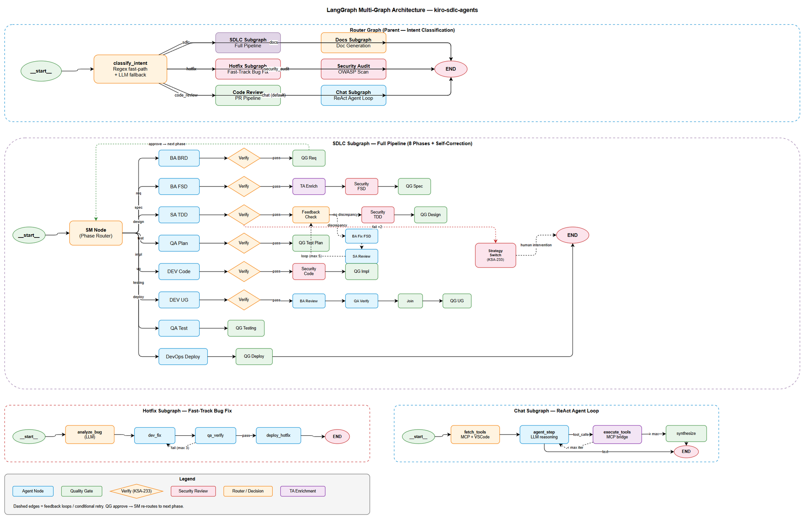
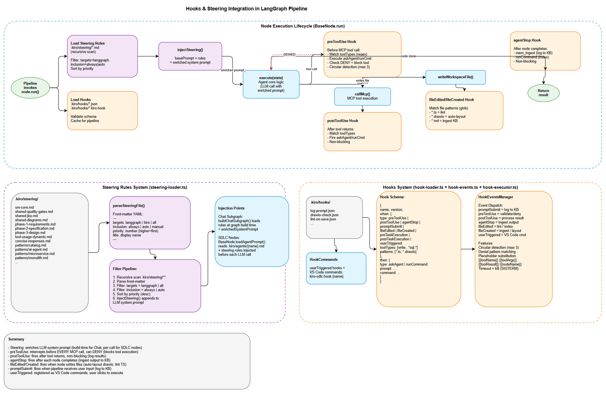

# LangGraph Multi-Graph Architecture



## Tổng quan

Hệ thống sử dụng **LangGraph** (StateGraph) với kiến trúc **multi-graph** — một Router Graph cha phân loại intent và delegate sang 6 subgraph chuyên biệt.

## Kiến trúc

### 1. Router Graph (Parent)

Entry point duy nhất. Phân loại user input bằng **2-layer classification**:
- **Fast path**: Regex patterns (confidence ≥ 0.8 → route ngay)
- **LLM fallback**: Khi regex không đủ confident, gọi LLM one-shot classify

| Intent | Subgraph | Mô tả |
|--------|----------|--------|
| `sdlc` | SDLC Subgraph | Full pipeline 8 phases (BRD → Deploy) |
| `hotfix` | Hotfix Subgraph | Fast-track bug fix (max 3 retries) |
| `code_review` | Code Review Subgraph | PR review + security scan |
| `docs` | Docs Subgraph | Document generation (UG/DPG/BRD) |
| `security_audit` | Security Audit Subgraph | OWASP vulnerability scan |
| `chat` | Chat Subgraph | ReAct agent loop (default) |

Subgraphs được **lazy-loaded** — chỉ import khi cần (zero activation impact).

### 2. SDLC Subgraph (Full Pipeline)

Pipeline đầy đủ 8 phases với **self-correction** (KSA-233):

```
SM → Agent Node → Verify → [pass?]
  pass → Security Review → Quality Gate → [approve?]
    approve → SM (next phase)
    reject → END (wait for user)
    revise → Agent Node (redo)
  fail → Agent Node (retry, max 2)
  fail ×2 → Strategy Switch → [alternate?]
    yes → Agent Node (alternate strategy)
    no → END (human intervention)
```

**Phases:**

| # | Phase | Node | Verify | Security | QG |
|---|-------|------|--------|----------|----|
| 1 | Requirements | BA BRD | ✅ | — | ✅ |
| 2 | Specification | BA FSD → TA Enrich | ✅ | ✅ FSD | ✅ |
| 3 | Design | SA TDD + Feedback Loop (max 5) | ✅ | ✅ TDD | ✅ |
| 4 | Test Planning | QA Plan | ✅ | — | ✅ |
| 5 | Implementation | DEV Code | ✅ | ✅ Code | ✅ |
| 5.5 | User Guide | DEV UG → BA Review → QA Verify → Join | ✅ | — | ✅ |
| 6 | Testing | QA Test | — | — | ✅ |
| 7 | Deployment | DevOps Deploy | — | — | ✅ |

**Feedback Loop (Phase 3):**
- SA tạo TDD → check DISCREPANCY.md
- Có discrepancy → BA fix FSD → SA review → check lại
- Loop max 5 lần, sau đó pause cho human

**Self-Correction (KSA-233):**
- Mỗi agent output được Verify Node kiểm tra bằng LLM
- Fail → retry agent (max 2 attempts)
- Vẫn fail → Strategy Switch: alternate strategy hoặc human intervention

### 3. Hotfix Subgraph

Fast-track cho bug fix khẩn cấp:

```
__start__ → analyze_bug (LLM) → dev_fix → qa_verify → [pass?]
  pass → deploy_hotfix → END
  fail → dev_fix (loop, max 3 attempts)
```

### 4. Code Review Subgraph

Sequential pipeline:

```
__start__ → fetch_context → security_scan → quality_review → report → END
```

### 5. Docs Subgraph

Route tới agent phù hợp theo loại document:

```
__start__ → detect_doc_type → [BA | DEV | DevOps] → qa_verify → END
```

- BRD/FSD → BA
- UG/API docs → DEV
- DPG/RLN → DevOps

### 6. Security Audit Subgraph

3-phase scan + consolidated report:

```
__start__ → scan_dependencies → scan_code_patterns → scan_config → generate_report → END
```

### 7. Chat Subgraph (ReAct Agent Loop)

Tool-calling agent:

```
__start__ → fetch_tools → agent_step → [tool_calls?]
  tool_calls → execute_tools → [< max iterations?]
    yes → agent_step (loop)
    no → synthesize → END
  text response → END
```

- Tools: MCP bridge + VS Code built-in tools
- Scratchpad: correctly-paired assistant(tool_use) + tool(result) messages
- Max iterations cap → synthesize forced final answer

## Shared State

Tất cả subgraphs chia sẻ `PipelineAnnotation` state với:
- Pipeline metadata (ticketKey, threadId, phase, status)
- Document states (per-phase)
- Agent outputs (capped 50)
- Chat history (capped 200)
- Quality gate results
- Self-correction state (verify attempts, strategy history)
- ReAct state (tool calls, scratchpad, iterations)

## Components

| File | Vai trò |
|------|---------|
| `graph-builder.ts` | Entry point — build Router Graph |
| `langgraph-engine.ts` | Public API (invoke, resume, cancel) |
| `state.ts` | Shared PipelineAnnotation |
| `edges.ts` | Conditional routing logic |
| `router/router-graph.ts` | Router Graph construction |
| `router/intent-classifier.ts` | Regex + LLM intent classification |
| `graphs/*.ts` | 6 subgraph definitions |
| `nodes/*.ts` | 13 node implementations |
| `checkpointer.ts` | State persistence |
| `mcp-bridge.ts` | Tool execution via MCP |
| `stream-handler.ts` | Real-time event streaming |

## Hooks & Steering Integration



### Steering Rules

Steering rules (`.kiro/steering/*.md`) được inject vào LLM system prompt:

1. **SteeringLoader** scan recursive thư mục `.kiro/steering/` (bao gồm subdirectories)
2. Parse front-matter YAML: `targets`, `inclusion`, `priority`
3. Filter cho pipeline: `targets=langgraph|all` + `inclusion=always|auto`
4. Sort by priority (descending)
5. `injectSteering()` append rules vào base system prompt

**Injection points:**
- **Chat Subgraph**: load 1 lần khi build graph → `enrichedSystemPrompt`
- **SDLC Nodes**: `loadAgentPrompt()` đọc `.kiro/agents/{name}.md` + steering trước mỗi LLM call

### Hooks

Hooks (`.kiro/hooks/*.json`) fire tại các lifecycle events:

| Event | Timing | Example Use |
|-------|--------|-------------|
| `promptSubmit` | User gửi input | Log to KB |
| `preToolUse` | Trước MCP call | Validate, DENY nếu cần |
| `postToolUse` | Sau MCP call | Process result |
| `agentStop` | Node hoàn thành | Ingest output to KB |
| `fileEdited` | Node write file | Lint, auto-layout |
| `fileCreated` | Node tạo file mới | Ingest KB |
| `userTriggered` | User click button | VS Code command |
| `preTaskExecution` | Task bắt đầu | Validate prerequisites |
| `postTaskExecution` | Task hoàn thành | Run tests |

**Key features:**
- **Circular detection**: max depth 3 — prevent infinite loops
- **Denial pattern**: preToolUse can DENY (FORBIDDEN, ACCESS_DENIED) → block tool
- **Placeholder substitution**: `{{toolName}}`, `{{toolArgs}}`, `{{toolResult}}`, `{{nodeName}}`
- **Non-blocking**: hook failures never crash pipeline
- **Tool category classification**: read, write, shell, web, spec + regex patterns

### Diagram Index

| # | Diagram | Image | Source (editable) |
|---|---------|-------|-------------------|
| 1 | LangGraph Workflow | [langgraph-workflow.png](langgraph-workflow.png) | [langgraph-workflow.drawio](langgraph-workflow.drawio) |
| 2 | Hooks & Steering Integration | [hooks-steering-integration.png](hooks-steering-integration.png) | [hooks-steering-integration.drawio](hooks-steering-integration.drawio) |
