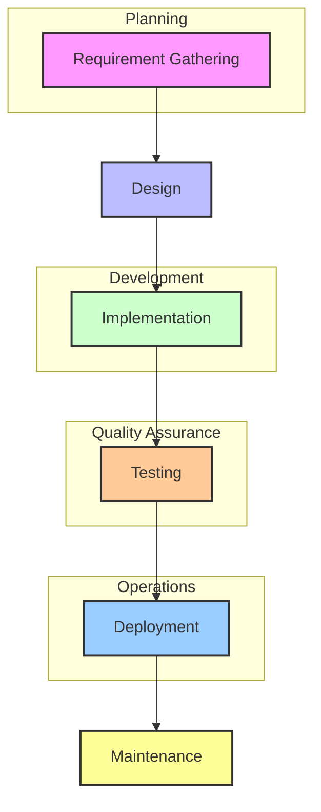

# SDLC Pipeline Diagram

## SDLC Pipeline Overview

## Key Components

- **Requirement Gathering**: Collect and analyze project requirements
- **Design**: Create architectural and detailed designs
- **Implementation**: Develop the actual code/solution
- **Testing**: Verify functionality and quality
- **Deployment**: Release to production environment
- **Maintenance**: Ongoing support and updates

## Current Status

- **LLM Provider**: Anthropic (Claude models recommended)
- **API Configuration**: Key management and endpoint settings
- **Connection Test**: Verify LLM configuration works end-to-end

*Diagram generated based on SDLC Pipeline Settings interface*