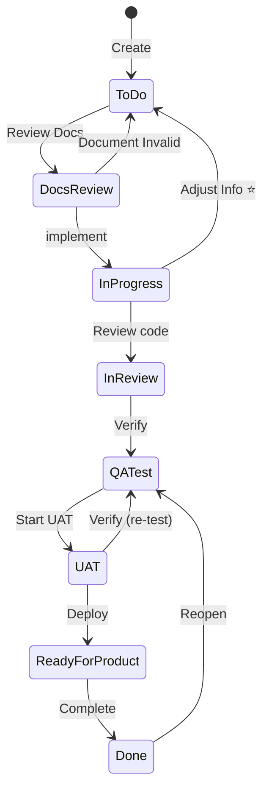
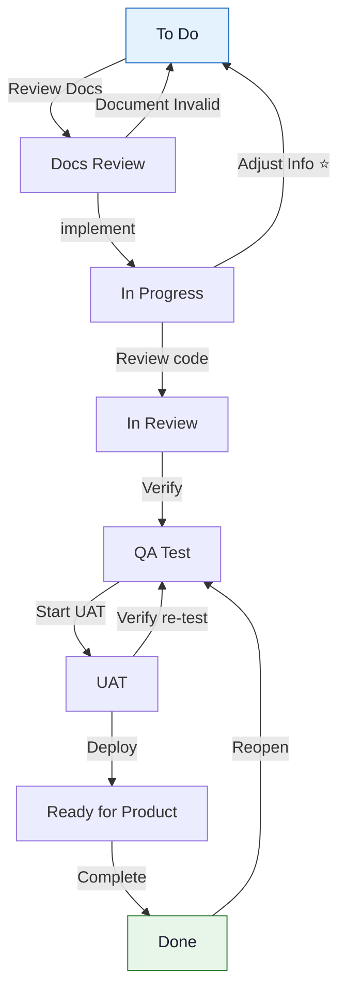
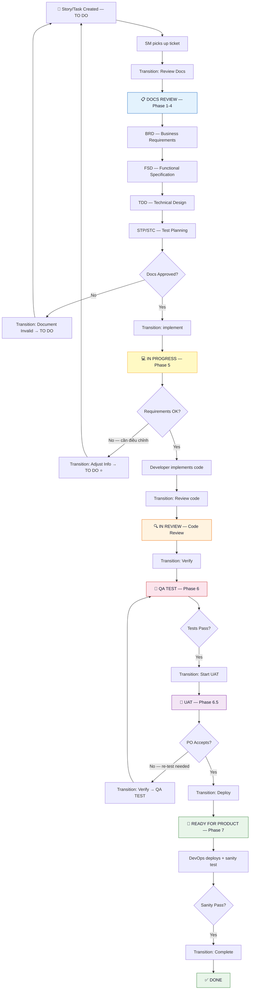
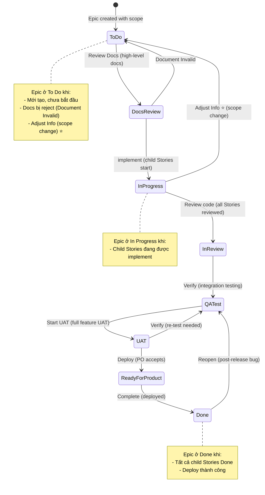
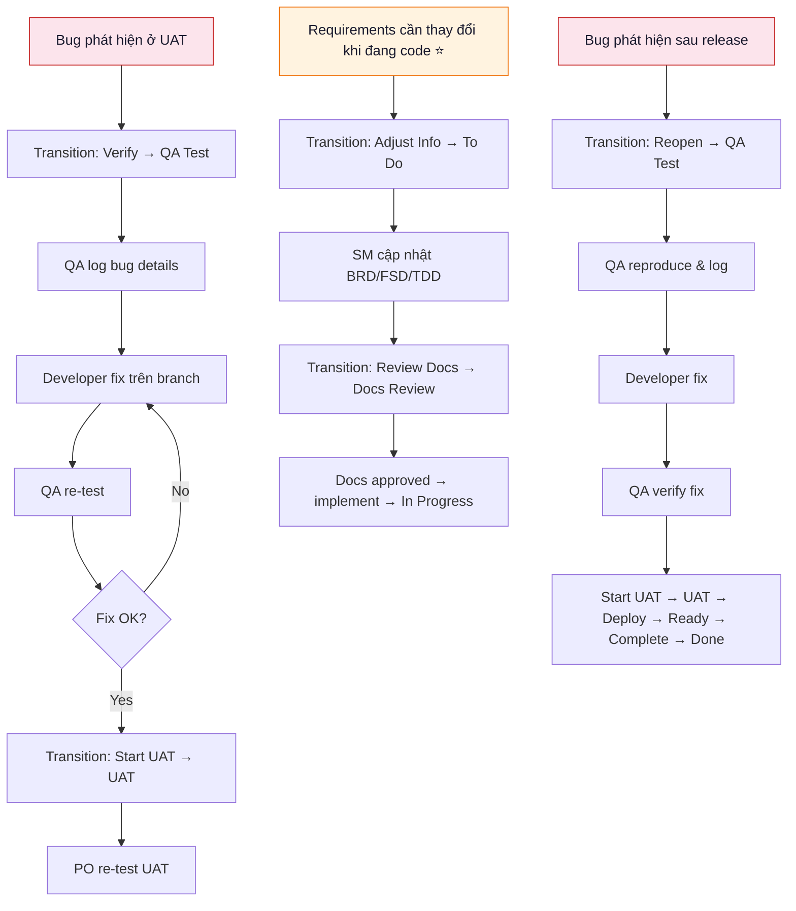
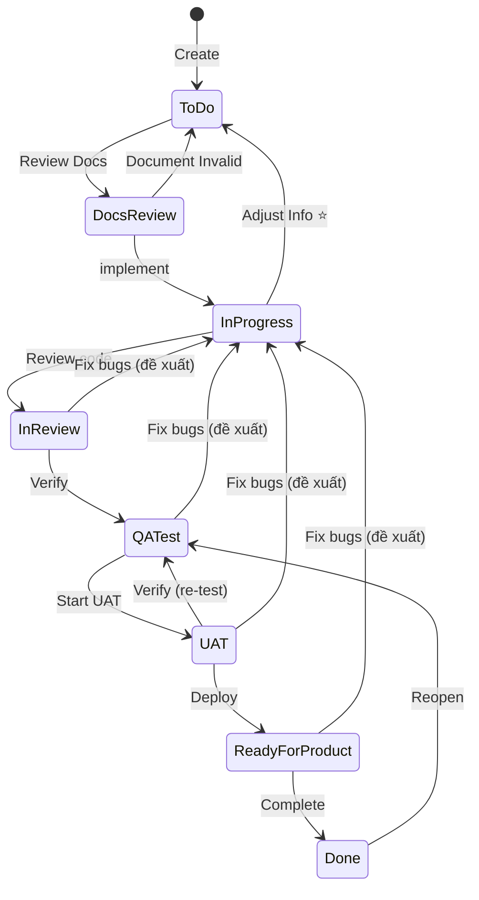

# Jira Workflow Documentation — Project MTO

> **Project**: MCP Tool Orchestration
> **Key**: MTO
> **Type**: Software (Next-Gen / Team-Managed)
> **Board**: MTO board (Simple/Kanban)
> **Generated**: 2026-05-02 (re-scanned via Jira API transition traversal)
> **Previous scan**: 2026-05-01

---

## Changelog

| Date | Change | Details |
|------|--------|---------|
| 2026-05-02 | **+1 transition mới** | `Adjust Info` (id: 12) — In Progress → To Do. Cho phép quay lại To Do khi cần điều chỉnh requirements/info trong quá trình implement. |
| 2026-05-01 | Initial scan | 11 transitions, 8 statuses |

---

## Tổng quan

Project MTO sử dụng **Team-Managed (Next-Gen) project** với workflow **8 trạng thái** theo SDLC pipeline. Workflow áp dụng **chung cho tất cả issue types** (Epic, Story, Task, Subtask).

### So sánh với Project SCRUM

| Đặc điểm | MTO | SCRUM |
|-----------|-----|-------|
| Số statuses | 8 | 8 |
| Số transitions | **12** (bao gồm Create) | — |
| "Document Invalid" đi đến | **To Do** | In Progress |
| "Adjust Info" (In Progress → To Do) | **Có** ⭐ | Không |
| "Fix bugs" backward loops | **Không có** | Có (từ In Review, QA Test, UAT, Ready for Product) |
| "Reopen" từ Done đi đến | **QA Test** | — |
| "Verify" từ UAT đi đến | **QA Test** | — |
| Workflow style | **Linear + 2 backward paths** | Looping (nhiều backward paths) |

> ⚠️ **Lưu ý quan trọng**: MTO workflow **không có "Fix bugs" transitions** từ In Review/QA Test/UAT/Ready for Product về In Progress. Tuy nhiên, có **"Adjust Info"** cho phép quay từ In Progress về To Do khi cần điều chỉnh requirements.

---

## 1. Workflow Statuses

| # | Status | Category | Color | Mô tả |
|---|--------|----------|-------|-------|
| 1 | **TO DO** | To Do | blue-gray | Ticket mới tạo, chưa bắt đầu |
| 2 | **DOCS REVIEW** | In Progress | yellow | Đang tạo/review tài liệu (BRD, FSD, TDD) |
| 3 | **IN PROGRESS** | In Progress | yellow | Đang implement code |
| 4 | **IN REVIEW** | In Progress | yellow | Code review (PR submitted) |
| 5 | **QA TEST** | In Progress | yellow | QA đang test |
| 6 | **UAT** | In Progress | yellow | User Acceptance Testing |
| 7 | **READY FOR PRODUCT** | In Progress | yellow | Sẵn sàng deploy lên Production |
| 8 | **DONE** | Done | green | Hoàn thành, đã deploy |

---

## 2. State Diagram (chính xác từ Jira API — re-scanned 2026-05-02)



### Simplified Flow (Happy Path)

```mermaid
flowchart LR
    A[To Do] -->|Review Docs| B[Docs Review]
    B -->|implement| C[In Progress]
    C -->|Review code| D[In Review]
    D -->|Verify| E[QA Test]
    E -->|Start UAT| F[UAT]
    F -->|Deploy| G[Ready for Product]
    G -->|Complete| H[Done]

    style A fill:#e3f2fd,stroke:#1565c0,color:#1a1a2e
    style B fill:#fff3e0,stroke:#ef6c00,color:#1a1a2e
    style C fill:#fff9c4,stroke:#f9a825,color:#1a1a2e
    style D fill:#fff9c4,stroke:#f9a825,color:#1a1a2e
    style E fill:#fff9c4,stroke:#f9a825,color:#1a1a2e
    style F fill:#fff9c4,stroke:#f9a825,color:#1a1a2e
    style G fill:#fff9c4,stroke:#f9a825,color:#1a1a2e
    style H fill:#e8f5e9,stroke:#2e7d32,color:#1a1a2e
```



### Backward Transitions Diagram



---

## 3. Transitions Table (chính xác từ Jira API — re-scanned 2026-05-02)

| # | ID | From | To | Transition Name | Trigger | Responsible |
|---|-----|------|-----|----------------|---------|-------------|
| 1 | — | — | TO DO | Create | Ticket created | Reporter/PO |
| 2 | 2 | TO DO | DOCS REVIEW | **Review Docs** | SM bắt đầu tạo tài liệu | SM (invoke BA/SA) |
| 3 | 3 | DOCS REVIEW | TO DO | **Document Invalid** | Tài liệu cần sửa lại từ đầu | SM/Reviewer |
| 4 | 4 | DOCS REVIEW | IN PROGRESS | **implement** | Tài liệu approved → bắt đầu code | SM (invoke DEV) |
| 5 | 5 | IN PROGRESS | IN REVIEW | **Review code** | PR submitted | Developer |
| 6 | 12 | IN PROGRESS | TO DO | **Adjust Info** ⭐ | Cần điều chỉnh requirements/info | Developer/SM |
| 7 | 6 | IN REVIEW | QA TEST | **Verify** | Code review approved | Reviewer |
| 8 | 8 | QA TEST | UAT | **Start UAT** | QA tests pass | QA/SM |
| 9 | 7 | UAT | QA TEST | **Verify** | UAT cần re-test → quay lại QA | PO/SM |
| 10 | 9 | UAT | READY FOR PRODUCT | **Deploy** | UAT accepted | SM (invoke DevOps) |
| 11 | 10 | READY FOR PRODUCT | DONE | **Complete** | Deploy thành công + sanity pass | DevOps/SM |
| 12 | 11 | DONE | QA TEST | **Reopen** | Bug phát hiện sau release → re-test | QA/PO |

### ⭐ Transition mới: Adjust Info (id: 12)

**Mục đích**: Cho phép quay từ **In Progress → To Do** khi developer phát hiện requirements không rõ ràng, thiếu thông tin, hoặc cần thay đổi scope trong quá trình implement.

**Use cases:**
- Developer phát hiện requirement mâu thuẫn khi đang code → Adjust Info → cập nhật BRD/FSD → Review Docs → implement lại
- PO thay đổi scope giữa chừng → Adjust Info → cập nhật tài liệu
- Technical blocker cần thay đổi approach → Adjust Info → cập nhật TDD

**SM Pipeline impact:**
- Khi SM detect ticket ở To Do (sau Adjust Info), SM cần:
  1. Đọc Jira comments để hiểu lý do Adjust Info
  2. Xác định documents nào cần cập nhật (BRD/FSD/TDD)
  3. Invoke BA/SA agents để cập nhật documents
  4. Transition lại: To Do → Docs Review → In Progress

---

## 4. Issue Types

### Available Issue Types

| Issue Type | Hierarchy Level | Mô tả | Workflow |
|------------|----------------|-------|----------|
| **Epic** | 1 (Parent) | Tập hợp các Stories/Tasks liên quan | Chung (8 statuses, 12 transitions) |
| **Story** | 0 (Standard) | Chức năng từ góc nhìn user | Chung (8 statuses, 12 transitions) |
| **Task** | 0 (Standard) | Công việc kỹ thuật cụ thể | Chung (8 statuses, 12 transitions) |
| **Subtask** | -1 (Child) | Phần nhỏ của Task/Story | Chung (8 statuses, 12 transitions) |

> ✅ **Xác nhận (2026-05-02)**: Tất cả issue types dùng **cùng một workflow** — đã verify bằng cách tạo Task, Story, Epic và kiểm tra transitions tại mỗi status.

---

## 5. Workflow chi tiết theo Issue Type

### 5.1 Story / Task Workflow (Full SDLC)



### 5.2 Epic Workflow



---

## 6. SDLC Phase Mapping

### Workflow Status ↔ SM Pipeline Phase

| Jira Status | SDLC Phase | SM Pipeline Phase | Documents Expected | Agents |
|-------------|-----------|-------------------|-------------------|--------|
| **TO DO** | Backlog | — | Jira ticket | PO |
| **DOCS REVIEW** | Planning & Design | Phase 1–4 | BRD, FSD, TDD, STP, STC | BA, SA, QA |
| **IN PROGRESS** | Implementation | Phase 5 | Source code | DEV |
| **IN REVIEW** | Code Review | Phase 5 (review) | PR, code review comments | DEV + Reviewer |
| **QA TEST** | Testing | Phase 6 | Test results, bug reports | QA |
| **UAT** | User Acceptance | Phase 6.5 | UAT sign-off | PO/User |
| **READY FOR PRODUCT** | Deployment | Phase 7 | DPG, RLN, deploy artifacts | DevOps |
| **DONE** | Released | — | Release notes | — |

### SM Jira Transition Points

| Khi nào transition? | From | To | Transition Name (ID) | SM Action |
|---------------------|------|-----|---------------------|-----------|
| SM bắt đầu tạo tài liệu | TO DO | DOCS REVIEW | Review Docs (2) | `transition_issue(transition_id: "2")` |
| Tài liệu bị reject | DOCS REVIEW | TO DO | Document Invalid (3) | `transition_issue(transition_id: "3")` |
| Tài liệu approved, DEV bắt đầu | DOCS REVIEW | IN PROGRESS | implement (4) | `transition_issue(transition_id: "4")` |
| DEV submit PR | IN PROGRESS | IN REVIEW | Review code (5) | `transition_issue(transition_id: "5")` |
| Cần điều chỉnh requirements ⭐ | IN PROGRESS | TO DO | Adjust Info (12) | `transition_issue(transition_id: "12")` |
| Code review pass | IN REVIEW | QA TEST | Verify (6) | `transition_issue(transition_id: "6")` |
| QA tests pass | QA TEST | UAT | Start UAT (8) | `transition_issue(transition_id: "8")` |
| UAT cần re-test | UAT | QA TEST | Verify (7) | `transition_issue(transition_id: "7")` |
| PO accepts UAT | UAT | READY FOR PRODUCT | Deploy (9) | `transition_issue(transition_id: "9")` |
| Deploy + sanity pass | READY FOR PRODUCT | DONE | Complete (10) | `transition_issue(transition_id: "10")` |
| Post-release bug | DONE | QA TEST | Reopen (11) | `transition_issue(transition_id: "11")` |

---

## 7. Backward Transitions & Bug Handling

### Backward Transitions Available

| # | From | To | Transition | Mục đích |
|---|------|-----|-----------|----------|
| 1 | DOCS REVIEW | TO DO | Document Invalid (3) | Tài liệu cần sửa lại từ đầu |
| 2 | IN PROGRESS | TO DO | **Adjust Info (12)** ⭐ | Requirements cần điều chỉnh |
| 3 | UAT | QA TEST | Verify (7) | UAT fail → re-test |
| 4 | DONE | QA TEST | Reopen (11) | Post-release bug |

### ⚠️ Không có "Fix bugs" transitions

MTO **không có "Fix bugs" backward transitions** từ:
- In Review → In Progress ❌
- QA Test → In Progress ❌
- UAT → In Progress ❌
- Ready for Product → In Progress ❌

### Workaround khi phát hiện bug

| Giai đoạn phát hiện bug | Workaround |
|--------------------------|------------|
| **In Review** (code review) | Chỉ có Verify (→ QA Test). Developer fix trên branch, reviewer re-review, rồi Verify. |
| **QA Test** | Chỉ có Start UAT (→ UAT). QA log bugs, developer fix trên branch, QA re-test trước khi Start UAT. |
| **UAT** | Dùng **Verify** (→ QA Test) để quay lại QA. QA coordinate fix rồi re-test. |
| **Ready for Product** | Chỉ có Complete (→ Done). Nếu deploy fail, cần rollback và Reopen từ Done. |
| **Done** (post-release) | Dùng **Reopen** (→ QA Test) để quay lại QA Test. |

### Flow khi có bug



---

## 8. Roles & Responsibilities

### RACI Matrix

| Activity | Product Owner | Scrum Master | Developer | QA | DevOps |
|----------|:---:|:---:|:---:|:---:|:---:|
| Create ticket | **R/A** | C | C | I | I |
| Review Docs (To Do → Docs Review) | I | **R** | I | I | I |
| BRD/FSD/TDD (Phase 1-3) | A | **R** (invoke BA/SA) | C | I | I |
| STP/STC (Phase 4) | I | **R** (invoke QA + review) | I | C | I |
| Document Invalid (reject docs) | **A** | R | I | I | I |
| implement (approve docs) | **A** | **R** | I | I | I |
| Implementation (Phase 5) | I | R (invoke DEV) | **A** | I | I |
| **Adjust Info** (requirements change) ⭐ | A | **R** | C | I | I |
| Review code (PR) | I | I | **R** | I | I |
| Verify (code review → QA) | I | I | C | **R** | I |
| QA Testing (Phase 6) | I | R (invoke QA) | C | **A** | I |
| Start UAT | I | **R** | I | C | I |
| UAT Testing (Phase 6.5) | **A** | R | I | C | I |
| Deploy (UAT → Ready) | A | **R** (invoke DevOps) | I | I | C |
| Complete (Ready → Done) | I | **R** | I | I | **A** |
| Reopen (post-release bug) | A | R | C | **R** | I |

> **R** = Responsible, **A** = Accountable, **C** = Consulted, **I** = Informed

---

## 9. Đề xuất cải thiện Workflow

### 9.1 Thêm "Fix bugs" backward transitions

**Vấn đề**: Hiện tại không có cách quay lại In Progress khi phát hiện bug ở In Review, QA Test, hoặc Ready for Product.

**Đề xuất**: Thêm transitions sau:

| # | From | To | Transition Name | Mục đích |
|---|------|-----|----------------|----------|
| 1 | IN REVIEW | IN PROGRESS | Fix bugs | Code review reject → developer fix |
| 2 | QA TEST | IN PROGRESS | Fix bugs | QA found bugs → developer fix |
| 3 | UAT | IN PROGRESS | Fix bugs | PO rejects → developer fix |
| 4 | READY FOR PRODUCT | IN PROGRESS | Fix bugs | Deploy fail → rollback & fix |

**State Diagram sau cải thiện:**



### 9.2 Thêm "Blocked" status (optional)

Nếu project có dependencies phức tạp, thêm status "Blocked" giữa In Progress và In Review:

```
In Progress → Blocked (dependency issue)
Blocked → In Progress (unblocked)
```

---

## 10. Quick Reference — SM Commands

| Command | Mô tả |
|---------|-------|
| `MTO-{N}` | Xem status & đề xuất bước tiếp theo |
| `MTO-{N} status` | Chỉ xem status |
| `MTO-{N} tạo BRD` | Tạo Business Requirements Document |
| `MTO-{N} tạo FSD` | Tạo Functional Specification Document |
| `MTO-{N} tạo TDD` | Tạo Technical Design Document |
| `MTO-{N} tạo STP` | Tạo Test Plan & Test Cases |
| `MTO-{N} tạo tài liệu đầy đủ` | Tạo BRD → FSD → TDD |
| `MTO-{N} tạo lại FSD` | Tạo lại FSD (force redo) |
| `MTO workflow` | Tạo/cập nhật workflow documentation (file này) |

---

## 11. Transition ID Quick Reference (cho SM automation)

```json
{
  "project": "MTO",
  "scanDate": "2026-05-02",
  "totalStatuses": 8,
  "totalTransitions": 12,
  "transitions": {
    "Review Docs":      { "id": "2",  "from": "To Do",              "to": "Docs Review" },
    "Document Invalid": { "id": "3",  "from": "Docs Review",        "to": "To Do" },
    "implement":        { "id": "4",  "from": "Docs Review",        "to": "In Progress" },
    "Review code":      { "id": "5",  "from": "In Progress",        "to": "In Review" },
    "Adjust Info":      { "id": "12", "from": "In Progress",        "to": "To Do" },
    "Verify (review)":  { "id": "6",  "from": "In Review",          "to": "QA Test" },
    "Verify (UAT)":     { "id": "7",  "from": "UAT",                "to": "QA Test" },
    "Start UAT":        { "id": "8",  "from": "QA Test",            "to": "UAT" },
    "Deploy":           { "id": "9",  "from": "UAT",                "to": "Ready for product" },
    "Complete":         { "id": "10", "from": "Ready for product",  "to": "Done" },
    "Reopen":           { "id": "11", "from": "Done",               "to": "QA Test" }
  }
}
```

---

## 12. Adjacency Matrix (cho programmatic use)

| From ↓ \ To → | To Do | Docs Review | In Progress | In Review | QA Test | UAT | Ready for Product | Done |
|----------------|:-----:|:-----------:|:-----------:|:---------:|:-------:|:---:|:-----------------:|:----:|
| **To Do** | — | ✅ (2) | — | — | — | — | — | — |
| **Docs Review** | ✅ (3) | — | ✅ (4) | — | — | — | — | — |
| **In Progress** | ✅ (12) | — | — | ✅ (5) | — | — | — | — |
| **In Review** | — | — | — | — | ✅ (6) | — | — | — |
| **QA Test** | — | — | — | — | — | ✅ (8) | — | — |
| **UAT** | — | — | — | — | ✅ (7) | — | ✅ (9) | — |
| **Ready for Product** | — | — | — | — | — | — | — | ✅ (10) |
| **Done** | — | — | — | — | ✅ (11) | — | — | — |

> Số trong ngoặc = transition ID
