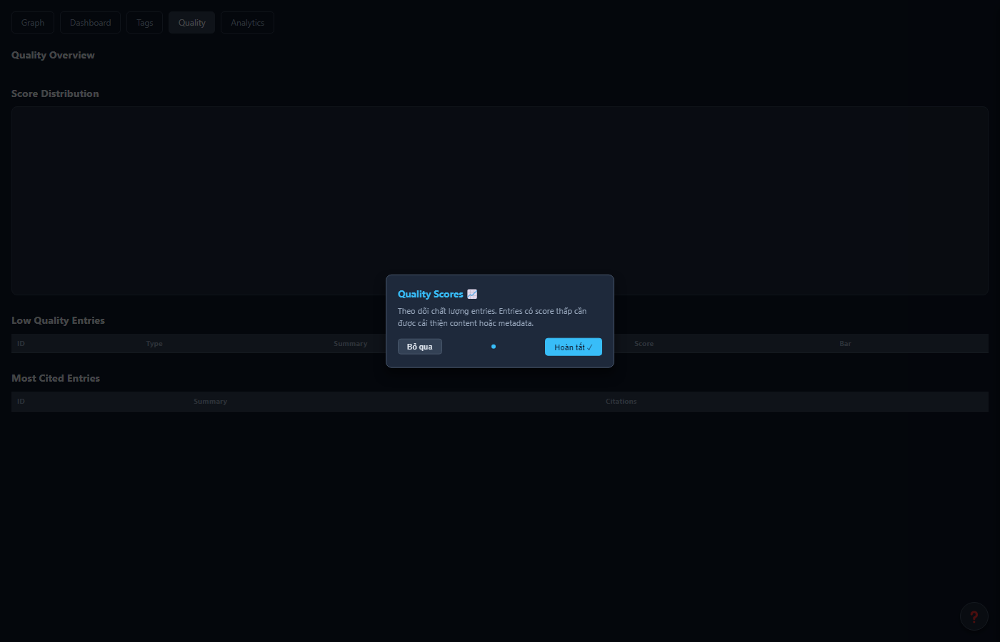
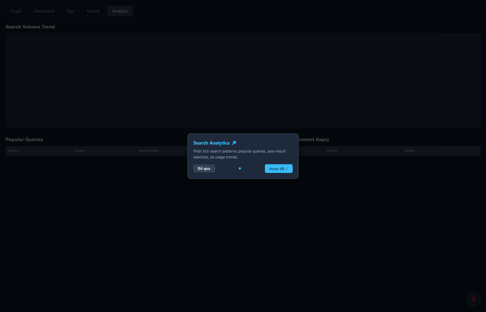

<p align="center">
  
</p>

<h1 align="center">Kiro SDLC Agents</h1>

<p align="center">
  <strong>Your entire software team — in one extension.</strong><br>
  9 AI agents. Full SDLC pipeline. Built-in Knowledge Base UI.
</p>

<p align="center">
  
  
  
  
  
</p>

<p align="center">
  <a href="#-quick-start">Quick Start</a> •
  <a href="#-knowledge-base-ui">KB UI</a> •
  <a href="#-meet-the-team">Agents</a> •
  <a href="#-commands">Commands</a> •
  <a href="#-using-mcp-server">MCP Server</a> •
  <a href="#-web-dashboard">Web Dashboard</a> •
  <a href="#-native-binary-management">Native Binaries</a> •
  <a href="#-troubleshooting">Troubleshooting</a>
</p>

---

## 🆕 What's New in v1.14.0

- **KB Auto-Linker** — Automatic relationship discovery between KB entries (entity extraction, semantic similarity, configurable strategies)
- **KB Graph LOD** — Level of Detail clustering for large graphs (879+ nodes render smoothly with animation)
- **Incremental Prebuilt Binaries** — CI/CD only builds missing native binaries (skip existing, force rebuild option)
- **Node.js 25 Support** — Precompiled `better-sqlite3` + `onnxruntime-node` for Node 20/22/24/25
- **better-sqlite3 v12.10.0** — Latest bindings with verified SHA-256 checksums
- **Similarity Pipeline** — `find_duplicates` + `find_dead_code` + ignore parser + body extraction wired into indexing
- **Scheduled Prebuild Scan** — Weekly cron detects missing platform binaries and auto-triggers builds

---

## 🚀 Quick Start

New to this extension? Here is how to get started in 4 simple steps:

```
1. Install the extension from the marketplace
2. Open Command Palette: Ctrl+Shift+P → type "Kiro SDLC: Inject All Agents"
3. Wait a few seconds — the extension auto-starts the MCP server
   → You will see "Running Port 9181" in the sidebar
4. Click any panel in the sidebar: Graph, Dashboard, Quality, Analytics
```

**What happens behind the scenes:**
- The extension installs 9 AI agents into your `.kiro/` folder
- It starts a local MCP server (Code Intelligence) that manages your Knowledge Base
- Sidebar panels connect to this server to show charts and data

> **No separate setup needed.** The extension bundles its own MCP server. Just install and go.

---

## 🧠 Knowledge Base UI

The extension provides **5 interactive panels** you can open from the sidebar. Look for the tree view: **KIRO SDLC AGENTS → Knowledge Base**.

Each panel shows different information about your project's knowledge base:

### Panel Overview

| Panel | What It Shows | Key Features |
|-------|--------------|--------------|
| 📊 **Dashboard** | Health score, metrics, trends, recommendations | SVG gauge, canvas bar charts, auto-refresh |
| 🕸️ **Graph** | 3D force-directed knowledge graph | 879+ nodes, 935+ edges, search, type/tier filters |
| 🏷️ **Tags** | Tag taxonomy, popular tags | Browse entries by tag |
| ⭐ **Quality** | Score distribution histogram, confidence stats | Canvas 2D charts, low-quality entries table |
| 📈 **Analytics** | Search volume trend, popular queries, gaps | Line chart, recommendations |

### How to Open Panels

There are 3 ways to open any panel:

- **Sidebar** (easiest): Expand "Knowledge Base" section → click any item
- **Command Palette**: `Ctrl+Shift+P` → type "KB" → select the panel you want
- **Direct commands**: `kiroSdlc.openKbDashboard`, `kiroSdlc.openKbGraph`, etc.

### Graph Panel

Visualizes your entire knowledge base as a 3D force-directed graph. Think of it like a map of everything your project knows.

<p align="center">
  
</p>
<p align="center"><em>Graph Panel — nodes are entries, edges are relationships. Color = entry type.</em></p>

- **Nodes** = KB entries (each dot is one piece of knowledge, color-coded by type)
- **Edges** = relationships between entries (lines connecting related knowledge)
- **Search** = find nodes by keyword
- **Filters** = Type dropdown, Tier dropdown
- **Click node** = view entry details in sidebar
- **Data source** = same as web dashboard (viewer API)

Color legend:
- 🟢 REQUIREMENT — 🟣 ARCHITECTURE — ⚪ CODE_ENTITY
- 🔴 DECISION — 🟠 ERROR_PATTERN — 🟡 PROCEDURE
- 🔵 CONTEXT — 🩵 API_DESIGN — 🩷 LESSON_LEARNED

### Quality Panel

Shows how "healthy" your knowledge base entries are. Two views side-by-side:

<p align="center">
  
</p>
<p align="center"><em>Quality Panel — histogram shows score distribution, confidence stats on the right.</em></p>

- **Left**: Histogram (Canvas 2D) — score buckets with color coding
- **Right**: Confidence stats card (Average, High, Low counts)
- **Below**: Low Quality Entries table with score bars (these need attention)

### Analytics Panel

Helps you understand how the knowledge base is being used:

<p align="center">
  
</p>
<p align="center"><em>Analytics Panel — search volume trend, popular queries, and knowledge gaps.</em></p>

- **Top**: Search Volume line chart (Canvas 2D, 30-day trend)
- **Left**: Popular Queries (ranked list with counts — what people search most)
- **Right**: Knowledge Gaps (zero-result queries — what is missing)
- **Bottom**: Recommendations (suggestions to improve your KB)

### Dashboard Panel

Overall KB health at a glance. Open this first to get a quick summary:

<p align="center">
  
</p>
<p align="center"><em>Dashboard Panel — health gauge, metrics cards, trend charts.</em></p>

- **Health Gauge**: SVG arc (green = good, yellow = okay, red = needs work)
- **Metrics Cards**: Total entries, Quality avg, Stale count, Unowned
- **Trend Charts**: Search volume + Ingest volume (7-day canvas bars)
- **Recommendations**: Actionable items to improve KB health

---

## 👥 Meet the Team

These are the 9 AI agents that work together as your software team. Each one has a specific role, just like a real team:

| Agent | Role | What They Do |
|-------|------|-------------|
| 🎯 **SM** | Scrum Master | Orchestrates the full pipeline, manages Jira tickets, enforces quality gates |
| 📋 **BA** | Business Analyst | Writes BRD (Business Requirements), FSD (Functional Spec), user stories |
| 🔧 **TA** | Technical Analyst | Reviews FSD, adds API contracts, pseudocode, technical depth |
| 🏗️ **SA** | Solution Architect | Creates TDD (Technical Design), architecture decisions, diagrams |
| 🧪 **QA** | Quality Assurance | Writes test plans (STP), test cases (STC), runs test execution |
| 💻 **DEV** | Developer | Implements code from TDD, creates user guides |
| 🚀 **DevOps** | Deployment | Deployment guides, CI/CD pipelines, release notes |
| 🎨 **UI** | UI Designer | Wireframes, design specs, UI mockups |
| 🔒 **Security** | Security Review | Threat modeling, vulnerability assessment |

### How to Use the Agents

The easiest way is to give a Jira ticket to the Scrum Master — it will call other agents automatically:

```
# Start full pipeline from a Jira ticket (SM handles everything)
@sm-agent KSA-14

# Or call specific agents directly if you only need one step:
@ba-agent KSA-14        → creates BRD + FSD
@sa-agent KSA-14        → creates TDD from FSD
@dev-agent KSA-14       → implements code from TDD
@qa-agent KSA-14        → creates test plan + test cases
```

> **Tip**: The SM agent knows which phase your ticket is in. If you already have a BRD, it will skip BA and go straight to SA.

---

## ⚙️ Commands

Open Command Palette (`Ctrl+Shift+P`) and type "Kiro SDLC" to see all available commands:

| Command | Description |
|---------|-------------|
| `Kiro SDLC: Inject All Agents` | Install agents, steering files, hooks, and templates into your project |
| `Kiro SDLC: Check Status` | Verify all components are present and working |
| `Kiro SDLC: Restart MCP Server` | Restart the bundled MCP server (useful if something is stuck) |
| `Kiro SDLC: Stop MCP Server` | Stop the MCP server |
| `Kiro SDLC: Change Port` | Change the MCP server port number |
| `Kiro SDLC: Open KB Browser` | Open the web dashboard in your browser |
| `Kiro SDLC: Edit Config` | Open the orchestration config file for editing |
| `Kiro SDLC: Change Config...` | Select a different orchestration config file |
| `Kiro SDLC: Symbol Search` | Quick Pick symbol search across codebase (KSA-179) |
| `Kiro SDLC: Open Security Panel` | View security findings grouped by severity (KSA-173) |
| `Kiro SDLC: Impact Analysis` | Analyze blast radius of modifying a symbol (KSA-174) |
| `Kiro SDLC: Get AI Context` | Copy AI context for symbol at cursor to clipboard (KSA-177) |
| `Kiro SDLC: Get Edit Context` | Copy edit context for symbol at cursor to clipboard (KSA-177) |

### Code Intelligence Features (KSA-170)

| Feature | Description |
|---------|-------------|
| **Symbol Search** | Debounced QuickPick — type to search, navigate to file:line on select |
| **Security Panel** | Webview showing findings by severity (critical/high/medium/low) with file links |
| **Diagnostics Provider** | Auto-analyzes on file save, shows issues in VS Code Problems panel with quick fixes |
| **Impact Analysis** | Blast radius visualization — affected files, callers, tests for any symbol |
| **AI Context Commands** | Get context for symbol at cursor → copies to clipboard for AI chat |

---

## 🔌 Using MCP Server

The extension includes a built-in MCP (Model Context Protocol) server called **Code Intelligence**. This server manages your Knowledge Base (SQLite database), provides tools for agents, and serves the web dashboard.

There are **two ways** to use the MCP server depending on your setup:

### Option A: With Kiro IDE Extension (Recommended)

**You do not need to do anything.** The extension handles everything automatically:

1. Extension starts the MCP server when you open a workspace
2. Server runs on port 9181 (configurable)
3. Agents connect to it through the extension
4. Sidebar shows server status: "Running Port 9181"

This is the default behavior. Just install the extension and it works.

### Option B: With Kiro CLI (Standalone MCP Server)

If you use **Kiro CLI** (command-line mode without the extension UI), you need to configure MCP manually.

Add the server to your `mcp.json` file (usually at `~/.kiro/settings/mcp.json`):

```json
{
  "mcpServers": {
    "code-intelligence-nodejs": {
      "command": "node",
      "args": [
        "c:/projects/kiro/FEC_CR_Builder/kiro-sdlc-agents/mcp-server/http-entry.js"
      ],
      "env": {
        "DB_PATH": "c:/projects/kiro/FEC_CR_Builder/.code-intel/index.db",
        "PORT": "9181"
      }
    }
  }
}
```

Then agents will connect to the MCP server through this config.

### ⚠️ IMPORTANT: Avoid Running Two Servers at the Same Time

> **If you want to use the standalone MCP server (from `mcp.json`), you MUST disable the extension's built-in server first.**

Both servers use the **same SQLite database** file (`.code-intel/index.db`). Running two servers at the same time will cause:
- Database lock errors
- Data corruption
- Tools timing out or returning empty results

**How to disable the extension's built-in server:**

| Method | How to Do It |
|--------|-------------|
| **Settings** | Set `kiroSdlc.enableMcpServer` to `false` in your IDE settings |
| **Sidebar** | Click "Stop Server" button in the KIRO SDLC AGENTS sidebar |
| **Command** | `Ctrl+Shift+P` → "Kiro SDLC: Stop MCP Server" |

**Rule of thumb**: Pick ONE way to run the server. Either the extension manages it, OR you manage it yourself via `mcp.json`. Never both.

---

## 🌐 Web Dashboard

The MCP server serves a web dashboard at `http://localhost:9181`. It shows the same data as the sidebar panels, but in your browser:

| Page | URL |
|------|-----|
| Graph | `localhost:9181/` |
| Dashboard | `localhost:9181/dashboard` |
| Tags | `localhost:9181/tags` |
| Quality | `localhost:9181/quality` |
| Analytics | `localhost:9181/analytics` |

> The web dashboard runs on the same port as the MCP server. No separate viewer process needed.

---

## 📦 Native Binary Management

The MCP server's Node.js variant depends on `better-sqlite3`, which requires a platform-specific native binary (`.node` file). The extension handles this automatically — no C++ build tools needed on your machine.

### How It Works

1. On activation, the extension detects your Node version and platform
2. Downloads the matching prebuilt `better-sqlite3` binary from GitHub Releases
3. Verifies SHA-256 checksum
4. Caches the binary for future use

### Supported Platforms

| Node Version | win32-x64 | darwin-x64 | darwin-arm64 | linux-x64 |
|:---:|:---:|:---:|:---:|:---:|
| 20 | ✅ | ✅ | ✅ | ✅ |
| 22 | ✅ | ✅ | ✅ | ✅ |
| 24 | ✅ | ✅ | ✅ | ✅ |

### Cache Location

Binaries are cached at:

```
%APPDATA%/Kiro/User/globalStorage/dnguyenminh.kiro-sdlc-agents/native-addons/
  better-sqlite3/v11.7.0/{platform-key}/better_sqlite3.node
```

On macOS/Linux: `~/.config/Kiro/User/globalStorage/dnguyenminh.kiro-sdlc-agents/native-addons/`

### Troubleshooting Native Binaries

If you get errors like `Could not load better-sqlite3 native binding`:

1. Delete the cache folder: `%APPDATA%/Kiro/User/globalStorage/dnguyenminh.kiro-sdlc-agents/native-addons/`
2. Restart the IDE
3. The extension will re-download the correct binary

---

## 🏗️ Architecture

Here is how all the pieces fit together:

```
┌─────────────────────────────────────────────────┐
│  Kiro IDE                                        │
│  ┌─────────────────┐  ┌──────────────────────┐  │
│  │ Extension Host   │  │ Webview Panels       │  │
│  │ (TypeScript)     │  │ (HTML/JS/Canvas)     │  │
│  │                  │  │                      │  │
│  │ McpServerManager │──│ Graph, Dashboard     │  │
│  │ NativeAddonMgr   │  │ Quality, Analytics   │  │
│  └────────┬─────────┘  └──────────────────────┘  │
│           │ HTTP (port 9181)                      │
│  ┌────────▼──────────────────────────────┐       │
│  │ MCP Server (port 9181)                 │       │
│  │ ├─ MCP tools (JSON-RPC over HTTP)      │       │
│  │ ├─ Web Dashboard (viewer routes)       │       │
│  │ └─ SQLite DB (.code-intel/index.db)    │       │
│  └────────────────────────────────────────┘       │
└───────────────────────────────────────────────────┘
```

**How it works:**
- **Extension** spawns the MCP server as a child process
- **Panels** communicate via `postMessage` (extension ↔ webview)
- **Data** is fetched via MCP tool calls OR viewer HTTP API
- **Charts** are rendered with Canvas 2D (no external chart libraries — CSP compatible)
- **Web Dashboard** is served by the MCP server on the same port (9181)

---

## 📋 Settings

Configure the extension in your IDE settings (`Ctrl+,` → search "kiroSdlc"):

| Setting | Default | Description |
|---------|---------|-------------|
| `kiroSdlc.enableMcpServer` | `true` | Auto-start MCP server when extension activates. Set to `false` if using standalone server. |
| `kiroSdlc.mcpServerPort` | `9181` | Port number for the MCP server |
| `kiroSdlc.configPath` | `.code-intel/orchestration.json` | Path to orchestration config (relative to workspace) |

---

## 🔧 Troubleshooting

Having issues? Here are the most common problems and how to fix them:

### "MCP tool timed out"

**Cause**: The MCP server is not ready yet, or it crashed.

**Fix**:
1. Wait 5-10 seconds after opening the workspace (server needs time to start)
2. Check sidebar — does it show "Running Port 9181"?
3. If not, run: `Ctrl+Shift+P` → "Kiro SDLC: Restart MCP Server"
4. If still failing, check if another process is using port 9181

### "Charts not showing" / Panels are blank

**Cause**: Panel opened before the server was ready, or server stopped.

**Fix**:
1. Close the panel (click X on the tab)
2. Make sure sidebar shows "Running Port 9181"
3. Reopen the panel from sidebar → Knowledge Base → click the panel

### "Port already in use" / Server fails to start

**Cause**: Another process (or another instance of the server) is already using that port.

**Fix**:
1. **Change port**: `Ctrl+Shift+P` → "Kiro SDLC: Change Port" → enter a new port (e.g., 9182)
2. **Or stop the other server**: If you have a standalone MCP server running from `mcp.json`, stop it first
3. **Or kill the process**: On Windows: `netstat -ano | findstr :9181` then `taskkill /PID <pid> /F`

### "Database is locked" / SQLite errors

**Cause**: Two servers are trying to access the same database file at the same time.

**Fix**:
1. Make sure only ONE server is running (see [MCP Server section](#-using-mcp-server))
2. Disable extension server (`kiroSdlc.enableMcpServer` = `false`) if using standalone
3. Or stop standalone server if using extension's built-in server

### "Could not load better-sqlite3 native binding"

**Cause**: Native binary missing, corrupted, or incompatible with current Node version.

**Fix**:
1. Delete cache: `%APPDATA%/Kiro/User/globalStorage/dnguyenminh.kiro-sdlc-agents/native-addons/`
2. Restart the IDE — extension will re-download the correct binary
3. Check that your Node version is 20, 22, or 24

---

## 📝 License

MIT
