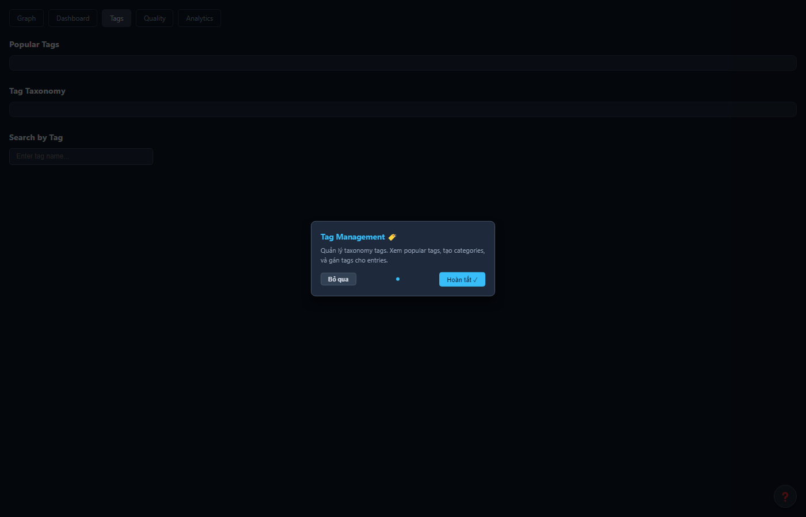

<p align="center">
  
</p>

<h1 align="center">Kiro SDLC Agents</h1>

<p align="center">
  <strong>Your entire software team — in one extension.</strong><br>
  9 AI agents. Full SDLC pipeline. One command to inject. Zero config.
</p>

<p align="center">
  <a href="#-quick-start"></a>
  
  
  
  
</p>

<p align="center">
  <a href="#-features-at-a-glance">Features</a> •
  <a href="#-quick-start">Quick Start</a> •
  <a href="#-meet-the-team">Agents</a> •
  <a href="#-how-it-works">Architecture</a> •
  <a href="#-commands">Commands</a> •
  <a href="#-faq">FAQ</a>
</p>

---

<!-- screenshot: Hero banner showing Kiro IDE with agent chat panel open, SM agent coordinating document creation -->

## 🎯 The Problem

Building software involves **dozens of documents**, **multiple roles**, and **endless context switching**:

- 📝 Writing BRDs, FSDs, TDDs manually — hours per document
- 🔄 Keeping specs in sync when requirements change
- 🧪 Creating test plans that actually trace back to requirements
- 🏗️ Ensuring architecture matches the spec
- 📊 Managing Jira workflow transitions
- 🤝 Coordinating between BA, SA, QA, DEV, DevOps...

**What if your IDE had a full software team built in?**

## ✨ Features at a Glance

| | Feature | Description |
|---|---------|-------------|
| 🤖 | **9 Specialized Agents** | Each agent masters one SDLC role — from requirements to deployment |
| 📋 | **Full Document Pipeline** | BRD → FSD → TDD → STP → Code → Tests → Deploy — automated |
| 🔄 | **Feedback Loops** | BA ↔ SA auto-resolve spec discrepancies (up to 5 iterations) |
| 🧠 | **Code Intelligence** | MCP-powered semantic search across your entire codebase |
| 📊 | **Jira Integration** | Auto-transitions, comments, attachments — hands-free |
| 📐 | **Draw.io Diagrams** | Architecture, sequence, state diagrams — auto-generated |
| 📄 | **12 Document Templates** | Industry-standard templates for every SDLC artifact |
| 🔒 | **Security Agent** | Threat modeling and security review built into the pipeline |
| ⚡ | **One-Command Setup** | Inject everything into any workspace instantly |

<!-- screenshot: Split view showing FSD document on left, generated draw.io architecture diagram on right -->

---

## 🚀 Quick Start

### 3 steps. That's it.

```
Step 1  →  Install the extension
Step 2  →  Ctrl+Shift+P → "Kiro SDLC: Inject All Agents"
Step 3  →  Chat with @sm-agent: "KSA-14 tạo tài liệu đầy đủ"
```

<!-- screenshot: GIF showing the 3-step process — command palette → inject → chat with agent -->

**What happens:**
1. Extension injects agents, steering rules, hooks, and templates into your workspace
2. You pick an MCP variant (Python / Node.js / Kotlin) for code intelligence
3. Done — start chatting with agents to build your software

---

## 👥 Meet the Team

Your AI-powered software development team:

| Agent | Role | What They Do |
|-------|------|-------------|
| 🎯 **SM** (Scrum Master) | Orchestrator | Coordinates all agents, manages Jira, enforces quality gates |
| 📋 **BA** (Business Analyst) | Requirements | Writes BRD, FSD drafts, user stories, acceptance criteria |
| 🔧 **TA** (Technical Analyst) | Tech Enrichment | Reviews FSD, adds API contracts, integration specs, pseudocode |
| 🏗️ **SA** (Solution Architect) | Design | Creates TDD, architecture decisions, component design |
| 🧪 **QA** (Quality Assurance) | Testing | Writes STP/STC, executes tests, verifies user guides |
| 💻 **DEV** (Developer) | Implementation | Writes code following TDD, creates user guides |
| 🚀 **DevOps** | Deployment | Deployment guides, release notes, CI/CD pipelines |
| 🎨 **UI** (UI Designer) | Interface Design | Wireframes, design system, accessibility review |
| 🔒 **Security** | Security Review | Threat modeling, vulnerability assessment, secure coding |

<!-- screenshot: Agent roster in Kiro chat panel showing all 9 agents available -->

### How They Collaborate

<p align="center">
  
</p>

> 💡 SM reads your Jira ticket → delegates to the right agent → each phase produces documents → feedback loops auto-resolve discrepancies → code ships.

---

## 🏗️ How It Works

### Architecture Overview

<p align="center">
  
</p>

### What Gets Injected

```
your-workspace/
├── .kiro/
│   ├── agents/          ← 9 agents (SM, BA, TA, SA, QA, DEV, DevOps, UI, Security)
│   │   └── prompts/     ← Detailed agent instructions
│   ├── steering/        ← 18 rules (code standards, drawio, jira, orchestration...)
│   ├── hooks/           ← Auto-triggers (code indexing, drawio validation)
│   └── settings/
│       └── mcp.json     ← Code Intelligence MCP server config
└── documents/
    └── templates/       ← 12 templates (BRD, FSD, TDD, STP, STC, DPG, RLN, UG...)
```

### Document Pipeline

Each document builds on the previous one:

<p align="center">
  
</p>

---

## 📦 Commands

| Command | Shortcut | Description |
|---------|----------|-------------|
| **Inject All Agents** | `Ctrl+Shift+P` | One-click setup — injects everything + picks MCP variant |
| **Inject (Select Components)** | `Ctrl+Shift+P` | Cherry-pick: agents only? templates only? steering only? |
| **Update Agents** | `Ctrl+Shift+P` | Update to latest version, preserves your customizations |
| **Show Status** | `Ctrl+Shift+P` | Health check — what's installed, what's outdated |
| **Index Workspace** | `Ctrl+Shift+P` | Index source code + documents into Knowledge Base |
| **Download Embedding Model** | `Ctrl+Shift+P` | Get ONNX models for semantic search |

<!-- screenshot: Command palette showing all 6 Kiro SDLC commands -->

---

## 🧠 Code Intelligence (MCP)

The extension configures an MCP server that gives agents deep understanding of your codebase.

### MCP Server Ecosystem

<p align="center">
  
</p>

The **MCP Code Intelligence Server** is not just a code indexer — it's a **meta-orchestrator** that can unify access to multiple MCP servers through a single interface.

#### What's Included (out of the box)

| Component | What It Does | Tools |
|-----------|-------------|-------|
| 🧠 **Code Intelligence** | Code search, knowledge base, memory graph, embeddings, auto-indexing | 35+ built-in tools |

#### Extensible via Orchestration (optional, user-configured)

The server supports **nested orchestration** — you can connect additional MCP servers and their tools become discoverable via `find_tools()`:

| Example Server | What It Could Do | How to Add |
|----------------|-----------------|------------|
| Jira/Confluence server | Issue tracking, wiki pages | Add to `orchestration.json` |
| Database server | Query your DB from agents | Add to `orchestration.json` |
| Browser automation | Screenshots, web testing | Add to `orchestration.json` |
| Any MCP server | Anything | Add to `orchestration.json` |

> ⚠️ These are **not included** with the extension. You configure them separately based on your team's needs.

#### How Orchestration Works

```
Agent needs an external tool:
  ↓
find_tools("<describe what you need>")
  → Discovers matching tools from ALL configured servers (lazy discovery)
  → Registers in routing table for fast future access
  ↓
execute_dynamic_tool("<tool_name>", {arguments})
  → Routed to correct server automatically
  → Result returned to agent
```

**Key features:**
- **Lazy discovery** — tools from nested servers are discovered on first `find_tools()` call
- **Hit-based ranking** — frequently used tools rank higher in search results
- **Fallback chains** — if one server fails, tries alternatives
- **Zero config per tool** — add a server to `orchestration.json`, all its tools become available

#### Adding an External MCP Server

```json
// .code-intel/orchestration.json
{
  "mcp_servers": {
    "your-server-name": {
      "command": "npx",
      "args": ["your-mcp-server-package", "--your-args"],
      "timeout": 30000,
      "enabled": true
    }
  }
}
```

After adding, the orchestrator auto-spawns the server and makes its tools available via `find_tools()`.

### Choose Your Variant

| Variant | Runtime | Install Method | Best For |
|---------|---------|---------------|----------|
| 🐍 **Python** | Python 3.11+ | `uvx` (auto) | Recommended — zero setup |
| 📦 **Node.js** | Node.js 20+ | `npx` (auto) | JS/TS projects |
| ☕ **Kotlin** | JDK 11+ | JAR download | Enterprise / JVM projects |

### What It Provides

| Category | Capabilities | Example |
|----------|-------------|---------|
| 🔍 **Code Search** | FTS5 + vector similarity | `code_search("authentication middleware")` |
| 📚 **Knowledge Base** | Store & retrieve decisions, patterns, architecture | `mem_search("why we chose Ktor")` |
| 🕸️ **Memory Graph** | Cross-reference code ↔ docs ↔ decisions | `mem_graph(neighbors: class_id)` |
| 🔗 **Tool Orchestration** | Unified access to Jira, Confluence, any MCP server | `find_tools("create jira issue")` |
| 📇 **Auto-indexing** | File watcher triggers re-index on changes | Hooks auto-trigger on save |
| 🎯 **Embeddings** | ONNX local models or Ollama for semantic search | `all-MiniLM-L6-v2` (90MB) |
| 📊 **Analytics** | Search metrics, popular queries, gap detection | `mem_admin(action: "analytics")` |
| 🏷️ **Tagging** | Hierarchical taxonomy for knowledge entries | `mem_tags(action: "search", tags: "auth")` |

### Optional: Semantic Search with Ollama

By default, search uses FTS5 (fast keyword matching). For meaning-based search:

```bash
# 1. Install Ollama
# 2. Pull an embedding model
ollama pull nomic-embed-text

# 3. Extension wizard asks during injection — just say "Yes"
```

| Without Ollama | With Ollama |
|----------------|-------------|
| Keyword matching | Semantic meaning |
| Zero setup | Requires Ollama running |
| Fast and lightweight | Richer results |

---

## 🌐 KB Web Viewer — Visual Knowledge Management

The MCP server includes a **built-in web interface** at `http://localhost:3201` for visual knowledge base management. No extra setup — it starts automatically with the MCP server.

<!-- screenshot: KB Web Viewer showing the 3D Knowledge Graph with nodes and connections -->

<p align="center">
  
</p>
<p align="center"><em>3D Knowledge Graph — visualize relationships between all knowledge entries</em></p>

### 5 Pages, Zero Training

| Page | What You See | What You Do |
|------|-------------|-------------|
| 🕸️ **Graph** | Interactive 3D knowledge graph (nodes = entries, edges = relations) | Explore connections, find clusters, visualize architecture |
| 📊 **Dashboard** | Health score gauge, KPI metrics, trend charts, recommendations | Monitor KB health, act on recommendations with "Fix Now" buttons |
| 🏷️ **Tags** | Tag cloud, taxonomy tree, tag-based search | Browse content by topic, manage tag hierarchy |
| ⭐ **Quality** | Quality distribution chart, low-quality entries table | Identify weak entries, prioritize content improvement |
| 📈 **Analytics** | Search metrics, popular queries, zero-result queries, gaps | Discover what's missing, optimize content coverage |

### Key Features

- **4-tab Graph Viewer** — Graph (3D force-directed), Sessions (playback), Browser (tree view), Stream (real-time)
- **Onboarding Tour** — First-time users get a guided walkthrough (zero-training UX)
- **Contextual Tooltips** — Hover any element for instant help
- **Smart Empty States** — When a page has no data, shows actionable suggestions
- **Actionable Recommendations** — "Fix Now" buttons that resolve issues via API
- **Graph Auto-Analysis** — AI-generated insights about your knowledge structure
- **Dark Mode** — Full dark theme with design tokens
- **Responsive** — Works on any screen size

### Pages In Detail

<details>
<summary><strong>🕸️ Graph — Interactive 3D Knowledge Graph</strong></summary>

<p align="center">
  
</p>

Your entire knowledge base visualized as a force-directed 3D graph. Nodes = entries, edges = relationships.

**4 Tabs:**
| Tab | Purpose |
|-----|---------|
| 🧠 Graph | 3D visualization — rotate, zoom, click nodes for details |
| 📋 Sessions | Agent session history — who accessed KB, when, what operations |
| 🔍 Browser | Filter entries by tier/type/search — fastest way to find specific entries |
| ⚡ Stream | Real-time operation feed — see what's happening right now |

**What you'll discover:**
- Clusters of related knowledge (tightly connected nodes)
- Orphan entries (isolated nodes needing relationships)
- Knowledge topology (which domains are rich vs. thin)
</details>

<details>
<summary><strong>📊 Dashboard — KB Health at a Glance</strong></summary>

<p align="center">
  
</p>

One-second health check for your entire knowledge base.

**Components:**
| Component | What It Shows |
|-----------|--------------|
| 🎯 Health Gauge | Overall score (green ≥70, yellow ≥40, red <40) |
| 📊 Metric Cards | Total entries, quality avg, stale count, unowned count |
| 💡 Recommendations | Prioritized actions to improve KB health |
| 📅 Due Reviews | Entries overdue for review (>90 days) |
| 📈 Trends | 7-day search volume + ingest volume charts |

**Actionable insights:**
- Health Score < 40 → run `mem_lifecycle(action="detect_stale")` to find stale entries
- Stale > 20% → review campaign needed
- Search trend declining → content may be outdated
</details>

<details>
<summary><strong>🏷️ Tags — Content Taxonomy Explorer</strong></summary>

<p align="center">
  
</p>

Visual exploration of your knowledge classification system.

**Components:**
- **Tag Cloud** — font size = usage frequency, click to search
- **Taxonomy Tree** — hierarchical parent/child tag structure
- **Search with Auto-suggest** — type 2+ chars → instant suggestions

**Why it matters:**
- Browse by topic instead of guessing keywords
- Discover entries you didn't know existed
- Identify gaps (missing tags = missing knowledge)
</details>

<details>
<summary><strong>⭐ Quality — Content Quality Monitor</strong></summary>

<p align="center">
  
</p>

Identify and fix low-quality entries before they become problems.

**Components:**
| Component | Purpose |
|-----------|---------|
| Stats Cards | Average score, scored count, high/low quality counts |
| Distribution Chart | Bar chart showing score buckets (red/yellow/green) |
| Low Quality Table | Sorted list of entries needing improvement |
| Most Cited | High-impact entries (if these are wrong, everything is wrong) |

**Quality score factors:** content length, tags, owner, recent review, structured format.

**Weekly target:** Fix 3-5 lowest-scoring entries → distribution shifts right over time.
</details>

<details>
<summary><strong>📈 Analytics — Search Behavior Intelligence</strong></summary>

<p align="center">
  
</p>

Data-driven content strategy — know what your team needs.

**Components:**
| Component | Insight |
|-----------|---------|
| Search Volume Trend | Is KB being used? Growing or declining? |
| Popular Queries | What topics are most searched? |
| Zero-Result Queries | **Content gaps** — team searched but KB has nothing |

**The most important metric:** Zero-result queries = content gaps. Each gap is a topic your team needs but KB doesn't cover. Fix gaps → team finds answers → adoption grows.
</details>

### Recommended Workflow

| Frequency | Action | Time |
|-----------|--------|------|
| **Daily** | Dashboard → check health score + red recommendations | 2 min |
| **Weekly** | Analytics → fix content gaps; Quality → improve 3-5 entries | 15 min |
| **Monthly** | Full audit: compare trends, review taxonomy, check graph | 30 min |

### Access

```
# Starts automatically with MCP server
# Open in browser:
http://localhost:3201
```

> Port configurable via `CODE_INTEL_VIEWER_PORT` env var or `viewerPort` in config.
> Full user guide: `documents/KSA-86/USER-GUIDE.md`

---

## 📄 Document Templates

Every SDLC artifact has a battle-tested template:

| Template | Purpose | Created By |
|----------|---------|-----------|
| 📋 BRD | Business Requirements Document | BA Agent |
| 📐 FSD | Functional Specification Document | BA + TA Agents |
| 🏗️ TDD | Technical Design Document | SA Agent |
| 🧪 STP | Software Test Plan | QA Agent |
| 📊 STC | Software Test Cases | QA Agent |
| 🚀 DPG | Deployment Guide | DevOps Agent |
| 📝 RLN | Release Notes | DevOps Agent |
| 📖 UG | User Guide | DEV + BA Agents |
| 📈 TEST-REPORT | Test Execution Report | QA Agent |
| 🔒 SECURITY-REPORT | Security Assessment | Security Agent |
| 🎨 UI-SPEC | UI Specification | UI Agent |
| 🎨 DESIGN-SYSTEM | Design System Documentation | UI Agent |

---

## 💬 Usage Examples

### Start a full document pipeline

```
You: KSA-14 tạo tài liệu đầy đủ

SM: 📋 KSA-14 — Starting full pipeline
     Phase 1: Creating BRD... ✅
     Phase 2: Creating FSD... ✅
     Phase 3: Creating TDD... ✅
     All documents attached to Jira.
```

### Create a specific document

```
You: KSA-14 tạo BRD
You: KSA-14 tạo FSD
You: KSA-14 tạo TDD
```

### Check status

```
You: KSA-14 status

SM: 📋 KSA-14 — Status Report
    ✅ Phase 1 (Requirements): BRD.md v1
    ✅ Phase 2 (Specification): FSD.md v2
    🔄 Phase 3 (Design): In progress
    ⏳ Phase 4-7: Not started
```

### Redo a document

```
You: KSA-14 tạo lại FSD
```

### Project overview

```
You: KSA workflow

SM: 📊 Project KSA — Overview
    | Ticket | Summary        | Status    | Docs    |
    | KSA-1  | User Auth      | Done      | ✅ All  |
    | KSA-14 | Payment Flow   | In Review | ✅ BRD  |
    | KSA-20 | Dashboard      | To Do     | ❌ None |
```

<!-- screenshot: Chat conversation showing SM agent coordinating document creation with status updates -->

---

## 🔄 Jira Integration

The SM agent manages your Jira workflow automatically:

| When | Jira Transition |
|------|----------------|
| Documents start | To Do → Docs Review |
| Docs approved, coding starts | Docs Review → In Progress |
| PR submitted | In Progress → In Review |
| Code review passed | In Review → QA Test |
| QA tests pass | QA Test → UAT |
| UAT accepted | UAT → Ready For Product |
| Deployed + verified | Ready For Product → Done |

**Auto-attachments:** BRD, FSD, TDD exported as DOCX and attached to Jira ticket with version tracking.

---

## 🛡️ Steering Rules

18 built-in rules that keep agents consistent:

| Rule | Purpose |
|------|---------|
| `code-standards.md` | Max 200 lines/file, 20 lines/function |
| `drawio.md` | Diagram generation standards |
| `jira-workflow.md` | Jira transition rules |
| `kotlin-code-standards.md` | Kotlin/JVM conventions |
| `backend-structure.md` | Backend project layout |
| `frontend-structure.md` | Frontend project layout |
| `orchestration.md` | MCP orchestration architecture |
| `agent-self-learning.md` | Agents learn from mistakes |
| `concise-responses.md` | Keep responses short and actionable |
| `file-writing.md` | File creation best practices |
| `no-workaround-rule.md` | Fix root causes, not symptoms |
| ... | + 7 more |

---

## ⚙️ Installation

### From Marketplace (Recommended)

1. Open Kiro IDE (or VS Code with Kiro extension)
2. Extensions panel → Search "Kiro SDLC Agents"
3. Click Install

### From VSIX (Manual)

```bash
# Download the latest .vsix from releases
code --install-extension kiro-sdlc-agents-1.7.0.vsix
```

### From Source (Development)

```bash
git clone https://github.com/YOUR_USERNAME/kiro-sdlc-agents.git
cd kiro-sdlc-agents
npm install
npm run compile
# Press F5 → Extension Development Host
```

---

## 🔧 Configuration

**Zero configuration required.** Everything is set up through the injection wizard.

The wizard handles:
- MCP variant selection (Python / Node.js / Kotlin)
- Ollama integration (optional)
- Embedding model download (optional)

### MCP Server Variants

<details>
<summary><strong>Python (uvx) — Recommended</strong></summary>

```json
{
  "mcpServers": {
    "code-intelligence": {
      "command": "uvx",
      "args": ["mcp-code-intel@latest", "--workspace", "${workspaceFolder}"],
      "cwd": "/absolute/path/to/workspace"
    }
  }
}
```
Zero install — `uvx` auto-downloads from PyPI.
</details>

<details>
<summary><strong>Node.js (npx)</strong></summary>

```json
{
  "mcpServers": {
    "code-intelligence": {
      "command": "npx",
      "args": ["mcp-code-intelligence@latest", "--workspace", "${workspaceFolder}"],
      "cwd": "/absolute/path/to/workspace"
    }
  }
}
```
Zero install — `npx` auto-downloads from npm.
</details>

<details>
<summary><strong>Kotlin (JAR)</strong></summary>

```json
{
  "mcpServers": {
    "code-intelligence": {
      "command": "java",
      "args": ["-jar", "~/.kiro/mcp-servers/code-intelligence/mcp-code-intelligence.jar", "--workspace", "${workspaceFolder}"],
      "cwd": "/absolute/path/to/workspace"
    }
  }
}
```
Extension downloads JAR to `~/.kiro/mcp-servers/` automatically.
</details>

### First-time Security Approval

When Kiro shows:
> 🔒 Your MCP configuration contains environment variables that have not been approved: workspaceFolder

Click **"Approve"** — this is safe. It just resolves to your workspace path.

---

## 📊 Embedding Models & Semantic Tool Search

### 5-Tier Intelligent Search

The `find_tools()` system uses a **self-learning 5-tier search** that gets faster over time:

```
find_tools("search jira issues")
    │
    ├─ Tier 1: Registry (tokenized match)      → 0ms (instant)
    ├─ Tier 2: Adaptive Cache (fuzzy 80%)      → 0ms (learned from past)
    ├─ Tier 3: Embedding Search (ONNX)         → 50-100ms (semantic)
    ├─ Tier 4: Delegate to nested servers      → network call
    └─ Tier 5: KB fallback                     → semantic search
```

**Self-learning:** Every Tier 3 hit is automatically cached → next identical query hits Tier 2 (0ms). The system gets faster the more you use it.

### Download Embedding Models

`Ctrl+Shift+P` → **"Kiro SDLC: Download Embedding Model"**

| Model | Size | Languages | Use Case |
|-------|------|-----------|----------|
| `all-MiniLM-L6-v2` | 90 MB | English | Default, fast, good for English tool names |
| `paraphrase-multilingual-MiniLM-L12-v2` | 470 MB | 50+ (vi, zh, ja, ko...) | Multilingual queries |

### How It Helps

| Without Embeddings | With Embeddings |
|-------------------|-----------------|
| "search jira" ❌ misses `jira_search` | "search jira" ✅ finds `jira_search` (semantic match) |
| Only exact keyword matching | Understands meaning and synonyms |
| Vietnamese queries fail | Multilingual model understands tiếng Việt |
| Same speed every time | Gets faster with use (adaptive cache) |

### Storage

| What | Path | Scope |
|------|------|-------|
| Models | `~/.code-intel/models/` | Global (shared across workspaces) |
| Registry | `~/.code-intel/models/registry.json` | Global |
| Token Cache | `{workspace}/.code-intel/token-cache.json` | Per-workspace (auto-LRU, max 10K entries) |

---

## 🔄 Upgrading

### From v1.x to v1.2+

The extension auto-migrates on first activation:

| Before (v1.x) | After (v1.2+) |
|----------------|---------------|
| Bundled indexer scripts | MCP server (auto-indexes) |
| `Run Code Indexer` command | Removed — automatic |
| `preferredIndexer` setting | Removed — wizard picks variant |

Legacy `scripts/` folder is auto-removed. Your `project-structure.md` and `modules/` are preserved.

---

## ❓ FAQ

<details>
<summary><strong>Q: Do I need Jira for this to work?</strong></summary>

No. Jira integration is optional. Without Jira, agents still create all documents — they just skip ticket transitions and attachments. You can use any project tracker or none at all.
</details>

<details>
<summary><strong>Q: Which languages/frameworks are supported?</strong></summary>

The agents are language-agnostic. They work with any tech stack — Kotlin, TypeScript, Python, Java, Go, Rust, React, Angular, Spring Boot, etc. Code Intelligence indexes any text-based source file.
</details>

<details>
<summary><strong>Q: Can I customize agent prompts?</strong></summary>

Yes. After injection, all agent files live in `.kiro/agents/`. Edit them freely. The "Update" command detects your modifications and asks before overwriting.
</details>

<details>
<summary><strong>Q: What's the difference between SM and other agents?</strong></summary>

SM (Scrum Master) is the orchestrator. You talk to SM, and SM delegates to the right agent. You can also invoke agents directly (e.g., `@ba-agent`) for specific tasks.
</details>

<details>
<summary><strong>Q: Does it work with VS Code or only Kiro?</strong></summary>

The extension installs in VS Code, but agents require Kiro's AI capabilities (agent chat, sub-agent invocation, MCP support). VS Code alone can use the templates and steering rules.
</details>

<details>
<summary><strong>Q: How does the feedback loop work?</strong></summary>

When SA creates TDD and finds spec issues, it writes a DISCREPANCY.md. SM automatically triggers BA to fix FSD, then SA re-reviews. This loops up to 5 times until specs are consistent — no manual intervention needed.
</details>

<details>
<summary><strong>Q: Can I use my own document templates?</strong></summary>

Yes. Either edit the templates in `documents/templates/` or specify a custom template path:
```
KSA-14 tạo BRD template:my-templates/CUSTOM-BRD.md
```
</details>

<details>
<summary><strong>Q: What happens if I re-run "Inject All"?</strong></summary>

It's safe to re-run. The extension detects existing files, compares checksums, and only overwrites outdated files. Your customizations are preserved (you'll be asked before overwriting modified files).
</details>

---

## 🐛 Known Issues & Compatibility

| Issue | Status | Workaround |
|-------|--------|------------|
| `${workspaceFolder}` in `cwd` not supported | By design | Extension auto-sets absolute path |
| Ollama must be running for semantic search | Expected | Start with `ollama serve` |
| Draw.io desktop required for PNG export | Expected | Install from [draw.io](https://www.drawio.com/) |
| Large workspaces (>10k files) may slow initial index | Known | Index completes in background |

### Compatibility Matrix

| Component | Minimum Version |
|-----------|----------------|
| Kiro IDE | 1.0+ |
| VS Code Engine | 1.85+ |
| Node.js (for Node variant) | 20+ |
| Python (for Python variant) | 3.11+ |
| JDK (for Kotlin variant) | 11+ |
| Ollama (optional) | 0.1.0+ |
| Draw.io Desktop (for diagrams) | Any |

---

## 🤝 Contributing

We welcome contributions! Here's how:

### Development Setup

```bash
git clone https://github.com/YOUR_USERNAME/kiro-sdlc-agents.git
cd kiro-sdlc-agents
npm install
npm run compile
```

Press **F5** to launch the Extension Development Host.

### Project Structure

```
kiro-sdlc-agents/
├── src/
│   ├── extension.ts       ← Entry point, command registration
│   ├── injector.ts        ← File injection logic
│   ├── mcp-injector.ts    ← MCP config injection
│   ├── checksum.ts        ← File version tracking
│   ├── config.ts          ← Extension configuration
│   ├── indexer.ts         ← Workspace indexing
│   ├── model-downloader.ts← Embedding model management
│   └── file-utils.ts      ← File copy utilities
├── resources/
│   ├── .kiro/             ← Bundled agents, steering, hooks
│   └── documents/         ← Bundled templates
├── scripts/
│   ├── copy-resources.js  ← Build: copy resources
│   └── gen-checksums.js   ← Build: generate file checksums
└── package.json
```

### Packaging

```bash
npm run package
# Creates kiro-sdlc-agents-1.7.0.vsix
```

---

## 📜 License

MIT — use it, modify it, ship it.

---

<p align="center">
  <strong>Built for teams who ship fast without cutting corners.</strong><br>
  <sub>From requirements to deployment — your AI team has your back.</sub>
</p>
